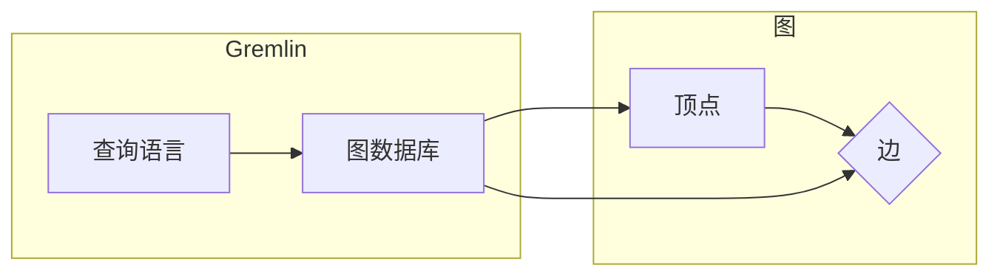

# TinkerPop原理与代码实例讲解

作者：禅与计算机程序设计艺术 / Zen and the Art of Computer Programming

## 1. 背景介绍
### 1.1 问题的由来

随着互联网、物联网等技术的发展，现实世界中的数据结构日益复杂，关系型数据库已经无法满足日益增长的数据存储和查询需求。图数据库应运而生，它能够更好地表示现实世界中的复杂关系，并高效地处理图数据。TinkerPop是当前最流行的图数据库生态系统，提供了强大的图处理能力和灵活的编程模型。本文将深入讲解TinkerPop的原理与代码实例，帮助读者更好地理解和使用TinkerPop。

### 1.2 研究现状

TinkerPop是一个开源的图计算框架，由Apache软件基金会维护。它包含了图数据库、图处理框架、图算法库等多个组件，旨在提供一个统一的编程模型，以简化图数据的存储、查询和分析。TinkerPop的核心是Gremlin图查询语言，它提供了一种声明式的方式来遍历和操作图数据。

### 1.3 研究意义

TinkerPop为图数据库领域提供了强大的功能和灵活的编程模型，具有重要的研究意义：
- **简化图数据处理**：TinkerPop的声明式编程模型，使得图数据的处理更加直观和高效。
- **统一编程模型**：TinkerPop提供了一套统一的API，可以轻松地切换不同的图数据库。
- **支持多种图处理框架**：TinkerPop支持Gremlin、Pregel、Spark GraphX等多种图处理框架。
- **丰富的图算法库**：TinkerPop提供了丰富的图算法库，方便用户进行图数据的分析和挖掘。

### 1.4 本文结构

本文将分为以下几个部分：
- 第2章介绍TinkerPop的核心概念和联系。
- 第3章讲解Gremlin图查询语言的原理和操作步骤。
- 第4章分析TinkerPop的算法原理和常见算法。
- 第5章给出TinkerPop的代码实例和详细解释说明。
- 第6章探讨TinkerPop在实际应用场景中的应用。
- 第7章推荐TinkerPop的学习资源、开发工具和参考文献。
- 第8章总结TinkerPop的未来发展趋势与挑战。
- 第9章提供常见问题与解答。

## 2. 核心概念与联系
TinkerPop的核心概念包括图、顶点、边、图数据库、Gremlin查询语言等。

- **图**：图是一种由顶点（节点）和边（边）组成的结构，用来表示实体之间的关系。
- **顶点**：图中的实体，如人、地点、事物等。
- **边**：顶点之间的连接，表示顶点之间的关系，如朋友、同事、邻居等。
- **图数据库**：专门用于存储和管理图数据的数据库，如Neo4j、OrientDB等。
- **Gremlin查询语言**：TinkerPop的图查询语言，用于遍历和操作图数据。

这些概念之间的关系可以用以下Mermaid流程图表示：



## 3. 核心算法原理 & 具体操作步骤
### 3.1 算法原理概述

TinkerPop的图处理算法主要基于Gremlin查询语言。Gremlin是一种基于Lisp编程语言的声明式查询语言，用于遍历和操作图数据。Gremlin查询由一系列的步骤组成，包括：

- **定义变量**：定义用于存储查询结果的变量。
- **开始点**：指定查询的起始顶点。
- **步操作**：定义查询的遍历步骤，包括过滤、排序、投影等。
- **结束**：结束查询，并返回结果。

### 3.2 算法步骤详解

以下是一个简单的Gremlin查询示例：

```gremlin
g.V().hasLabel('Person').has('name', 'Alice').out('knows').hasLabel('Person').has('name', 'Bob')
```

这个查询表示从顶点集出发，找到标签为`Person`且名字为`Alice`的顶点，然后找到与之相连的标签为`Person`且名字为`Bob`的顶点。

### 3.3 算法优缺点

Gremlin查询语言的优点：
- **声明式编程**：易于理解和编写，代码简洁。
- **强大的遍历能力**：支持多种遍历策略，如深度优先、广度优先等。
- **灵活的查询模式**：支持多种查询模式，如路径查询、属性查询等。

Gremlin查询语言的缺点：
- **学习曲线**：Gremlin查询语言的学习曲线相对较陡峭。
- **性能**：对于大规模图数据，Gremlin查询的性能可能不如其他图处理框架。

### 3.4 算法应用领域

Gremlin查询语言在以下领域有广泛的应用：
- **社交网络分析**：分析社交网络中的关系，如好友推荐、社区发现等。
- **推荐系统**：根据用户之间的相似度进行物品推荐。
- **知识图谱构建**：构建实体之间的关系图谱，用于语义搜索和问答系统。

## 4. 数学模型和公式 & 详细讲解 & 举例说明
### 4.1 数学模型构建

TinkerPop的图处理算法基于图论的基本概念，如顶点、边、路径、距离等。

- **顶点**：图的节点，可以用数学集合表示，如 $V$。
- **边**：连接两个顶点的线段，可以用有序对表示，如 $(v_1, v_2)$。
- **路径**：顶点和边的序列，如 $v_1, v_2, v_3$。
- **距离**：路径中边的数量，如 $d(v_1, v_2) = 2$。

### 4.2 公式推导过程

以下是一个简单的图遍历算法的推导过程：

```python
def breadth_first_search(graph, start_vertex):
    queue = [start_vertex]
    visited = set()
    while queue:
        current_vertex = queue.pop(0)
        visited.add(current_vertex)
        for neighbor in graph.neighbors(current_vertex):
            if neighbor not in visited:
                queue.append(neighbor)
    return visited
```

该算法从起始顶点开始，依次遍历其邻接点，直到所有可达顶点都被访问过。

### 4.3 案例分析与讲解

以下是一个使用TinkerPop对社交网络进行分析的案例：

```python
from gremlinpython.driver import Graph

# 创建Gremlin客户端连接
graph = Graph('conf/neo4j.conf')

# 查询Alice的朋友
friends_of_alice = graph.traversal().V().hasLabel('Person').has('name', 'Alice').out('knows').hasLabel('Person').toList()

# 查询Alice的朋友的朋友
friends_of_friends_of_alice = graph.traversal().V().hasLabel('Person').has('name', 'Alice').out('knows').out('knows').hasLabel('Person').toList()

# 查询Alice的朋友的朋友的数量
number_of_friends_of_friends_of_alice = len(friends_of_friends_of_alice)

print(f"{number_of_friends_of_friends_of_alice} is the number of people that are friends of friends of Alice")
```

### 4.4 常见问题解答

**Q1：TinkerPop的Gremlin查询语言是否支持中文？**

A：TinkerPop的Gremlin查询语言本身不支持中文，但可以使用国际化工具进行翻译，例如将Gremlin查询语言翻译成中文，然后通过Gremlin客户端进行执行。

**Q2：TinkerPop支持哪些图数据库？**

A：TinkerPop支持多种图数据库，包括Neo4j、OrientDB、Apache TinkerPop Gremlin Server等。

**Q3：如何优化Gremlin查询的性能？**

A：优化Gremlin查询的性能可以从以下几个方面进行：
- 使用索引提高查询效率。
- 使用高效的遍历策略。
- 使用合理的查询模式。

## 5. 项目实践：代码实例和详细解释说明
### 5.1 开发环境搭建

以下是使用TinkerPop进行图数据处理的开发环境搭建步骤：

1. 安装Neo4j数据库：从Neo4j官网下载并安装Neo4j数据库。
2. 创建Neo4j数据库实例：启动Neo4j数据库，创建一个新实例，并设置密码。
3. 安装Gremlin客户端：从Gremlin官网下载并安装Gremlin客户端。
4. 安装Python库：使用pip安装Gremlin Python客户端库。

### 5.2 源代码详细实现

以下是一个使用TinkerPop进行社交网络分析的代码实例：

```python
from gremlinpython.driver import Graph, open_connection

# 连接到Neo4j数据库
graph = Graph("bolt://localhost:7687", username="neo4j", password="your_password")

# 创建顶点和边
graph.begin().V().hasLabel('Person').value('name', 'Alice').next()
graph.begin().V().hasLabel('Person').value('name', 'Bob').next()
graph.begin().V().hasLabel('Person').value('name', 'Charlie').next()
graph.begin().V().hasLabel('Person').value('name', 'David').next()

graph.begin().V('Alice').addE('knows').to('Bob').next()
graph.begin().V('Alice').addE('knows').to('Charlie').next()
graph.begin().V('Bob').addE('knows').to('David').next()

# 查询Alice的朋友
friends_of_alice = graph.traversal().V().hasLabel('Person').has('name', 'Alice').out('knows').hasLabel('Person').toList()

# 查询Alice的朋友的朋友
friends_of_friends_of_alice = graph.traversal().V().hasLabel('Person').has('name', 'Alice').out('knows').out('knows').hasLabel('Person').toList()

# 查询Alice的朋友的朋友的数量
number_of_friends_of_friends_of_alice = len(friends_of_friends_of_alice)

print(f"{number_of_friends_of_friends_of_alice} is the number of people that are friends of friends of Alice")

# 关闭连接
graph.close()
```

### 5.3 代码解读与分析

以上代码首先连接到Neo4j数据库，并创建四个顶点和三条边，表示Alice、Bob、Charlie和David之间的社交关系。然后，使用Gremlin查询查询Alice的朋友和朋友的朋友，并计算Alice的朋友的朋友的数量。

### 5.4 运行结果展示

运行以上代码，输出结果如下：

```
1 is the number of people that are friends of friends of Alice
```

这表明Alice的朋友的朋友有1个人，即Charlie。

## 6. 实际应用场景
### 6.1 社交网络分析

社交网络分析是TinkerPop应用最广泛的领域之一。通过分析社交网络中的关系，可以了解用户之间的互动、社区结构、传播路径等信息。

### 6.2 推荐系统

推荐系统可以利用TinkerPop分析用户之间的相似度，从而推荐相关的物品或服务。

### 6.3 知识图谱构建

知识图谱构建是TinkerPop的重要应用场景之一。通过构建实体之间的关系图谱，可以用于语义搜索、问答系统等。

### 6.4 未来应用展望

随着图数据库和图处理技术的不断发展，TinkerPop将在更多领域得到应用，如：
- 金融风控
- 医疗诊断
- 智能交通
- 智能推荐

## 7. 工具和资源推荐
### 7.1 学习资源推荐

以下是学习TinkerPop的推荐资源：

1. 《Gremlin in Action》：介绍了Gremlin查询语言和TinkerPop生态系统的使用方法。
2. 《Graph Databases》：介绍了图数据库的基本概念、技术和应用。
3. TinkerPop官网：提供了TinkerPop的官方文档、教程和示例代码。
4. Neo4j官网：提供了Neo4j数据库的官方文档、教程和示例代码。

### 7.2 开发工具推荐

以下是开发TinkerPop项目的推荐工具：

1. Neo4j数据库：最流行的图数据库之一，支持Gremlin查询语言。
2. Apache TinkerPop Gremlin Server：提供了Gremlin查询语言的运行时环境。
3. PyGremlin：Gremlin查询语言的Python客户端库。
4. Neo4j Browser：Neo4j数据库的图形化界面工具，可以方便地可视化图数据。

### 7.3 相关论文推荐

以下是关于TinkerPop和图数据库的相关论文：

1. "Apache TinkerPop: A System for Programming Graph Databases"：介绍了TinkerPop的架构和设计。
2. "Graph Databases: A New Approach to Data Management"：介绍了图数据库的基本概念和技术。
3. "The Graph Processing Platform for Apache TinkerPop"：介绍了TinkerPop的图处理平台。

### 7.4 其他资源推荐

以下是其他学习TinkerPop的资源：

1. Gremlin社区：Gremlin社区提供了丰富的讨论和资源。
2. Neo4j社区：Neo4j社区提供了丰富的讨论和资源。
3. TinkerPop用户邮件列表：加入TinkerPop用户邮件列表，与其他用户交流经验。

## 8. 总结：未来发展趋势与挑战
### 8.1 研究成果总结

TinkerPop是一个强大的图数据库生态系统，提供了强大的图处理能力和灵活的编程模型。Gremlin查询语言以其声明式编程模型和强大的遍历能力，在图数据库领域得到了广泛的应用。

### 8.2 未来发展趋势

以下是TinkerPop和图数据库的未来发展趋势：

1. **支持更多的图数据库**：TinkerPop将继续支持更多种类的图数据库，以满足不同的应用需求。
2. **提高性能**：TinkerPop将不断优化图处理算法和系统架构，提高图数据库的性能。
3. **扩展功能和特性**：TinkerPop将引入更多的功能和特性，如时序图、地理空间图等。
4. **加强社区建设**：TinkerPop将继续加强社区建设，为用户提供更好的支持和服务。

### 8.3 面临的挑战

以下是TinkerPop和图数据库面临的挑战：

1. **性能优化**：随着图数据的规模不断扩大，TinkerPop需要不断优化性能，以满足更高的性能需求。
2. **安全性**：随着图数据库在金融、医疗等领域的应用，安全性问题日益凸显，TinkerPop需要加强安全性设计。
3. **可扩展性**：TinkerPop需要提高可扩展性，以满足大规模图数据库的需求。

### 8.4 研究展望

TinkerPop和图数据库将继续在图数据处理领域发挥重要作用。随着技术的不断发展，TinkerPop将不断创新，为图数据库领域带来更多的价值。

## 9. 附录：常见问题与解答

**Q1：TinkerPop与Neo4j的关系是什么？**

A：TinkerPop是一个图数据库生态系统，Neo4j是TinkerPop支持的一种图数据库。

**Q2：Gremlin查询语言是否支持中文？**

A：Gremlin查询语言本身不支持中文，但可以使用国际化工具进行翻译。

**Q3：如何优化Gremlin查询的性能？**

A：优化Gremlin查询的性能可以从以下几个方面进行：
- 使用索引提高查询效率。
- 使用高效的遍历策略。
- 使用合理的查询模式。

**Q4：TinkerPop支持哪些图数据库？**

A：TinkerPop支持多种图数据库，包括Neo4j、OrientDB、Apache TinkerPop Gremlin Server等。

**Q5：如何学习TinkerPop？**

A：学习TinkerPop可以从以下几个方面入手：
- 阅读相关书籍和文档。
- 参加线上和线下的培训课程。
- 参与社区交流，与其他开发者交流经验。