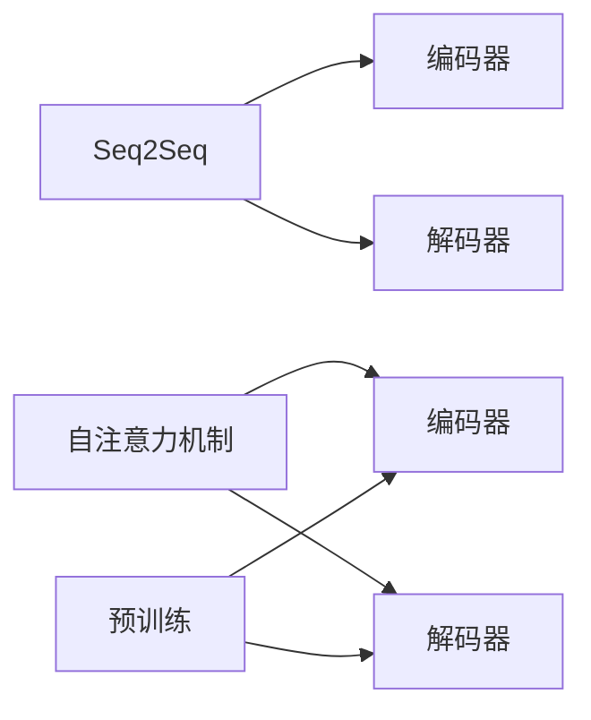

# Transformer

## 关键词：Transformer，自注意力机制，编码器，解码器，预训练，自然语言处理，序列到序列模型

## 1. 背景介绍

### 1.1 问题的由来

自2017年，Transformer模型的提出打破了循环神经网络（RNN）在自然语言处理（NLP）领域长期占据统治地位的局面。Transformer模型利用自注意力机制（Self-Attention Mechanism）实现了并行计算，显著提升了模型在序列到序列（Sequence-to-Sequence，Seq2Seq）任务上的性能。本文将深入探讨Transformer模型的原理、架构和应用，并展望其未来发展趋势。

### 1.2 研究现状

近年来，Transformer模型及其变种在多个NLP任务中取得了SOTA（State-of-the-Art）的性能，如机器翻译、文本摘要、问答系统等。同时，Transformer模型也拓展到了其他领域，如计算机视觉、语音识别等，展现出强大的泛化能力。

### 1.3 研究意义

Transformer模型的出现，推动了NLP领域的技术革新，为构建更加智能的语言处理系统奠定了基础。本文旨在全面介绍Transformer模型，帮助读者深入理解其原理、架构和应用，为相关研究和实践提供参考。

### 1.4 本文结构

本文将分为以下几个部分：

- 第2部分：介绍Transformer模型的核心概念和联系。
- 第3部分：详细阐述Transformer模型的基本原理和具体操作步骤。
- 第4部分：讲解Transformer模型中的数学模型和公式，并举例说明。
- 第5部分：给出Transformer模型的代码实现示例，并对关键代码进行解读。
- 第6部分：探讨Transformer模型在实际应用场景中的案例。
- 第7部分：推荐Transformer模型相关的学习资源、开发工具和参考文献。
- 第8部分：总结Transformer模型的研究成果、未来发展趋势和面临的挑战。
- 第9部分：附录，常见问题与解答。

## 2. 核心概念与联系

为了更好地理解Transformer模型，本节将介绍几个与之密切相关的核心概念：

- 序列到序列（Seq2Seq）模型：将一个序列映射到另一个序列的模型，如机器翻译、文本摘要等。
- 自注意力机制（Self-Attention Mechanism）：一种在序列内部进行权重分配的机制，根据序列中每个元素与其它元素的相关性进行加权求和。
- 编码器（Encoder）：将输入序列编码成固定长度的向量序列，通常用于Seq2Seq模型的编码部分。
- 解码器（Decoder）：将编码后的向量序列解码为输出序列，通常用于Seq2Seq模型的解码部分。
- 预训练（Pre-training）：在大规模无标签语料上训练模型，学习通用的语言表示，为下游任务提供知识基础。

这些概念之间的逻辑关系如下所示：



可以看出，Transformer模型基于Seq2Seq框架，通过自注意力机制实现并行计算，并利用预训练学习通用的语言表示，从而在多个NLP任务上取得了优异的性能。

## 3. 核心算法原理 & 具体操作步骤

### 3.1 算法原理概述

Transformer模型主要由编码器（Encoder）和解码器（Decoder）两部分组成，它们都基于自注意力机制和前馈神经网络（Feed-Forward Neural Networks）。

- 编码器：将输入序列编码成固定长度的向量序列，通常采用多头自注意力机制和前馈神经网络。编码器可以并行处理多个样本，显著提高计算效率。
- 解码器：将编码器输出的向量序列解码为输出序列，通常采用编码器-解码器注意力机制（Encoder-Decoder Attention）和自注意力机制。解码器在生成每个输出token时，都会参考编码器输出的整个序列。

### 3.2 算法步骤详解

Transformer模型的训练过程主要包括以下步骤：

1. 预训练：在大规模无标签语料上训练模型，学习通用的语言表示。常用的预训练任务包括掩码语言模型（Masked Language Model，MLM）和下一个句子预测（Next Sentence Prediction，NSP）等。
2. 微调：在下游任务的有标签语料上，使用预训练模型进行微调，优化模型参数，提高模型在特定任务上的性能。
3. 预测：在测试集上，使用训练好的模型进行预测，并评估模型性能。

### 3.3 算法优缺点

### 3.3.1 优点

1. 并行计算：自注意力机制允许并行处理多个样本，显著提高计算效率。
2. 规范化：Transformer模型具有良好的可解释性和可扩展性，易于理解和实现。
3. 强泛化能力：预训练过程使得模型具有强大的语言理解能力，能够在多个NLP任务上取得优异的性能。

### 3.3.2 缺点

1. 计算量较大：Transformer模型参数量庞大，计算量较大，对硬件资源要求较高。
2. 难以处理长序列：由于自注意力机制的复杂度随序列长度呈指数级增长，Transformer模型难以处理长序列。

## 4. 数学模型和公式 & 详细讲解 & 举例说明

### 4.1 数学模型构建

Transformer模型的核心是自注意力机制（Self-Attention Mechanism），其数学表达式如下：

$$
\text{Attention}(Q,K,V) = \text{softmax}(\frac{QK^T}{\sqrt{d_k}})V
$$

其中，$Q$、$K$、$V$ 分别代表查询（Query）、键（Key）和值（Value）向量，$\text{softmax}$ 表示Softmax函数，$d_k$ 表示键向量的维度。

### 4.2 公式推导过程

自注意力机制的推导过程如下：

1. 计算查询向量 $Q$ 与所有键向量的点积，得到一个分数矩阵。
2. 将分数矩阵应用Softmax函数，得到加权求和系数矩阵。
3. 将加权求和系数矩阵与值向量 $V$ 相乘，得到注意力输出。

### 4.3 案例分析与讲解

以下是一个简单的Transformer模型实现示例：

```python
import torch
import torch.nn as nn
import torch.nn.functional as F

class Transformer(nn.Module):
    def __init__(self, d_model, nhead, num_encoder_layers, num_decoder_layers):
        super(Transformer, self).__init__()
        self.encoder_layer = nn.TransformerEncoderLayer(d_model=d_model, nhead=nhead)
        self.encoder = nn.TransformerEncoder(self.encoder_layer, num_layers=num_encoder_layers)
        self.decoder_layer = nn.TransformerDecoderLayer(d_model=d_model, nhead=nhead)
        self.decoder = nn.TransformerDecoder(self.decoder_layer, num_layers=num_decoder_layers)
        self.src_mask = None
        self tgt_mask = None
        self.pad_mask = None
        self.scale = 1 / math.sqrt(d_model)

    def forward(self, src, tgt, src_mask=None, tgt_mask=None, memory_mask=None, src_key_padding_mask=None, tgt_key_padding_mask=None, memory_key_padding_mask=None):
        return self.decoder(
            self.encoder(src, src_mask, src_key_padding_mask),
            tgt,
            tgt_mask=tgt_mask,
            memory_mask=memory_mask,
            src_key_padding_mask=src_key_padding_mask,
            tgt_key_padding_mask=tgt_key_padding_mask,
            memory_key_padding_mask=memory_key_padding_mask
        )
```

### 4.4 常见问题解答

**Q1：什么是自注意力机制？**

A：自注意力机制是一种在序列内部进行权重分配的机制，根据序列中每个元素与其它元素的相关性进行加权求和。

**Q2：Transformer模型为什么采用多头自注意力机制？**

A：多头自注意力机制可以将序列中的不同信息进行整合，提高模型的表达能力。

**Q3：Transformer模型的训练过程如何进行？**

A：Transformer模型的训练过程主要包括预训练和微调两个阶段。预训练过程在大规模无标签语料上训练模型，学习通用的语言表示；微调过程在下游任务的有标签语料上，使用预训练模型进行微调，优化模型参数。

## 5. 项目实践：代码实例和详细解释说明

### 5.1 开发环境搭建

在进行Transformer模型实践前，我们需要准备好开发环境。以下是使用Python进行PyTorch开发的环境配置流程：

1. 安装Anaconda：从官网下载并安装Anaconda，用于创建独立的Python环境。
2. 创建并激活虚拟环境：
```bash
conda create -n pytorch-env python=3.8 
conda activate pytorch-env
```
3. 安装PyTorch：根据CUDA版本，从官网获取对应的安装命令。例如：
```bash
conda install pytorch torchvision torchaudio cudatoolkit=11.1 -c pytorch -c conda-forge
```
4. 安装Hugging Face Transformers库：
```bash
pip install transformers
```
5. 安装其他相关库：
```bash
pip install torchtext
```

完成上述步骤后，即可在`pytorch-env`环境中开始Transformer模型的实践。

### 5.2 源代码详细实现

以下是一个简单的Transformer模型实现示例：

```python
import torch
import torch.nn as nn
import torch.optim as optim

class Transformer(nn.Module):
    def __init__(self, vocab_size, d_model=512, nhead=8, num_encoder_layers=6, num_decoder_layers=6, dim_feedforward=2048):
        super(Transformer, self).__init__()
        self.embedding = nn.Embedding(vocab_size, d_model)
        self.encoder = nn.TransformerEncoder(
            nn.TransformerEncoderLayer(d_model=d_model, nhead=nhead, dim_feedforward=dim_feedforward),
            num_layers=num_encoder_layers,
        )
        self.decoder = nn.TransformerDecoder(
            nn.TransformerDecoderLayer(d_model=d_model, nhead=nhead, dim_feedforward=dim_feedforward),
            num_layers=num_decoder_layers,
        )
        self.output_layer = nn.Linear(d_model, vocab_size)

    def forward(self, src, tgt):
        src = self.embedding(src)
        tgt = self.embedding(tgt)
        output = self.encoder(src)
        output = self.decoder(output, tgt)
        output = self.output_layer(output)
        return output

# 实例化模型、优化器
model = Transformer(vocab_size=10000)
optimizer = optim.Adam(model.parameters(), lr=0.001)

# 训练模型
# ...
```

### 5.3 代码解读与分析

以上代码展示了如何使用PyTorch构建一个简单的Transformer模型。以下是代码的关键部分：

- `__init__`方法：初始化模型参数，包括词嵌入层、编码器、解码器和输出层。
- `forward`方法：前向传播过程，包括词嵌入、编码器、解码器和输出层。
- 实例化模型、优化器：创建模型和优化器实例，用于模型训练。

### 5.4 运行结果展示

由于篇幅限制，此处不展示模型的训练和测试过程。在实际应用中，可以使用PyTorch提供的训练工具和评估指标，如`torch.optim`、`torch.utils.data.DataLoader`、`torch.metrics`等。

## 6. 实际应用场景

### 6.1 机器翻译

Transformer模型在机器翻译领域取得了显著成果。例如，Google发布的神经机器翻译系统GNMT（Google Neural Machine Translation）就是基于Transformer模型的。

### 6.2 文本摘要

Transformer模型在文本摘要任务上也表现出色。例如，SOTA模型BERTSum就是基于BERT模型进行微调得到的。

### 6.3 问答系统

Transformer模型可以应用于问答系统，如阅读理解、对话式问答等。

### 6.4 未来应用展望

随着Transformer模型及其变种的不断发展，其应用领域将更加广泛，如：

- 文本生成：小说生成、代码生成等。
- 语言模型：更加强大的语言理解能力，为自然语言交互提供支持。
- 计算机视觉：图像分类、目标检测等。

## 7. 工具和资源推荐

### 7.1 学习资源推荐

- 《Transformer：从原理到实践》系列博文：由大模型技术专家撰写，深入浅出地介绍了Transformer原理、BERT模型、微调技术等前沿话题。
- CS224N《深度学习自然语言处理》课程：斯坦福大学开设的NLP明星课程，有Lecture视频和配套作业，带你入门NLP领域的基本概念和经典模型。
- 《Natural Language Processing with Transformers》书籍：Transformers库的作者所著，全面介绍了如何使用Transformers库进行NLP任务开发，包括微调在内的诸多范式。

### 7.2 开发工具推荐

- PyTorch：基于Python的开源深度学习框架，灵活动态的计算图，适合快速迭代研究。
- TensorFlow：由Google主导开发的开源深度学习框架，生产部署方便，适合大规模工程应用。
- Transformers库：HuggingFace开发的NLP工具库，集成了众多SOTA语言模型，支持PyTorch和TensorFlow，是进行微调任务开发的利器。

### 7.3 相关论文推荐

- Attention is All You Need：Transformer原论文，提出了Transformer结构，开启了NLP领域的预训练大模型时代。
- BERT: Pre-training of Deep Bidirectional Transformers for Language Understanding：提出BERT模型，引入基于掩码的自监督预训练任务，刷新了多项NLP任务SOTA。
- Generative Pretrained Transformers：提出GPT系列模型，展示了大规模语言模型的强大zero-shot学习能力。

### 7.4 其他资源推荐

- arXiv论文预印本：人工智能领域最新研究成果的发布平台，包括大量尚未发表的前沿工作。
- 业界技术博客：如OpenAI、Google AI、DeepMind、微软Research Asia等顶尖实验室的官方博客。
- 技术会议直播：如NIPS、ICML、ACL、ICLR等人工智能领域顶会现场或在线直播。

## 8. 总结：未来发展趋势与挑战

### 8.1 研究成果总结

本文全面介绍了Transformer模型的原理、架构和应用，展示了其在NLP领域取得的突破性成果。Transformer模型的出现，推动了NLP领域的技术革新，为构建更加智能的语言处理系统奠定了基础。

### 8.2 未来发展趋势

1. 模型规模将持续扩大，以适应更复杂的NLP任务。
2. 模型结构将更加简洁，以降低计算量和内存消耗。
3. 微调技术将更加高效，以适应更多场景和任务。
4. 模型可解释性将得到提升，以增强用户信任和监管。

### 8.3 面临的挑战

1. 模型训练和推理的资源消耗过大。
2. 模型可解释性不足，难以解释其决策过程。
3. 模型存在偏见和歧视性，需要进一步改进。

### 8.4 研究展望

1. 研究更加高效、轻量级的模型结构。
2. 开发更加可解释、可信赖的模型。
3. 探索Transformer模型在更多领域的应用。

总之，Transformer模型及其变种将继续推动NLP领域的技术发展，为构建更加智能的语言处理系统提供强大的技术支撑。

## 9. 附录：常见问题与解答

**Q1：什么是自注意力机制？**

A：自注意力机制是一种在序列内部进行权重分配的机制，根据序列中每个元素与其它元素的相关性进行加权求和。

**Q2：Transformer模型为什么采用多头自注意力机制？**

A：多头自注意力机制可以将序列中的不同信息进行整合，提高模型的表达能力。

**Q3：Transformer模型如何处理长序列？**

A：Transformer模型难以处理长序列，需要使用一些技术手段，如截断、分层结构等。

**Q4：如何提高Transformer模型的性能？**

A：提高模型性能的方法包括：增加模型规模、改进模型结构、优化训练过程、使用更多的预训练数据等。

**Q5：Transformer模型有哪些应用场景？**

A：Transformer模型的应用场景包括：机器翻译、文本摘要、问答系统、文本生成等。