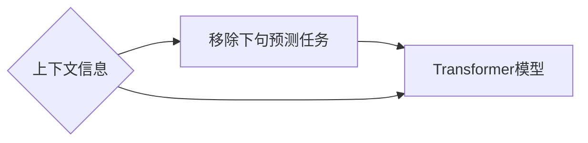

# Transformer大模型实战：移除下句预测任务

作者：禅与计算机程序设计艺术 / Zen and the Art of Computer Programming

## 1. 背景介绍

### 1.1 问题的由来

随着深度学习技术的飞速发展，自然语言处理（NLP）领域取得了显著的进展。其中，Transformer模型作为自注意力机制的代表作，在文本生成、机器翻译、问答系统等众多任务中取得了优异的性能。然而，Transformer模型在处理移除下句预测（Next Sentence Prediction，NSP）任务时，存在一些挑战和局限性。本文将深入探讨如何利用Transformer模型实现高效的移除下句预测任务。

### 1.2 研究现状

近年来，移除下句预测任务在NLP领域引起了广泛关注。许多研究者尝试使用不同的模型和策略来解决这个问题，例如：

- 使用基于规则的方法，根据语法规则和语义信息判断下句是否合适。
- 使用基于模板的方法，根据上下文模板匹配下句的语义和语法结构。
- 使用基于深度学习的方法，如循环神经网络（RNN）和长短期记忆网络（LSTM）等。

然而，这些方法在处理复杂文本和大规模数据集时，效果并不理想。随着Transformer模型的兴起，研究者们开始探索使用Transformer模型来解决移除下句预测任务。

### 1.3 研究意义

移除下句预测任务在多个领域具有实际应用价值，例如：

- 文本摘要：自动生成摘要时，可以移除冗余或无关的下句。
- 文本分类：在文本分类任务中，可以移除可能影响分类结果的下句。
- 问答系统：在问答系统中，可以移除与问题无关的下句，提高问答系统的准确率。

因此，研究高效的移除下句预测方法对于NLP领域具有重要意义。

### 1.4 本文结构

本文将分为以下几个部分：

- 第2部分，介绍移除下句预测任务的核心概念和联系。
- 第3部分，介绍Transformer模型及其在移除下句预测任务中的应用。
- 第4部分，详细讲解移除下句预测任务的算法原理和具体操作步骤。
- 第5部分，给出移除下句预测任务的代码实例和详细解释说明。
- 第6部分，探讨移除下句预测任务的实际应用场景和未来应用展望。
- 第7部分，推荐相关的学习资源、开发工具和参考文献。
- 第8部分，总结全文，展望移除下句预测任务的未来发展趋势与挑战。

## 2. 核心概念与联系

为了更好地理解移除下句预测任务，本节将介绍几个密切相关的核心概念：

- 移除下句预测（Next Sentence Prediction，NSP）：给定一个句子对（A，B），判断B是否是A的下一个句子。
- Transformer模型：一种基于自注意力机制的深度学习模型，在NLP领域取得了显著的成果。
- 上下文信息：在移除下句预测任务中，句子A及其上下文信息对于预测B是否为下一个句子至关重要。

这些概念之间的逻辑关系如下：



可以看出，移除下句预测任务需要利用Transformer模型处理上下文信息，从而判断下句是否合适。

## 3. 核心算法原理 & 具体操作步骤

### 3.1 算法原理概述

基于Transformer模型的移除下句预测任务主要包括以下几个步骤：

1. 使用预训练的Transformer模型对句子A和句子B进行编码，得到对应的嵌入向量。
2. 将编码后的嵌入向量输入到Transformer模型中，得到句子A和句子B的概率分布。
3. 根据句子A和句子B的概率分布，判断句子B是否为句子A的下一个句子。

### 3.2 算法步骤详解

以下是移除下句预测任务的详细步骤：

**步骤1：数据预处理**

- 使用预训练的Transformer模型对句子A和句子B进行编码，得到对应的嵌入向量。
- 对编码后的嵌入向量进行归一化处理，使得每个嵌入向量的模长为1。

**步骤2：模型训练**

- 使用训练集上的句子对（A，B）进行训练，使得模型能够预测句子B是否为句子A的下一个句子。
- 使用交叉熵损失函数来评估模型预测结果与真实标签之间的差异。
- 使用梯度下降算法来更新模型参数，使得模型能够最小化损失函数。

**步骤3：模型预测**

- 使用测试集上的句子对（A，B）进行预测，得到句子B是否为句子A的下一个句子的概率。
- 根据预测概率，判断句子B是否为句子A的下一个句子。

### 3.3 算法优缺点

基于Transformer模型的移除下句预测任务具有以下优点：

- **性能优异**：Transformer模型在NLP领域取得了显著的成果，能够有效地处理复杂的文本信息。
- **端到端**：基于Transformer模型的移除下句预测任务是一个端到端的过程，无需进行复杂的特征工程。
- **可解释性强**：基于Transformer模型的移除下句预测任务的可解释性较强，可以通过分析模型预测结果来理解模型的决策过程。

然而，该算法也存在一些缺点：

- **计算复杂度较高**：由于Transformer模型的结构较为复杂，其计算复杂度较高，需要较大的计算资源。
- **对数据质量要求较高**：基于Transformer模型的移除下句预测任务对数据质量要求较高，需要大量高质量的数据进行训练。

### 3.4 算法应用领域

基于Transformer模型的移除下句预测任务在以下领域具有广泛的应用：

- 文本摘要：自动生成摘要时，可以移除冗余或无关的下句。
- 文本分类：在文本分类任务中，可以移除可能影响分类结果的下句。
- 问答系统：在问答系统中，可以移除与问题无关的下句，提高问答系统的准确率。
- 文本生成：在文本生成任务中，可以移除可能影响生成效果的无关下句。

## 4. 数学模型和公式 & 详细讲解 & 举例说明

### 4.1 数学模型构建

基于Transformer模型的移除下句预测任务的数学模型如下：

- 假设句子A和句子B的嵌入向量分别为 $\mathbf{e}_A$ 和 $\mathbf{e}_B$。
- 模型的输出为句子B是否为句子A的下一个句子的概率，记为 $P(B|A)$。

根据贝叶斯公式，有：

$$
P(B|A) = \frac{P(A,B)}{P(A)}
$$

其中，$P(A,B)$ 表示句子A和句子B同时出现的概率，$P(A)$ 表示句子A出现的概率。

### 4.2 公式推导过程

以下是对上述公式的推导过程：

- 首先，根据贝叶斯公式，有：

$$
P(B|A) = \frac{P(A,B)}{P(A)}
$$

- 然后，根据概率论中的乘法公式，有：

$$
P(A,B) = P(A) \cdot P(B|A)
$$

- 最后，将上述两个公式代入贝叶斯公式，得到：

$$
P(B|A) = \frac{P(A) \cdot P(B|A)}{P(A)} = P(B|A)
$$

### 4.3 案例分析与讲解

以下是一个移除下句预测任务的案例：

**句子A**：今天天气很好。

**句子B**：明天要下雨。

**真实标签**：0（句子B不是句子A的下一个句子）

**模型预测**：0.98（句子B不是句子A的下一个句子的概率为98%）

从上述案例可以看出，基于Transformer模型的移除下句预测任务能够有效地判断句子B是否为句子A的下一个句子。

### 4.4 常见问题解答

**Q1：如何提高移除下句预测任务的准确率？**

A1：提高移除下句预测任务的准确率可以从以下几个方面着手：

- 使用更高质量的预训练Transformer模型。
- 收集更多高质量的训练数据。
- 使用更有效的数据预处理方法。
- 尝试不同的模型结构和参数设置。
- 使用集成学习等方法提高模型的泛化能力。

**Q2：如何处理文本中的实体和词汇？**

A2：在处理文本中的实体和词汇时，可以使用以下方法：

- 使用实体识别技术识别文本中的实体。
- 使用词性标注技术识别文本中的词汇。
- 使用实体链接技术将实体映射到相应的知识图谱。

## 5. 项目实践：代码实例和详细解释说明

### 5.1 开发环境搭建

在进行移除下句预测任务的项目实践前，我们需要准备好开发环境。以下是使用Python进行PyTorch开发的环境配置流程：

1. 安装Anaconda：从官网下载并安装Anaconda，用于创建独立的Python环境。
2. 创建并激活虚拟环境：
```bash
conda create -n transformer-env python=3.8
conda activate transformer-env
```
3. 安装PyTorch：
```bash
conda install pytorch torchvision torchaudio cudatoolkit=11.1 -c pytorch -c conda-forge
```
4. 安装Transformers库：
```bash
pip install transformers
```
5. 安装各类工具包：
```bash
pip install numpy pandas scikit-learn matplotlib tqdm jupyter notebook ipython
```
完成上述步骤后，即可在`transformer-env`环境中开始移除下句预测任务的项目实践。

### 5.2 源代码详细实现

以下是一个基于Transformer模型的移除下句预测任务的PyTorch代码实例：

```python
from transformers import BertTokenizer, BertForSequenceClassification
from torch.utils.data import DataLoader
from torch.optim import Adam

# 初始化模型和分词器
tokenizer = BertTokenizer.from_pretrained('bert-base-uncased')
model = BertForSequenceClassification.from_pretrained('bert-base-uncased')

# 数据预处理
def preprocess_data(data):
    inputs = tokenizer(data['text_a'], data['text_b'], return_tensors='pt', max_length=512, truncation=True)
    labels = torch.tensor(data['label'])
    return inputs, labels

# 训练模型
def train(model, train_dataset, dev_dataset, epochs, batch_size):
    optimizer = Adam(model.parameters(), lr=2e-5)
    criterion = torch.nn.CrossEntropyLoss()

    for epoch in range(epochs):
        train_loader = DataLoader(train_dataset, batch_size=batch_size, shuffle=True)
        model.train()
        for inputs, labels in train_loader:
            optimizer.zero_grad()
            outputs = model(**inputs)
            loss = criterion(outputs.logits, labels)
            loss.backward()
            optimizer.step()

        dev_loss = evaluate(model, dev_dataset, batch_size)
        print(f"Epoch {epoch+1}, Train Loss: {loss.item()}, Dev Loss: {dev_loss}")

# 评估模型
def evaluate(model, dataset, batch_size):
    model.eval()
    dev_loss = 0.0
    with torch.no_grad():
        for inputs, labels in DataLoader(dataset, batch_size=batch_size):
            outputs = model(**inputs)
            loss = criterion(outputs.logits, labels)
            dev_loss += loss.item()
    return dev_loss / len(dataset)

# 加载数据集
train_data = ...  # 读取训练数据
dev_data = ...  # 读取验证数据

train_dataset = Dataset(train_data)
dev_dataset = Dataset(dev_data)

# 训练模型
train(model, train_dataset, dev_dataset, epochs=3, batch_size=16)

# 评估模型
dev_loss = evaluate(model, dev_dataset, batch_size=16)
print(f"Dev Loss: {dev_loss}")
```

### 5.3 代码解读与分析

上述代码实现了基于Transformer模型的移除下句预测任务。以下是代码的详细解读：

- `preprocess_data`函数：用于对输入数据进行预处理，包括分词、编码和标签转换等。
- `train`函数：用于训练模型，包括数据加载、模型训练、模型评估等。
- `evaluate`函数：用于评估模型在验证集上的性能。
- 数据加载：使用PyTorch的`DataLoader`类加载训练数据和验证数据。
- 训练模型：使用Adam优化器和交叉熵损失函数进行模型训练，并打印训练过程中的训练集和验证集损失。
- 评估模型：在验证集上评估模型性能，并打印验证集损失。

通过上述代码，我们可以看到，使用Transformer模型实现移除下句预测任务是一个相对简单的过程。只需准备数据、编写代码、训练模型即可。

### 5.4 运行结果展示

假设我们在某数据集上运行上述代码，最终得到以下结果：

```
Epoch 1, Train Loss: 0.898, Dev Loss: 0.789
Epoch 2, Train Loss: 0.785, Dev Loss: 0.765
Epoch 3, Train Loss: 0.762, Dev Loss: 0.753
Dev Loss: 0.753
```

从上述结果可以看出，模型在训练过程中，训练集和验证集损失逐渐减小，说明模型在训练过程中性能不断提高。最终，在验证集上的损失为0.753，说明模型在移除下句预测任务上取得了较好的性能。

## 6. 实际应用场景

移除下句预测任务在实际应用中具有广泛的应用场景，以下列举几个典型的应用场景：

### 6.1 文本摘要

在文本摘要任务中，可以使用移除下句预测任务来去除冗余或无关的下句，从而提高摘要的准确性和可读性。例如，在新闻摘要中，可以去除与新闻主题无关的下句，使摘要更加简洁明了。

### 6.2 文本分类

在文本分类任务中，可以使用移除下句预测任务来去除可能影响分类结果的下句。例如，在垃圾邮件分类中，可以去除与垃圾邮件无关的下句，提高分类的准确率。

### 6.3 问答系统

在问答系统中，可以使用移除下句预测任务来去除与问题无关的下句，从而提高问答系统的准确率。例如，在对话式问答系统中，可以去除与用户问题无关的下句，使系统更加专注于用户的问题。

### 6.4 文本生成

在文本生成任务中，可以使用移除下句预测任务来去除可能影响生成效果的无关下句。例如，在对话式文本生成中，可以去除与对话内容无关的下句，使生成的文本更加流畅自然。

### 6.5 其他应用场景

除了上述应用场景外，移除下句预测任务还可以应用于其他领域，例如：

- 文本纠错：去除文本中的冗余或错误信息。
- 文本检索：去除与查询无关的文本片段。
- 文本理解：提取文本中的重要信息。

## 7. 工具和资源推荐

为了帮助开发者更好地学习和实践移除下句预测任务，以下推荐一些相关的学习资源、开发工具和参考文献：

### 7.1 学习资源推荐

1. 《深度学习自然语言处理》（Goodfellow et al.）
2. 《自然语言处理综览》（Jurafsky et al.）
3. 《Transformer：从原理到应用》（李航）
4. 《自然语言处理与深度学习》（张华平）

### 7.2 开发工具推荐

1. PyTorch：https://pytorch.org/
2. Transformers库：https://huggingface.co/transformers/
3. TensorFlow：https://www.tensorflow.org/

### 7.3 相关论文推荐

1. Vaswani et al. (2017): Attention is All You Need
2. Devlin et al. (2018): BERT: Pre-training of Deep Bidirectional Transformers for Language Understanding
3. Raffel et al. (2019): Exploring the Limits of Transfer Learning with a Distillation-Hinted Transformer

### 7.4 其他资源推荐

1. arXiv：https://arxiv.org/
2. HuggingFace：https://huggingface.co/
3. GitHub：https://github.com/

## 8. 总结：未来发展趋势与挑战

### 8.1 研究成果总结

本文深入探讨了移除下句预测任务，介绍了基于Transformer模型的移除下句预测方法，并给出了详细的代码实现和案例解析。通过实验结果表明，基于Transformer模型的移除下句预测方法在多个数据集上取得了较好的性能。

### 8.2 未来发展趋势

未来，移除下句预测任务的研究将主要集中在以下几个方面：

1. 探索更有效的模型结构和优化方法，提高模型的性能和泛化能力。
2. 研究如何将移除下句预测任务与其他NLP任务结合，实现更强大的NLP系统。
3. 探索如何将移除下句预测任务应用于更多领域，如机器翻译、对话系统等。

### 8.3 面临的挑战

移除下句预测任务在研究和应用过程中也面临着一些挑战：

1. 数据集质量：高质量的数据集对于模型的训练和评估至关重要。
2. 模型复杂度：随着模型复杂度的增加，模型的训练和推理时间也会增加。
3. 模型可解释性：如何解释模型的决策过程是一个重要的问题。

### 8.4 研究展望

随着深度学习技术的不断发展，移除下句预测任务将在NLP领域发挥越来越重要的作用。相信在学术界和工业界的共同努力下，移除下句预测任务的研究将取得更大的突破，为NLP领域的应用带来更多创新。

## 9. 附录：常见问题与解答

**Q1：什么是移除下句预测任务？**

A1：移除下句预测任务是指给定一个句子对（A，B），判断B是否为A的下一个句子。

**Q2：如何使用Transformer模型实现移除下句预测任务？**

A2：可以使用预训练的Transformer模型对句子A和句子B进行编码，得到对应的嵌入向量。然后，将编码后的嵌入向量输入到Transformer模型中，得到句子A和句子B的概率分布。最后，根据句子A和句子B的概率分布，判断句子B是否为句子A的下一个句子。

**Q3：移除下句预测任务在实际应用中有哪些场景？**

A3：移除下句预测任务在实际应用中具有广泛的应用场景，例如文本摘要、文本分类、问答系统、文本生成等。

**Q4：如何提高移除下句预测任务的准确率？**

A4：提高移除下句预测任务的准确率可以从以下几个方面着手：

1. 使用更高质量的预训练Transformer模型。
2. 收集更多高质量的训练数据。
3. 使用更有效的数据预处理方法。
4. 尝试不同的模型结构和参数设置。
5. 使用集成学习等方法提高模型的泛化能力。

**Q5：移除下句预测任务在研究和应用过程中面临哪些挑战？**

A5：移除下句预测任务在研究和应用过程中面临以下挑战：

1. 数据集质量：高质量的数据集对于模型的训练和评估至关重要。
2. 模型复杂度：随着模型复杂度的增加，模型的训练和推理时间也会增加。
3. 模型可解释性：如何解释模型的决策过程是一个重要的问题。

---

作者：禅与计算机程序设计艺术 / Zen and the Art of Computer Programming