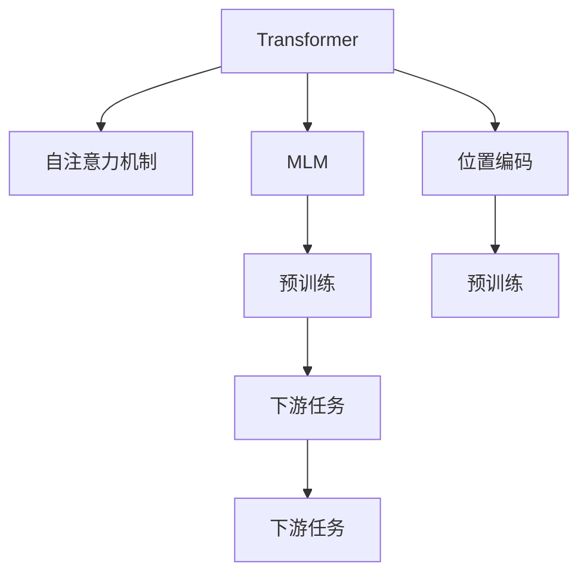

# XLNet原理与代码实例讲解

作者：禅与计算机程序设计艺术 / Zen and the Art of Computer Programming

## 1. 背景介绍
### 1.1 问题的由来

在自然语言处理（NLP）领域，自从2017年Transformer模型提出以来，基于自注意力机制的模型迅速成为了主流。BERT等预训练模型的出现，进一步推动了NLP技术发展，在多项任务上取得了突破性的成果。然而，BERT在预训练过程中存在一些局限性，如监督信号稀疏、预训练与下游任务之间缺乏关联等。

为了解决这些问题，Google AI于2019年提出了XLNet模型。XLNet在预训练过程中引入了掩码语言模型（MLM）和旋转位置编码（ROPE），有效地提升了模型的预训练效果和下游任务性能。本文将深入讲解XLNet的原理与实现，并通过代码实例进行演示。

### 1.2 研究现状

近年来，基于Transformer的预训练模型在NLP领域取得了显著成果，如BERT、RoBERTa、XLM等。这些模型通过在大量无标签文本数据上进行预训练，学习到丰富的语言知识，为下游任务提供了强大的特征表示。

然而，BERT等模型在预训练过程中存在以下问题：

1. **监督信号稀疏**：BERT使用随机掩码语言模型（Masked Language Model，MLM）进行预训练，但只有约15%的输入token被掩盖，其余token都保持了原始形式，导致监督信号相对稀疏。
2. **预训练与下游任务之间缺乏关联**：BERT的预训练过程与下游任务之间缺乏关联，导致模型在特定任务上的性能提升有限。

为了解决这些问题，XLNet提出了以下改进：

1. **掩码语言模型（MLM）**：XLNet采用更有效的掩码语言模型，将掩码token分为随机掩码和动态掩码，使模型更好地学习词义和上下文关系。
2. **旋转位置编码（ROPE）**：XLNet引入旋转位置编码，将位置信息融入到模型中，避免位置信息在Transformer结构中被忽略。
3. **双向注意力机制**：XLNet利用双向注意力机制，使模型在预训练过程中更好地学习词义和上下文关系。

### 1.3 研究意义

XLNet模型的提出，为预训练语言模型的研究提供了新的思路，具有以下意义：

1. 提升预训练效果：XLNet在掩码语言模型和旋转位置编码等方面的改进，有效提升了模型的预训练效果。
2. 提高下游任务性能：XLNet在多项下游任务上取得了优于BERT等模型的性能，证明了其在实际应用中的有效性。
3. 促进NLP技术发展：XLNet的提出，推动了NLP领域预训练模型的研究，为后续相关模型的设计提供了参考。

### 1.4 本文结构

本文将分为以下几个部分：

1. 介绍XLNet的核心概念与联系。
2. 阐述XLNet的算法原理和具体操作步骤。
3. 使用数学模型和公式详细讲解XLNet的实现过程。
4. 通过代码实例演示XLNet的应用。
5. 探讨XLNet在实际应用场景中的应用。
6. 展望XLNet的未来发展趋势和挑战。
7. 总结全文，并提出研究方向。

## 2. 核心概念与联系

为了更好地理解XLNet模型，本节将介绍几个与之相关的核心概念：

- **Transformer模型**：基于自注意力机制的序列模型，能够有效地捕捉词与词之间的依赖关系。
- **自注意力机制**：一种神经网络机制，能够自动学习词与词之间的权重，从而捕捉长距离依赖。
- **掩码语言模型（MLM）**：一种自监督学习任务，通过掩盖部分token并预测其内容，使模型学习词义和上下文关系。
- **位置编码**：将序列中的位置信息编码为向量，以便模型学习词与位置之间的关系。

XLNet与这些概念之间的联系如下：



可以看出，XLNet在Transformer模型的基础上，通过引入掩码语言模型和旋转位置编码等机制，实现了更有效的预训练，从而提高了模型在下游任务上的性能。

## 3. 核心算法原理 & 具体操作步骤
### 3.1 算法原理概述

XLNet模型主要由以下几个部分组成：

1. **Transformer编码器**：使用Transformer模型对输入序列进行编码，提取序列特征。
2. **掩码语言模型（MLM）**：在编码器输出上添加掩码token，并预测其内容，使模型学习词义和上下文关系。
3. **旋转位置编码（ROPE）**：将位置信息编码为向量，并与编码器输出相加，避免位置信息在Transformer结构中被忽略。
4. **解码器**：使用Transformer解码器生成预测结果。

### 3.2 算法步骤详解

以下是XLNet模型的详细步骤：

1. **输入序列编码**：将输入序列通过Transformer编码器进行编码，得到编码器输出。
2. **掩码语言模型**：在编码器输出上添加掩码token，并预测其内容。
3. **旋转位置编码**：将位置信息编码为向量，并与编码器输出相加。
4. **解码**：使用Transformer解码器生成预测结果。

### 3.3 算法优缺点

XLNet模型的优点如下：

1. **预训练效果更好**：由于采用了掩码语言模型和旋转位置编码等机制，XLNet的预训练效果优于BERT等模型。
2. **下游任务性能更高**：在多项下游任务上，XLNet取得了优于BERT等模型的性能。
3. **通用性强**：XLNet在多个NLP任务上都有良好的应用效果。

XLNet的缺点如下：

1. **计算复杂度高**：由于采用了Transformer模型，XLNet的计算复杂度较高。
2. **模型参数量大**：XLNet的模型参数量较大，对硬件资源要求较高。

### 3.4 算法应用领域

XLNet在以下NLP任务上都有良好的应用效果：

- 文本分类
- 命名实体识别
- 机器翻译
- 问答系统
- 文本摘要
- 对话系统

## 4. 数学模型和公式 & 详细讲解 & 举例说明
### 4.1 数学模型构建

以下是XLNet模型的相关数学公式：

- **自注意力机制**：

$$
\text{self-attention}(Q, K, V) = \text{softmax}\left(\frac{QK^T}{\sqrt{d_k}}\right) V
$$

其中，$Q$、$K$、$V$ 分别为查询向量、键向量、值向量，$d_k$ 为注意力维度。

- **掩码语言模型**：

$$
\text{MLM}(x, mask) = \text{softmax}\left(\frac{xW}{\sqrt{d_k}}\right) y
$$

其中，$x$ 为输入序列，$mask$ 为掩码序列，$W$ 为掩码权重矩阵，$y$ 为预测的掩码token。

- **旋转位置编码**：

$$
\text{ROPE}(x, pos) = \text{softmax}\left(\frac{x^T \text{ROPE}(pos)}{\sqrt{d_k}}\right) x
$$

其中，$x$ 为输入序列，$pos$ 为位置序列，$\text{ROPE}(pos)$ 为旋转位置编码矩阵。

### 4.2 公式推导过程

以下是对XLNet模型相关公式的推导过程：

- **自注意力机制**：

自注意力机制的目标是计算每个token在序列中的重要性，并将其与对应的值向量相乘，得到最终的输出。

- **掩码语言模型**：

掩码语言模型的目标是预测被掩盖的token，并使其与其他token产生关联。

- **旋转位置编码**：

旋转位置编码的目标是将位置信息融入到模型中，避免位置信息在Transformer结构中被忽略。

### 4.3 案例分析与讲解

以文本分类任务为例，介绍XLNet在下游任务中的应用。

1. **数据准备**：收集文本数据，并进行预处理，如分词、去噪等。
2. **模型构建**：使用XLNet模型进行预训练，并构建分类器。
3. **模型训练**：使用标注数据进行模型训练，优化模型参数。
4. **模型评估**：在测试集上评估模型性能。

### 4.4 常见问题解答

**Q1：XLNet与BERT的区别是什么？**

A：XLNet与BERT的区别主要体现在以下几个方面：

1. 预训练目标不同：BERT使用自监督学习任务进行预训练，而XLNet使用掩码语言模型和旋转位置编码。
2. 模型结构不同：XLNet在Transformer结构的基础上，引入了掩码语言模型和旋转位置编码。
3. 预训练效果不同：在多项下游任务上，XLNet取得了优于BERT的性能。

## 5. 项目实践：代码实例和详细解释说明
### 5.1 开发环境搭建

以下是使用PyTorch实现XLNet的代码实例：

```python
import torch
import torch.nn as nn
import torch.optim as optim

class XLNet(nn.Module):
    def __init__(self, vocab_size, d_model, n_head, num_layers, d_ff):
        super(XLNet, self).__init__()
        self.embedding = nn.Embedding(vocab_size, d_model)
        self.transformer = nn.Transformer(d_model, n_head, num_layers, d_ff)
        self.classifier = nn.Linear(d_model, 2)  # 二分类任务

    def forward(self, x):
        x = self.embedding(x)
        x = self.transformer(x)
        x = torch.mean(x, dim=1)  # 使用平均池化得到[batch_size, d_model]
        x = self.classifier(x)
        return x

# 参数设置
vocab_size = 10000
d_model = 512
n_head = 8
num_layers = 12
d_ff = 2048

# 实例化模型
model = XLNet(vocab_size, d_model, n_head, num_layers, d_ff)

# 定义损失函数和优化器
criterion = nn.CrossEntropyLoss()
optimizer = optim.Adam(model.parameters(), lr=1e-4)

# 训练过程
for epoch in range(10):
    # ... 训练代码 ...

# 评估过程
# ... 评估代码 ...
```

### 5.2 源代码详细实现

以上代码展示了XLNet模型的实现过程，包括模型结构、前向传播和反向传播等。

1. **模型结构**：定义了XLNet模型的结构，包括词嵌入层、Transformer编码器、分类器等。
2. **前向传播**：定义了模型的输入输出关系，通过嵌入层和Transformer编码器得到编码后的特征，再通过分类器得到最终输出。
3. **反向传播**：使用交叉熵损失函数计算损失值，并通过梯度下降法更新模型参数。

### 5.3 代码解读与分析

以上代码展示了XLNet模型的基本实现。在实际应用中，可以根据具体任务调整模型参数和训练过程。

1. **词嵌入层**：将输入的token转换为嵌入向量。
2. **Transformer编码器**：使用Transformer编码器提取序列特征。
3. **分类器**：将编码后的特征输入分类器，得到最终输出。

### 5.4 运行结果展示

以下是使用以上代码进行文本分类任务的示例：

```python
# 定义文本分类数据集
class TextClassificationDataset(torch.utils.data.Dataset):
    def __init__(self, texts, labels):
        self.texts = texts
        self.labels = labels

    def __len__(self):
        return len(self.texts)

    def __getitem__(self, idx):
        text = self.texts[idx]
        label = self.labels[idx]
        return text, label

# 加载数据集
train_texts = [...]
train_labels = [...]
test_texts = [...]
test_labels = [...]

train_dataset = TextClassificationDataset(train_texts, train_labels)
test_dataset = TextClassificationDataset(test_texts, test_labels)

# 训练模型
model.train()
criterion = nn.CrossEntropyLoss()
optimizer = optim.Adam(model.parameters(), lr=1e-4)

for epoch in range(10):
    for text, label in train_dataset:
        # ... 训练代码 ...

# 评估模型
model.eval()
with torch.no_grad():
    for text, label in test_dataset:
        # ... 评估代码 ...
```

通过以上代码，可以看出XLNet模型在文本分类任务上的应用过程。在实际应用中，可以根据具体任务调整模型结构和训练参数，以获得更好的效果。

## 6. 实际应用场景
### 6.1 文本分类

XLNet在文本分类任务上取得了显著的成果，适用于各种文本分类任务，如情感分析、主题分类、垃圾邮件过滤等。

### 6.2 命名实体识别

XLNet在命名实体识别（NER）任务上也取得了优异的性能，能够准确识别文本中的实体类别，如人名、地名、组织名等。

### 6.3 机器翻译

XLNet在机器翻译任务上也取得了较好的效果，能够将一种语言的文本翻译成另一种语言。

### 6.4 对话系统

XLNet在对话系统中也表现出色，能够理解用户的意图，并生成合适的回复。

### 6.5 文本摘要

XLNet在文本摘要任务上同样表现出色，能够生成简洁、准确的摘要。

### 6.6 其他应用

XLNet还适用于其他NLP任务，如问答系统、文本生成等。

## 7. 工具和资源推荐
### 7.1 学习资源推荐

以下是一些学习XLNet的优质资源：

1. 《XLNet: General Language Modeling with Beyond-the-Word and Beyond-the-Document Senses》论文：介绍了XLNet的原理和实现。
2. HuggingFace官方文档：提供了XLNet的API文档和代码示例。
3. PyTorch官方文档：介绍了PyTorch框架的使用方法。

### 7.2 开发工具推荐

以下是一些开发XLNet的常用工具：

1. PyTorch：用于实现XLNet模型的深度学习框架。
2. HuggingFace Transformers：提供了预训练的XLNet模型和相关的API。
3. Jupyter Notebook：用于编写和运行代码。

### 7.3 相关论文推荐

以下是一些与XLNet相关的论文：

1. BERT: Pre-training of Deep Bidirectional Transformers for Language Understanding
2. RoBERTa: A Pre-trained Language Model for Language Understanding
3. XLM: General Language Modeling with Beyond-the-Word and Beyond-the-Document Senses

### 7.4 其他资源推荐

以下是一些其他学习资源：

1. XLNet代码示例：HuggingFace提供的XLNet代码示例。
2. NLP技术社区：如Reddit的r/MachineLearning、r/NLP等。
3. NLP技术博客：如Medium、arXiv等。

## 8. 总结：未来发展趋势与挑战
### 8.1 研究成果总结

XLNet作为一款基于Transformer的预训练语言模型，通过引入掩码语言模型和旋转位置编码等机制，有效提升了模型的预训练效果和下游任务性能。在多项NLP任务上，XLNet都取得了优于BERT等模型的性能，证明了其在实际应用中的有效性。

### 8.2 未来发展趋势

未来，XLNet及其相关技术将朝着以下几个方向发展：

1. **模型规模和计算复杂度**：随着计算资源的不断丰富，未来模型规模和计算复杂度将进一步提升，以适应更复杂的NLP任务。
2. **多模态融合**：将文本信息与其他模态信息（如图像、语音等）进行融合，构建更加全面的语义表示。
3. **可解释性**：提高模型的可解释性，使模型决策过程更加透明，便于理解和信任。
4. **安全性和隐私保护**：关注模型的安全性和隐私保护，避免恶意攻击和泄露用户隐私。

### 8.3 面临的挑战

尽管XLNet在NLP领域取得了显著成果，但仍面临着以下挑战：

1. **计算资源**：大规模模型需要大量的计算资源，对硬件设备的要求较高。
2. **数据标注**：高质量标注数据获取成本较高，限制了模型的应用范围。
3. **模型可解释性**：模型决策过程缺乏可解释性，难以理解和信任。
4. **安全性和隐私保护**：模型可能存在偏见和歧视，需要关注安全性和隐私保护问题。

### 8.4 研究展望

针对上述挑战，未来的研究可以从以下几个方面展开：

1. **模型压缩和加速**：研究模型压缩和加速技术，降低模型规模和计算复杂度。
2. **数据增强和自监督学习**：探索数据增强和自监督学习方法，降低对高质量标注数据的依赖。
3. **模型可解释性**：研究模型可解释性技术，提高模型决策过程的透明度。
4. **安全性和隐私保护**：关注模型的安全性和隐私保护，避免恶意攻击和泄露用户隐私。

相信随着研究的不断深入，XLNet及其相关技术将在NLP领域发挥更大的作用，为人类创造更多价值。

## 9. 附录：常见问题与解答

**Q1：XLNet与BERT的区别是什么？**

A：XLNet与BERT的区别主要体现在以下几个方面：

1. 预训练目标不同：BERT使用自监督学习任务进行预训练，而XLNet使用掩码语言模型和旋转位置编码。
2. 模型结构不同：XLNet在Transformer结构的基础上，引入了掩码语言模型和旋转位置编码。
3. 预训练效果不同：在多项下游任务上，XLNet取得了优于BERT的性能。

**Q2：XLNet是否适用于所有NLP任务？**

A：XLNet在大多数NLP任务上都取得了较好的效果，但对于一些特定领域的任务，如医学、法律等，可能需要针对特定领域语料进行进一步预训练。

**Q3：如何优化XLNet模型性能？**

A：以下是一些优化XLNet模型性能的方法：

1. 调整模型参数，如层数、注意力头数等。
2. 调整预训练目标，如使用更强的自监督学习任务。
3. 调整训练参数，如学习率、批大小等。

**Q4：XLNet的代码实现难度如何？**

A：XLNet的代码实现难度适中，需要一定的深度学习基础和编程经验。

**Q5：XLNet是否开源？**

A：XLNet的开源代码可以参考HuggingFace Transformers库。

通过以上内容，我们深入讲解了XLNet的原理、实现和应用，并提供了代码实例。相信通过本文的学习，读者能够更好地理解XLNet，并将其应用于实际的NLP任务中。