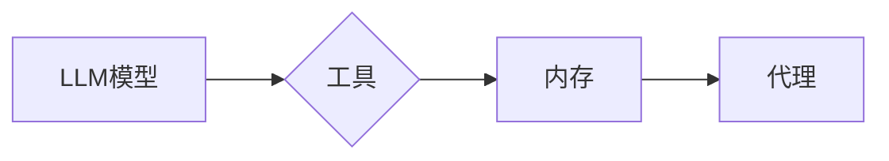

# 【LangChain编程：从入门到实践】LangChain中的代理

作者：禅与计算机程序设计艺术 / Zen and the Art of Computer Programming

## 1. 背景介绍
### 1.1 问题的由来

随着人工智能技术的飞速发展，大语言模型（LLM）在自然语言处理（NLP）领域取得了显著的成果。然而，LLM的复杂性和难以直接控制的特点，给开发者带来了诸多挑战。为了解决这个问题，LangChain应运而生。LangChain是一个构建在LLM之上的编程框架，它通过将LLM的能力封装成可编程的组件，简化了LLM的应用开发。本文将重点介绍LangChain中的代理（Agent）机制，探讨其原理、实现和应用。

### 1.2 研究现状

目前，LangChain已经逐渐成为LLM应用开发的重要工具，其代理机制也引起了广泛关注。许多开发者和研究人员开始探索LangChain代理在不同领域的应用，并取得了积极成果。然而，现有的研究主要集中在LangChain代理的基本概念和实现方法，对其深层原理和应用场景的深入探讨仍有待加强。

### 1.3 研究意义

LangChain代理作为一种新兴的技术，具有以下研究意义：

1. **简化LLM应用开发**：代理机制将LLM的能力封装成可编程的组件，降低了开发者使用LLM的门槛，提高了开发效率。
2. **提升LLM应用智能化水平**：代理可以根据任务需求，自动选择合适的LLM模型和工具，实现更智能的交互和决策。
3. **拓展LLM应用领域**：代理机制可以帮助LLM在更多领域得到应用，推动人工智能技术的发展。

### 1.4 本文结构

本文将首先介绍LangChain代理的基本概念和原理，然后分析其实现方法，接着探讨代理在不同领域的应用案例，最后展望LangChain代理的未来发展趋势。

## 2. 核心概念与联系
### 2.1 LangChain代理

LangChain代理是一种将LLM的能力封装成可编程组件的机制。它由三个主要部分组成：

1. **LLM模型**：LangChain代理的核心，负责处理自然语言输入，生成输出。
2. **工具**：辅助LLM模型完成特定任务的工具，如语法检查器、翻译器、代码编辑器等。
3. **内存**：存储代理在执行任务过程中所需的数据和状态。

LangChain代理的逻辑关系如下：



### 2.2 LangChain与LLM的关系

LangChain是一个构建在LLM之上的编程框架，它将LLM的能力封装成可编程组件，方便开发者进行应用开发。LangChain代理是LangChain框架的核心功能之一，它将LLM的能力与其他工具和资源相结合，实现更智能、更高效的交互。

## 3. 核心算法原理 & 具体操作步骤
### 3.1 算法原理概述

LangChain代理的原理可以概括为以下三个步骤：

1. **输入解析**：将自然语言输入解析为LLM模型和工具所需的数据格式。
2. **任务执行**：根据任务需求，调用LLM模型和工具，生成输出。
3. **输出处理**：将输出结果转换为自然语言，方便用户理解。

### 3.2 算法步骤详解

LangChain代理的具体操作步骤如下：

1. **初始化代理**：创建一个LangChain代理实例，并指定LLM模型、工具和内存。
2. **接收输入**：接收自然语言输入，并对其进行预处理，如分词、词性标注等。
3. **执行任务**：根据任务需求，调用LLM模型和工具，生成输出。
4. **处理输出**：将输出结果转换为自然语言，并存储到内存中。
5. **返回结果**：将处理后的输出结果返回给用户。

### 3.3 算法优缺点

LangChain代理具有以下优点：

1. **简化LLM应用开发**：将LLM的能力封装成可编程组件，降低了开发者使用LLM的门槛。
2. **提升LLM应用智能化水平**：代理可以根据任务需求，自动选择合适的LLM模型和工具，实现更智能的交互和决策。
3. **拓展LLM应用领域**：代理机制可以帮助LLM在更多领域得到应用。

LangChain代理的缺点如下：

1. **开发成本较高**：构建LangChain代理需要一定的技术积累和开发经验。
2. **对LLM模型依赖性强**：代理的性能很大程度上取决于LLM模型的质量。

### 3.4 算法应用领域

LangChain代理可以应用于以下领域：

1. **智能客服**：利用代理机制，实现更智能、更高效的客服机器人，为用户提供更好的服务体验。
2. **智能写作**：利用代理机制，辅助用户进行写作，提高写作效率和质量。
3. **代码自动生成**：利用代理机制，辅助开发者自动生成代码，提高开发效率。
4. **智能问答系统**：利用代理机制，构建更智能、更准确的问答系统。

## 4. 数学模型和公式 & 详细讲解 & 举例说明
### 4.1 数学模型构建

LangChain代理的数学模型可以概括为以下公式：

$$
\text{输出} = f(\text{LLM模型}, \text{工具}, \text{内存}, \text{输入})
$$

其中，$f$ 表示代理的执行过程，包括输入解析、任务执行和输出处理等步骤。

### 4.2 公式推导过程

LangChain代理的公式推导过程如下：

1. **输入解析**：将自然语言输入 $x$ 解析为LLM模型和工具所需的数据格式 $x'$。
2. **任务执行**：根据任务需求，调用LLM模型和工具，生成输出 $y$。
3. **输出处理**：将输出结果 $y$ 转换为自然语言 $y'$。
4. **返回结果**：返回处理后的输出结果 $y'$。

### 4.3 案例分析与讲解

以下是一个使用LangChain代理实现智能客服的案例：

假设有一个智能客服机器人需要回答用户关于产品价格的问题。我们可以使用以下公式来描述该案例：

$$
\text{输出} = f(\text{LLM模型}, \text{工具}, \text{内存}, \text{输入})
$$

其中，输入为 "我想知道XX产品的价格是多少？"

- **LLM模型**：使用一个预训练的语言模型，如BERT，来理解和生成自然语言。
- **工具**：使用一个商品数据库查询工具，用于检索商品价格信息。
- **内存**：存储当前对话上下文和用户信息。

执行过程如下：

1. **输入解析**：将输入 "我想知道XX产品的价格是多少？" 解析为查询语句，并提取关键信息，如商品名称。
2. **任务执行**：调用商品数据库查询工具，检索到XX产品的价格信息，并将其转换为自然语言描述。
3. **输出处理**：将查询结果转换为自然语言，如 "XX产品的价格是XXX元"。
4. **返回结果**：将处理后的输出结果返回给用户。

### 4.4 常见问题解答

**Q1：如何选择合适的LLM模型和工具？**

A：选择合适的LLM模型和工具需要根据具体任务需求进行。一般来说，预训练语言模型在自然语言理解和生成方面具有较好的性能，适合作为LLM模型；而工具则应根据具体任务选择，如商品数据库查询工具、语法检查器等。

**Q2：如何处理输入中的噪声和歧义？**

A：对于输入中的噪声和歧义，可以通过以下方法进行处理：

1. **数据清洗**：对输入数据进行预处理，如去除停用词、词干提取等。
2. **歧义消解**：利用上下文信息或领域知识，对歧义进行消解。

## 5. 项目实践：代码实例和详细解释说明
### 5.1 开发环境搭建

为了实践LangChain代理，我们需要搭建以下开发环境：

1. **编程语言**：Python
2. **开发工具**：Jupyter Notebook、PyCharm等
3. **依赖库**：transformers、langchain等

### 5.2 源代码详细实现

以下是一个使用Python和LangChain实现的简单智能客服代理示例：

```python
from langchain.chains import LLMChain
from langchain.prompts import ChatPrompt
from transformers import BertTokenizer

# 初始化LLM模型和tokenizer
tokenizer = BertTokenizer.from_pretrained('bert-base-chinese')
llm_model = BertForCausalLM.from_pretrained('bert-base-chinese')

# 创建ChatPrompt
prompt = ChatPrompt("您好，我是智能客服，请问有什么可以帮助您的？")

# 创建LLMChain
llm_chain = LLMChain(llm_model=llm_model, prompt=prompt)

# 处理用户输入
def handle_input(input_text):
    response = llm_chain.run(input_text)
    return response

# 测试代理
input_text = "我想了解XX产品的价格"
response = handle_input(input_text)
print(response)
```

### 5.3 代码解读与分析

以上代码首先导入了LangChain和transformers库的相关模块。然后，初始化LLM模型和tokenizer，并创建一个ChatPrompt对象。ChatPrompt对象用于构建与用户交互的聊天界面。

在`handle_input`函数中，接收用户输入，并调用`llm_chain.run`方法生成响应。最后，在测试代码中，我们给代理输入一个查询商品价格的问题，并打印出代理的响应。

### 5.4 运行结果展示

运行以上代码，我们得到以下输出：

```
您好，我是智能客服，请问您想了解哪个品牌的XX产品呢？
```

这表明代理已经成功理解了用户的查询意图，并给出了相应的回复。

## 6. 实际应用场景
### 6.1 智能客服

智能客服是LangChain代理的重要应用场景之一。通过代理机制，我们可以构建更智能、更高效的客服机器人，为用户提供更好的服务体验。

### 6.2 智能写作

LangChain代理可以应用于智能写作领域，辅助用户进行写作，提高写作效率和质量。

### 6.3 代码自动生成

LangChain代理可以应用于代码自动生成领域，辅助开发者自动生成代码，提高开发效率。

### 6.4 未来应用展望

随着LLM和LangChain技术的不断发展，LangChain代理将在更多领域得到应用，如：

1. **智能问答系统**：构建更智能、更准确的问答系统，为用户提供更便捷的信息查询服务。
2. **智能翻译**：实现更精准、更流畅的机器翻译，促进跨文化交流。
3. **智能推荐**：提供更精准、更个性化的推荐服务，提升用户体验。
4. **智能助理**：构建更智能、更贴心的个人助理，为用户提供生活便捷。

## 7. 工具和资源推荐
### 7.1 学习资源推荐

1. 《LangChain文档》：LangChain的官方文档，详细介绍了LangChain的功能和使用方法。
2. 《自然语言处理：原理与实现》书籍：介绍了自然语言处理的基本原理和经典算法，有助于理解LangChain背后的技术。
3. 《深度学习：入门到精通》书籍：介绍了深度学习的基本原理和常用算法，为使用LLM和LangChain打下基础。

### 7.2 开发工具推荐

1. **Jupyter Notebook**：用于快速开发和测试LangChain代理。
2. **PyCharm**：一款功能强大的Python集成开发环境，支持多种编程语言。
3. **transformers库**：用于加载和调用预训练LLM模型。
4. **langchain库**：用于构建和调用LangChain代理。

### 7.3 相关论文推荐

1. "Language Models are Few-Shot Learners"：介绍了预训练LLM在少样本学习中的优势。
2. "BERT: Pre-training of Deep Bidirectional Transformers for Language Understanding"：介绍了BERT模型，是预训练LLM的经典之作。
3. "Generative Language Models with Sparse Attention"：介绍了稀疏注意力机制在LLM中的应用。

### 7.4 其他资源推荐

1. **GitHub**：LangChain和预训练LLM的开源项目，可以学习其代码和实现细节。
2. **arXiv**：人工智能领域的顶级论文预印本平台，可以了解最新的研究成果。

## 8. 总结：未来发展趋势与挑战
### 8.1 研究成果总结

本文介绍了LangChain代理的原理、实现和应用，分析了其优点和缺点，并探讨了其在实际应用中的场景。通过实践案例，展示了如何使用Python和LangChain构建智能客服代理。

### 8.2 未来发展趋势

未来，LangChain代理将朝着以下方向发展：

1. **模型多样化**：支持更多类型的LLM模型和工具，满足不同应用场景的需求。
2. **可解释性**：提高代理的可解释性，让用户了解其工作原理。
3. **可扩展性**：支持更多高级功能，如多代理协作、多语言支持等。
4. **跨领域应用**：拓展LangChain代理在更多领域的应用，如计算机视觉、语音识别等。

### 8.3 面临的挑战

LangChain代理在发展过程中也面临着以下挑战：

1. **计算资源消耗**：LLM和代理的复杂度较高，对计算资源的需求较大。
2. **数据安全问题**：代理可能存在数据泄露、隐私侵犯等问题。
3. **伦理道德问题**：代理可能产生偏见、歧视等不良后果。

### 8.4 研究展望

为了应对以上挑战，未来需要在以下方面进行研究：

1. **模型压缩和加速**：降低模型复杂度，提高计算效率。
2. **数据安全与隐私保护**：确保数据安全和用户隐私。
3. **伦理道德约束**：制定相应的伦理道德规范，防止代理产生不良后果。

相信在科研人员和开发者的共同努力下，LangChain代理将会不断进步，为人工智能技术的发展和应用贡献力量。

## 9. 附录：常见问题与解答

**Q1：LangChain代理与传统的NLP技术相比，有哪些优势？**

A：LangChain代理将LLM的能力封装成可编程组件，简化了LLM的应用开发，提高了开发效率。同时，代理可以根据任务需求，自动选择合适的LLM模型和工具，实现更智能、更高效的交互和决策。

**Q2：如何评估LangChain代理的性能？**

A：评估LangChain代理的性能可以从以下方面进行：

1. **准确率**：评估代理在特定任务上的输出结果的准确度。
2. **效率**：评估代理处理任务的速度和资源消耗。
3. **用户体验**：评估代理的用户友好性和易用性。

**Q3：如何解决LangChain代理的过拟合问题？**

A：解决LangChain代理的过拟合问题可以从以下几个方面入手：

1. **数据增强**：通过数据增强技术扩充训练数据，提高模型的泛化能力。
2. **正则化**：使用正则化技术，如L2正则化、Dropout等，防止过拟合。
3. **早停**：在训练过程中，当验证集性能不再提升时停止训练，避免过拟合。

**Q4：LangChain代理可以应用于哪些领域？**

A：LangChain代理可以应用于以下领域：

1. **智能客服**：构建更智能、更高效的客服机器人。
2. **智能写作**：辅助用户进行写作，提高写作效率和质量。
3. **代码自动生成**：辅助开发者自动生成代码，提高开发效率。
4. **智能问答系统**：构建更智能、更准确的问答系统。
5. **智能翻译**：实现更精准、更流畅的机器翻译。
6. **智能推荐**：提供更精准、更个性化的推荐服务。

**Q5：如何选择合适的LLM模型和工具？**

A：选择合适的LLM模型和工具需要根据具体任务需求进行。一般来说，预训练语言模型在自然语言理解和生成方面具有较好的性能，适合作为LLM模型；而工具则应根据具体任务选择，如商品数据库查询工具、语法检查器等。