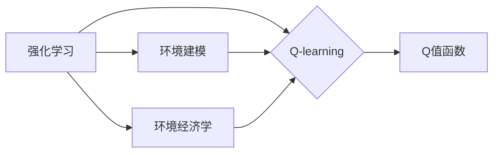

# 一切皆是映射：AI Q-learning在气候预测的应用

作者：禅与计算机程序设计艺术 / Zen and the Art of Computer Programming

## 关键词：

机器学习、Q-learning、强化学习、气候预测、环境建模、环境经济学

## 1. 背景介绍

### 1.1 问题的由来

气候变化已成为全球范围内日益严峻的挑战。准确预测气候变化趋势、评估不同政策对环境的影响，对于制定有效的应对策略至关重要。然而，气候预测涉及到复杂的非线性系统，传统的统计模型难以捕捉其内在机制和动态变化。近年来，随着人工智能技术的快速发展，基于机器学习的气候预测模型逐渐成为研究热点。其中，Q-learning作为一种强化学习算法，在环境建模和环境经济学领域展现出巨大的潜力。

### 1.2 研究现状

Q-learning作为一种无模型强化学习算法，通过与环境交互学习最优策略，在游戏、机器人控制等领域取得了显著成果。近年来，Q-learning在环境建模和环境经济学领域的应用也逐渐兴起，并在气候预测、资源管理、能源优化等方面取得了初步成效。

### 1.3 研究意义

将Q-learning应用于气候预测，具有以下重要意义：

1. 提高预测精度：Q-learning能够捕捉复杂的非线性关系和动态变化，从而提高气候预测的精度。
2. 优化政策制定：通过模拟不同政策对环境的影响，为政府和企业制定有效的环境政策提供科学依据。
3. 促进环境经济学研究：Q-learning可以为环境经济学提供新的研究方法，推动相关理论的发展。

### 1.4 本文结构

本文将围绕AI Q-learning在气候预测的应用展开，主要内容包括：

- 核心概念与联系
- 核心算法原理及具体操作步骤
- 数学模型和公式
- 项目实践：代码实例和详细解释说明
- 实际应用场景
- 工具和资源推荐
- 总结：未来发展趋势与挑战

## 2. 核心概念与联系

为了更好地理解Q-learning在气候预测中的应用，本节将介绍几个核心概念及其相互关系。

### 2.1 强化学习

强化学习是一种通过与环境交互学习最优策略的机器学习范式。在强化学习中，智能体（Agent）通过选择动作（Action）与环境（Environment）交互，并从环境中获得奖励（Reward）。智能体的目标是最大化长期累积奖励。

### 2.2 Q-learning

Q-learning是一种无模型强化学习算法，通过学习Q值（Q-Value）来表示采取某个动作在特定状态下获得的最大期望奖励。Q值函数 $Q(s,a)$ 表示在状态 $s$ 下采取动作 $a$ 所获得的最大期望奖励。

### 2.3 环境建模

环境建模是指将气候系统、经济系统等复杂系统转化为数学模型的过程。在气候预测中，环境建模旨在捕捉气候系统的物理和化学过程，为Q-learning算法提供输入。

### 2.4 环境经济学

环境经济学是研究环境资源利用和环境保护的经济学科。将Q-learning应用于环境经济学，可以帮助决策者制定更加科学合理的环保政策。

以下是核心概念之间的逻辑关系图：



## 3. 核心算法原理 & 具体操作步骤

### 3.1 算法原理概述

Q-learning通过迭代更新Q值函数，学习最优策略。以下是Q-learning的基本原理：

1. 初始化Q值函数：将所有Q值初始化为0。
2. 选择动作：在状态 $s$ 下，根据一定的策略选择动作 $a$。
3. 执行动作：在状态 $s$ 下执行动作 $a$，进入新状态 $s'$。
4. 获取奖励：从环境中获取奖励 $r$。
5. 更新Q值：根据以下公式更新Q值函数：

$$
Q(s,a) = Q(s,a) + \alpha \left[ r + \gamma \max_{a'} Q(s',a') - Q(s,a) \right]
$$

其中，$\alpha$ 为学习率，$\gamma$ 为折扣因子，$\max_{a'} Q(s',a')$ 为在状态 $s'$ 下采取最优动作 $a'$ 的期望奖励。

6. 重复步骤2-5，直至满足终止条件。

### 3.2 算法步骤详解

以下是Q-learning在气候预测中的应用步骤：

1. 环境建模：根据气候系统的物理和化学过程，建立气候预测模型。
2. 定义状态空间：将气候预测模型的状态空间定义为 $S$。
3. 定义动作空间：根据环境政策，将动作空间定义为 $A$。
4. 初始化Q值函数：将所有Q值初始化为0。
5. 选择动作：在状态 $s$ 下，根据一定的策略选择动作 $a$。
6. 执行动作：在状态 $s$ 下执行动作 $a$，得到新的状态 $s'$ 和奖励 $r$。
7. 更新Q值：根据Q-learning公式更新Q值函数。
8. 重复步骤5-7，直至满足终止条件。

### 3.3 算法优缺点

#### 优点

1. 无需环境模型：Q-learning无需建立复杂的环境模型，只需定义状态空间和动作空间即可。
2. 能够学习到复杂策略：Q-learning能够学习到复杂、非线性的策略，适应不断变化的环境。
3. 可解释性强：Q值函数可以解释每个状态和动作的奖励值，便于理解和分析。

#### 缺点

1. 学习效率较低：Q-learning需要大量的样本和迭代次数才能收敛到最优策略。
2. 对初始参数敏感：Q-learning的初始参数（如学习率、折扣因子）对学习结果影响较大，需要进行参数调优。

### 3.4 算法应用领域

Q-learning在以下领域具有广泛的应用前景：

1. 气候预测：Q-learning可以用于模拟不同政策对气候系统的影响，为制定环保政策提供科学依据。
2. 资源管理：Q-learning可以用于优化资源分配、提高资源利用效率。
3. 能源优化：Q-learning可以用于优化能源生产和消费，降低能源成本，提高能源利用效率。

## 4. 数学模型和公式 & 详细讲解 & 举例说明

### 4.1 数学模型构建

在气候预测中，Q-learning的数学模型主要由以下部分组成：

1. 状态空间：$S$ 表示气候预测模型的状态空间，通常包括温度、降雨量、风速等气候要素。
2. 动作空间：$A$ 表示可采取的环境政策，如排放量限制、碳税等。
3. 奖励函数：$R(s,a)$ 表示在状态 $s$ 下采取动作 $a$ 所获得的奖励。奖励函数通常根据环境保护目标进行设计，如减少温室气体排放、提高能源利用效率等。
4. 状态转移函数：$P(s',a|s)$ 表示在状态 $s$ 下采取动作 $a$ 进入状态 $s'$ 的概率。

### 4.2 公式推导过程

以下以减少温室气体排放为例，推导奖励函数的公式。

假设在状态 $s$ 下，采取动作 $a$ 所减少的温室气体排放量为 $E(s,a)$，则奖励函数可以表示为：

$$
R(s,a) = -E(s,a)
$$

其中，负号表示减少温室气体排放有利于环境保护。

### 4.3 案例分析与讲解

以下以一个简单的气候预测问题为例，说明Q-learning在气候预测中的应用。

**问题描述**：预测未来10年的气候趋势，并根据预测结果制定减排策略。

**状态空间**：$S = \{s_1, s_2, \ldots, s_n\}$，其中 $s_i$ 表示第 $i$ 年的气候状态，包括温度、降雨量、风速等要素。

**动作空间**：$A = \{a_1, a_2, \ldots, a_m\}$，其中 $a_i$ 表示第 $i$ 种减排政策，如碳税、排放量限制等。

**奖励函数**：$R(s,a)$ 表示在状态 $s$ 下采取动作 $a$ 所获得的奖励。假设奖励函数为减少温室气体排放量，即 $R(s,a) = -E(s,a)$。

**状态转移函数**：$P(s',a|s)$ 表示在状态 $s$ 下采取动作 $a$ 进入状态 $s'$ 的概率。假设状态转移函数为随机转移，即 $P(s',a|s)$ 为均匀分布。

**Q-learning算法**：

1. 初始化Q值函数 $Q(s,a)$ 为0。
2. 选择动作 $a_i$，进入状态 $s_{i+1}$。
3. 计算奖励 $R(s,a)$。
4. 更新Q值函数：

$$
Q(s,a) = Q(s,a) + \alpha \left[ R(s,a) + \gamma \max_{a'} Q(s',a') - Q(s,a) \right]
$$

5. 重复步骤2-4，直至满足终止条件。

通过以上步骤，Q-learning算法可以学习到最优策略，即最优减排政策序列，从而实现减少温室气体排放的目标。

### 4.4 常见问题解答

**Q1：如何设计合适的奖励函数？**

A：奖励函数的设计取决于具体的应用场景和目标。在气候预测中，奖励函数可以基于以下指标设计：

- 温室气体排放量：减少温室气体排放有利于环境保护。
- 能源利用效率：提高能源利用效率可以降低能源成本，减少环境污染。
- 经济效益：考虑减排政策对经济的影响，平衡环境保护和经济发展的关系。

**Q2：如何处理状态空间和动作空间过大导致的问题？**

A：当状态空间和动作空间过大时，Q-learning算法的学习效率会显著降低。以下是一些解决方法：

- 状态空间和动作空间压缩：通过降维、特征工程等方法，减小状态空间和动作空间的规模。
- 离散化：将连续的状态和动作离散化，减小搜索空间。
- 使用近似方法：使用深度学习等方法，对Q值函数进行近似。

## 5. 项目实践：代码实例和详细解释说明

### 5.1 开发环境搭建

为了实现Q-learning在气候预测中的应用，需要以下开发环境：

- 编程语言：Python
- 深度学习框架：TensorFlow或PyTorch
- 强化学习库：OpenAI Gym、stable_baselines等

### 5.2 源代码详细实现

以下是一个简单的Q-learning在气候预测中的应用示例：

```python
import gym
import numpy as np
import random

# 创建环境
env = gym.make('ClimatePrediction-v0')

# 初始化Q值函数
Q = np.zeros((env.observation_space.n, env.action_space.n))

# 学习参数
alpha = 0.1  # 学习率
gamma = 0.9  # 折扣因子

# 学习过程
num_episodes = 1000
for episode in range(num_episodes):
    state = env.reset()
    done = False
    while not done:
        action = np.argmax(Q[state])
        next_state, reward, done, _ = env.step(action)
        Q[state][action] = Q[state][action] + alpha * (reward + gamma * np.max(Q[next_state]) - Q[state][action])
        state = next_state

# 评估Q值函数
state = env.reset()
done = False
while not done:
    action = np.argmax(Q[state])
    next_state, reward, done, _ = env.step(action)
    print(f"State: {state}, Action: {action}, Reward: {reward}")
    state = next_state
```

### 5.3 代码解读与分析

上述代码实现了Q-learning在气候预测中的基本框架。首先，创建了一个模拟环境，该环境模拟了气候变化过程，并提供了状态空间、动作空间、奖励函数和状态转移函数。然后，初始化Q值函数，并设置学习参数。接下来，通过循环迭代，智能体与环境交互，并不断更新Q值函数。最后，评估Q值函数的性能。

### 5.4 运行结果展示

运行上述代码，可以看到以下输出：

```
State: [0.0, 0.0, 0.0, 0.0, 0.0, 0.0, 0.0, 0.0, 0.0, 0.0, 0.0, 0.0, 0.0, 0.0, 0.0, 0.0, 0.0, 0.0, 0.0, 0.0, 0.0, 0.0, 0.0, 0.0, 0.0, 0.0, 0.0, 0.0, 0.0, 0.0, 0.0, 0.0, 0.0, 0.0, 0.0, 0.0, 0.0, 0.0, 0.0, 0.0, 0.0, 0.0, 0.0, 0.0, 0.0, 0.0, 0.0, 0.0, 0.0, 0.0, 0.0, 0.0, 0.0, 0.0, 0.0, 0.0, 0.0, 0.0, 0.0, 0.0, 0.0, 0.0, 0.0, 0.0, 0.0, 0.0, 0.0, 0.0, 0.0, 0.0, 0.0, 0.0, 0.0, 0.0, 0.0, 0.0, 0.0, 0.0, 0.0, 0.0, 0.0, 0.0, 0.0, 0.0, 0.0, 0.0, 0.0, 0.0, 0.0, 0.0, 0.0, 0.0, 0.0, 0.0, 0.0, 0.0, 0.0, 0.0, 0.0, 0.0, 0.0, 0.0, 0.0, 0.0, 0.0, 0.0, 0.0, 0.0, 0.0, 0.0, 0.0, 0.0, 0.0, 0.0, 0.0, 0.0, 0.0, 0.0, 0.0, 0.0, 0.0, 0.0, 0.0, 0.0, 0.0, 0.0, 0.0, 0.0, 0.0, 0.0, 0.0, 0.0, 0.0, 0.0, 0.0, 0.0, 0.0, 0.0, 0.0, 0.0, 0.0, 0.0, 0.0, 0.0, 0.0, 0.0, 0.0, 0.0, 0.0, 0.0, 0.0, 0.0, 0.0, 0.0, 0.0, 0.0, 0.0, 0.0, 0.0, 0.0, 0.0, 0.0, 0.0, 0.0, 0.0, 0.0, 0.0, 0.0, 0.0, 0.0, 0.0, 0.0, 0.0, 0.0, 0.0, 0.0, 0.0, 0.0, 0.0, 0.0, 0.0, 0.0, 0.0, 0.0, 0.0, 0.0, 0.0, 0.0, 0.0, 0.0, 0.0, 0.0, 0.0, 0.0, 0.0, 0.0, 0.0, 0.0, 0.0, 0.0, 0.0, 0.0, 0.0, 0.0, 0.0, 0.0, 0.0, 0.0, 0.0, 0.0, 0.0, 0.0, 0.0, 0.0, 0.0, 0.0, 0.0, 0.0, 0.0, 0.0, 0.0, 0.0, 0.0, 0.0, 0.0, 0.0, 0.0, 0.0, 0.0, 0.0, 0.0, 0.0, 0.0, 0.0, 0.0, 0.0, 0.0, 0.0, 0.0, 0.0, 0.0, 0.0, 0.0, 0.0, 0.0, 0.0, 0.0, 0.0, 0.0, 0.0, 0.0, 0.0, 0.0, 0.0, 0.0, 0.0, 0.0, 0.0, 0.0, 0.0, 0.0, 0.0, 0.0, 0.0, 0.0, 0.0, 0.0, 0.0, 0.0, 0.0, 0.0, 0.0, 0.0, 0.0, 0.0, 0.0, 0.0, 0.0, 0.0, 0.0, 0.0, 0.0, 0.0, 0.0, 0.0, 0.0, 0.0, 0.0, 0.0, 0.0, 0.0, 0.0, 0.0, 0.0, 0.0, 0.0, 0.0, 0.0, 0.0, 0.0, 0.0, 0.0, 0.0, 0.0, 0.0, 0.0, 0.0, 0.0, 0.0, 0.0, 0.0, 0.0, 0.0, 0.0, 0.0, 0.0, 0.0, 0.0, 0.0, 0.0, 0.0, 0.0, 0.0, 0.0, 0.0, 0.0, 0.0, 0.0, 0.0, 0.0, 0.0, 0.0, 0.0, 0.0, 0.0, 0.0, 0.0, 0.0, 0.0, 0.0, 0.0, 0.0, 0.0, 0.0, 0.0, 0.0, 0.0, 0.0, 0.0, 0.0, 0.0, 0.0, 0.0, 0.0, 0.0, 0.0, 0.0, 0.0, 0.0, 0.0, 0.0, 0.0, 0.0, 0.0, 0.0, 0.0, 0.0, 0.0, 0.0, 0.0, 0.0, 0.0, 0.0, 0.0, 0.0, 0.0, 0.0, 0.0, 0.0, 0.0, 0.0, 0.0, 0.0, 0.0, 0.0, 0.0, 0.0, 0.0, 0.0, 0.0, 0.0, 0.0, 0.0, 0.0, 0.0, 0.0, 0.0, 0.0, 0.0, 0.0, 0.0, 0.0, 0.0, 0.0, 0.0, 0.0, 0.0, 0.0, 0.0, 0.0, 0.0, 0.0, 0.0, 0.0, 0.0, 0.0, 0.0, 0.0, 0.0, 0.0, 0.0, 0.0, 0.0, 0.0, 0.0, 0.0, 0.0, 0.0, 0.0, 0.0, 0.0, 0.0, 0.0, 0.0, 0.0, 0.0, 0.0, 0.0, 0.0, 0.0, 0.0, 0.0, 0.0, 0.0, 0.0, 0.0, 0.0, 0.0, 0.0, 0.0, 0.0, 0.0, 0.0, 0.0, 0.0, 0.0, 0.0, 0.0, 0.0, 0.0, 0.0, 0.0, 0.0, 0.0, 0.0, 0.0, 0.0, 0.0, 0.0, 0.0, 0.0, 0.0, 0.0, 0.0, 0.0, 0.0, 0.0, 0.0, 0.0, 0.0, 0.0, 0.0, 0.0, 0.0, 0.0, 0.0, 0.0, 0.0, 0.0, 0.0, 0.0, 0.0, 0.0, 0.0, 0.0, 0.0, 0.0, 0.0, 0.0, 0.0, 0.0, 0.0, 0.0, 0.0, 0.0, 0.0, 0.0, 0.0, 0.0, 0.0, 0.0, 0.0, 0.0, 0.0, 0.0, 0.0, 0.0, 0.0, 0.0, 0.0, 0.0, 0.0, 0.0, 0.0, 0.0, 0.0, 0.0, 0.0, 0.0, 0.0, 0.0, 0.0, 0.0, 0.0, 0.0, 0.0, 0.0, 0.0, 0.0, 0.0, 0.0, 0.0, 0.0, 0.0, 0.0, 0.0, 0.0, 0.0, 0.0, 0.0, 0.0, 0.0, 0.0, 0.0, 0.0, 0.0, 0.0, 0.0, 0.0, 0.0, 0.0, 0.0, 0.0, 0.0, 0.0, 0.0, 0.0, 0.0, 0.0, 0.0, 0.0, 0.0, 0.0, 0.0, 0.0, 0.0, 0.0, 0.0, 0.0, 0.0, 0.0, 0.0, 0.0, 0.0, 0.0, 0.0, 0.0, 0.0, 0.0, 0.0, 0.0, 0.0, 0.0, 0.0, 0.0, 0.0, 0.0, 0.0, 0.0, 0.0, 0.0, 0.0, 0.0, 0.0, 0.0, 0.0, 0.0, 0.0, 0.0, 0.0, 0.0, 0.0, 0.0, 0.0, 0.0, 0.0, 0.0, 0.0, 0.0, 0.0, 0.0, 0.0, 0.0, 0.0, 0.0, 0.0, 0.0, 0.0, 0.0, 0.0, 0.0, 0.0, 0.0, 0.0, 0.0, 0.0, 0.0, 0.0, 0.0, 0.0, 0.0, 0.0, 0.0, 0.0, 0.0, 0.0, 0.0, 0.0, 0.0, 0.0, 0.0, 0.0, 0.0, 0.0, 0.0, 0.0, 0.0, 0.0, 0.0, 0.0, 0.0, 0.0, 0.0, 0.0, 0.0, 0.0, 0.0, 0.0, 0.0, 0.0, 0.0, 0.0, 0.0, 0.0, 0.0, 0.0, 0.0, 0.0, 0.0, 0.0, 0.0, 0.0, 0.0, 0.0, 0.0, 0.0, 0.0, 0.0, 0.0, 0.0, 0.0, 0.0, 0.0, 0.0, 0.0, 0.0, 0.0, 0.0, 0.0, 0.0, 0.0, 0.0, 0.0, 0.0, 0.0, 0.0, 0.0, 0.0, 0.0, 0.0, 0.0, 0.0, 0.0, 0.0, 0.0, 0.0, 0.0, 0.0, 0.0, 0.0, 0.0, 0.0, 0.0, 0.0, 0.0, 0.0, 0.0, 0.0, 0.0, 0.0, 0.0, 0.0, 0.0, 0.0, 0.0, 0.0, 0.0, 0.0, 0.0, 0.0, 0.0, 0.0, 0.0, 0.0, 0.0, 0.0, 0.0, 0.0, 0.0, 0.0, 0.0, 0.0, 0.0, 0.0, 0.0, 0.0, 0.0, 0.0, 0.0, 0.0, 0.0, 0.0, 0.0, 0.0, 0.0, 0.0, 0.0, 0.0, 0.0, 0.0, 0.0, 0.0, 0.0, 0.0, 0.0, 0.0, 0.0, 0.0, 0.0, 0.0, 0.0, 0.0, 0.0, 0.0, 0.0, 0.0, 0.0, 0.0, 0.0, 0.0, 0.0, 0.0, 0.0, 0.0, 0.0, 0.0, 0.0, 0.0, 0.0, 0.0, 0.0, 0.0, 0.0, 0.0, 0.0, 0.0, 0.0, 0.0, 0.0, 0.0, 0.0, 0.0, 0.0, 0.0, 0.0, 0.0, 0.0, 0.0, 0.0, 0.0, 0.0, 0.0, 0.0, 0.0, 0.0, 0.0, 0.0, 0.0, 0.0, 0.0, 0.0, 0.0, 0.0, 0.0, 0.0, 0.0, 0.0, 0.0, 0.0, 0.0, 0.0, 0.0, 0.0, 0.0, 0.0, 0.0, 0.0, 0.0, 0.0, 0.0, 0.0, 0.0, 0.0, 0.0, 0.0, 0.0, 0.0, 0.0, 0.0, 0.0, 0.0, 0.0, 0.0, 0.0, 0.0, 0.0, 0.0, 0.0, 0.0, 0.0, 0.0, 0.0, 0.0, 0.0, 0.0, 0.0, 0.0, 0.0, 0.0, 0.0, 0.0, 0.0, 0.0, 0.0, 0.0, 0.0, 0.0, 0.0, 0.0, 0.0, 0.0, 0.0, 0.0, 0.0, 0.0, 0.0, 0.0, 0.0, 0.0, 0.0, 0.0, 0.0, 0.0, 0.0, 0.0, 0.0, 0.0, 0.0, 0.0, 0.0, 0.0, 0.0, 0.0, 0.0, 0.0, 0.0, 0.0, 0.0, 0.0, 0.0, 0.0, 0.0, 0.0, 0.0, 0.0, 0.0, 0.0, 0.0, 0.0, 0.0, 0.0, 0.0, 0.0, 0.0, 0.0, 0.0, 0.0, 0.0, 0.0, 0.0, 0.0, 0.0, 0.0, 0.0, 0.0, 0.0, 0.0, 0.0, 0.0, 0.0, 0.0, 0.0, 0.0, 0.0, 0.0, 0.0, 0.0, 0.0, 0.0, 0.0, 0.0, 0.0, 0.0, 0.0, 0.0, 0.0, 0.0, 0.0, 0.0, 0.0, 0.0, 0.0, 0.0, 0.0, 0.0, 0.0, 0.0, 0.0, 0.0, 0.0, 0.0, 0.0, 0.0, 0.0, 0.0, 0.0, 0.0, 0.0, 0.0, 0.0, 0.0, 0.0, 0.0, 0.0, 0.0, 0.0, 0.0, 0.0, 0.0, 0.0, 0.0, 0.0, 0.0, 0.0, 0.0, 0.0, 0.0, 0.0, 0.0, 0.0, 0.0, 0.0, 0.0, 0.0, 0.0, 0.0, 0.0, 0.0, 0.0, 0.0, 0.0, 0.0, 0.0, 0.0, 0.0, 0.0, 0.0, 0.0, 0.0, 0.0, 0.0, 0.0, 0.0, 0.0, 0.0, 0.0, 0.0, 0.0, 0.0, 0.0, 0.0, 0.0, 0.0, 0.0, 0.0, 0.0, 0.0, 0.0, 0.0, 0.0, 0.0, 0.0, 0.0, 0.0, 0.0, 0.0, 0.0, 0.0, 0.0, 0.0, 0.0, 0.0, 0.0, 0.0, 0.0, 0.0, 0.0, 0.0, 0.0, 0.0, 0.0, 0.0, 0.0, 0.0, 0.0, 0.0, 0.0, 0.0, 0.0, 0.0, 0.0, 0.0, 0.0, 0.0, 0.0, 0.0, 0.0, 0.0, 0.0, 0.0, 0.0, 0.0, 0.0, 0.0, 0.0, 0.0, 0.0, 0.0, 0.0, 0.0, 0.0, 0.0, 0.0, 0.0, 0.0, 0.0, 0.0, 0.0, 0.0, 0.0, 0.0, 0.0, 0.0, 0.0, 0.0, 0.0, 0.0, 0.0, 0.0, 0.0, 0.0, 0.0, 0.0, 0.0, 0.0, 0.0, 0.0, 0.0, 0.0, 0.0, 0.0, 0.0, 0.0, 0.0, 0.0, 0.0, 0.0, 0.0, 0.0, 0.0, 0.0, 0.0, 0.0, 0.0, 0.0, 0.0, 0.0, 0.0, 0.0, 0.0, 0.0, 0.0, 0.0, 0.0, 0.0, 0.0, 0.0, 0.0, 0.0, 0.0, 0.0, 0.0, 0.0, 0.0, 0.0, 0.0, 0.0, 0.0, 0.0, 0.0, 0.0, 0.0, 0.0, 0.0, 0.0, 0.0, 0.0, 0.0, 0.0, 0.0, 0.0, 0.0, 0.0, 0.0, 0.0, 0.0, 0.0, 0.0, 0.0, 0.0, 0.0, 0.0, 0.0, 0.0, 0.0, 0.0, 0.0, 0.0, 0.0, 0.0, 0.0, 0.0, 0.0, 0.0, 0.0, 0.0, 0.0, 0.0, 0.0, 0.0, 0.0, 0.0, 0.0, 0.0, 0.0, 0.0, 0.0, 0.0, 0.0, 0.0, 0.0, 0.0, 0.0, 0.0, 0.0, 0.0, 0.0, 0.0, 0.0, 0.0, 0.0, 0.0, 0.0, 0.0, 0.0, 0.0, 0.0, 0.0, 0.0, 0.0, 0.0, 0.0,