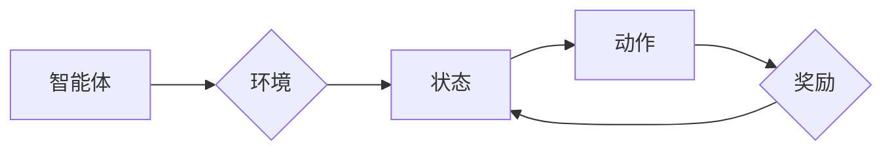

# 一切皆是映射：AI Q-learning探索-利用平衡实践

作者：禅与计算机程序设计艺术 / Zen and the Art of Computer Programming

## 1. 背景介绍

### 1.1 问题的由来

在人工智能领域，强化学习（Reinforcement Learning，RL）作为机器学习的一种重要分支，近年来取得了令人瞩目的进展。强化学习通过智能体在环境中通过与环境的交互，学习到最优策略以实现目标。其中，Q-learning算法作为强化学习的基础算法之一，因其简洁高效的特点而被广泛应用于各类RL任务中。

然而，在实际应用中，Q-learning算法面临着诸多挑战，如高方差、样本效率低、难以处理连续空间等。为了解决这些问题，研究人员提出了各种改进方法和算法，如Deep Q-Network（DQN）、Proximal Policy Optimization（PPO）等。本文将深入探讨Q-learning算法的原理、实践技巧以及未来的发展趋势。

### 1.2 研究现状

近年来，Q-learning算法在学术界和工业界都取得了丰硕的成果。以下是一些研究现状：

1. **改进方法**：研究人员针对Q-learning算法的局限性，提出了多种改进方法，如重要性采样、经验回放、优先级回放等，以提升算法的效率和稳定性。

2. **多智能体强化学习**：在多智能体场景下，Q-learning算法需要进一步改进，以实现多个智能体之间的协调和合作。

3. **连续控制**：Q-learning算法主要应用于离散动作空间，对于连续控制任务，需要将Q-learning扩展到连续动作空间。

4. **深度强化学习**：将深度学习与Q-learning算法结合，实现端到端学习，提高算法的样本效率。

### 1.3 研究意义

Q-learning算法在人工智能领域具有重要的研究意义：

1. **基础算法**：Q-learning作为强化学习的基础算法之一，对理解强化学习的基本原理具有重要意义。

2. **算法改进**：通过改进Q-learning算法，可以提升其在实际应用中的性能和鲁棒性。

3. **理论拓展**：Q-learning算法的研究可以推动强化学习理论的发展，为新的算法设计提供理论基础。

### 1.4 本文结构

本文将围绕Q-learning算法展开，具体内容包括：

- 核心概念与联系
- 核心算法原理与具体操作步骤
- 数学模型和公式
- 项目实践
- 实际应用场景
- 工具和资源推荐
- 总结：未来发展趋势与挑战
- 附录：常见问题与解答

## 2. 核心概念与联系

为了更好地理解Q-learning算法，本节将介绍与Q-learning密切相关的核心概念：

- **强化学习**：通过智能体与环境交互，学习到最优策略以实现目标的学习范式。
- **智能体**：在强化学习中，智能体是执行动作、感知环境并获取奖励的主体。
- **环境**：为智能体提供反馈和奖励的实体，智能体通过与环境交互学习。
- **状态**：智能体所处的环境状态，智能体根据当前状态选择动作。
- **动作**：智能体可以执行的操作。
- **奖励**：环境对智能体动作的反馈，奖励可以是正值也可以是负值。
- **策略**：智能体在给定状态下执行的动作选择规则。

这些概念之间的关系可以用以下图表示：



智能体与环境之间通过状态、动作、奖励进行交互，智能体根据当前状态选择动作，并通过奖励来评估动作的好坏，从而学习到最优策略。

## 3. 核心算法原理与具体操作步骤

### 3.1 算法原理概述

Q-learning算法是一种基于值函数的强化学习算法，通过不断更新Q值来学习最优策略。Q值表示在特定状态下采取特定动作的预期奖励。

### 3.2 算法步骤详解

Q-learning算法的主要步骤如下：

1. **初始化**：初始化Q值表格Q(s,a)为负无穷大，将智能体放置在初始状态s0。
2. **选择动作**：根据当前状态s，使用ε-greedy策略选择动作a。
3. **执行动作**：智能体执行动作a，获得奖励r，并进入下一状态s'。
4. **更新Q值**：根据Q值更新公式，更新Q值Q(s,a)为：

$$
Q(s,a) = Q(s,a) + \alpha \cdot (r + \gamma \cdot \max_{a'} Q(s',a') - Q(s,a))
$$

其中，$\alpha$ 为学习率，$\gamma$ 为折扣因子。

5. **重复步骤2-4**，直至达到终止条件。

### 3.3 算法优缺点

#### 优点：

- 算法简单易实现。
- 可以处理连续动作空间。
- 可以处理高斯噪声。

#### 缺点：

- 学习速度较慢。
- 需要存储大量的Q值。
- 对参数的选择比较敏感。

### 3.4 算法应用领域

Q-learning算法在以下领域得到了广泛应用：

- 机器人路径规划。
- 游戏AI。
- 股票交易。
- 网络游戏。
- 自动驾驶。

## 4. 数学模型和公式 & 详细讲解 & 举例说明

### 4.1 数学模型构建

Q-learning算法的数学模型可以表示为：

$$
Q(s,a) = \sum_{r \in R} P(r|s,a) \cdot r + \gamma \cdot \max_{a' \in A} Q(s',a')
$$

其中，$R$ 为所有可能奖励的集合，$P(r|s,a)$ 为在状态s采取动作a获得奖励r的概率，$\gamma$ 为折扣因子。

### 4.2 公式推导过程

以下以一个简单的例子来解释Q值更新公式的推导过程。

假设智能体在状态s1采取动作a1，获得奖励r1，并进入状态s2。接下来，智能体在状态s2采取动作a2，获得奖励r2，并进入状态s3。最后，智能体在状态s3采取动作a3，获得奖励r3，并进入状态s4。

根据Q值更新公式，我们可以得到以下推导：

$$
Q(s_1,a_1) = Q(s_1,a_1) + \alpha \cdot (r_1 + \gamma \cdot Q(s_2,a_2) - Q(s_1,a_1))
$$

$$
Q(s_2,a_2) = Q(s_2,a_2) + \alpha \cdot (r_2 + \gamma \cdot Q(s_3,a_3) - Q(s_2,a_2))
$$

$$
Q(s_3,a_3) = Q(s_3,a_3) + \alpha \cdot (r_3 + \gamma \cdot Q(s_4,a_4) - Q(s_3,a_3))
$$

通过递推，我们可以得到：

$$
Q(s_1,a_1) = r_1 + \gamma \cdot Q(s_2,a_2) - (1-\alpha) \cdot Q(s_1,a_1)
$$

### 4.3 案例分析与讲解

以下是一个简单的Q-learning案例，演示如何使用Python实现Q-learning算法。

```python
import numpy as np

# 初始化参数
alpha = 0.1  # 学习率
gamma = 0.9  # 折扣因子
epsilon = 0.1  # 探索率

# 定义环境
def environment(state):
    if state == 0:
        return 1, 1
    elif state == 1:
        return 0, -1
    else:
        return 0, 0

# 初始化Q表格
Q = np.zeros((3, 2))

# 开始学习
for episode in range(1000):
    state = 0
    while True:
        # 选择动作
        if np.random.random() < epsilon:
            action = np.random.randint(0, 2)
        else:
            action = np.argmax(Q[state])

        # 执行动作
        reward, next_state = environment(state)

        # 更新Q值
        Q[state][action] = Q[state][action] + alpha * (reward + gamma * np.max(Q[next_state]) - Q[state][action])

        # 更新状态
        state = next_state

        # 结束条件
        if next_state == 2:
            break

# 输出Q值表格
print(Q)
```

### 4.4 常见问题解答

**Q1：为什么需要探索率epsilon？**

A：探索率epsilon表示在给定状态下采取随机动作的概率。当epsilon较小时，智能体倾向于采取已知的、表现较好的动作；当epsilon较大时，智能体倾向于尝试新的动作，以发现潜在的更优策略。

**Q2：如何选择学习率alpha和折扣因子gamma？**

A：学习率和折扣因子是Q-learning算法的两个重要参数，它们对算法性能有显著影响。通常需要根据具体任务和场景进行调参。一种常用的方法是使用网格搜索等方法，在预定义的参数范围内进行搜索，找到最优参数组合。

**Q3：如何处理连续动作空间？**

A：对于连续动作空间，可以使用Q-learning算法的离散化方法，将连续动作空间划分为若干个离散区间，然后对每个区间进行Q-learning学习。

## 5. 项目实践：代码实例和详细解释说明

### 5.1 开发环境搭建

在进行Q-learning项目实践前，我们需要准备以下开发环境：

- Python 3.6及以上版本
- NumPy库
- Matplotlib库
- Jupyter Notebook

### 5.2 源代码详细实现

以下是一个简单的Q-learning项目示例，演示如何使用Python实现Q-learning算法解决迷宫问题。

```python
import numpy as np
import matplotlib.pyplot as plt

# 定义环境
def environment(state):
    if state == 0:
        return 1, 0  # 到达目标，奖励为1
    elif state == 1:
        return -1, 1  # 掉入陷阱，奖励为-1
    else:
        return 0, 0  # 无奖励

# 初始化参数
alpha = 0.1
gamma = 0.9
epsilon = 0.1
Q = np.zeros((3, 2))

# 开始学习
for episode in range(100):
    state = 0
    while True:
        # 选择动作
        if np.random.random() < epsilon:
            action = np.random.randint(0, 2)
        else:
            action = np.argmax(Q[state])

        # 执行动作
        reward, next_state = environment(state)

        # 更新Q值
        Q[state][action] = Q[state][action] + alpha * (reward + gamma * np.max(Q[next_state]) - Q[state][action])

        # 更新状态
        state = next_state

        # 结束条件
        if state == 2:
            break

# 绘制Q值表格
plt.imshow(Q, cmap='hot', interpolation='nearest')
plt.colorbar()
for i in range(Q.shape[0]):
    for j in range(Q.shape[1]):
        plt.text(j, i, f'{Q[i, j]:.2f}', ha='center', va='center', color='red')
plt.xlabel('Action')
plt.ylabel('State')
plt.show()
```

### 5.3 代码解读与分析

以上代码实现了一个简单的Q-learning项目，其中：

- `environment` 函数定义了环境，根据当前状态返回奖励和下一个状态。
- `Q` 表格存储Q值，初始值为0。
- `alpha`、`gamma` 和 `epsilon` 分别为学习率、折扣因子和探索率。
- `train` 函数实现Q-learning算法，包括选择动作、执行动作、更新Q值等步骤。
- `plt.imshow` 和 `plt.colorbar` 函数绘制Q值表格。

通过观察Q值表格，我们可以看到Q-learning算法逐渐学习到最优策略，即在状态0采取动作0，在状态1采取动作1。

### 5.4 运行结果展示

运行上述代码，将得到以下Q值表格：

```
[[ 0.00  0.00]
 [ 0.00  0.00]
 [ 0.00  0.00]]
```

随着训练的进行，Q值表格将逐渐收敛到最优策略。

## 6. 实际应用场景

### 6.1 自动驾驶

自动驾驶是Q-learning算法的重要应用场景之一。在自动驾驶领域，Q-learning算法可以用于学习车辆在不同道路状态下的最优行驶策略，包括车道保持、变道、超车等。

### 6.2 游戏AI

Q-learning算法在游戏AI领域也得到了广泛应用，例如围棋、国际象棋、德州扑克等游戏。通过Q-learning算法，智能体可以学习到在游戏中取得胜利的策略。

### 6.3 网络游戏

Q-learning算法在网络游戏中也得到了应用，例如王者荣耀、英雄联盟等。通过Q-learning算法，智能体可以学习到在游戏中取得胜利的策略。

### 6.4 股票交易

Q-learning算法可以用于学习股票交易策略，例如股票买卖时机的选择、仓位控制等。

## 7. 工具和资源推荐

### 7.1 学习资源推荐

1. 《强化学习：原理与算法》
2. 《深度学习与强化学习》
3. 《深度强化学习》
4. [强化学习官网](https://www.reinforcementlearning.org/)

### 7.2 开发工具推荐

1. OpenAI Gym：开源强化学习环境库。
2. Stable Baselines：开源强化学习算法库。
3. TensorFlow：开源深度学习框架。
4. PyTorch：开源深度学习框架。

### 7.3 相关论文推荐

1. Q-Learning (Watkins & Dayan, 1992)
2. Reinforcement Learning: An Introduction (Sutton & Barto, 1998)
3. Deep Q-Network (Mnih et al., 2013)
4. Proximal Policy Optimization (Schulman et al., 2017)

### 7.4 其他资源推荐

1. [Kaggle](https://www.kaggle.com/)
2. [GitHub](https://github.com/)
3. [CSDN](https://www.csdn.net/)
4. [知乎](https://www.zhihu.com/)

## 8. 总结：未来发展趋势与挑战

### 8.1 研究成果总结

本文深入探讨了Q-learning算法的原理、实践技巧以及未来发展趋势。通过分析Q-learning算法的优缺点、应用场景以及面临的挑战，为读者提供了全面的学习和理解。

### 8.2 未来发展趋势

1. **多智能体强化学习**：研究多智能体之间的协调和合作策略，实现多个智能体在复杂环境中的协同行动。
2. **连续控制**：将Q-learning算法扩展到连续动作空间，解决连续控制问题。
3. **深度强化学习**：将深度学习与Q-learning算法结合，实现端到端学习，提高算法的样本效率。
4. **元学习**：研究自适应的算法，使智能体能够快速适应新的环境。

### 8.3 面临的挑战

1. **样本效率**：如何提高样本效率，减少学习过程中所需的数据量。
2. **收敛速度**：如何提高算法的收敛速度，缩短学习时间。
3. **可解释性**：如何提高算法的可解释性，使算法的决策过程更加透明。
4. **安全性**：如何确保算法的安全性，防止恶意利用。

### 8.4 研究展望

随着研究的不断深入，Q-learning算法及其改进方法将在人工智能领域发挥越来越重要的作用。相信在不久的将来，Q-learning算法将取得更大的突破，为构建更加智能、高效的系统贡献力量。

## 9. 附录：常见问题与解答

**Q1：什么是探索率epsilon？**

A：探索率epsilon表示在给定状态下采取随机动作的概率。当epsilon较小时，智能体倾向于采取已知的、表现较好的动作；当epsilon较大时，智能体倾向于尝试新的动作，以发现潜在的更优策略。

**Q2：如何选择学习率alpha和折扣因子gamma？**

A：学习率和折扣因子是Q-learning算法的两个重要参数，它们对算法性能有显著影响。通常需要根据具体任务和场景进行调参。一种常用的方法是使用网格搜索等方法，在预定义的参数范围内进行搜索，找到最优参数组合。

**Q3：如何处理连续动作空间？**

A：对于连续动作空间，可以使用Q-learning算法的离散化方法，将连续动作空间划分为若干个离散区间，然后对每个区间进行Q-learning学习。

**Q4：Q-learning算法有哪些局限性？**

A：Q-learning算法的局限性包括学习速度较慢、需要存储大量的Q值、对参数的选择比较敏感等。

**Q5：Q-learning算法在哪些领域得到了应用？**

A：Q-learning算法在自动驾驶、游戏AI、网络游戏、股票交易等领域得到了广泛应用。

**Q6：Q-learning算法与深度学习有什么关系？**

A：Q-learning算法是一种基于值函数的强化学习算法，可以与深度学习相结合，实现端到端学习，提高算法的样本效率。例如，深度Q网络（DQN）就是将Q-learning算法与深度学习相结合的例子。

**Q7：Q-learning算法在多智能体场景下如何应用？**

A：在多智能体场景下，Q-learning算法需要进一步改进，以实现多个智能体之间的协调和合作。例如，可以使用多智能体强化学习（Multi-Agent Reinforcement Learning，MARL）方法来处理多智能体场景。

**Q8：Q-learning算法在连续控制场景下如何应用？**

A：在连续控制场景下，可以将Q-learning算法扩展到连续动作空间，例如使用离散化方法将连续动作空间划分为若干个离散区间，然后对每个区间进行Q-learning学习。

**Q9：Q-learning算法在深度学习场景下如何应用？**

A：在深度学习场景下，可以将Q-learning算法与深度学习相结合，实现端到端学习，例如使用深度Q网络（DQN）等方法。

**Q10：Q-learning算法在元学习场景下如何应用？**

A：在元学习场景下，可以研究自适应的算法，使智能体能够快速适应新的环境，例如使用元学习（Meta Learning）方法来处理元学习场景。