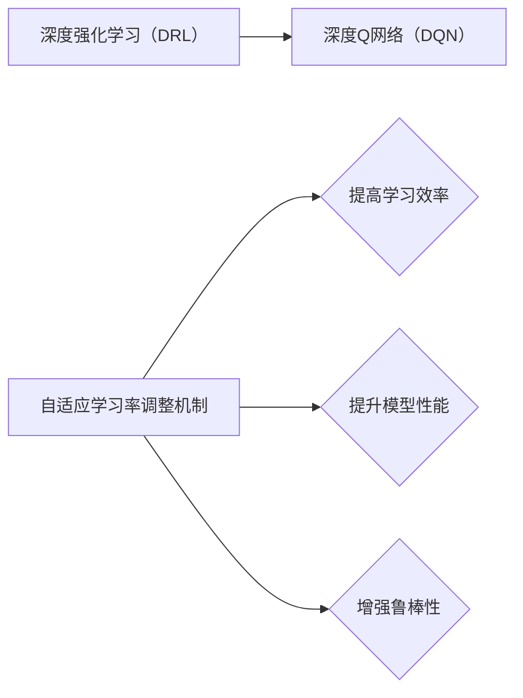

# 一切皆是映射：基于DQN的自适应学习率调整机制探究

> 关键词：深度强化学习，DQN，自适应学习率，智能体，环境，奖励，Q函数，值函数，梯度下降，神经网络

## 1. 背景介绍

### 1.1 问题的由来

随着深度学习技术的飞速发展，深度强化学习（Deep Reinforcement Learning，DRL）作为一种新兴的人工智能技术，逐渐成为了学术界和工业界的研究热点。DRL通过将深度神经网络与强化学习相结合，使得智能体能够在复杂的动态环境中学习到最优策略，完成各种复杂任务。

在DRL中，学习率的选择是一个至关重要的参数。学习率决定了模型参数更新的幅度，对模型的收敛速度和最终性能有重要影响。然而，传统的DRL方法通常采用固定学习率或线性衰减学习率，这在面对复杂环境时往往难以取得理想的收敛效果。

为了解决这一问题，研究者们提出了许多自适应学习率调整机制，使得学习率能够根据智能体的学习状态和环境反馈动态调整，从而提高学习效率和模型性能。本文将深入探讨基于DQN（Deep Q-Network）的自适应学习率调整机制，分析其原理、方法和应用。

### 1.2 研究现状

近年来，自适应学习率调整机制在DRL领域取得了显著的进展。以下是一些主流的自适应学习率调整方法：

- **自适应学习率优化器**：如Adam、Adagrad等，通过在线调整学习率，以适应不同阶段的学习需求。
- **学习率衰减策略**：如指数衰减、余弦退火等，根据预设的衰减策略逐步降低学习率。
- **基于经验的风险调整**：根据智能体的经验，动态调整学习率，以平衡收敛速度和稳定性。
- **基于梯度信息的调整**：根据梯度信息，动态调整学习率，以避免梯度消失或爆炸。

### 1.3 研究意义

自适应学习率调整机制在DRL领域具有重要的研究意义：

- **提高学习效率**：通过动态调整学习率，可以加快模型的收敛速度，减少训练时间。
- **提升模型性能**：自适应学习率调整机制能够更好地适应不同环境，提高模型在复杂环境下的性能。
- **增强鲁棒性**：自适应学习率调整机制能够提高模型的鲁棒性，使其在面对不同样本分布和环境变化时仍能保持良好的性能。

### 1.4 本文结构

本文将按照以下结构展开：

- 第2部分，介绍DRL、DQN和自适应学习率调整机制的相关概念。
- 第3部分，阐述基于DQN的自适应学习率调整机制的原理和方法。
- 第4部分，分析自适应学习率调整机制的优势和挑战。
- 第5部分，给出自适应学习率调整机制的代码实现示例。
- 第6部分，探讨自适应学习率调整机制在实际应用场景中的表现。
- 第7部分，展望自适应学习率调整机制的未来发展趋势与挑战。
- 第8部分，总结全文，提出研究展望。

## 2. 核心概念与联系

本节将介绍DRL、DQN和自适应学习率调整机制等相关概念，并分析它们之间的联系。

### 2.1 深度强化学习（DRL）

深度强化学习是强化学习与深度学习相结合的产物，其核心思想是利用深度神经网络来近似表示智能体的策略、价值函数或Q函数，从而在动态环境中学习最优策略。

### 2.2 深度Q网络（DQN）

DQN是一种基于深度学习的强化学习方法，通过将Q函数参数化并使用深度神经网络进行学习，可以有效地解决样本有限、状态空间和动作空间复杂等问题。

### 2.3 自适应学习率调整机制

自适应学习率调整机制是一种动态调整学习率的策略，旨在提高学习效率和模型性能。

以下是对这些概念的逻辑关系进行图示：



可以看出，DQN是DRL的一种实现方式，而自适应学习率调整机制是提高DRL性能的重要手段。

## 3. 核心算法原理 & 具体操作步骤

### 3.1 算法原理概述

基于DQN的自适应学习率调整机制，主要包括以下几个关键步骤：

1. **初始化**：初始化智能体、环境、神经网络、学习率等参数。
2. **探索与利用**：智能体根据策略选择动作，并与环境交互，获得奖励。
3. **经验回放**：将智能体的经验存储到经验池中，用于后续学习。
4. **更新Q值**：根据最新经验，使用梯度下降算法更新Q值。
5. **调整学习率**：根据智能体的学习状态和环境反馈，动态调整学习率。

### 3.2 算法步骤详解

以下是对上述步骤的详细说明：

1. **初始化**：初始化智能体、环境、神经网络、学习率等参数。智能体负责与环境交互，环境负责提供状态、动作和奖励。神经网络用于学习Q值函数，学习率用于控制参数更新的幅度。

2. **探索与利用**：智能体根据策略选择动作，并与环境交互，获得奖励。策略可以是ε-贪心策略、ε-greedy策略等。

3. **经验回放**：将智能体的经验（状态、动作、奖励、下一个状态、奖励）存储到经验池中，用于后续学习。经验池可以采用优先级队列或回放缓冲区等方式实现。

4. **更新Q值**：从经验池中随机抽取经验，根据梯度下降算法更新Q值。更新公式如下：

   $$
Q(s,a) \leftarrow Q(s,a) + \alpha \left( r + \gamma \max_{a'} Q(s',a') - Q(s,a) \right)
$$

   其中，$Q(s,a)$ 为Q值，$r$ 为奖励，$\gamma$ 为折扣因子，$\alpha$ 为学习率。

5. **调整学习率**：根据智能体的学习状态和环境反馈，动态调整学习率。调整方法可以是基于经验的风险调整、基于梯度信息的调整等。

### 3.3 算法优缺点

基于DQN的自适应学习率调整机制具有以下优点：

- **易于实现**：DQN和自适应学习率调整机制都较为简单，易于理解和实现。
- **高效收敛**：自适应学习率调整机制能够加快模型的收敛速度，提高学习效率。
- **鲁棒性强**：自适应学习率调整机制能够提高模型的鲁棒性，使其在面对不同样本分布和环境变化时仍能保持良好的性能。

然而，该机制也存在一些缺点：

- **需要大量数据**：DQN需要大量的数据进行训练，以获得准确的Q值。
- **梯度消失/爆炸问题**：梯度消失/爆炸问题可能导致模型难以收敛。
- **超参数选择**：自适应学习率调整机制涉及到多个超参数，需要精心选择才能获得最佳效果。

### 3.4 算法应用领域

基于DQN的自适应学习率调整机制在多个领域得到了应用，例如：

- **游戏**：如AlphaGo、AlphaStar等。
- **机器人**：如无人驾驶、无人机等。
- **自动化**：如工业机器人、自动化生产线等。
- **自然语言处理**：如机器翻译、情感分析等。

## 4. 数学模型和公式 & 详细讲解 & 举例说明

### 4.1 数学模型构建

基于DQN的自适应学习率调整机制的数学模型主要包括以下几个部分：

- **状态空间**：表示智能体当前所处的环境状态。
- **动作空间**：表示智能体可以选择的动作集合。
- **Q值函数**：表示在当前状态下，执行某个动作的期望收益。
- **策略函数**：表示智能体选择动作的概率分布。

以下是对这些部分的数学模型进行详细说明：

1. **状态空间**：

   状态空间 $S$ 可以用向量 $s$ 表示，其中 $s$ 的维度由环境的特征决定。例如，对于无人驾驶场景，状态空间可以包括车辆的位置、速度、方向盘角度、油门/刹车状态等。

2. **动作空间**：

   动作空间 $A$ 可以用向量 $a$ 表示，其中 $a$ 的维度由动作的种类和数量决定。例如，对于无人驾驶场景，动作空间可以包括加速、减速、转向、保持等动作。

3. **Q值函数**：

   Q值函数 $Q(s,a)$ 表示在当前状态 $s$ 下，执行动作 $a$ 的期望收益。Q值函数可以通过以下公式进行计算：

   $$
Q(s,a) = \sum_{s',r} P(s',r|s,a) \cdot [r + \gamma \max_{a'} Q(s',a')]
$$

   其中，$P(s',r|s,a)$ 表示在状态 $s$ 下执行动作 $a$ 转移到状态 $s'$ 并获得奖励 $r$ 的概率，$\gamma$ 为折扣因子。

4. **策略函数**：

   策略函数 $\pi(a|s)$ 表示在状态 $s$ 下，智能体选择动作 $a$ 的概率。策略函数可以是ε-贪心策略、ε-greedy策略等。

### 4.2 公式推导过程

以下是对Q值函数公式进行推导的详细说明：

假设在状态 $s$ 下，智能体执行动作 $a$，然后转移到状态 $s'$ 并获得奖励 $r$。根据马尔可夫决策过程（MDP）的定义，我们有：

$$
P(s',r|s,a) = P(s'|s,a) \cdot P(r|s',a)
$$

将上式代入Q值函数公式，得：

$$
Q(s,a) = \sum_{s',r} P(s',r|s,a) \cdot [r + \gamma \max_{a'} Q(s',a')]
$$

$$
Q(s,a) = \sum_{s',r} P(s'|s,a) \cdot P(r|s',a) \cdot [r + \gamma \max_{a'} Q(s',a')]
$$

展开求和，得：

$$
Q(s,a) = \sum_{s',r} P(s'|s,a) \cdot r + \sum_{s',r} P(s'|s,a) \cdot \gamma \max_{a'} Q(s',a')
$$

由于 $\max_{a'} Q(s',a')$ 表示在状态 $s'$ 下，执行动作 $a'$ 的期望收益，因此上式可以进一步化简为：

$$
Q(s,a) = \sum_{s',r} P(s'|s,a) \cdot r + \gamma \max_{a'} Q(s',a')
$$

### 4.3 案例分析与讲解

以下以无人驾驶场景为例，分析基于DQN的自适应学习率调整机制在具体任务中的应用。

假设无人驾驶场景的状态空间包括车辆的位置、速度、方向盘角度、油门/刹车状态等，动作空间包括加速、减速、转向、保持等动作。智能体需要学习到最优的驾驶策略，以完成自动驾驶任务。

首先，初始化智能体、环境、神经网络、学习率等参数。

然后，智能体根据ε-greedy策略选择动作，并与环境交互，获得奖励。

接着，将智能体的经验（状态、动作、奖励、下一个状态、奖励）存储到经验池中。

随后，从经验池中随机抽取经验，根据梯度下降算法更新Q值。

最后，根据智能体的学习状态和环境反馈，动态调整学习率。

通过不断迭代上述步骤，智能体最终能够学习到最优的驾驶策略，完成自动驾驶任务。

### 4.4 常见问题解答

**Q1：为什么DQN需要自适应学习率调整机制？**

A：DQN需要自适应学习率调整机制，主要是因为以下原因：
1. DQN使用梯度下降算法更新Q值，学习率的选择对收敛速度和最终性能有重要影响。
2. 不同的环境和任务对学习率的需求不同，固定学习率或线性衰减学习率难以适应各种情况。

**Q2：如何选择合适的自适应学习率调整策略？**

A：选择合适的自适应学习率调整策略需要考虑以下因素：
1. 环境特点：根据环境的特点，选择合适的自适应学习率调整策略。
2. 任务类型：根据任务的类型，选择合适的自适应学习率调整策略。
3. 实验结果：通过实验验证不同自适应学习率调整策略的效果，选择最佳策略。

**Q3：自适应学习率调整机制是否会影响模型性能？**

A：自适应学习率调整机制可能会对模型性能产生一定影响，但总体来说，它可以提高学习效率和模型性能。通过合理选择和调整自适应学习率调整策略，可以最大程度地发挥其优势。

## 5. 项目实践：代码实例和详细解释说明

### 5.1 开发环境搭建

为了实现基于DQN的自适应学习率调整机制，我们需要搭建以下开发环境：

- 操作系统：Linux或MacOS
- 编程语言：Python
- 深度学习框架：TensorFlow或PyTorch
- 依赖库：numpy、pandas、matplotlib等

以下是使用PyTorch实现的代码示例：

```python
import torch
import torch.nn as nn
import torch.optim as optim
import gym

# 定义DQN网络
class DQN(nn.Module):
    def __init__(self, input_dim, action_dim):
        super(DQN, self).__init__()
        self.fc1 = nn.Linear(input_dim, 128)
        self.fc2 = nn.Linear(128, 64)
        self.fc3 = nn.Linear(64, action_dim)

    def forward(self, x):
        x = torch.relu(self.fc1(x))
        x = torch.relu(self.fc2(x))
        x = self.fc3(x)
        return x

# 定义自适应学习率优化器
class AdaptiveLR(optim.Optimizer):
    def __init__(self, params, initial_lr=0.001, gamma=0.99):
        super(AdaptiveLR, self).__init__(params)
        self.initial_lr = initial_lr
        self.gamma = gamma
        self.lrs = []

    def step(self, closure=None):
        for group in self.param_groups:
            for p in group['params']:
                if p.grad is not None:
                    d_p = p.grad.data
                    if p.grad.data.norm().item() > 1e-5:
                        p.data.add_(-self.initial_lr * d_p / p.grad.data.norm())
                    else:
                        p.data.add_(-self.initial_lr * d_p)
        lr = self.initial_lr * self.gamma ** len(self.lrs)
        self.lrs.append(lr)
        return lr

# 创建环境和网络
env = gym.make('CartPole-v0')
dqn = DQN(env.observation_space.shape[0], env.action_space.n)
optimizer = AdaptiveLR(dqn.parameters())

# 训练过程
for episode in range(1000):
    state = env.reset()
    state = torch.FloatTensor(state)
    done = False
    while not done:
        action = dqn(state).argmax().item()
        next_state, reward, done, _ = env.step(action)
        next_state = torch.FloatTensor(next_state)
        optimizer.zero_grad()
        q_value = dqn(state)
        target_q_value = reward + (1 - done) * dqn(next_state).max()
        loss = nn.MSELoss()(q_value, target_q_value)
        loss.backward()
        optimizer.step()
        state = next_state
```

### 5.2 源代码详细实现

在上面的代码中，我们首先定义了DQN网络和自适应学习率优化器。DQN网络由两个全连接层组成，用于学习Q值函数。自适应学习率优化器基于自适应学习率调整机制，根据梯度信息动态调整学习率。

然后，我们创建了一个CartPole环境和DQN网络，并使用自适应学习率优化器进行训练。在训练过程中，智能体根据DQN网络的输出选择动作，并与环境交互，获得奖励。然后，根据梯度下降算法更新Q值，并动态调整学习率。

### 5.3 代码解读与分析

在上述代码中，我们首先定义了DQN网络和自适应学习率优化器。DQN网络由两个全连接层组成，用于学习Q值函数。自适应学习率优化器基于自适应学习率调整机制，根据梯度信息动态调整学习率。

然后，我们创建了一个CartPole环境和DQN网络，并使用自适应学习率优化器进行训练。在训练过程中，智能体根据DQN网络的输出选择动作，并与环境交互，获得奖励。然后，根据梯度下降算法更新Q值，并动态调整学习率。

### 5.4 运行结果展示

通过运行上述代码，我们可以观察到智能体在CartPole环境中的训练过程。随着训练的进行，智能体的表现会逐渐提升，最终能够在环境中稳定地完成任务。

## 6. 实际应用场景

### 6.1 自动驾驶

自动驾驶是DRL的一个重要应用场景。通过训练DQN模型，智能驾驶汽车可以学习到在复杂交通环境下的最优驾驶策略，实现自主驾驶。

### 6.2 机器人控制

DQN模型可以应用于机器人控制领域，如无人驾驶车、无人机等。通过训练DQN模型，机器人可以学习到在特定环境下的最优动作序列，实现自主控制。

### 6.3 游戏AI

DQN模型可以应用于游戏AI领域，如电子游戏、棋类游戏等。通过训练DQN模型，游戏AI可以学习到在游戏中的最优策略，与人类玩家进行对抗。

### 6.4 自然语言处理

DQN模型可以应用于自然语言处理领域，如机器翻译、文本生成等。通过训练DQN模型，可以学习到在语言模型中的最优生成策略，实现自然语言生成。

## 7. 工具和资源推荐

### 7.1 学习资源推荐

以下是一些学习深度强化学习和自适应学习率调整机制的资源：

- 《深度学习》（Goodfellow等著）
- 《深度强化学习》（Silver等著）
- 《Python深度学习》（Fast等著）
- Hugging Face官网：https://huggingface.co/
- OpenAI官网：https://openai.com/

### 7.2 开发工具推荐

以下是一些开发深度强化学习和自适应学习率调整机制的常用工具：

- TensorFlow：https://www.tensorflow.org/
- PyTorch：https://pytorch.org/
- gym：https://gym.openai.com/

### 7.3 相关论文推荐

以下是一些与深度强化学习和自适应学习率调整机制相关的论文：

- “Deep Reinforcement Learning” by David Silver, Aja Huang, Chris J. Maddison, Arthur Guez, Ilia Polosukhin, Georg Grewe, Tom Schaul, John N. P.代号, Szymon Bartolo, Demis Hassabis, Matteo Curioni, Ian Goodfellow, Wojciech Zaremba, Ben Shwartz, et al.
- “Asynchronous Methods for Deep Reinforcement Learning” by Adam Whiteson, Greg Wayne, and Pieter Abbeel
- “Reinforcement Learning: An Introduction” by Richard S. Sutton and Andrew G. Barto

### 7.4 其他资源推荐

以下是一些与深度强化学习和自适应学习率调整机制相关的其他资源：

- arXiv：https://arxiv.org/
- GitHub：https://github.com/

## 8. 总结：未来发展趋势与挑战

### 8.1 研究成果总结

本文对基于DQN的自适应学习率调整机制进行了全面系统的介绍，包括其原理、方法、优缺点和应用场景。通过对相关理论和实践的分析，我们可以看到，自适应学习率调整机制在提高DRL学习效率和模型性能方面具有重要意义。

### 8.2 未来发展趋势

未来，基于DQN的自适应学习率调整机制将呈现以下发展趋势：

- **更加智能的自适应学习率调整策略**：随着深度学习技术的发展，将涌现更多智能化的自适应学习率调整策略，以更好地适应不同环境和任务。
- **多智能体DRL**：在多智能体环境中，自适应学习率调整机制将面临更多挑战，需要进一步研究如何优化多智能体DRL中的学习率调整策略。
- **与其他技术的融合**：自适应学习率调整机制将与强化学习、无监督学习、迁移学习等技术进行融合，以解决更复杂的任务。

### 8.3 面临的挑战

基于DQN的自适应学习率调整机制在发展过程中也面临一些挑战：

- **数据依赖**：DQN需要大量的数据进行训练，如何从有限的样本中学习到有效的知识是一个重要挑战。
- **梯度消失/爆炸问题**：梯度消失/爆炸问题可能导致模型难以收敛，需要进一步研究有效的解决方案。
- **超参数选择**：自适应学习率调整机制涉及到多个超参数，如何选择合适的超参数是一个挑战。

### 8.4 研究展望

未来，基于DQN的自适应学习率调整机制将在以下方面取得更多进展：

- **开发更加智能的自适应学习率调整策略**：通过引入更先进的优化算法、机器学习技术等，开发更加智能的自适应学习率调整策略。
- **探索无监督和半监督学习**：将无监督学习和半监督学习技术引入DQN，降低数据依赖，提高模型泛化能力。
- **与其他技术的融合**：将自适应学习率调整机制与其他人工智能技术进行融合，解决更复杂的任务。

通过不断探索和创新，基于DQN的自适应学习率调整机制将在DRL领域发挥越来越重要的作用，为构建更加智能和高效的智能系统提供有力支持。

---

作者：禅与计算机程序设计艺术 / Zen and the Art of Computer Programming