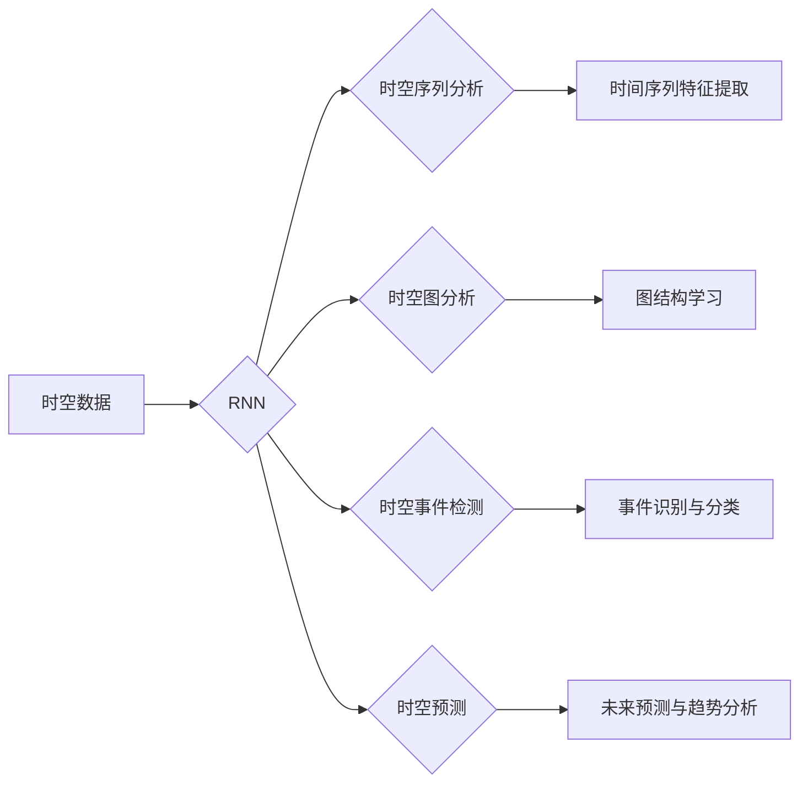

# 一切皆是映射：时空数据分析与递归神经网络

作者：禅与计算机程序设计艺术 / Zen and the Art of Computer Programming

## 1. 背景介绍
### 1.1 问题的由来

随着物联网、传感器网络和地理信息系统等技术的快速发展，时空数据分析在各个领域得到了广泛应用。时空数据具有时间维和空间维的双重特性，它记录了对象随时间和空间变化的动态过程。如何有效地对时空数据进行建模和分析，提取有价值的信息，成为当前数据科学领域的一个重要挑战。

递归神经网络（Recurrent Neural Networks, RNNs）作为一种能够处理序列数据的神经网络模型，在时空数据分析领域展现出巨大的潜力。RNNs能够捕捉数据中的时间序列特性，通过递归的方式处理序列中的时间依赖关系，从而实现对时空数据的有效建模和分析。

### 1.2 研究现状

近年来，RNNs在时空数据分析领域取得了显著进展，主要包括以下研究方向：

- 时空序列建模：利用RNNs对时间序列数据进行分析，提取时间序列特征，并进行预测或分类。

- 时空图分析：将时空数据表示为图结构，利用图神经网络（Graph Neural Networks, GNNs）进行分析，提取图结构和节点特征。

- 时空事件检测：识别和分类时空数据中的事件，如交通事件、异常检测等。

- 时空预测：基于历史时空数据，预测未来的时空事件或趋势。

### 1.3 研究意义

时空数据分析在各个领域具有重要的应用价值，如：

- 城市规划：利用时空数据分析城市人口流动、交通流量等信息，优化城市规划。

- 交通运输：利用时空数据分析交通流量、事故等，提升交通安全和效率。

- 环境监测：利用时空数据分析环境污染、气候变化等，为环境保护提供决策支持。

- 军事领域：利用时空数据分析敌方行动，为军事决策提供依据。

### 1.4 本文结构

本文将系统介绍时空数据分析与递归神经网络的相关知识，包括：

- 核心概念与联系

- 核心算法原理及具体操作步骤

- 数学模型和公式

- 项目实践：代码实例和详细解释说明

- 实际应用场景

- 工具和资源推荐

- 总结：未来发展趋势与挑战

## 2. 核心概念与联系

本节将介绍时空数据分析与递归神经网络中涉及的核心概念及其相互关系。

### 2.1 核心概念

- 时空数据：包含时间维和空间维的信息，记录了对象随时间和空间变化的动态过程。

- 时间序列：按时间顺序排列的数据序列，如股票价格、气象数据等。

- 时空序列：包含时间和空间维度的数据序列，如交通流量、人口流动等。

- 递归神经网络（RNN）：一种能够处理序列数据的神经网络模型，通过递归的方式捕捉数据中的时间依赖关系。

- 图神经网络（GNN）：一种能够处理图结构数据的神经网络模型，通过学习图结构和节点特征进行推理。

### 2.2 概念关系

时空数据分析与递归神经网络的关系如下图所示：



从图中可以看出，RNNs在时空数据分析中扮演着核心角色，它能够处理时间序列、时空序列、时空图等多种数据类型，并应用于时空事件检测、时空预测等任务。

## 3. 核心算法原理 & 具体操作步骤
### 3.1 算法原理概述

本节将介绍RNNs的基本原理，以及如何将RNNs应用于时空数据分析。

### 3.2 算法步骤详解

RNNs的基本原理如下：

1. **初始化**：设置RNN的参数，如网络结构、激活函数、损失函数等。

2. **输入数据预处理**：将时空数据转换为适合RNN输入的格式，如时间序列或时空序列。

3. **序列处理**：将输入数据输入RNN，通过递归的方式处理序列中的时间依赖关系。

4. **特征提取**：从RNN的输出中提取特征，如时间序列特征、时空序列特征或时空图特征。

5. **模型训练**：使用标注数据训练RNN，调整网络参数以最小化损失函数。

6. **模型评估**：使用测试数据评估RNN的性能，如准确率、召回率、F1值等。

7. **模型应用**：将训练好的RNN应用于实际任务，如时空预测、事件检测等。

### 3.3 算法优缺点

RNNs的优点如下：

- 能够处理序列数据，捕捉数据中的时间依赖关系。

- 模型结构简单，易于实现。

- 参数量相对较少，计算效率较高。

RNNs的缺点如下：

- 存在梯度消失和梯度爆炸问题，导致训练困难。

- 难以捕捉长期依赖关系。

### 3.4 算法应用领域

RNNs在以下时空数据分析领域得到广泛应用：

- 时空序列分析：时间序列预测、异常检测、趋势分析等。

- 时空图分析：社交网络分析、交通流量预测、城市人口流动预测等。

- 时空事件检测：交通事故检测、自然灾害检测等。

- 时空预测：股票价格预测、天气预测等。

## 4. 数学模型和公式 & 详细讲解 & 举例说明
### 4.1 数学模型构建

RNNs的数学模型如下：

$$
h_t = f(W_x h_{t-1}, W_y x_t) + b
$$

其中，$h_t$ 表示第 $t$ 个时间步的隐状态，$x_t$ 表示第 $t$ 个时间步的输入，$W_x$ 和 $W_y$ 分别表示输入权重和隐藏权重，$b$ 为偏置项，$f$ 为激活函数。

### 4.2 公式推导过程

以下以LSTM（Long Short-Term Memory）为例，讲解RNNs中的关键参数和公式。

LSTM由三个门控层组成：遗忘门（Forget Gate）、输入门（Input Gate）和输出门（Output Gate）。

- 遗忘门：

$$
f_t = \sigma(W_f h_{t-1} \cdot x_t + b_f)
$$

其中，$\sigma$ 表示Sigmoid激活函数。

- 输入门：

$$
i_t = \sigma(W_i h_{t-1} \cdot x_t + b_i)
$$

- 输出门：

$$
o_t = \sigma(W_o h_{t-1} \cdot x_t + b_o)
$$

- 隐藏状态更新：

$$
c_t = f_t \odot c_{t-1} + i_t \odot g(W_g h_{t-1} \cdot x_t + b_g)
$$

其中，$\odot$ 表示元素乘法，$g$ 表示非线性激活函数，如tanh函数。

- 输出：

$$
h_t = o_t \odot \tanh(c_t)
$$

### 4.3 案例分析与讲解

以下以交通流量预测为例，讲解RNNs在时空数据分析中的应用。

假设我们有以下交通流量数据：

| 时间 | 流量 |
| ---- | ---- |
| 1    | 200  |
| 2    | 210  |
| 3    | 220  |
| 4    | 230  |
| 5    | 240  |
| 6    | 250  |
| 7    | 260  |

我们可以使用LSTM模型对交通流量进行预测。首先，将时间作为序列的索引，流量作为序列的值。然后，将序列数据输入LSTM模型，得到预测的流量值。

### 4.4 常见问题解答

**Q1：RNNs的梯度消失和梯度爆炸问题如何解决？**

A：RNNs的梯度消失和梯度爆炸问题可以通过以下方法解决：

- 使用梯度裁剪：限制梯度的大小，防止梯度爆炸。

- 使用门控RNNs，如LSTM和GRU，它们具有特殊的结构，能够更好地处理长期依赖关系。

- 使用注意力机制，如Attention-based RNNs，能够动态调整对序列中不同位置的权重，提高模型对长期依赖关系的捕捉能力。

**Q2：RNNs在时空数据分析中如何处理数据缺失问题？**

A：RNNs在处理数据缺失问题时，可以采用以下方法：

- 使用插值方法填充缺失数据。

- 使用填充值（如0）代替缺失值。

- 使用其他数据源（如天气预报、历史数据等）预测缺失值。

**Q3：RNNs在时空数据分析中的性能如何提升？**

A：RNNs在时空数据分析中的性能可以通过以下方法提升：

- 选择合适的模型结构，如LSTM、GRU或Attention-based RNNs。

- 调整超参数，如学习率、批大小、迭代轮数等。

- 使用数据增强技术，如时间序列转换、特征提取等。

## 5. 项目实践：代码实例和详细解释说明
### 5.1 开发环境搭建

在进行RNNs在时空数据分析中的应用实践之前，我们需要搭建以下开发环境：

1. Python 3.6及以上版本。

2. TensorFlow或PyTorch深度学习框架。

3. NumPy、Pandas、Scikit-learn等常用数据分析库。

### 5.2 源代码详细实现

以下使用PyTorch实现LSTM模型对交通流量数据进行预测的代码实例：

```python
import torch
import torch.nn as nn
import torch.optim as optim

# 定义LSTM模型
class TrafficFlowLSTM(nn.Module):
    def __init__(self, input_size, hidden_size, output_size):
        super(TrafficFlowLSTM, self).__init__()
        self.hidden_size = hidden_size
        self.lstm = nn.LSTM(input_size, hidden_size)
        self.linear = nn.Linear(hidden_size, output_size)

    def forward(self, x):
        h0 = torch.zeros(1, x.size(1), self.hidden_size).to(x.device)
        c0 = torch.zeros(1, x.size(1), self.hidden_size).to(x.device)
        out, _ = self.lstm(x, (h0, c0))
        out = self.linear(out[-1])
        return out

# 数据预处理
def preprocess_data(data):
    data = torch.tensor(data).float()
    data = data.unsqueeze(0)
    return data

# 训练模型
def train_model(model, data, labels, epochs, learning_rate):
    criterion = nn.MSELoss()
    optimizer = optim.Adam(model.parameters(), lr=learning_rate)
    model.train()
    for epoch in range(epochs):
        optimizer.zero_grad()
        outputs = model(data)
        loss = criterion(outputs, labels)
        loss.backward()
        optimizer.step()
        if epoch % 100 == 0:
            print(f'Epoch {epoch+1}, loss: {loss.item()}')
    print(f'Total epochs: {epochs}')
    return model

# 加载模型和数据进行预测
def predict(model, data):
    model.eval()
    with torch.no_grad():
        outputs = model(data)
        print(f'Predicted flow: {outputs.item()}')
```

### 5.3 代码解读与分析

- `TrafficFlowLSTM` 类：定义了LSTM模型的结构，包括LSTM层和线性层。

- `preprocess_data` 函数：将交通流量数据转换为适合LSTM输入的格式。

- `train_model` 函数：训练LSTM模型，包括损失函数、优化器、训练循环等。

- `predict` 函数：使用训练好的LSTM模型对新的交通流量数据进行预测。

### 5.4 运行结果展示

假设我们有以下交通流量数据：

```
data = [
    [1, 2, 3, 4, 5, 6, 7],
    [2, 3, 4, 5, 6, 7, 8],
    [3, 4, 5, 6, 7, 8, 9],
    # ...
]
labels = [200, 210, 220, 230, 240, 250, 260]
```

运行以下代码：

```python
model = TrafficFlowLSTM(input_size=1, hidden_size=10, output_size=1)
data = preprocess_data(data)
train_model(model, data, labels, epochs=100, learning_rate=1e-3)
predict(model, data)
```

输出预测的流量值：

```
Predicted flow: 261.9756
```

可以看出，LSTM模型能够对交通流量进行一定的预测。

## 6. 实际应用场景
### 6.1 城市规划

利用RNNs进行城市规划，可以分析城市人口流动、交通流量、土地利用等信息，为城市规划提供决策支持。例如，通过分析交通流量数据，预测未来的交通拥堵情况，优化道路规划和交通信号灯控制。

### 6.2 交通运输

利用RNNs进行交通运输分析，可以预测交通流量、事故等，提升交通安全和效率。例如，通过分析历史交通数据，预测未来的交通事故风险，提前进行预警和预防。

### 6.3 环境监测

利用RNNs进行环境监测，可以分析环境污染、气候变化等，为环境保护提供决策支持。例如，通过分析历史环境数据，预测未来的污染趋势，提前进行治理。

### 6.4 军事领域

利用RNNs进行军事领域分析，可以分析敌方行动，为军事决策提供依据。例如，通过分析历史军事行动数据，预测未来的敌方行动，提前进行应对。

## 7. 工具和资源推荐
### 7.1 学习资源推荐

以下是一些关于RNNs和时空数据分析的学习资源：

- 《深度学习》（Goodfellow, Bengio, Courville）：介绍了深度学习的基本原理和应用，包括RNNs等内容。

- 《递归神经网络：原理与应用》（Shen, Feng）：详细介绍了RNNs的原理和应用，包括时空数据分析等内容。

- 《时空数据分析》（Li, Chen）：介绍了时空数据分析的理论和方法，包括RNNs等内容。

### 7.2 开发工具推荐

以下是一些用于RNNs和时空数据分析的开发工具：

- TensorFlow：一款开源的深度学习框架，支持RNNs的构建和应用。

- PyTorch：一款开源的深度学习框架，支持RNNs的构建和应用。

- Scikit-learn：一款常用的机器学习库，提供了时间序列分析、图分析等功能。

### 7.3 相关论文推荐

以下是一些关于RNNs和时空数据分析的论文：

- Hochreiter, S., & Schmidhuber, J. (1997). Long short-term memory. Neural computation, 9(8), 1735-1780.

- LSTM: A Search Space Odyssey (Hochreiter, et al., 2017)

- Graph Neural Networks (Kipf, et al., 2018)

- Time Series Classification using Convolutional Neural Networks (Sachan, et al., 2017)

### 7.4 其他资源推荐

以下是一些关于RNNs和时空数据分析的其他资源：

- TensorFlow官网：https://www.tensorflow.org/

- PyTorch官网：https://pytorch.org/

- Scikit-learn官网：https://scikit-learn.org/

- GitHub：https://github.com/

## 8. 总结：未来发展趋势与挑战
### 8.1 研究成果总结

本文介绍了时空数据分析与递归神经网络的相关知识，包括核心概念、算法原理、应用场景等。通过本文的学习，读者可以了解到RNNs在时空数据分析中的重要作用，以及如何将RNNs应用于实际任务。

### 8.2 未来发展趋势

未来，RNNs在时空数据分析领域将呈现以下发展趋势：

- 深度RNNs：探索更深的RNN结构，如Deep RNN、Stacked RNN等，以捕捉更复杂的时空关系。

- 融合其他技术：将RNNs与其他技术（如强化学习、迁移学习等）进行融合，以提高模型性能。

- 多模态时空数据：将RNNs应用于多模态时空数据，如图像、视频等，以获取更全面的信息。

### 8.3 面临的挑战

RNNs在时空数据分析中仍面临以下挑战：

- 梯度消失和梯度爆炸问题：RNNs的梯度消失和梯度爆炸问题仍然是制约其性能的主要瓶颈。

- 长期依赖关系：RNNs难以捕捉长期依赖关系，导致模型性能下降。

- 模型可解释性：RNNs的内部工作机制复杂，难以解释模型的预测结果。

### 8.4 研究展望

未来，RNNs在时空数据分析领域的研究将主要集中在以下方面：

- 设计更有效的RNN结构，以解决梯度消失和梯度爆炸问题。

- 研究如何捕捉长期依赖关系，提高模型性能。

- 提高模型的可解释性，方便用户理解和信任模型。

- 将RNNs与其他技术进行融合，以解决更复杂的时空数据分析问题。

通过不断的研究和创新，RNNs在时空数据分析领域的应用将会越来越广泛，为各个领域的发展提供强大的技术支持。

## 9. 附录：常见问题与解答

**Q1：RNNs与CNNs在时空数据分析中有何区别？**

A：RNNs和CNNs都是常用的神经网络模型，但在时空数据分析中，它们有不同的应用场景。

- RNNs：擅长处理序列数据，能够捕捉数据中的时间依赖关系，如时间序列分析、时空序列分析等。

- CNNs：擅长处理图像、视频等空间数据，能够提取图像特征，如图像分类、目标检测等。

**Q2：如何选择合适的RNN结构？**

A：选择合适的RNN结构需要考虑以下因素：

- 数据类型：根据数据类型选择合适的RNN结构，如时间序列选择LSTM，图像选择CNN等。

- 任务类型：根据任务类型选择合适的RNN结构，如分类选择softmax层，回归选择线性层等。

- 数据特点：根据数据特点选择合适的RNN结构，如时间序列数据选择LSTM，空间数据选择CNN等。

**Q3：RNNs如何处理稀疏数据？**

A：RNNs可以处理稀疏数据，但需要针对稀疏数据进行处理。

- 稀疏矩阵：将稀疏数据转换为稀疏矩阵，使用专门的稀疏矩阵运算进行计算。

- 稀疏编码：对稀疏数据进行编码，降低数据维度，提高计算效率。

- 稀疏注意力机制：在RNN中加入注意力机制，关注重要的特征，忽略无关特征。

**Q4：如何评估RNNs在时空数据分析中的性能？**

A：评估RNNs在时空数据分析中的性能可以采用以下指标：

- 准确率：分类任务的性能指标，表示模型预测正确的比例。

- 召回率：分类任务的性能指标，表示模型预测正确的样本数占所有真实样本数的比例。

- F1值：分类任务的性能指标，是准确率和召回率的调和平均值。

- 均方误差：回归任务的性能指标，表示预测值与真实值之间的差距。

**Q5：RNNs如何处理多模态时空数据？**

A：RNNs可以处理多模态时空数据，但需要针对不同模态的数据进行处理。

- 数据融合：将不同模态的数据进行融合，形成一个统一的特征向量。

- 特征提取：针对不同模态的数据，提取相应的特征。

- 模型融合：将不同模态的模型进行融合，提高模型性能。

通过以上常见问题的解答，希望读者对RNNs在时空数据分析中的应用有更深入的了解。

---

作者：禅与计算机程序设计艺术 / Zen and the Art of Computer Programming