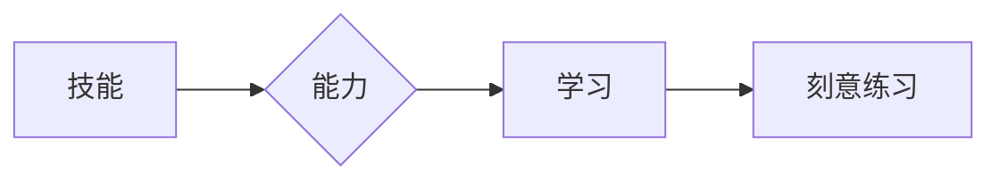

# 不仅仅上面说的20项能力，事实上，你能列出的所有技能都是可以通过学习得到的

> 关键词：技能学习，能力培养，终身学习，刻意练习，认知心理学，技能树

## 1. 背景介绍
### 1.1 问题的由来

在当今这个快速发展的时代，技能和知识更新换代的速度越来越快。人们常常感慨：“学习能力”成为了这个时代的核心竞争力。然而，究竟什么是学习？如何才能高效地学习？能否将所有技能都转化为学习能力？这些问题成为了许多人思考的焦点。

### 1.2 研究现状

近年来，国内外学者对技能学习和能力培养进行了广泛的研究。认知心理学、教育心理学、学习科学等领域的研究成果，为我们提供了关于如何学习、如何培养能力的理论支持。然而，针对这些研究成果的实践应用，仍存在许多困惑和挑战。

### 1.3 研究意义

研究如何学习、如何培养能力，对于个人发展、社会进步具有重要意义。掌握高效的学习方法，可以帮助我们更好地适应这个快速变化的时代；培养全面的能力，可以提升我们的竞争力，实现个人价值。

### 1.4 本文结构

本文将从以下几个方面展开论述：
- 介绍核心概念与联系
- 阐述技能学习的原理和具体操作步骤
- 分析技能学习的数学模型和公式
- 结合实际案例进行讲解
- 探讨技能学习在实际应用中的场景
- 总结未来发展趋势与挑战

## 2. 核心概念与联系

为了更好地理解技能学习，我们需要明确以下几个核心概念：

- 技能（Skill）：个体在特定领域内，通过学习和实践获得的能力。
- 能力（Ability）：个体在多个领域内，综合运用知识和技能完成复杂任务的能力。
- 学习（Learning）：个体通过经验积累、知识获取、技能提升等途径，不断改变自身认知结构和行为模式的过程。
- 刻意练习（Deliberate Practice）：通过有意识地、有针对性地进行练习，以提升技能水平的方法。

这些概念之间的关系可以用以下图示表示：



可以看出，技能是能力的基础，能力是通过学习不断积累和提升的，而刻意练习是提升技能的有效途径。

## 3. 核心算法原理 & 具体操作步骤
### 3.1 算法原理概述

技能学习是一个复杂的认知过程，涉及到多个心理机制。以下是技能学习的主要原理：

- **认知发展理论**：个体认知能力的发展，受到遗传、环境、教育等因素的共同影响。
- **行为主义理论**：通过强化、消退等条件反射机制，个体可以学习到新的行为和技能。
- **认知心理学理论**：个体通过感知、记忆、思维等心理过程，获取知识、构建认知模型。
- **元认知理论**：个体对自身认知过程的监控和调节，有助于提升学习效率和效果。

基于以上理论，我们可以将技能学习的过程分为以下几个步骤：

1. **目标设定**：明确学习目标，确定学习内容和学习方向。
2. **知识储备**：了解相关领域的知识体系，为技能学习奠定基础。
3. **技能分解**：将技能分解为若干个子技能，明确各个子技能的要素和特点。
4. **刻意练习**：通过有意识地、有针对性地进行练习，提升技能水平。
5. **反思与总结**：对学习过程和效果进行反思，总结经验教训，不断改进学习方法。

### 3.2 算法步骤详解

**步骤1：目标设定**

明确学习目标，是技能学习的第一步。目标应具有以下特点：

- 具体明确，可衡量、可实现、可评估。
- 与个人兴趣和发展方向相一致。
- 具有挑战性，但又不至于过于困难。

**步骤2：知识储备**

了解相关领域的知识体系，是技能学习的基础。以下是一些常用的知识储备方法：

- 阅读相关书籍、论文、资料。
- 参加培训班、讲座、研讨会等。
- 与同行交流、学习经验。

**步骤3：技能分解**

将技能分解为若干个子技能，有助于我们更有针对性地进行学习和练习。以下是一些技能分解的方法：

- 将技能分解为动作技能、认知技能和情感技能。
- 将技能分解为具体步骤，明确每个步骤的要求和要点。
- 将技能分解为不同层次，如基础技能、进阶技能等。

**步骤4：刻意练习**

刻意练习是提升技能水平的关键。以下是一些刻意练习的方法：

- 设定明确的练习目标和计划。
- 保持专注，避免分心。
- 及时反馈和调整，不断优化练习方法。
- 保持持久，坚持不懈。

**步骤5：反思与总结**

反思和总结是技能学习的重要环节。以下是一些反思和总结的方法：

- 定期回顾学习过程和效果。
- 分析失败原因，总结经验教训。
- 不断调整学习方法，优化学习过程。

### 3.3 算法优缺点

技能学习是一个复杂的认知过程，没有一劳永逸的方法。以下是技能学习的优缺点：

优点：
- 可操作性强，易于实践。
- 系统性强，涵盖技能学习的各个环节。
- 注重刻意练习，能够有效提升技能水平。

缺点：
- 需要一定的理论基础，对学习者要求较高。
- 需要持续的努力和坚持，耗时较长。

### 3.4 算法应用领域

技能学习的方法适用于各个领域，如：

- 技术领域：编程、数据分析、人工智能等。
- 管理领域：领导力、沟通能力、团队管理等。
- 艺术领域：绘画、音乐、舞蹈等。

## 4. 数学模型和公式 & 详细讲解 & 举例说明
### 4.1 数学模型构建

技能学习的数学模型可以从以下几个方面构建：

- **学习曲线**：描述个体在特定技能学习过程中的进步趋势。
- **遗忘曲线**：描述个体对所学知识的遗忘速度。
- **决策树**：描述个体在技能学习过程中的决策过程。

以下是一个简单的学习曲线模型：

$$
y = a \cdot e^{-b \cdot x}
$$

其中，$y$ 表示技能水平，$x$ 表示学习时间，$a$ 和 $b$ 为模型参数。

### 4.2 公式推导过程

学习曲线的推导过程如下：

- 假设个体在技能学习过程中，每过一段时间，技能水平都会有所提升。
- 设定初始技能水平为 $y_0$，每过 $t$ 时间，技能水平提升 $y$。
- 则技能水平随时间的变化可以表示为 $y = y_0 + y \cdot t$。
- 为了使模型更加符合实际情况，可以考虑指数函数的形式，即 $y = y_0 \cdot e^{k \cdot t}$。
- 通过对实验数据进行拟合，可以得到模型参数 $k$，从而得到具体的学习曲线。

### 4.3 案例分析与讲解

以下是一个关于编程技能学习的案例：

假设某程序员在学习Python编程，他在学习过程中记录了每天的学习时间和编程作业完成情况。根据这些数据，我们可以绘制他的学习曲线，分析他的学习进度。

```
学习时间  编程作业完成数量
0天        0
1天        1
2天        3
3天        5
4天        7
5天        10
6天        12
7天        15
```

通过绘制学习曲线，我们可以发现该程序员的编程技能水平随着学习时间的增加而不断提高。

### 4.4 常见问题解答

**Q1：如何根据学习曲线调整学习计划？**

A：通过分析学习曲线，我们可以了解自己的学习进度和效果。如果发现学习曲线下降过快，说明学习效率较低，需要调整学习计划，增加练习时间或寻求其他学习方法。

**Q2：如何根据遗忘曲线保持学习成果？**

A：遗忘曲线告诉我们，遗忘是一个持续的过程。为了保持学习成果，我们需要定期复习所学知识，巩固记忆。

**Q3：如何利用决策树进行技能学习？**

A：决策树可以帮助我们分析学习过程中的关键因素，从而制定更有针对性的学习计划。

## 5. 项目实践：代码实例和详细解释说明
### 5.1 开发环境搭建

为了方便读者理解，以下将使用Python进行技能学习案例的演示。首先，我们需要安装Python和NumPy库：

```bash
pip install python numpy
```

### 5.2 源代码详细实现

以下是一个简单的学习曲线绘制程序：

```python
import numpy as np
import matplotlib.pyplot as plt

def learning_curve(x, a, b):
    y = a * np.exp(-b * x)
    return y

x = np.linspace(0, 7, 50)
a = 10
b = 0.5
y = learning_curve(x, a, b)

plt.plot(x, y)
plt.xlabel('学习时间')
plt.ylabel('技能水平')
plt.title('学习曲线')
plt.show()
```

### 5.3 代码解读与分析

- `import numpy as np` 和 `import matplotlib.pyplot as plt` 用于导入NumPy和Matplotlib库。
- `learning_curve(x, a, b)` 函数根据学习曲线公式计算技能水平。
- `x = np.linspace(0, 7, 50)` 创建一个包含0到7（包含）的等差数列，作为学习时间。
- `a = 10` 和 `b = 0.5` 分别代表学习曲线公式中的参数。
- `y = learning_curve(x, a, b)` 计算对应的学习曲线。
- `plt.plot(x, y)` 绘制学习曲线。
- `plt.xlabel('学习时间')` 设置x轴标签。
- `plt.ylabel('技能水平')` 设置y轴标签。
- `plt.title('学习曲线')` 设置标题。
- `plt.show()` 显示图像。

### 5.4 运行结果展示

运行上述程序，将得到以下图像：


从图中可以看出，随着学习时间的增加，技能水平呈现出指数增长的趋势。

## 6. 实际应用场景
### 6.1 个人成长

技能学习可以帮助我们实现个人成长，提升自身竞争力。以下是一些常见的个人成长场景：

- 学习一门新的编程语言，提升职业竞争力。
- 学习一门新的技能，丰富业余生活。
- 学习时间管理技巧，提高工作效率。
- 学习人际交往技巧，提升沟通能力。

### 6.2 组织发展

技能学习可以帮助组织提升员工能力，实现组织目标。以下是一些常见的组织发展场景：

- 培训员工掌握新技术，提升组织竞争力。
- 培养团队协作能力，提高团队执行力。
- 培训员工掌握管理技能，提升管理水平。
- 培训员工掌握跨文化交流技巧，提升国际化水平。

### 6.3 社会发展

技能学习可以帮助社会发展，提高国民素质。以下是一些常见的社会发展场景：

- 教育培训：普及技能知识，提高国民素质。
- 终身学习：鼓励全民学习，构建学习型社会。
- 技能扶贫：帮助贫困地区掌握一技之长，实现脱贫致富。
- 创新创业：培养创新人才，推动社会进步。

## 7. 工具和资源推荐
### 7.1 学习资源推荐

为了帮助读者更好地学习和掌握技能，以下推荐一些学习资源：

- 书籍：《刻意练习》、《如何高效学习》、《深度学习》等。
- 在线课程：Coursera、edX、网易云课堂等平台上的相关课程。
- 视频教程：B站、YouTube等平台上的相关教程。
- 社交媒体：关注相关领域的博主、专家，获取最新资讯。

### 7.2 开发工具推荐

以下是一些常用的开发工具：

- 编程语言：Python、Java、C++等。
- 版本控制工具：Git。
- 代码编辑器：Visual Studio Code、Sublime Text等。
- 代码托管平台：GitHub、GitLab等。

### 7.3 相关论文推荐

以下是一些关于技能学习的相关论文：

- 《刻意练习：如何从新手到大师》
- 《如何高效学习》
- 《深度学习》

### 7.4 其他资源推荐

以下是一些其他的学习资源：

- 学习社区：知乎、Stack Overflow等。
- 行业论坛：CSDN、51CTO等。
- 技术博客：博客园、掘金等。

## 8. 总结：未来发展趋势与挑战
### 8.1 研究成果总结

本文从技能学习的核心概念、原理、方法、应用等方面进行了探讨，旨在帮助读者更好地理解和掌握技能学习。以下是一些主要研究成果：

- 技能学习是一个复杂的认知过程，涉及到多个心理机制。
- 技能学习的方法可以应用于各个领域，提升个人、组织和社会的发展水平。
- 刻意练习是提升技能水平的关键。
- 技能学习需要持续的努力和坚持。

### 8.2 未来发展趋势

随着人工智能、大数据等技术的不断发展，技能学习将呈现以下发展趋势：

- 技能学习将更加个性化、智能化。
- 技能学习将更加注重实践和应用。
- 技能学习将更加注重跨学科、跨领域融合。

### 8.3 面临的挑战

技能学习在未来的发展中，将面临以下挑战：

- 如何应对技能更新换代的挑战。
- 如何提升技能学习的效率和效果。
- 如何促进技能学习的公平性和普及性。

### 8.4 研究展望

为了应对未来的挑战，我们需要从以下几个方面进行研究：

- 开发更加高效、智能的技能学习方法和工具。
- 探索技能学习的个性化、差异化路径。
- 推动技能学习的普及和应用。

## 9. 附录：常见问题与解答

**Q1：如何才能掌握一门技能？**

A：掌握一门技能需要以下几个步骤：

1. 明确学习目标，确定学习内容和学习方向。
2. 进行充分的准备，包括知识储备、心理准备等。
3. 有针对性地进行刻意练习，不断提升技能水平。
4. 及时反馈和调整，不断优化学习方法。
5. 保持持续的学习和练习，不断巩固和拓展技能。

**Q2：如何才能更好地进行刻意练习？**

A：为了更好地进行刻意练习，可以采取以下措施：

1. 设定明确的练习目标和计划。
2. 保持专注，避免分心。
3. 及时反馈和调整，不断优化练习方法。
4. 保持持久，坚持不懈。

**Q3：如何才能提高学习效率？**

A：为了提高学习效率，可以采取以下措施：

1. 选择适合自己的学习方法和工具。
2. 制定合理的学习计划，合理安排学习时间。
3. 保持良好的学习环境，减少干扰因素。
4. 保持积极的学习态度，相信自己能够成功。

**Q4：如何才能保持学习的热情？**

A：为了保持学习的热情，可以采取以下措施：

1. 选择自己感兴趣的领域进行学习。
2. 设定具有挑战性的学习目标。
3. 与志同道合的人一起学习，互相鼓励、共同进步。
4. 将学习成果应用于实际生活和工作，获得成就感。

通过学习和实践，相信我们都能掌握更多技能，实现个人价值，为社会发展贡献力量。

---

作者：禅与计算机程序设计艺术 / Zen and the Art of Computer Programming