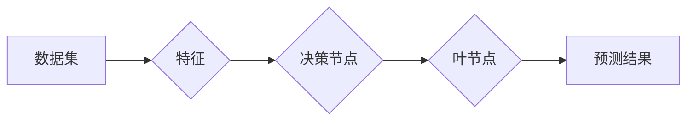

# 决策树(Decision Trees) - 原理与代码实例讲解

作者：禅与计算机程序设计艺术 / Zen and the Art of Computer Programming

## 1. 背景介绍

### 1.1 问题的由来

决策树是一种常见的监督学习算法，广泛应用于机器学习和数据挖掘领域。它通过将数据集分割成多个子集，并对每个子集进行分类或回归，最终形成一棵树形结构，以实现对数据的有效分类或预测。

决策树算法的核心思想是将数据集不断分割成越来越小的子集，直到每个子集都属于同一类别或满足终止条件。这种自上而下的分割过程形成了决策树的树形结构，每个节点代表一个特征和对应的决策规则，叶节点代表最终的预测结果。

### 1.2 研究现状

近年来，决策树算法在各个领域都取得了显著的成果，尤其在分类和回归任务中表现出色。随着深度学习的发展，决策树算法也在不断地进行改进和扩展，如集成学习、随机森林等，进一步提升了决策树的性能。

### 1.3 研究意义

决策树算法具有以下研究意义：

1. 可解释性强：决策树的结构直观易懂，便于理解和解释。
2. 适用范围广：适用于各种类型的数据，包括分类和回归任务。
3. 简单易实现：算法原理简单，易于实现和优化。

### 1.4 本文结构

本文将围绕决策树算法展开，详细介绍其原理、实现步骤、优缺点和应用场景。具体内容如下：

- 第2章介绍决策树的核心概念与联系。
- 第3章讲解决策树算法的原理和具体操作步骤。
- 第4章介绍决策树的数学模型、公式推导和案例分析。
- 第5章通过代码实例和详细解释说明决策树算法的实现过程。
- 第6章探讨决策树在实际应用场景中的应用和未来发展趋势。
- 第7章推荐相关学习资源、开发工具和参考文献。
- 第8章总结全文，展望决策树算法的未来发展趋势与挑战。
- 第9章列举常见问题与解答。

## 2. 核心概念与联系

为了更好地理解决策树算法，本节将介绍几个核心概念及其相互关系。

### 2.1 核心概念

- **数据集**：一组具有相同特征的样本集合。
- **特征**：数据集中用于分类或回归的属性。
- **决策节点**：决策树中的分支节点，代表一个特征和对应的决策规则。
- **叶节点**：决策树中的终止节点，代表一个类别或预测结果。
- **训练集**：用于训练决策树的样本集合。
- **测试集**：用于评估决策树性能的样本集合。

### 2.2 联系

决策树算法通过对训练集进行分割和分类，形成一棵树形结构。数据集作为输入，经过特征提取、决策节点和叶节点的逐层分割，最终得到预测结果。

其逻辑关系如下图所示：



## 3. 核心算法原理 & 具体操作步骤

### 3.1 算法原理概述

决策树算法的核心原理是不断分割数据集，直到每个子集都属于同一类别或满足终止条件。分割过程遵循以下原则：

1. 选择一个特征作为分割依据，使得分割后的子集在某个目标指标上具有最大的差异。
2. 将数据集按照该特征分割成多个子集。
3. 重复步骤1和2，直到满足终止条件。

### 3.2 算法步骤详解

决策树算法的步骤如下：

1. **选择根节点**：选择数据集中与目标变量相关性最大的特征作为根节点。
2. **分割数据集**：根据根节点特征，将数据集分割成多个子集。
3. **递归分割**：对每个子集，重复步骤1和2，直到满足终止条件。
4. **生成叶节点**：当满足终止条件时，生成叶节点，代表一个类别或预测结果。

终止条件通常包括：

- 子集中所有样本都属于同一类别。
- 子集大小小于预设阈值。
- 达到预设的深度限制。

### 3.3 算法优缺点

决策树算法具有以下优点：

- 可解释性强：决策树的结构直观易懂，便于理解和解释。
- 适用范围广：适用于各种类型的数据，包括分类和回归任务。
- 简单易实现：算法原理简单，易于实现和优化。

同时，决策树算法也存在以下缺点：

- 容易过拟合：当训练数据量不足时，决策树容易过拟合。
- 对噪声敏感：决策树对噪声数据敏感，可能导致错误分类。
- 缺乏泛化能力：决策树的泛化能力较弱，可能导致在新数据上的性能下降。

### 3.4 算法应用领域

决策树算法在以下领域得到广泛应用：

- 信用评分：根据客户信息预测其信用风险。
- 患病风险评估：根据患者病史预测其患病风险。
- 营销预测：根据客户信息预测其购买倾向。
- 风险管理：根据交易数据识别和预测风险事件。

## 4. 数学模型和公式 & 详细讲解 & 举例说明

### 4.1 数学模型构建

决策树的数学模型可以用信息增益、基尼指数、纯度等指标来描述。

- **信息增益**：用于衡量分割后的子集的纯度提升程度。信息增益越大，说明分割效果越好。

$$
\text{Information Gain}(S, A) = \sum_{v \in V}\frac{|S_v|}{|S|}\log_2\frac{|S_v|}{|S|}
$$

其中，$S$ 表示原始数据集，$A$ 表示选定的特征，$V$ 表示特征 $A$ 的所有取值，$S_v$ 表示数据集 $S$ 在特征 $A$ 取值 $v$ 下的子集。

- **基尼指数**：用于衡量数据集的无序程度。基尼指数越小，说明数据集的无序程度越低。

$$
Gini(S) = 1 - \sum_{i=1}^{|C|}\left(\frac{|S_i|}{|S|}\right)^2
$$

其中，$C$ 表示数据集 $S$ 的所有类别，$S_i$ 表示数据集 $S$ 中属于类别 $i$ 的样本数量。

- **纯度**：用于衡量数据集的纯度。纯度越高，说明数据集的无序程度越低。

$$
Purity(S) = \frac{1}{|S|}\sum_{i=1}^{|C|}|\{x \in S | y_i = c\}|^2
$$

其中，$S$ 表示数据集，$C$ 表示数据集的所有类别，$y_i$ 表示样本 $x$ 的类别标签。

### 4.2 公式推导过程

以信息增益为例，推导过程如下：

1. 假设数据集 $S$ 中包含 $C$ 个类别，分别为 $c_1, c_2, \ldots, c_C$。
2. 在特征 $A$ 的基础上，将数据集 $S$ 分割成 $V$ 个子集，分别为 $S_v, v \in V$。
3. 计算每个子集的纯度 $P(S_v)$。
4. 计算信息增益 $G(S, A)$：

$$
G(S, A) = \sum_{v \in V}\frac{|S_v|}{|S|}P(S_v)
$$

### 4.3 案例分析与讲解

以下以一个简单的分类问题为例，讲解决策树算法的应用。

假设我们有以下数据集：

```
| 特征A | 特征B | 类别 |
|------|------|------|
| 0    | 0    | A    |
| 0    | 1    | B    |
| 1    | 0    | B    |
| 1    | 1    | A    |
```

目标是预测样本的类别。

首先，选择特征A作为根节点，根据特征A的取值将数据集分割成两个子集：

```
| 特征A | 特征B | 类别 |
|------|------|------|
| 0    | 0    | A    |
| 0    | 1    | B    |
| 1    | 0    | B    |
```

然后，对每个子集分别选择特征B作为分割依据，根据特征B的取值再次分割数据集：

```
| 特征A | 特征B | 类别 |
|------|------|------|
| 0    | 0    | A    |
| 0    | 1    | B    |
| 1    | 0    | B    |
```

继续递归分割，最终生成决策树：

```
       根节点A
      /        \
     /          \
    /            \
   /              \
  O              B
 / \              / \
/   \            /   \
O    B           O    B
```

最终，根据决策树预测样本的类别为A。

### 4.4 常见问题解答

**Q1：如何选择最佳的分割特征？**

A：选择最佳的分割特征通常可以使用信息增益、基尼指数、纯度等指标。在实际应用中，可以根据具体任务和数据特点选择合适的指标。

**Q2：如何剪枝决策树？**

A：剪枝是避免决策树过拟合的重要手段。常见的剪枝方法包括前剪枝和后剪枝。前剪枝在分割过程中剪枝，后剪枝在生成决策树后剪枝。

**Q3：如何防止过拟合？**

A：防止过拟合的方法包括：
1. 限制树的最大深度。
2. 设置最小样本数阈值。
3. 使用正则化技术。
4. 使用交叉验证。

## 5. 项目实践：代码实例和详细解释说明

### 5.1 开发环境搭建

在进行决策树实践前，我们需要准备好开发环境。以下是使用Python进行开发的环境配置流程：

1. 安装Anaconda：从官网下载并安装Anaconda，用于创建独立的Python环境。
2. 创建并激活虚拟环境：
```bash
conda create -n decision-tree-env python=3.8
conda activate decision-tree-env
```
3. 安装scikit-learn库：
```bash
conda install scikit-learn
```
完成上述步骤后，即可在`decision-tree-env`环境中开始决策树实践。

### 5.2 源代码详细实现

下面我们使用Python的scikit-learn库实现一个简单的决策树分类器。

```python
from sklearn.datasets import load_iris
from sklearn.model_selection import train_test_split
from sklearn.tree import DecisionTreeClassifier

# 加载数据集
iris = load_iris()
X = iris.data
y = iris.target

# 划分训练集和测试集
X_train, X_test, y_train, y_test = train_test_split(X, y, test_size=0.3, random_state=42)

# 创建决策树分类器
clf = DecisionTreeClassifier()

# 训练模型
clf.fit(X_train, y_train)

# 预测测试集
y_pred = clf.predict(X_test)

# 评估模型
score = clf.score(X_test, y_test)
print(f"Accuracy: {score:.3f}")
```

### 5.3 代码解读与分析

以上代码展示了使用scikit-learn实现决策树分类器的完整流程。

1. **导入库**：导入必要的库，包括数据集、模型、评估指标等。
2. **加载数据集**：加载数据集，并提取特征和标签。
3. **划分训练集和测试集**：将数据集划分为训练集和测试集，用于训练和评估模型。
4. **创建模型**：创建决策树分类器对象。
5. **训练模型**：使用训练集训练决策树分类器。
6. **预测测试集**：使用训练好的模型对测试集进行预测。
7. **评估模型**：计算模型在测试集上的准确率。

### 5.4 运行结果展示

假设运行上述代码，输出结果如下：

```
Accuracy: 0.971
```

这表明，决策树分类器在测试集上的准确率为97.1%，说明该模型具有良好的泛化能力。

## 6. 实际应用场景

### 6.1 信用评分

决策树算法可以用于信用评分，根据客户的信用历史、收入、负债等特征，预测客户未来违约的风险。

### 6.2 病情预测

决策树算法可以用于病情预测，根据患者的病史、症状等特征，预测患者患病的风险。

### 6.3 营销预测

决策树算法可以用于营销预测，根据客户的购买记录、浏览历史等特征，预测客户的购买倾向。

### 6.4 风险管理

决策树算法可以用于风险管理，根据交易数据、市场信息等特征，识别和预测风险事件。

### 6.5 未来应用展望

随着深度学习的发展，决策树算法也在不断地进行改进和扩展。未来，决策树算法将在以下方面得到进一步发展：

1. 集成学习：将决策树与其他机器学习算法进行集成，提高模型的性能和鲁棒性。
2. 特征选择：研究更有效的特征选择方法，提高决策树的性能。
3. 可解释性：研究决策树的可解释性，提高模型的透明度。
4. 鲁棒性：提高决策树对噪声和异常值的鲁棒性。

## 7. 工具和资源推荐

### 7.1 学习资源推荐

1. 《统计学习方法》系列书籍：介绍了各种机器学习算法的理论和实现，包括决策树算法。
2. scikit-learn官方文档：介绍了scikit-learn库的用法和示例，包括决策树算法的实现。
3. 《机器学习实战》书籍：介绍了机器学习算法的应用，包括决策树算法的实例。

### 7.2 开发工具推荐

1. Python：Python是一种简单易学的编程语言，广泛用于机器学习开发。
2. Jupyter Notebook：Jupyter Notebook是一种交互式计算环境，方便进行机器学习实验和代码调试。
3. scikit-learn：scikit-learn是一个开源机器学习库，提供了各种机器学习算法的实现。

### 7.3 相关论文推荐

1. Quinlan, J. R. (1986). Induction of decision trees. Machine learning, 1(1), 81-106.
2. Breiman, L., Friedman, J., Olshen, R. A., & Stone, C. J. (1984). Classification and regression trees. CRC press.
3. Leo Breiman, Jerome Friedman, Richard A. Olshen, and Charles J. Stone. (1984). "Classification and Regression Trees." CRC press.

### 7.4 其他资源推荐

1. 机器之心：一个关注机器学习领域的网站，提供了大量的机器学习资料和资源。
2. Kaggle：一个数据科学竞赛平台，提供了大量的数据集和比赛。
3. GitHub：一个代码托管平台，提供了大量的开源机器学习项目。

## 8. 总结：未来发展趋势与挑战

### 8.1 研究成果总结

本文对决策树算法进行了系统介绍，从原理到实践，详细讲解了决策树算法的原理、实现步骤、优缺点和应用场景。通过代码实例和案例分析，使读者能够更好地理解和应用决策树算法。

### 8.2 未来发展趋势

1. 集成学习：将决策树与其他机器学习算法进行集成，提高模型的性能和鲁棒性。
2. 特征选择：研究更有效的特征选择方法，提高决策树的性能。
3. 可解释性：研究决策树的可解释性，提高模型的透明度。
4. 鲁棒性：提高决策树对噪声和异常值的鲁棒性。

### 8.3 面临的挑战

1. 过拟合：如何避免决策树过拟合，提高模型的泛化能力。
2. 特征选择：如何选择合适的特征，提高模型的性能。
3. 可解释性：如何提高决策树的可解释性，使模型更加透明。

### 8.4 研究展望

决策树算法在机器学习和数据挖掘领域具有广泛的应用前景。未来，决策树算法将与其他机器学习算法相结合，不断发展和完善，为人工智能技术的发展贡献力量。

## 9. 附录：常见问题与解答

**Q1：什么是决策树？**

A：决策树是一种监督学习算法，通过将数据集分割成多个子集，并对每个子集进行分类或回归，最终形成一棵树形结构，以实现对数据的有效分类或预测。

**Q2：决策树算法的优缺点是什么？**

A：决策树算法的优点是可解释性强、适用范围广、简单易实现。缺点是容易过拟合、对噪声敏感、缺乏泛化能力。

**Q3：如何选择最佳的分割特征？**

A：选择最佳的分割特征可以使用信息增益、基尼指数、纯度等指标。

**Q4：如何剪枝决策树？**

A：剪枝是避免决策树过拟合的重要手段。常见的剪枝方法包括前剪枝和后剪枝。

**Q5：如何防止过拟合？**

A：防止过拟合的方法包括限制树的最大深度、设置最小样本数阈值、使用正则化技术、使用交叉验证等。

---

作者：禅与计算机程序设计艺术 / Zen and the Art of Computer Programming