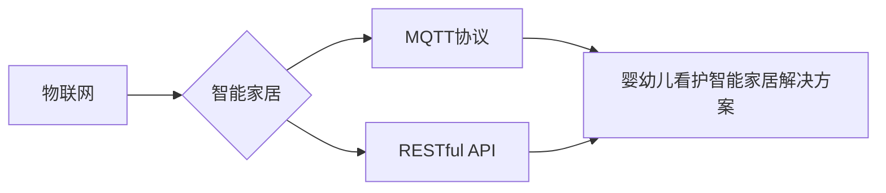

# 基于MQTT协议和RESTful API的婴幼儿看护智能家居解决方案

作者：禅与计算机程序设计艺术 / Zen and the Art of Computer Programming

## 1. 背景介绍
### 1.1 问题的由来

随着社会发展和家庭结构变化，越来越多的家庭选择育儿嫂或保姆来照顾婴幼儿。然而，传统的看护方式往往依赖于人工经验和主观判断，缺乏科学性和数据支持。随着物联网和智能家居技术的不断发展，利用智能设备对婴幼儿进行实时监测和远程看护成为一种新的趋势。

### 1.2 研究现状

目前，基于智能家居的婴幼儿看护系统已经取得了一定的研究成果。例如，利用摄像头、传感器、可穿戴设备等收集婴幼儿的生理参数、行为数据，并通过云计算、大数据等技术进行分析和预警。然而，现有的系统往往存在以下问题：

- **通信协议不统一**：不同的设备和平台可能使用不同的通信协议，导致系统集成困难，数据交互不顺畅。
- **接口不开放**：部分智能设备的接口不开放，难以与其他系统进行集成。
- **数据孤岛**：不同设备采集的数据难以整合，难以形成全面的数据视图。
- **缺乏统一的控制平台**：不同功能模块分散在不同设备或平台中，难以统一管理和控制。

### 1.3 研究意义

基于MQTT协议和RESTful API的婴幼儿看护智能家居解决方案，旨在解决现有系统的不足，实现以下目标：

- **统一通信协议**：采用MQTT协议作为统一的通信协议，实现不同设备之间的无缝连接和数据交互。
- **开放接口**：开放RESTful API，方便其他系统或应用程序的集成。
- **数据整合**：将不同设备采集的数据进行整合，形成全面的数据视图。
- **统一控制平台**：构建统一的控制平台，方便用户对婴幼儿看护系统进行管理。

### 1.4 本文结构

本文将围绕基于MQTT协议和RESTful API的婴幼儿看护智能家居解决方案展开，主要内容包括：

- 核心概念与联系
- 核心算法原理与具体操作步骤
- 数学模型与公式
- 项目实践：代码实例和详细解释说明
- 实际应用场景
- 工具和资源推荐
- 总结：未来发展趋势与挑战

## 2. 核心概念与联系

本节将介绍与婴幼儿看护智能家居解决方案相关的核心概念，并阐述它们之间的联系。

### 2.1 物联网（IoT）

物联网是指通过信息传感设备，将各种物品连接到网络中进行信息交换和通信的系统。在婴幼儿看护智能家居解决方案中，物联网技术是实现设备互联互通和数据采集的基础。

### 2.2 智能家居

智能家居是指利用物联网、云计算、大数据等技术，将家居环境中的各种设备连接起来，实现智能化控制和管理的系统。

### 2.3 MQTT协议

MQTT（Message Queuing Telemetry Transport）是一种轻量级、低功耗、面向消息的通信协议，适用于低带宽、高延迟的物联网应用场景。

### 2.4 RESTful API

RESTful API是一种基于REST（Representational State Transfer）架构风格的Web服务接口规范，用于实现不同系统之间的数据交互。

### 2.5 关联图

以下是核心概念之间的关联图：



## 3. 核心算法原理 & 具体操作步骤

### 3.1 算法原理概述

基于MQTT协议和RESTful API的婴幼儿看护智能家居解决方案的核心算法原理主要包括以下三个方面：

- **数据采集**：通过摄像头、传感器、可穿戴设备等采集婴幼儿的生理参数、行为数据。
- **数据传输**：采用MQTT协议将采集到的数据进行传输，实现设备之间的互联互通。
- **数据处理与分析**：通过RESTful API将数据传输到云端，进行数据分析和预警。

### 3.2 算法步骤详解

基于MQTT协议和RESTful API的婴幼儿看护智能家居解决方案的具体操作步骤如下：

1. **设备接入**：将摄像头、传感器、可穿戴设备等接入网络，并配置MQTT客户端。
2. **数据采集**：摄像头、传感器、可穿戴设备等采集婴幼儿的生理参数、行为数据。
3. **数据传输**：通过MQTT协议将采集到的数据传输到云端服务器。
4. **数据处理与分析**：云端服务器通过RESTful API接收数据，并进行处理和分析。
5. **预警与控制**：根据分析结果，系统向用户发送预警信息，并根据用户指令控制智能家居设备。

### 3.3 算法优缺点

基于MQTT协议和RESTful API的婴幼儿看护智能家居解决方案具有以下优点：

- **低功耗**：MQTT协议是轻量级协议，适用于低功耗的物联网设备。
- **可靠性**：MQTT协议支持多种消息服务质量（QoS），确保数据传输的可靠性。
- **可扩展性**：RESTful API支持多种编程语言和平台，便于系统扩展和集成。
- **易用性**：用户可以通过简单的Web界面或移动应用程序进行操作。

然而，该方案也存在以下缺点：

- **安全性**：MQTT协议本身安全性较低，需要额外进行安全加固。
- **复杂度**：系统涉及多个组件和协议，实现和维护较为复杂。

### 3.4 算法应用领域

基于MQTT协议和RESTful API的婴幼儿看护智能家居解决方案可以应用于以下领域：

- **婴幼儿监护**：实时监测婴幼儿的生理参数、行为数据，及时发现异常情况。
- **智能家居控制**：根据婴幼儿的生理参数和行为数据，自动调节室内温度、湿度、光线等环境参数。
- **远程看护**：用户可以通过手机或电脑远程监控婴幼儿的情况，并及时进行干预。

## 4. 数学模型与公式

本节将介绍婴幼儿看护智能家居解决方案中涉及的一些数学模型和公式。

### 4.1 数学模型构建

婴幼儿看护智能家居解决方案中涉及的主要数学模型包括：

- **生理参数监测模型**：通过传感器采集婴幼儿的体温、心率、呼吸频率等生理参数，并建立相应的监测模型。
- **行为监测模型**：通过摄像头采集婴幼儿的行为数据，并建立相应的行为监测模型。
- **环境控制模型**：根据婴幼儿的生理参数和行为数据，建立相应的环境控制模型。

### 4.2 公式推导过程

以生理参数监测模型为例，假设婴幼儿的体温、心率、呼吸频率分别为 $T$、$R$、$F$，则生理参数监测模型可以表示为：

$$
T = f(T, R, F)
$$

其中，$f$ 为生理参数监测模型的函数。

### 4.3 案例分析与讲解

以婴幼儿体温监测为例，介绍如何构建体温监测模型。

首先，收集婴幼儿的体温数据，并建立体温与时间的关系曲线。然后，使用线性回归、支持向量机等机器学习算法建立体温监测模型。

### 4.4 常见问题解答

**Q1：如何保证数据采集的准确性？**

A：为了保证数据采集的准确性，需要选择高质量的传感器，并进行定期校准和校验。同时，可以对采集到的数据进行滤波和去噪处理。

**Q2：如何保证数据传输的安全性？**

A：为了保证数据传输的安全性，可以使用TLS/SSL等加密协议对MQTT消息进行加密，并采用身份认证机制确保通信双方的身份验证。

**Q3：如何处理异常数据？**

A：异常数据可能是由于传感器故障、网络异常等原因造成的。可以通过设置阈值、数据清洗等方法对异常数据进行处理。

## 5. 项目实践：代码实例和详细解释说明

### 5.1 开发环境搭建

在进行婴幼儿看护智能家居解决方案的开发之前，需要搭建以下开发环境：

- **操作系统**：Linux或Windows
- **编程语言**：Python
- **开发工具**：PyCharm、VS Code
- **MQTT客户端库**：Paho MQTT
- **RESTful API框架**：Flask或Django

### 5.2 源代码详细实现

以下是一个基于Python的MQTT客户端示例代码：

```python
from paho.mqtt import client as mqtt_client

# MQTT服务器地址和端口
MQTT_BROKER = 'localhost'
MQTT_PORT = 1883

# MQTT客户端ID
MQTT_CLIENT_ID = 'python_mqtt_client'

# MQTT主题
MQTT_TOPIC = '婴幼儿看护/体温'

# MQTT连接回调函数
def on_connect(client, userdata, flags, rc):
    print(f"连接到MQTT服务器，连接返回码：{rc}")
    client.subscribe(MQTT_TOPIC)

# MQTT消息接收回调函数
def on_message(client, userdata, msg):
    print(f"接收到消息：{msg.payload.decode()}")

# 创建MQTT客户端实例
client = mqtt_client.Client(MQTT_CLIENT_ID)

# 设置连接回调函数
client.on_connect = on_connect

# 设置消息接收回调函数
client.on_message = on_message

# 连接到MQTT服务器
client.connect(MQTT_BROKER, MQTT_PORT)

# 循环处理消息
client.loop_forever()
```

### 5.3 代码解读与分析

以上代码实现了MQTT客户端的基本功能，包括连接到MQTT服务器、订阅主题、接收消息等。

- `from paho.mqtt import client as mqtt_client`：导入Paho MQTT客户端库。
- `MQTT_BROKER` 和 `MQTT_PORT`：定义MQTT服务器地址和端口。
- `MQTT_CLIENT_ID`：定义MQTT客户端ID。
- `MQTT_TOPIC`：定义订阅的主题。
- `on_connect`：连接回调函数，用于处理连接事件。
- `on_message`：消息接收回调函数，用于处理接收到的消息。
- `client = mqtt_client.Client(MQTT_CLIENT_ID)`：创建MQTT客户端实例。
- `client.on_connect = on_connect`：设置连接回调函数。
- `client.on_message = on_message`：设置消息接收回调函数。
- `client.connect(MQTT_BROKER, MQTT_PORT)`：连接到MQTT服务器。
- `client.loop_forever()`：循环处理消息。

### 5.4 运行结果展示

运行以上代码，将连接到MQTT服务器，并订阅主题`婴幼儿看护/体温`。此时，当有新的消息发布到该主题时，会触发`on_message`回调函数，并打印出消息内容。

## 6. 实际应用场景

基于MQTT协议和RESTful API的婴幼儿看护智能家居解决方案可以应用于以下实际应用场景：

### 6.1 婴幼儿监护

通过摄像头采集婴幼儿的视频图像，并使用人脸识别技术检测婴幼儿的位置、状态等。同时，通过传感器采集婴幼儿的生理参数，如体温、心率、呼吸频率等。将采集到的数据传输到云端服务器，进行数据分析和预警。

### 6.2 智能家居控制

根据婴幼儿的生理参数和行为数据，自动调节室内温度、湿度、光线等环境参数，为婴幼儿提供舒适的成长环境。

### 6.3 远程看护

用户可以通过手机或电脑远程监控婴幼儿的情况，并及时进行干预。例如，当婴幼儿体温异常升高时，系统会向用户发送预警信息，并自动调节空调等设备降低室温。

## 7. 工具和资源推荐

### 7.1 学习资源推荐

- **《物联网技术与应用》**：介绍物联网技术的基本概念、技术架构和应用案例。
- **《智能家居技术与应用》**：介绍智能家居技术的基本概念、设计原则和应用案例。
- **《MQTT协议与实现》**：介绍MQTT协议的原理、特性和应用。
- **《RESTful API设计最佳实践》**：介绍RESTful API的设计原则、实现方法和最佳实践。

### 7.2 开发工具推荐

- **PyCharm**：Python集成开发环境，支持代码调试、版本控制等功能。
- **VS Code**：跨平台代码编辑器，支持多种编程语言和插件。
- **Paho MQTT**：开源MQTT客户端库，支持多种编程语言。
- **Flask**：Python Web框架，用于构建RESTful API。

### 7.3 相关论文推荐

- **《基于物联网的智能家居系统设计与实现》**
- **《基于MQTT协议的智能家居控制系统设计与实现》**
- **《基于RESTful API的智能家居平台设计与实现》**

### 7.4 其他资源推荐

- **HiveMQ**：开源MQTT消息代理，提供丰富的API和客户端支持。
- **AWS IoT**：亚马逊云平台提供的物联网服务，提供MQTT消息代理、设备管理等功能。
- **百度AI开放平台**：提供多种人工智能技术和服务，包括人脸识别、语音识别等。

## 8. 总结：未来发展趋势与挑战

### 8.1 研究成果总结

本文介绍了基于MQTT协议和RESTful API的婴幼儿看护智能家居解决方案，阐述了其核心概念、原理、算法和实现方法。通过实例分析，展示了该方案在实际应用中的优势和价值。

### 8.2 未来发展趋势

未来，基于MQTT协议和RESTful API的婴幼儿看护智能家居解决方案将呈现以下发展趋势：

- **多传感器融合**：融合多种传感器，如温度、湿度、光照、空气质量等，为婴幼儿提供更全面的监测。
- **边缘计算**：将数据处理和分析任务下沉到边缘设备，降低网络传输压力，提高实时性。
- **人工智能**：结合人工智能技术，实现更智能化的监测、预警和控制。
- **个性化定制**：根据不同婴幼儿的特点，提供个性化的看护方案。

### 8.3 面临的挑战

基于MQTT协议和RESTful API的婴幼儿看护智能家居解决方案在发展过程中也面临以下挑战：

- **数据安全**：如何保证数据传输、存储和使用的安全性。
- **隐私保护**：如何保护婴幼儿的隐私数据。
- **标准化**：如何推动物联网、智能家居等领域的标准化工作。
- **用户体验**：如何为用户提供更便捷、易用的操作界面和交互体验。

### 8.4 研究展望

针对面临的挑战，未来需要从以下方面进行研究：

- **安全加密技术**：研究更安全的数据传输、存储和加密技术，保护用户隐私。
- **隐私保护技术**：研究隐私保护技术，如差分隐私、联邦学习等，在保护隐私的前提下实现数据分析和挖掘。
- **标准化工作**：积极参与物联网、智能家居等领域的标准化工作，推动行业健康发展。
- **用户体验设计**：关注用户体验设计，提供易用、美观、智能的交互界面。

通过不断攻克这些挑战，基于MQTT协议和RESTful API的婴幼儿看护智能家居解决方案将为婴幼儿提供更加安全、舒适、健康的成长环境，为家庭带来更加便捷、智能的看护体验。

## 9. 附录：常见问题与解答

**Q1：如何选择合适的MQTT客户端库？**

A：在选择MQTT客户端库时，需要考虑以下因素：

- **编程语言**：选择支持目标编程语言的库。
- **功能特性**：选择功能丰富、性能优良的库。
- **社区支持**：选择社区活跃、文档齐全的库。

**Q2：如何保证MQTT消息的可靠性？**

A：可以通过以下方式保证MQTT消息的可靠性：

- **设置消息服务质量**：使用QoS 1或QoS 2，确保消息至少被发送一次或恰好发送一次。
- **使用持久化存储**：将消息存储到持久化存储中，防止消息丢失。
- **重试机制**：在发送消息时，使用重试机制确保消息发送成功。

**Q3：如何实现RESTful API的身份认证？**

A：可以通过以下方式实现RESTful API的身份认证：

- **使用HTTP Basic认证**：使用用户名和密码进行认证。
- **使用OAuth 2.0认证**：使用OAuth 2.0协议进行认证。
- **使用JWT认证**：使用JSON Web Token进行认证。

**Q4：如何处理异常数据？**

A：可以通过以下方式处理异常数据：

- **设置阈值**：设置阈值，将超出阈值的异常数据视为异常数据。
- **数据清洗**：对数据进行清洗，去除噪声和异常值。
- **人工审核**：人工审核异常数据，确定其是否为真实异常。

**Q5：如何优化系统性能？**

A：可以通过以下方式优化系统性能：

- **负载均衡**：使用负载均衡技术，将请求分配到多个服务器上。
- **缓存**：使用缓存技术，减少数据库访问次数。
- **数据库优化**：优化数据库查询和存储，提高数据库性能。

通过不断优化和改进，基于MQTT协议和RESTful API的婴幼儿看护智能家居解决方案将为婴幼儿提供更加安全、舒适、健康的成长环境，为家庭带来更加便捷、智能的看护体验。