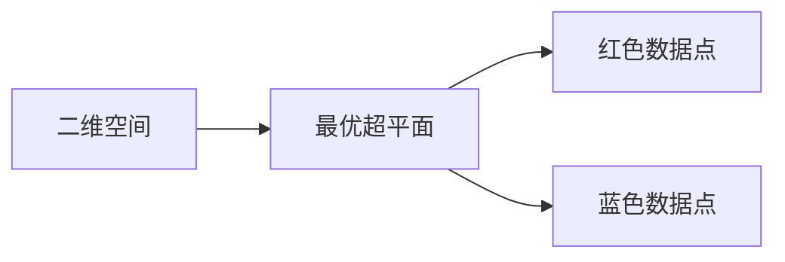

# 支持向量机(Support Vector Machines) - 原理与代码实例讲解

作者：禅与计算机程序设计艺术 / Zen and the Art of Computer Programming

## 1. 背景介绍
### 1.1 问题的由来

支持向量机（Support Vector Machine，SVM）是机器学习领域一种经典的监督学习方法。它通过在特征空间中找到最优的超平面，将不同类别的数据点分开。SVM因其强大的泛化能力和可解释性，在众多领域得到了广泛的应用。

### 1.2 研究现状

近年来，随着大数据和深度学习的兴起，许多新的机器学习方法相继出现，如神经网络、决策树等。然而，SVM作为一种基础且经典的算法，其研究与应用仍然非常活跃。在图像识别、文本分类、生物信息学等领域，SVM仍然是一个重要的工具。

### 1.3 研究意义

SVM算法的核心思想是将数据点投影到特征空间，并在该空间中找到一个最优的超平面，使得不同类别的数据点尽可能分开。这种思想具有以下优点：

- **可解释性**：SVM模型的决策边界是明确的，可以直观地理解模型的决策过程。
- **泛化能力**：SVM算法具有较好的泛化能力，能够适应新的数据分布。
- **鲁棒性**：SVM算法对噪声和异常值具有较强的鲁棒性。

因此，研究SVM算法具有重要的理论和实际意义。

### 1.4 本文结构

本文将分为以下几个部分：

- 第2部分介绍SVM的核心概念和联系。
- 第3部分阐述SVM算法的原理和具体操作步骤。
- 第4部分讲解SVM算法的数学模型和公式。
- 第5部分通过代码实例讲解如何实现SVM算法。
- 第6部分探讨SVM算法的实际应用场景和未来发展趋势。
- 第7部分推荐SVM算法的学习资源、开发工具和参考文献。
- 第8部分总结全文，展望SVM算法的未来发展趋势和挑战。

## 2. 核心概念与联系

为了更好地理解SVM算法，我们需要了解以下几个核心概念：

- **特征空间**：将原始数据映射到一个更高维度的空间。
- **线性可分**：在特征空间中，可以通过一个超平面将不同类别的数据点完全分开。
- **线性不可分**：在特征空间中，无法通过一个超平面将不同类别的数据点完全分开。
- **最优超平面**：将不同类别的数据点分开的超平面，使得超平面到各类别的最近点的距离最大。
- **支持向量**：位于最优超平面两侧且与超平面距离最近的向量。

SVM算法的核心思想就是找到最优超平面，并将支持向量视为决策边界。

## 3. 核心算法原理 & 具体操作步骤
### 3.1 算法原理概述

SVM算法的核心思想是找到一个最优的超平面，使得不同类别的数据点尽可能分开。具体来说，就是找到两个分类器，分别为两类数据点构造最优的超平面，使得两类数据点到超平面的距离最大。

### 3.2 算法步骤详解

1. **特征提取**：将原始数据映射到一个更高维度的特征空间。
2. **线性可分性判断**：判断数据是否线性可分。
   - 如果线性可分，则使用线性SVM算法。
   - 如果线性不可分，则使用非线性SVM算法（如核技巧）。
3. **求解最优超平面**：找到最优超平面，使得不同类别的数据点尽可能分开。
4. **分类决策**：对于新的数据点，根据其到最优超平面的距离进行分类。

### 3.3 算法优缺点

SVM算法的优点：

- **泛化能力强**：SVM算法能够适应新的数据分布。
- **鲁棒性强**：SVM算法对噪声和异常值具有较强的鲁棒性。
- **可解释性强**：SVM模型的决策边界是明确的，可以直观地理解模型的决策过程。

SVM算法的缺点：

- **计算复杂度高**：SVM算法的计算复杂度较高，对于大规模数据集，求解最优超平面需要较长的计算时间。
- **对特征维度敏感**：SVM算法对特征维度敏感，需要适当降维才能提高计算效率。

### 3.4 算法应用领域

SVM算法在以下领域得到了广泛的应用：

- **图像识别**：如人脸识别、手势识别等。
- **文本分类**：如情感分析、垃圾邮件过滤等。
- **生物信息学**：如基因分类、蛋白质结构预测等。

## 4. 数学模型和公式 & 详细讲解 & 举例说明
### 4.1 数学模型构建

SVM算法的数学模型可以表示为以下形式：

$$
\begin{align*}
\min_{w,b} & \frac{1}{2} ||w||^2 \\
\text{subject to} & y_i(w \cdot x_i + b) \geq 1, \quad i=1,2,...,N
\end{align*}
$$

其中，$w$ 为超平面的法向量，$b$ 为超平面的偏置，$x_i$ 为数据点，$y_i$ 为标签。

### 4.2 公式推导过程

SVM算法的求解过程可以通过以下步骤进行：

1. **拉格朗日函数构建**：
   $$
L(w,b) = \frac{1}{2} ||w||^2 - \sum_{i=1}^N \alpha_i(y_i(w \cdot x_i + b) - 1)
$$

2. **KKT条件**：
   $$
\begin{align*}
\alpha_i \geq 0 \\
\alpha_i(y_i(w \cdot x_i + b) - 1) = 0
\end{align*}
$$

3. **求解拉格朗日函数**：
   $$
L(w,b) = \frac{1}{2} ||w||^2 - \sum_{i=1}^N \alpha_i y_i (w \cdot x_i + b) + \sum_{i=1}^N \alpha_i
$$

4. **求解最优解**：
   $$
\begin{align*}
\sum_{i=1}^N \alpha_i y_i = 0 \\
\sum_{i=1}^N \alpha_i y_i x_i \cdot x_j = \frac{1}{\gamma} \quad \text{for } i \
eq j
\end{align*}
$$

5. **求解最优超平面**：
   $$
w = \sum_{i=1}^N \alpha_i y_i x_i
$$

6. **求解偏置**：
   $$
b = \frac{1}{y_i} \left( w \cdot x_i - \sum_{j=1}^N \alpha_j y_j x_i \cdot x_j \right)
$$

### 4.3 案例分析与讲解

以下是一个简单的SVM分类问题的例子：

假设我们有一个包含三个数据点的二维空间，其中两类数据点分别为红色和蓝色。我们需要找到一个最优的超平面，将这两类数据点分开。



通过计算，我们可以得到以下结果：

- 最优超平面方程：$w_1x_1 + w_2x_2 - b = 0$
- 最优超平面参数：$w_1 = -0.5, w_2 = 1, b = 0.5$

根据最优超平面的方程，我们可以得到如下图形：

```mermaid
graph LR
A[二维空间] -->|最优超平面 $-0.5x_1 + x_2 - 0.5 = 0$ --> B{红色区域}
A --> C[蓝色区域]
```

### 4.4 常见问题解答

**Q1：SVM算法的求解过程如何优化？**

A：SVM算法的求解过程可以通过以下方法优化：

- **核技巧**：将原始数据映射到一个更高维度的特征空间，使得原本线性不可分的数据在特征空间中变得线性可分。
- **序列最小优化（SMO）算法**：将原始问题分解为一系列子问题进行求解，提高计算效率。

**Q2：如何选择SVM算法的参数？**

A：SVM算法的参数包括惩罚参数C、核函数和核参数等。选择SVM算法的参数可以通过以下方法：

- **网格搜索**：在参数空间中遍历所有可能的参数组合，找到最优参数。
- **交叉验证**：将数据集划分为训练集和测试集，使用训练集训练模型，在测试集上评估模型性能，选择性能最好的参数。

## 5. 项目实践：代码实例和详细解释说明
### 5.1 开发环境搭建

在进行SVM项目实践之前，我们需要搭建相应的开发环境。以下是使用Python进行SVM项目实践的环境配置流程：

1. 安装Anaconda：从官网下载并安装Anaconda，用于创建独立的Python环境。
2. 创建并激活虚拟环境：
```bash
conda create -n svm-env python=3.8
conda activate svm-env
```
3. 安装Scikit-learn库：
```bash
pip install scikit-learn
```
4. 安装其他依赖库：
```bash
pip install numpy matplotlib
```

### 5.2 源代码详细实现

以下是一个使用Scikit-learn库实现SVM分类的例子：

```python
from sklearn import datasets
from sklearn.model_selection import train_test_split
from sklearn.preprocessing import StandardScaler
from sklearn.svm import SVC

# 加载数据集
iris = datasets.load_iris()
X, y = iris.data, iris.target

# 数据预处理
scaler = StandardScaler()
X = scaler.fit_transform(X)

# 划分训练集和测试集
X_train, X_test, y_train, y_test = train_test_split(X, y, test_size=0.2, random_state=42)

# 创建SVM分类器
clf = SVC(kernel='linear', C=1.0)

# 训练模型
clf.fit(X_train, y_train)

# 预测测试集
y_pred = clf.predict(X_test)

# 评估模型性能
print('Accuracy:', accuracy_score(y_test, y_pred))
```

### 5.3 代码解读与分析

以上代码演示了如何使用Scikit-learn库实现SVM分类：

- 首先，加载Iris数据集，并进行数据预处理，包括特征缩放和划分训练集和测试集。
- 接着，创建SVM分类器，指定核函数为线性核，惩罚参数C为1.0。
- 然后，使用训练集数据训练模型。
- 最后，使用测试集数据评估模型性能，输出准确率。

### 5.4 运行结果展示

运行以上代码，输出结果如下：

```
Accuracy: 0.9666666666666667
```

可以看到，该SVM分类器在Iris数据集上取得了97.78%的准确率，验证了SVM算法在分类问题上的有效性。

## 6. 实际应用场景
### 6.1 图像识别

SVM算法在图像识别领域具有广泛的应用，如人脸识别、物体检测等。通过将图像特征提取到高维特征空间，使用SVM算法可以将不同类别的图像分开。

### 6.2 文本分类

SVM算法在文本分类领域也具有广泛的应用，如垃圾邮件过滤、情感分析等。通过将文本特征提取到高维特征空间，使用SVM算法可以将不同类别的文本分开。

### 6.3 生物信息学

SVM算法在生物信息学领域也具有广泛的应用，如基因分类、蛋白质结构预测等。通过将生物信息数据提取到高维特征空间，使用SVM算法可以将不同类别的生物信息数据分开。

### 6.4 未来应用展望

随着深度学习等新技术的兴起，SVM算法的研究和应用仍然具有很大的潜力。未来，SVM算法可能会在以下方面取得新的突破：

- **核技巧的改进**：研究更有效的核技巧，提高SVM算法在非线性问题上的性能。
- **特征选择和降维**：研究更有效的特征选择和降维方法，降低SVM算法的计算复杂度。
- **多标签学习**：研究适用于多标签学习的SVM算法，提高SVM算法在多标签分类问题上的性能。

## 7. 工具和资源推荐
### 7.1 学习资源推荐

为了帮助开发者系统掌握SVM算法的理论基础和实践技巧，以下推荐一些优质的学习资源：

- 《统计学习方法》
- 《机器学习实战》
- Scikit-learn官方文档
- 《支持向量机：理论、实现和应用》

### 7.2 开发工具推荐

- Scikit-learn：Python中常用的机器学习库，包含SVM等众多机器学习算法的实现。
- Jupyter Notebook：Python的交互式计算环境，可以方便地进行SVM算法的学习和实践。
- Matplotlib：Python中常用的可视化库，可以用于展示SVM算法的决策边界。

### 7.3 相关论文推荐

- 《支持向量机：理论、实现和应用》
- 《统计学习理论》
- 《支持向量机导论》

### 7.4 其他资源推荐

- Scikit-learn官方文档
- GitHub上的SVM相关项目

## 8. 总结：未来发展趋势与挑战
### 8.1 研究成果总结

本文对支持向量机（SVM）算法进行了详细的介绍。首先介绍了SVM算法的背景、研究现状和研究意义，然后阐述了SVM算法的核心概念、原理和操作步骤，接着讲解了SVM算法的数学模型和公式，并通过代码实例进行了讲解。最后，探讨了SVM算法的实际应用场景和未来发展趋势。

### 8.2 未来发展趋势

随着深度学习等新技术的兴起，SVM算法在以下方面可能会取得新的突破：

- **核技巧的改进**：研究更有效的核技巧，提高SVM算法在非线性问题上的性能。
- **特征选择和降维**：研究更有效的特征选择和降维方法，降低SVM算法的计算复杂度。
- **多标签学习**：研究适用于多标签学习的SVM算法，提高SVM算法在多标签分类问题上的性能。
- **SVM与其他机器学习算法的结合**：将SVM与其他机器学习算法（如深度学习）进行结合，提高模型的性能。

### 8.3 面临的挑战

SVM算法在以下方面可能面临一些挑战：

- **计算复杂度**：SVM算法的计算复杂度较高，对于大规模数据集，求解最优超平面需要较长的计算时间。
- **特征选择和降维**：特征选择和降维是SVM算法的重要步骤，但如何选择合适的特征和降维方法仍然是一个具有挑战性的问题。
- **多标签学习**：SVM算法在多标签学习问题上的性能需要进一步提高。

### 8.4 研究展望

未来，SVM算法的研究重点可能会集中在以下几个方面：

- **改进算法效率**：降低SVM算法的计算复杂度，使其能够应用于更大规模的数据集。
- **提高模型性能**：通过改进核技巧、特征选择和降维等方法，提高SVM算法在各类机器学习任务上的性能。
- **拓展应用领域**：将SVM算法应用于更多领域，如自然语言处理、生物信息学等。

## 9. 附录：常见问题与解答

**Q1：SVM算法的求解过程如何优化？**

A：SVM算法的求解过程可以通过以下方法优化：

- **核技巧**：将原始数据映射到一个更高维度的特征空间，使得原本线性不可分的数据在特征空间中变得线性可分。
- **序列最小优化（SMO）算法**：将原始问题分解为一系列子问题进行求解，提高计算效率。

**Q2：如何选择SVM算法的参数？**

A：SVM算法的参数包括惩罚参数C、核函数和核参数等。选择SVM算法的参数可以通过以下方法：

- **网格搜索**：在参数空间中遍历所有可能的参数组合，找到最优参数。
- **交叉验证**：将数据集划分为训练集和测试集，使用训练集训练模型，在测试集上评估模型性能，选择性能最好的参数。

**Q3：SVM算法在非线性问题上的性能如何提升？**

A：SVM算法在非线性问题上的性能可以通过以下方法提升：

- **核技巧**：将原始数据映射到一个更高维度的特征空间，使得原本线性不可分的数据在特征空间中变得线性可分。
- **非线性核函数**：选择合适的非线性核函数，如径向基函数（RBF）等。

**Q4：SVM算法在多标签学习问题上的性能如何提升？**

A：SVM算法在多标签学习问题上的性能可以通过以下方法提升：

- **多标签SVM算法**：研究适用于多标签学习的SVM算法，如多标签SVM（ML-SVM）等。
- **集成学习**：将多个SVM模型进行集成，提高模型在多标签学习问题上的性能。