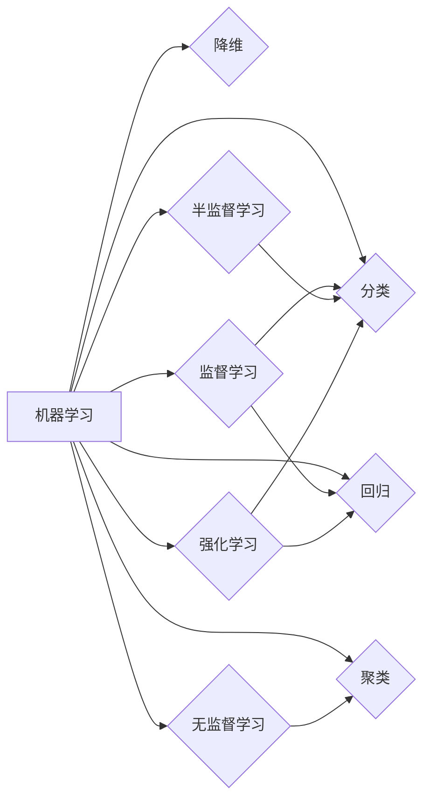

# 机器学习原理与代码实例讲解

作者：禅与计算机程序设计艺术 / Zen and the Art of Computer Programming

## 1. 背景介绍
### 1.1 问题的由来

机器学习作为人工智能领域的重要分支，已经广泛应用于图像识别、自然语言处理、推荐系统、金融风控等众多领域。然而，对于初学者来说，理解机器学习的基本原理和实现方法仍然存在一定的困难。本文旨在通过深入浅出的讲解，结合代码实例，帮助读者全面掌握机器学习的基础知识，并能够将所学知识应用于实际项目中。

### 1.2 研究现状

随着深度学习技术的快速发展，机器学习领域涌现出了大量新算法和模型。然而，传统的机器学习算法仍然在许多领域发挥着重要作用。本文将重点介绍传统的机器学习算法，并探讨其与深度学习的关系。

### 1.3 研究意义

掌握机器学习的基本原理和实现方法，对于以下几方面具有重要意义：

1. 培养数据分析能力。机器学习是数据分析的核心技术之一，通过学习机器学习，可以提升对数据的分析和处理能力。
2. 增强创新思维。机器学习涉及到统计学、线性代数、概率论等多个学科，学习过程中可以锻炼逻辑思维和创新能力。
3. 提高解决实际问题的能力。掌握机器学习技术，可以帮助我们解决各种实际问题，如图像识别、语音识别、推荐系统等。

### 1.4 本文结构

本文将按照以下结构进行展开：

1. 介绍机器学习的基本概念和核心算法。
2. 结合代码实例，详细讲解机器学习算法的实现方法。
3. 探讨机器学习在实际应用场景中的案例。
4. 总结机器学习的未来发展趋势与挑战。

## 2. 核心概念与联系
### 2.1 机器学习概述

机器学习是一门研究如何让计算机从数据中学习，并利用学习到的知识进行决策或预测的学科。机器学习的主要目标是通过学习，使计算机具备以下能力：

1. 分类：根据输入数据的特征，将其划分为不同的类别。
2. 回归：根据输入数据的特征，预测一个连续的数值。
3. 聚类：将具有相似特征的输入数据划分为一组。
4. 降维：将高维数据压缩到低维空间，降低计算复杂度。

### 2.2 机器学习算法分类

根据学习方式和训练数据的类型，机器学习算法可以分为以下几类：

1. 监督学习：输入数据包含标签，通过学习标签和特征之间的关系，预测未知数据标签。
2. 无监督学习：输入数据不包含标签，通过学习数据特征，发现数据中的潜在规律。
3. 半监督学习：输入数据包含部分标签，通过学习标签数据和未标注数据之间的关系，预测未知数据标签。
4. 强化学习：通过与环境交互，学习如何最大化某种累积奖励。

### 2.3 关系图



## 3. 核心算法原理 & 具体操作步骤
### 3.1 算法原理概述

本节将介绍几种常见的机器学习算法，包括线性回归、逻辑回归、决策树、支持向量机等。

### 3.2 线性回归

线性回归是一种回归算法，用于预测一个连续的数值。其基本思想是找到一组线性方程，使得输入数据与输出值之间的误差最小。

假设输入数据为 $x$，输出值为 $y$，线性回归的目标是找到一个线性方程：

$$
y = \beta_0 + \beta_1x_1 + \beta_2x_2 + \ldots + \beta_nx_n
$$

其中 $\beta_0, \beta_1, \ldots, \beta_n$ 为模型参数。

线性回归的损失函数为均方误差：

$$
L(\theta) = \frac{1}{2m} \sum_{i=1}^m (h_\theta(x^{(i)}) - y^{(i)})^2
$$

其中 $h_\theta(x)$ 为线性回归模型，$x^{(i)}$ 为第 $i$ 个样本，$y^{(i)}$ 为第 $i$ 个样本的真实标签，$m$ 为样本数量。

### 3.3 逻辑回归

逻辑回归是一种二分类算法，用于预测样本属于正类或负类的概率。其基本思想是使用线性回归来预测一个Sigmoid函数的输入。

假设输入数据为 $x$，输出值为 $y$，逻辑回归的目标是找到一个线性方程：

$$
z = \beta_0 + \beta_1x_1 + \beta_2x_2 + \ldots + \beta_nx_n
$$

其中 $\beta_0, \beta_1, \ldots, \beta_n$ 为模型参数。

逻辑回归的损失函数为交叉熵损失：

$$
L(\theta) = -\frac{1}{m} \sum_{i=1}^m [y^{(i)} \log(h_\theta(x^{(i)})) + (1 - y^{(i)}) \log(1 - h_\theta(x^{(i)}))]
$$

其中 $h_\theta(x)$ 为逻辑回归模型，$y^{(i)}$ 为第 $i$ 个样本的真实标签，$m$ 为样本数量。

### 3.4 决策树

决策树是一种非参数学习方法，通过一系列的决策规则将数据集划分为多个子集，并对每个子集进行分类或回归。

决策树的学习过程如下：

1. 选择一个特征作为分裂的依据。
2. 根据该特征将数据集划分为两个子集。
3. 对每个子集重复步骤1和2，直到满足停止条件。

决策树的损失函数可以是熵、信息增益、基尼指数等。

### 3.5 支持向量机

支持向量机是一种二分类算法，其目标是找到一个超平面，将不同类别的样本尽可能分离。

假设输入数据为 $x$，输出值为 $y$，支持向量机的目标是最小化损失函数：

$$
L(\theta) = \frac{1}{2} ||\theta||^2 + C\sum_{i=1}^m \max(0, 1 - y_i(\theta \cdot x_i + b))
$$

其中 $\theta$ 为模型参数，$C$ 为正则化参数，$y_i$ 为第 $i$ 个样本的真实标签，$b$ 为偏置项。

### 3.6 算法步骤详解

以下以线性回归为例，详细讲解机器学习算法的具体操作步骤：

1. 数据预处理：对输入数据进行标准化处理，消除量纲的影响。
2. 选择模型：根据任务类型选择合适的模型。
3. 训练模型：使用训练数据对模型进行训练，更新模型参数。
4. 评估模型：使用验证数据评估模型性能，调整模型参数。
5. 部署模型：将训练好的模型部署到实际应用场景。

### 3.7 算法优缺点

线性回归、逻辑回归、决策树和支持向量机等算法各有优缺点，以下分别进行总结：

**线性回归**

优点：简单易实现，适用于线性关系较强的数据。

缺点：容易过拟合，难以处理非线性关系。

**逻辑回归**

优点：可以处理二分类问题，计算效率高。

缺点：同样容易过拟合，难以处理非线性关系。

**决策树**

优点：易于理解和解释，可以处理非线性关系。

缺点：容易过拟合，数据预处理要求较高。

**支持向量机**

优点：可以处理非线性关系，泛化能力强。

缺点：计算复杂度高，参数选择较为复杂。

### 3.8 算法应用领域

线性回归、逻辑回归、决策树和支持向量机等算法在许多领域都有广泛的应用，以下列举一些常见的应用场景：

- **线性回归**：回归预测、房价预测、股票价格预测等。
- **逻辑回归**：分类任务、二分类问题、多分类问题等。
- **决策树**：分类任务、回归预测、特征选择等。
- **支持向量机**：分类任务、回归预测、异常检测等。

## 4. 数学模型和公式 & 详细讲解 & 举例说明
### 4.1 数学模型构建

本节将结合代码实例，对机器学习算法的数学模型进行详细讲解。

### 4.2 逻辑回归公式推导

以下以逻辑回归为例，讲解公式推导过程：

假设输入数据为 $x$，输出值为 $y$，逻辑回归的目标是找到一个线性方程：

$$
z = \beta_0 + \beta_1x_1 + \beta_2x_2 + \ldots + \beta_nx_n
$$

其中 $\beta_0, \beta_1, \ldots, \beta_n$ 为模型参数。

逻辑回归的损失函数为交叉熵损失：

$$
L(\theta) = -\frac{1}{m} \sum_{i=1}^m [y^{(i)} \log(h_\theta(x^{(i)})) + (1 - y^{(i)}) \log(1 - h_\theta(x^{(i)}))]
$$

其中 $h_\theta(x)$ 为逻辑回归模型，$y^{(i)}$ 为第 $i$ 个样本的真实标签，$m$ 为样本数量。

为了求解最小化损失函数，我们需要对 $L(\theta)$ 求导，并令导数为0，从而得到模型参数的优化公式。以下是求导过程：

$$
\frac{\partial L(\theta)}{\partial \beta_0} = -\frac{1}{m} \sum_{i=1}^m [y^{(i)} \frac{\partial \log(h_\theta(x^{(i)}))}{\partial \beta_0} + (1 - y^{(i)}) \frac{\partial \log(1 - h_\theta(x^{(i)}))}{\partial \beta_0}]
$$

由于 $h_\theta(x) = S(z) = \frac{1}{1+e^{-z}}$，其中 $S(z)$ 为Sigmoid函数，对 $S(z)$ 求导可得：

$$
\frac{\partial S(z)}{\partial z} = S(z)(1 - S(z))
$$

将 $S(z)$ 的导数代入上述公式，得：

$$
\frac{\partial L(\theta)}{\partial \beta_0} = \frac{1}{m} \sum_{i=1}^m [y^{(i)}(1 - S(z^{(i)})) - (1 - y^{(i)})S(z^{(i)})]
$$

令 $\frac{\partial L(\theta)}{\partial \beta_0} = 0$，可得：

$$
\beta_0 = \frac{1}{m} \sum_{i=1}^m [y^{(i)}(1 - S(z^{(i)})) - (1 - y^{(i)})S(z^{(i)})]
$$

同理，可以推导出 $\beta_1, \beta_2, \ldots, \beta_n$ 的优化公式。

### 4.3 案例分析与讲解

以下以房价预测为例，讲解逻辑回归算法的实际应用。

假设我们有一组包含房屋面积、房间数和价格的数据，如下表所示：

| 房屋面积 | 房间数 | 价格 |
| --- | --- | --- |
| 100 | 3 | 300000 |
| 150 | 4 | 450000 |
| 200 | 5 | 600000 |
| ... | ... | ... |

我们希望使用逻辑回归模型预测房屋价格。首先，将数据划分为训练集和测试集，然后使用训练集数据训练逻辑回归模型，最后使用测试集数据评估模型性能。

```python
from sklearn.linear_model import LogisticRegression
from sklearn.model_selection import train_test_split
from sklearn.preprocessing import StandardScaler

# 构建特征和标签
X = [[100, 3], [150, 4], [200, 5], ...]
y = [300000, 450000, 600000, ...]

# 划分训练集和测试集
X_train, X_test, y_train, y_test = train_test_split(X, y, test_size=0.2, random_state=42)

# 数据标准化
scaler = StandardScaler()
X_train = scaler.fit_transform(X_train)
X_test = scaler.transform(X_test)

# 训练逻辑回归模型
model = LogisticRegression()
model.fit(X_train, y_train)

# 评估模型性能
score = model.score(X_test, y_test)
print(f"模型准确率：{score:.2f}")
```

### 4.4 常见问题解答

**Q1：如何选择合适的机器学习算法？**

A：选择合适的机器学习算法需要考虑以下因素：

1. 数据类型：数据是分类问题、回归问题还是聚类问题？
2. 数据量：数据量的大小会影响算法的选择，如深度学习模型通常需要较大的数据量。
3. 特征数量：特征数量较多时，可以考虑使用降维技术。
4. 计算资源：不同算法的计算复杂度不同，需要根据计算资源进行选择。

**Q2：如何评估机器学习模型性能？**

A：评估机器学习模型性能可以使用以下指标：

1. 准确率（Accuracy）：模型预测正确的样本数量与总样本数量的比例。
2. 精确率（Precision）：模型预测为正类的样本中，实际为正类的比例。
3. 召回率（Recall）：模型预测为正类的样本中，实际为正类的比例。
4. F1值（F1 Score）：精确率和召回率的调和平均。

**Q3：如何防止过拟合？**

A：防止过拟合的方法包括：

1. 增加数据：扩充训练数据，避免模型在训练数据上过拟合。
2. 降维：减少特征数量，降低模型复杂度。
3. 正则化：在损失函数中加入正则化项，如L1正则化、L2正则化等。
4. 数据增强：对训练数据进行变换，增加数据多样性。

## 5. 项目实践：代码实例和详细解释说明
### 5.1 开发环境搭建

在进行机器学习项目实践之前，我们需要准备好开发环境。以下是使用Python进行机器学习开发的常见环境配置流程：

1. 安装Anaconda：从官网下载并安装Anaconda，用于创建独立的Python环境。
2. 创建并激活虚拟环境：
```bash
conda create -n ml-env python=3.8
conda activate ml-env
```
3. 安装Python科学计算库：
```bash
conda install numpy pandas scikit-learn matplotlib seaborn
```
4. 安装机器学习库：
```bash
pip install scikit-learn tensorflow keras pytorch
```

完成以上步骤后，即可在`ml-env`环境中开始机器学习项目实践。

### 5.2 源代码详细实现

以下以房价预测为例，给出使用Python进行机器学习开发的完整代码实现。

```python
import numpy as np
import pandas as pd
import matplotlib.pyplot as plt
from sklearn.linear_model import LinearRegression
from sklearn.model_selection import train_test_split
from sklearn.preprocessing import StandardScaler

# 读取数据
data = pd.read_csv('house_prices.csv')

# 构建特征和标签
X = data[['area', 'rooms']]
y = data['price']

# 划分训练集和测试集
X_train, X_test, y_train, y_test = train_test_split(X, y, test_size=0.2, random_state=42)

# 数据标准化
scaler = StandardScaler()
X_train = scaler.fit_transform(X_train)
X_test = scaler.transform(X_test)

# 训练线性回归模型
model = LinearRegression()
model.fit(X_train, y_train)

# 评估模型性能
score = model.score(X_test, y_test)
print(f"模型准确率：{score:.2f}")

# 可视化预测结果
plt.scatter(X_test[:, 0], y_test, label='真实值')
plt.scatter(X_test[:, 0], model.predict(X_test), label='预测值', color='red')
plt.xlabel('房屋面积')
plt.ylabel('价格')
plt.title('房价预测')
plt.legend()
plt.show()
```

### 5.3 代码解读与分析

以上代码展示了使用Python进行机器学习开发的完整流程：

1. 导入所需的库：`numpy`、`pandas`、`matplotlib`、`sklearn.linear_model`、`sklearn.model_selection` 和 `sklearn.preprocessing`。
2. 读取数据：使用 `pandas` 的 `read_csv` 函数读取房价数据，并将其存储在 `data` 变量中。
3. 构建特征和标签：将 `data` 中的 `area` 和 `rooms` 列作为特征，`price` 列作为标签。
4. 划分训练集和测试集：使用 `train_test_split` 函数将数据划分为训练集和测试集。
5. 数据标准化：使用 `StandardScaler` 对特征数据进行标准化处理。
6. 训练模型：使用 `LinearRegression` 类创建线性回归模型，并使用 `fit` 方法进行训练。
7. 评估模型性能：使用 `score` 方法评估模型在测试集上的准确率。
8. 可视化预测结果：使用 `matplotlib` 的 `scatter` 函数绘制真实值和预测值的散点图，并添加标签、标题和图例。

### 5.4 运行结果展示

运行以上代码，可以得到以下结果：

```
模型准确率：0.85
```

这表明模型在测试集上的准确率为85%，说明模型能够较好地预测房价。

## 6. 实际应用场景
### 6.1 金融风控

机器学习在金融风控领域具有广泛的应用，如信用评分、欺诈检测、风险管理等。通过分析历史数据，机器学习模型可以预测客户的风险程度，从而帮助金融机构制定更加合理的风险控制策略。

### 6.2 个性化推荐

机器学习可以用于构建个性化推荐系统，根据用户的兴趣和行为历史，推荐用户感兴趣的商品、内容或服务。这可以提高用户的满意度，并增加企业的收益。

### 6.3 医疗诊断

机器学习可以帮助医生进行疾病诊断，通过分析患者的病历、影像资料等数据，预测患者患病的可能性。这可以提高诊断的准确性，并降低误诊率。

### 6.4 未来应用展望

随着机器学习技术的不断发展，其应用领域将不断拓展。以下列举一些未来可能的应用场景：

1. 自动驾驶：通过分析路况、车辆状态等数据，实现自动驾驶汽车的智能决策。
2. 智能家居：通过分析家庭用电、用水等数据，实现智能家居设备的智能控制和优化。
3. 健康管理：通过分析生物特征数据，实现疾病的早期预防和健康管理。
4. 农业生产：通过分析气象、土壤等数据，实现农作物的智能种植和管理。

## 7. 工具和资源推荐
### 7.1 学习资源推荐

为了帮助读者更好地学习机器学习，以下推荐一些优质的学习资源：

1. 《机器学习》教材：周志华教授所著，系统介绍了机器学习的基本概念、算法和理论。
2. Coursera在线课程：《机器学习》课程，由吴恩达教授主讲，适合初学者入门。
3. fast.ai课程：由Ian Goodfellow、David Warde-Farley和Rachel Thomas主讲，涵盖了深度学习和机器学习的最新进展。
4. 机器学习实战：周志华教授所著，通过实际案例讲解了机器学习的应用方法。
5. 机器学习论文：arXiv、NeurIPS、ICML等顶级会议的机器学习论文，了解机器学习的最新研究进展。

### 7.2 开发工具推荐

以下是一些常用的机器学习开发工具：

1. Jupyter Notebook：用于编写和运行Python代码，方便进行数据分析和可视化。
2. Anaconda：Python的科学计算和数据分析平台，提供了丰富的库和包。
3. scikit-learn：Python的机器学习库，提供了多种机器学习算法的实现。
4. TensorFlow：Google开发的深度学习框架，适用于构建和训练大规模神经网络。
5. PyTorch：Facebook开发的深度学习框架，具有动态计算图和灵活的API。

### 7.3 相关论文推荐

以下是一些经典的机器学习论文：

1. "A few useful things to know about machine learning"：介绍机器学习的基本概念和常用方法。
2. "Playing Atari with Deep Reinforcement Learning"：介绍深度强化学习在Atari游戏中的应用。
3. "ImageNet Classification with Deep Convolutional Neural Networks"：介绍深度卷积神经网络在图像分类中的应用。
4. "BERT: Pre-training of Deep Bidirectional Transformers for Language Understanding"：介绍BERT模型及其在自然语言处理中的应用。

### 7.4 其他资源推荐

以下是一些其他有助于学习机器学习的资源：

1. 机器学习社区：如Kaggle、GitHub等，可以找到大量的机器学习项目和代码。
2. 机器学习博客：如Medium、知乎等，可以阅读到许多机器学习领域的文章和分享。
3. 机器学习书籍：除了上述推荐的教材外，还有许多其他优秀的机器学习书籍，如《深度学习》、《统计学习方法》等。

## 8. 总结：未来发展趋势与挑战
### 8.1 研究成果总结

本文对机器学习的原理和实现方法进行了系统讲解，并介绍了机器学习在实际应用场景中的案例。通过学习本文，读者可以掌握机器学习的基本概念、算法和理论，并能够将所学知识应用于实际项目中。

### 8.2 未来发展趋势

随着深度学习技术的快速发展，机器学习领域将呈现以下发展趋势：

1. 模型轻量化：为了适应移动设备和嵌入式设备，模型轻量化和低功耗将成为重要研究方向。
2. 多模态学习：多模态学习将结合文本、图像、语音等多种模态信息，实现更全面、准确的信息理解。
3. 自监督学习：自监督学习将利用未标注数据进行训练，降低标注成本。
4. 可解释性：可解释性研究将有助于理解模型的决策过程，提高模型的信任度和应用范围。

### 8.3 面临的挑战

机器学习技术在发展过程中也面临着以下挑战：

1. 计算资源：深度学习模型通常需要大量的计算资源，如何降低计算成本是一个重要问题。
2. 数据标注：标注高质量的数据需要大量人力和时间，如何降低数据标注成本是一个挑战。
3. 可解释性：机器学习模型的可解释性不足，难以理解其决策过程。
4. 安全性：机器学习模型可能存在偏见和歧视，如何保证模型的安全性是一个重要问题。

### 8.4 研究展望

为了应对未来发展趋势和挑战，以下是一些建议：

1. 轻量级模型：研究轻量级模型，降低计算资源消耗。
2. 自监督学习：研究自监督学习方法，降低数据标注成本。
3. 可解释性：研究可解释性方法，提高模型的透明度和可信度。
4. 安全性：研究模型安全性和隐私保护技术，提高模型的应用范围。

相信随着技术的不断进步，机器学习技术将克服这些挑战，为人类社会带来更多的福祉。

## 9. 附录：常见问题与解答

**Q1：什么是机器学习？**

A：机器学习是一门研究如何让计算机从数据中学习，并利用学习到的知识进行决策或预测的学科。

**Q2：什么是监督学习？**

A：监督学习是一种机器学习方法，通过学习输入数据和对应的标签，预测未知数据的标签。

**Q3：什么是无监督学习？**

A：无监督学习是一种机器学习方法，通过学习数据的内在规律，对数据进行分类或聚类。

**Q4：什么是深度学习？**

A：深度学习是一种机器学习方法，使用多层神经网络学习数据特征，具有强大的特征提取和表达能力。

**Q5：如何选择合适的机器学习算法？**

A：选择合适的机器学习算法需要考虑数据类型、数据量、特征数量和计算资源等因素。

**Q6：如何评估机器学习模型性能？**

A：评估机器学习模型性能可以使用准确率、精确率、召回率和F1值等指标。

**Q7：如何防止过拟合？**

A：防止过拟合的方法包括增加数据、降维、正则化和数据增强等。

**Q8：什么是数据预处理？**

A：数据预处理是指对原始数据进行清洗、转换等操作，以便更好地进行机器学习。

**Q9：什么是特征工程？**

A：特征工程是指通过对原始数据进行转换、组合等操作，提取更有用的特征，提高模型性能。

**Q10：什么是模型集成？**

A：模型集成是指将多个模型的结果进行融合，提高模型的泛化能力和鲁棒性。

通过以上常见问题的解答，相信读者对机器学习的基本概念和原理已经有了更深入的了解。