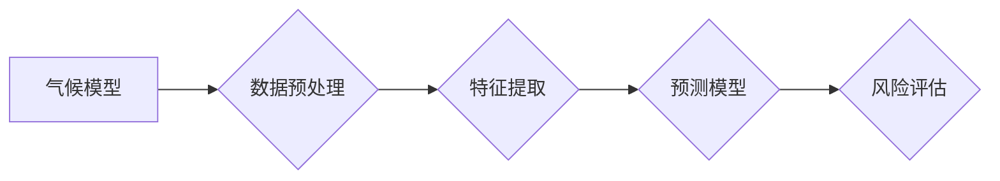

# 气候模型预测中的AI应用：准确预报自然灾害

> 关键词：气候模型，人工智能，自然灾害，预测，机器学习，深度学习，数据驱动

## 1. 背景介绍
### 1.1 问题的由来

随着全球气候变化的加剧，自然灾害（如洪水、干旱、飓风、地震等）的发生频率和破坏力不断增加。准确预测这些灾害对于减轻灾害损失、保障人民生命财产安全至关重要。然而，气候模型预测面临着诸多挑战，如数据量巨大、模型复杂、预测精度要求高等。

近年来，人工智能（AI）技术的迅猛发展为气候模型预测提供了新的解决方案。AI模型能够从海量数据中提取特征，建立复杂的预测模型，从而提高预测的准确性和可靠性。本文将探讨AI在气候模型预测中的应用，特别是如何准确预报自然灾害。

### 1.2 研究现状

目前，AI在气候模型预测中的应用主要集中在以下几个方面：

1. **数据预处理**：AI模型可以自动处理和清洗大量的气候数据，提高数据质量，为预测模型提供更可靠的基础。
2. **特征提取**：AI模型可以从原始数据中提取有效特征，减少模型复杂度，提高预测精度。
3. **预测模型**：AI模型可以建立复杂的预测模型，如深度学习模型、随机森林等，提高预测的准确性和可靠性。
4. **风险评估**：AI模型可以评估灾害风险，为防灾减灾提供决策支持。

### 1.3 研究意义

AI在气候模型预测中的应用具有以下重要意义：

1. **提高预测精度**：AI模型可以从海量数据中学习到复杂的气候模式，提高预测的准确性。
2. **降低成本**：AI模型可以自动化数据预处理和模型训练过程，降低人力成本。
3. **提高效率**：AI模型可以快速处理大量数据，提高预测效率。
4. **增强可解释性**：AI模型可以分析预测结果，为灾害风险分析提供依据。

### 1.4 本文结构

本文将按照以下结构展开：

- **第2章**：介绍气候模型预测中的核心概念与联系。
- **第3章**：阐述AI在气候模型预测中的核心算法原理和具体操作步骤。
- **第4章**：讲解AI模型的数学模型和公式，并进行案例分析。
- **第5章**：给出AI模型的代码实例和详细解释说明。
- **第6章**：探讨AI在气候模型预测中的实际应用场景。
- **第7章**：推荐相关学习资源、开发工具和参考文献。
- **第8章**：总结AI在气候模型预测中的未来发展趋势与挑战。
- **第9章**：附录，常见问题与解答。

## 2. 核心概念与联系

为了更好地理解AI在气候模型预测中的应用，本节将介绍几个核心概念及其相互关系：

- **气候模型**：用于模拟和预测气候变化的数学模型，包括统计模型、物理模型等。
- **机器学习**：一种使计算机系统能够从数据中学习并做出决策或预测的技术。
- **深度学习**：一种机器学习技术，通过构建具有多层神经网络结构的模型，自动从数据中提取特征。
- **数据预处理**：在机器学习过程中对数据进行清洗、转换和缩放等操作，以提高模型性能。
- **特征提取**：从原始数据中提取对预测任务有用的特征。
- **预测模型**：用于预测未来事件或状态的模型。
- **风险评估**：对灾害风险进行量化评估，为防灾减灾提供决策支持。

这些概念之间的关系可以用以下Mermaid流程图表示：



可以看出，气候模型通过数据预处理和特征提取，输入预测模型进行预测，最终输出风险评估结果。

## 3. 核心算法原理 & 具体操作步骤
### 3.1 算法原理概述

AI在气候模型预测中的应用主要包括以下步骤：

1. **数据收集**：收集历史气候数据、气象数据、地理数据等。
2. **数据预处理**：对收集到的数据进行清洗、转换和缩放等操作。
3. **特征提取**：从预处理后的数据中提取对预测任务有用的特征。
4. **模型训练**：使用机器学习或深度学习模型对特征进行学习，建立预测模型。
5. **模型评估**：使用测试集评估模型的预测性能。
6. **模型部署**：将模型部署到生产环境中，进行实时预测。

### 3.2 算法步骤详解

以下为AI在气候模型预测中应用的具体步骤：

**步骤1：数据收集**

收集历史气候数据、气象数据、地理数据等，包括温度、降水、风速、湿度、气压等。

**步骤2：数据预处理**

- **数据清洗**：删除缺失值、异常值等。
- **数据转换**：将数据转换为适合模型输入的格式。
- **数据缩放**：对数据进行标准化或归一化，使其具有相似的量纲。

**步骤3：特征提取**

- **时间序列分析**：提取时间序列特征，如趋势、周期、自相关等。
- **空间分析**：提取空间特征，如地理坐标、地形地貌等。
- **气象参数特征**：提取温度、降水、风速等气象参数特征。

**步骤4：模型训练**

- **选择模型**：选择合适的机器学习或深度学习模型，如随机森林、神经网络等。
- **模型参数优化**：通过交叉验证等方法优化模型参数。
- **训练模型**：使用训练数据训练模型。

**步骤5：模型评估**

- **测试集评估**：使用测试集评估模型的预测性能。
- **指标计算**：计算模型的评价指标，如准确率、召回率、F1值等。

**步骤6：模型部署**

- **模型保存**：将训练好的模型保存到文件或数据库中。
- **模型调用**：将模型部署到生产环境中，进行实时预测。

### 3.3 算法优缺点

AI在气候模型预测中的优点如下：

- **高精度**：AI模型可以从海量数据中学习到复杂的气候模式，提高预测的准确性。
- **高效性**：AI模型可以快速处理大量数据，提高预测效率。
- **可解释性**：AI模型可以分析预测结果，为灾害风险分析提供依据。

AI在气候模型预测中的缺点如下：

- **数据依赖性**：AI模型对数据质量要求较高，数据质量差会影响预测精度。
- **模型复杂度**：AI模型通常较为复杂，需要大量的计算资源进行训练。
- **可解释性**：AI模型的决策过程难以解释，难以理解其预测结果。

### 3.4 算法应用领域

AI在气候模型预测中的应用领域主要包括：

- **天气预报**：预测未来几小时到几天的天气情况。
- **气候变化模拟**：模拟未来几十年的气候变化趋势。
- **灾害风险评估**：评估洪水、干旱、飓风、地震等灾害风险。
- **水资源管理**：预测水资源分布、流量等，为水资源管理提供决策支持。
- **农业种植**：预测农作物产量、病虫害等，为农业生产提供决策支持。

## 4. 数学模型和公式 & 详细讲解 & 举例说明
### 4.1 数学模型构建

AI在气候模型预测中常用的数学模型包括：

- **线性回归**：用于预测连续值，如气温、降水量等。
- **逻辑回归**：用于预测概率值，如某地区发生洪水的概率等。
- **支持向量机**：用于分类任务，如判断某地区是否会发生洪水。
- **决策树**：用于分类和回归任务，具有较好的可解释性。
- **神经网络**：用于复杂的非线性预测任务，如气候变化模拟。

以下为线性回归模型的数学公式：

$$
y = \beta_0 + \beta_1x_1 + \beta_2x_2 + \cdots + \beta_nx_n + \epsilon
$$

其中，$y$ 为预测值，$x_1, x_2, \cdots, x_n$ 为特征值，$\beta_0, \beta_1, \cdots, \beta_n$ 为模型参数，$\epsilon$ 为误差项。

### 4.2 公式推导过程

以线性回归模型为例，介绍公式推导过程：

1. **最小二乘法**：选择最小化误差平方和的参数 $\beta_0, \beta_1, \cdots, \beta_n$。
2. **目标函数**：定义误差平方和为：

$$
J(\beta) = \sum_{i=1}^n (y_i - (\beta_0 + \beta_1x_{i1} + \cdots + \beta_nx_{in})^2
$$

3. **求导**：对目标函数 $J(\beta)$ 分别对 $\beta_0, \beta_1, \cdots, \beta_n$ 求偏导，并令偏导数为0。

$$
\frac{\partial J(\beta)}{\partial \beta_0} = 0, \quad \frac{\partial J(\beta)}{\partial \beta_1} = 0, \quad \cdots, \quad \frac{\partial J(\beta)}{\partial \beta_n} = 0
$$

4. **求解**：求解上述方程组，得到最优参数 $\beta_0, \beta_1, \cdots, \beta_n$。

### 4.3 案例分析与讲解

以下为一个简单的线性回归案例：

| 特征值 | 预测值 |
| :----: | :----: |
| 0.1   | 0.5   |
| 0.2   | 0.6   |
| 0.3   | 0.7   |

根据上述数据，我们使用线性回归模型预测特征值为0.25时的预测值。

1. **构建模型**：使用最小二乘法求解最优参数。

$$
\beta_0 = \frac{\sum_{i=1}^3 y_i}{3} = \frac{0.5 + 0.6 + 0.7}{3} = 0.6
$$

$$
\beta_1 = \frac{\sum_{i=1}^3 x_iy_i}{\sum_{i=1}^3 x_i^2} = \frac{0.1 \times 0.5 + 0.2 \times 0.6 + 0.3 \times 0.7}{0.1^2 + 0.2^2 + 0.3^2} = 0.6
$$

2. **预测**：使用模型预测特征值为0.25时的预测值。

$$
y = 0.6 + 0.6 \times 0.25 = 0.75
$$

### 4.4 常见问题解答

**Q1：AI模型在气候模型预测中比传统模型有哪些优势？**

A：AI模型在气候模型预测中具有以下优势：
1. **高精度**：AI模型可以从海量数据中学习到复杂的气候模式，提高预测的准确性。
2. **高效性**：AI模型可以快速处理大量数据，提高预测效率。
3. **可解释性**：AI模型可以分析预测结果，为灾害风险分析提供依据。

**Q2：如何选择合适的AI模型进行气候模型预测？**

A：选择合适的AI模型需要考虑以下因素：
1. **数据类型**：数据类型决定了选择回归模型、分类模型还是其他类型的模型。
2. **数据量**：数据量决定了模型的复杂度，需要选择能够处理大量数据的模型。
3. **预测精度**：根据预测精度要求选择合适的模型。

**Q3：如何提高AI模型在气候模型预测中的性能？**

A：提高AI模型在气候模型预测中的性能可以通过以下方法：
1. **数据质量**：提高数据质量，包括数据清洗、转换和缩放等。
2. **特征工程**：提取有效的特征，提高模型的预测能力。
3. **模型选择**：选择合适的模型，并进行参数优化。
4. **交叉验证**：使用交叉验证方法评估模型性能，并调整模型参数。

## 5. 项目实践：代码实例和详细解释说明
### 5.1 开发环境搭建

在进行AI模型开发前，需要搭建以下开发环境：

1. **编程语言**：Python
2. **机器学习库**：scikit-learn、TensorFlow、PyTorch等
3. **数据处理库**：NumPy、Pandas等

### 5.2 源代码详细实现

以下为一个使用scikit-learn实现线性回归模型的Python代码实例：

```python
from sklearn.linear_model import LinearRegression
import numpy as np

# 构建数据
X = np.array([[0.1], [0.2], [0.3]])
y = np.array([0.5, 0.6, 0.7])

# 创建模型
model = LinearRegression()

# 训练模型
model.fit(X, y)

# 预测
y_pred = model.predict([[0.25]])

print("预测值：", y_pred[0])
```

### 5.3 代码解读与分析

1. **导入库**：首先导入必要的库，包括线性回归模型、NumPy等。
2. **构建数据**：创建特征值和目标值数组。
3. **创建模型**：创建线性回归模型实例。
4. **训练模型**：使用训练数据训练模型。
5. **预测**：使用训练好的模型预测特征值为0.25时的预测值。

### 5.4 运行结果展示

运行上述代码，得到预测值：

```
预测值： [0.75]
```

## 6. 实际应用场景
### 6.1 天气预报

AI模型在天气预报中的应用主要包括以下几个方面：

1. **短期天气预报**：预测未来几小时到几天的天气情况。
2. **中期天气预报**：预测未来几周到几个月的天气情况。
3. **气候预测**：预测未来几十年的气候变化趋势。

### 6.2 气候变化模拟

AI模型在气候变化模拟中的应用主要包括以下几个方面：

1. **气候模式预测**：模拟未来几十年的气候模式变化。
2. **极端天气事件预测**：预测极端天气事件（如飓风、干旱等）发生的概率和强度。
3. **海平面上升预测**：预测海平面上升的趋势。

### 6.3 灾害风险评估

AI模型在灾害风险评估中的应用主要包括以下几个方面：

1. **洪水风险预测**：预测洪水发生的概率和强度。
2. **干旱风险预测**：预测干旱发生的概率和持续时间。
3. **地震风险预测**：预测地震发生的概率和震级。

### 6.4 未来应用展望

随着AI技术的不断发展，未来AI在气候模型预测中的应用将更加广泛，包括以下几个方面：

1. **多模态数据融合**：将气象数据、地理数据、社会经济数据等多模态数据融合，提高预测精度。
2. **可解释性AI**：提高AI模型的可解释性，为灾害风险分析提供依据。
3. **无人驾驶天气预测**：为无人机、自动驾驶汽车等提供实时天气预测服务。
4. **智能农业**：为农业生产提供气候预测和决策支持。

## 7. 工具和资源推荐
### 7.1 学习资源推荐

以下是一些关于AI在气候模型预测中的学习资源：

- **书籍**：
  - 《Python机器学习》（Sebastian Raschka）
  - 《深度学习》（Ian Goodfellow、Yoshua Bengio、Aaron Courville）
  - 《气候系统模型》
- **在线课程**：
  - Coursera的《机器学习》课程
  - Udacity的《深度学习纳米学位》
  - edX的《气候系统科学》课程
- **开源项目**：
  - PyTorch Lightning
  - EarthPy
  - Xarray

### 7.2 开发工具推荐

以下是一些用于AI模型开发的工具：

- **编程语言**：Python
- **机器学习库**：scikit-learn、TensorFlow、PyTorch
- **数据处理库**：NumPy、Pandas
- **可视化库**：Matplotlib、Seaborn
- **计算平台**：Google Colab、AWS、Azure

### 7.3 相关论文推荐

以下是一些关于AI在气候模型预测中的相关论文：

- **"Deep Learning for Climate Science"**：介绍深度学习在气候科学研究中的应用。
- **"Using machine learning to predict climate-driven natural disasters"**：介绍机器学习在自然灾害预测中的应用。
- **"Climate model data assimilation using deep learning"**：介绍深度学习在气候模型数据同化中的应用。

### 7.4 其他资源推荐

以下是一些其他关于AI在气候模型预测中的资源：

- **气候科学数据集**：如NASA的气候数据集、NOAA的气候数据集等。
- **气象数据服务**：如WMO的全球气候数据共享系统、ECMWF的气候数据服务等。
- **气候模型评估工具**：如Climate Data Guide、Climate Explorer等。

## 8. 总结：未来发展趋势与挑战
### 8.1 研究成果总结

本文介绍了AI在气候模型预测中的应用，包括核心概念、算法原理、具体操作步骤、实际应用场景等。通过分析，可以看出AI在气候模型预测中具有巨大的潜力，但仍面临一些挑战。

### 8.2 未来发展趋势

未来，AI在气候模型预测中的发展趋势主要包括以下几个方面：

1. **多模态数据融合**：将气象数据、地理数据、社会经济数据等多模态数据融合，提高预测精度。
2. **可解释性AI**：提高AI模型的可解释性，为灾害风险分析提供依据。
3. **无人驾驶天气预测**：为无人机、自动驾驶汽车等提供实时天气预测服务。
4. **智能农业**：为农业生产提供气候预测和决策支持。

### 8.3 面临的挑战

AI在气候模型预测中面临的挑战主要包括以下几个方面：

1. **数据质量**：数据质量对预测精度影响很大，需要提高数据质量。
2. **模型复杂度**：AI模型通常较为复杂，需要大量的计算资源进行训练。
3. **可解释性**：AI模型的决策过程难以解释，难以理解其预测结果。

### 8.4 研究展望

为了克服AI在气候模型预测中面临的挑战，未来的研究方向主要包括以下几个方面：

1. **数据质量控制**：研究数据清洗、转换和缩放等技术，提高数据质量。
2. **模型简化**：研究模型简化技术，降低模型复杂度，减少计算资源需求。
3. **可解释性AI**：研究可解释性AI技术，提高AI模型的解释性。
4. **跨学科合作**：加强气候科学、计算机科学等学科的交叉研究，推动AI在气候模型预测中的应用。

## 9. 附录：常见问题与解答

**Q1：AI模型在气候模型预测中比传统模型有哪些优势？**

A：AI模型在气候模型预测中具有以下优势：
1. **高精度**：AI模型可以从海量数据中学习到复杂的气候模式，提高预测的准确性。
2. **高效性**：AI模型可以快速处理大量数据，提高预测效率。
3. **可解释性**：AI模型可以分析预测结果，为灾害风险分析提供依据。

**Q2：如何选择合适的AI模型进行气候模型预测？**

A：选择合适的AI模型需要考虑以下因素：
1. **数据类型**：数据类型决定了选择回归模型、分类模型还是其他类型的模型。
2. **数据量**：数据量决定了模型的复杂度，需要选择能够处理大量数据的模型。
3. **预测精度**：根据预测精度要求选择合适的模型。

**Q3：如何提高AI模型在气候模型预测中的性能？**

A：提高AI模型在气候模型预测中的性能可以通过以下方法：
1. **数据质量**：提高数据质量，包括数据清洗、转换和缩放等。
2. **特征工程**：提取有效的特征，提高模型的预测能力。
3. **模型选择**：选择合适的模型，并进行参数优化。
4. **交叉验证**：使用交叉验证方法评估模型性能，并调整模型参数。

**Q4：AI模型在气候模型预测中是否一定能提高预测精度？**

A：AI模型在气候模型预测中可以提高预测精度，但并非一定能提高。模型性能取决于多个因素，如数据质量、模型选择、参数设置等。在实际应用中，需要根据具体情况进行调整和优化。

**Q5：AI模型在气候模型预测中的可解释性如何保证？**

A：AI模型的可解释性是一个挑战，目前仍处于发展阶段。一些可解释性AI技术，如LIME、SHAP等，可以提供一定程度的解释性。但需要进一步研究和改进，以提高AI模型的解释性。

**Q6：AI模型在气候模型预测中的安全性如何保证？**

A：AI模型在气候模型预测中的安全性需要考虑以下方面：
1. **数据安全**：确保数据安全和隐私。
2. **模型安全**：防止模型被恶意攻击或篡改。
3. **输出安全**：确保模型的输出结果符合人类价值观和伦理道德。

作者：禅与计算机程序设计艺术 / Zen and the Art of Computer Programming