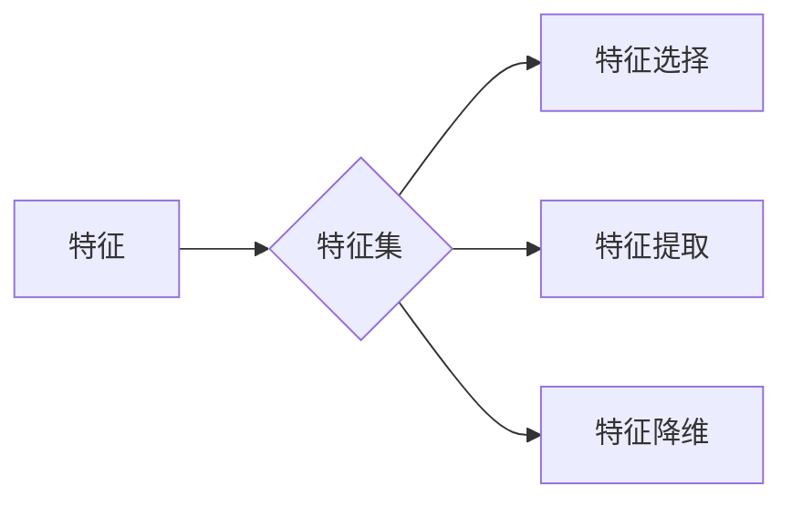

# 特征选择原理与代码实例讲解

作者：禅与计算机程序设计艺术 / Zen and the Art of Computer Programming

## 1. 背景介绍

### 1.1 问题的由来

在机器学习领域，特征选择（Feature Selection）是一个至关重要的环节。它旨在从原始特征集中选择出最有用的特征，用于训练模型，以提高模型性能和降低过拟合风险。然而，在现实世界中，往往存在大量冗余和噪声特征，这些特征不仅会增加模型的复杂度和计算成本，还可能降低模型性能。因此，特征选择成为机器学习中的一个重要研究课题。

### 1.2 研究现状

特征选择领域的研究成果丰富，主要分为以下几类：

- **过滤式（Filter-based）**：在数据预处理阶段，根据特征的一些统计指标（如方差、相关性等）来选择特征。
- **包装式（Wrapper-based）**：通过在特定算法上训练模型，根据模型性能来选择特征。
- **嵌入式（Embedded-based）**：在模型训练过程中，将特征选择作为模型的一部分进行优化。

### 1.3 研究意义

特征选择具有重要的理论意义和应用价值：

- **提高模型性能**：选择合适的特征可以帮助模型学习到更加有效的数据表示，从而提高模型性能。
- **降低过拟合风险**：通过去除冗余特征，可以降低模型的过拟合风险。
- **降低计算成本**：减少特征数量可以降低模型的复杂度和计算成本。
- **提高可解释性**：选择具有明确含义的特征可以提高模型的可解释性。

### 1.4 本文结构

本文将系统地介绍特征选择的基本原理、常见算法、代码实现和实际应用场景。具体内容安排如下：

- 第2部分，介绍特征选择的核心概念和联系。
- 第3部分，详细阐述特征选择的主要算法和具体操作步骤。
- 第4部分，讲解特征选择的数学模型和公式，并结合实例进行分析。
- 第5部分，给出特征选择的代码实例，并对关键代码进行解读。
- 第6部分，探讨特征选择在实际应用中的场景和案例。
- 第7部分，推荐特征选择相关的学习资源、开发工具和参考文献。
- 第8部分，总结全文，展望特征选择的未来发展趋势与挑战。

## 2. 核心概念与联系

为更好地理解特征选择，本节将介绍几个密切相关的核心概念：

- **特征（Feature）**：用于描述数据样本的属性或变量的量度。
- **特征集（Feature Set）**：由多个特征组成的集合。
- **特征选择（Feature Selection）**：从特征集中选择出最有用的特征的过程。
- **特征提取（Feature Extraction）**：通过某种算法或方法，从原始数据中提取新的特征的过程。
- **特征降维（Feature Dimensionality Reduction）**：通过某种算法或方法，降低特征维度，减少特征数量的过程。

它们之间的逻辑关系如下图所示：



可以看出，特征选择、特征提取和特征降维都是围绕特征集进行的，目的是为了获取更加有效的数据表示，提高模型性能。

## 3. 核心算法原理 & 具体操作步骤

### 3.1 算法原理概述

特征选择算法主要分为以下几类：

- **过滤式**：根据特征的一些统计指标（如方差、相关性等）来选择特征。
- **包装式**：通过在特定算法上训练模型，根据模型性能来选择特征。
- **嵌入式**：在模型训练过程中，将特征选择作为模型的一部分进行优化。

### 3.2 算法步骤详解

以下是三种特征选择算法的详细步骤：

#### 3.2.1 过滤式特征选择

1. 对特征集进行预处理，如标准化、归一化等。
2. 根据特征的一些统计指标（如方差、相关性等）进行排序。
3. 根据排序结果选择前K个特征。

#### 3.2.2 包装式特征选择

1. 选择一个基模型。
2. 从特征集中选择一部分特征进行训练。
3. 使用基模型在测试集上进行评估。
4. 重复步骤2和3，直到找到最优的特征组合。

#### 3.2.3 嵌入式特征选择

1. 选择一个基模型和特征选择函数。
2. 在模型训练过程中，使用特征选择函数优化特征权重。
3. 根据优化后的特征权重选择特征。

### 3.3 算法优缺点

以下是三种特征选择算法的优缺点：

| 算法类型 | 优点 | 缺点 |
| --- | --- | --- |
| 过滤式 | 实现简单，效率高 | 可能会漏掉有用的特征，对基模型敏感 |
| 包装式 | 可以考虑基模型的特性，选择更优的特征组合 | 计算成本高，对基模型敏感 |
| 嵌入式 | 可以同时进行特征选择和模型训练，提高效率 | 实现复杂，需要选择合适的特征选择函数 |

### 3.4 算法应用领域

特征选择算法在许多领域都有广泛的应用，如：

- 机器学习：特征选择可以提高模型性能和降低过拟合风险。
- 数据挖掘：特征选择可以帮助数据挖掘算法更有效地学习数据中的规律。
- 生物信息学：特征选择可以帮助识别生物体内的关键基因或蛋白质。
- 金融分析：特征选择可以帮助识别投资组合中的关键因素。

## 4. 数学模型和公式 & 详细讲解 & 举例说明

### 4.1 数学模型构建

特征选择问题的数学模型可以表示为：

$$
\begin{align*}
\min_{\mathbf{w}} \quad & \frac{1}{2} \left\| \mathbf{w} \right\|^2 \\
\text{s.t.} \quad & \left\| \mathbf{w} \right\|_0 \leq K
\end{align*}
$$

其中，$\mathbf{w}$ 为特征权重向量，$\left\| \mathbf{w} \right\|$ 为向量的L2范数，$\left\| \mathbf{w} \right\|_0$ 为向量的L0范数，$K$ 为要选择的特征数量。

### 4.2 公式推导过程

以下以L1正则化的线性回归为例，推导特征选择的公式。

假设线性回归模型的损失函数为：

$$
\ell(\mathbf{w}) = \frac{1}{2} \left\| \mathbf{y} - \mathbf{Xw} \right\|^2
$$

其中，$\mathbf{y}$ 为目标变量，$\mathbf{X}$ 为特征矩阵，$\mathbf{w}$ 为模型参数。

对损失函数进行求导，得到：

$$
\
abla_{\mathbf{w}} \ell(\mathbf{w}) = \mathbf{X}^T (\mathbf{Xw} - \mathbf{y})
$$

使用L1正则化，得到正则化损失函数：

$$
\ell(\mathbf{w}) = \frac{1}{2} \left\| \mathbf{y} - \mathbf{Xw} \right\|^2 + \lambda \left\| \mathbf{w} \right\|_1
$$

其中，$\lambda$ 为正则化系数。

对正则化损失函数进行求导，得到：

$$
\
abla_{\mathbf{w}} \ell(\mathbf{w}) = \mathbf{X}^T (\mathbf{Xw} - \mathbf{y}) + \lambda \mathbf{1}
$$

其中，$\mathbf{1}$ 为全1向量。

令导数为0，得到：

$$
\mathbf{X}^T \mathbf{Xw} - \mathbf{X}^T \mathbf{y} + \lambda \mathbf{1} = 0
$$

解得：

$$
\mathbf{w} = (\mathbf{X}^T \mathbf{X} + \lambda \mathbf{I})^{-1} \mathbf{X}^T \mathbf{y}
$$

其中，$\mathbf{I}$ 为单位矩阵。

由于L1范数是非凸函数，无法直接求解上述方程。因此，可以使用迭代惩罚算法（Lasso）进行求解。

### 4.3 案例分析与讲解

以下使用Python代码实现Lasso算法进行特征选择。

```python
import numpy as np
from scipy.linalg import pinv

def lasso(X, y, lambda_):
    w = pinv(X.T @ X + lambda_ * np.eye(X.shape[1])) @ X.T @ y
    return w

# 示例数据
X = np.array([[1, 2], [3, 4], [5, 6]])
y = np.array([1, 2, 3])

lambda_ = 0.1
w = lasso(X, y, lambda_)
print(w)
```

### 4.4 常见问题解答

**Q1：特征选择会降低模型的性能吗？**

A：不一定。特征选择可以去除冗余和噪声特征，提高模型性能。但在某些情况下，去除有用的特征也可能降低模型性能。

**Q2：特征选择是否对基模型敏感？**

A：是的，特征选择对基模型敏感。不同的基模型可能需要不同的特征选择方法。

**Q3：如何选择合适的特征选择方法？**

A：选择合适的特征选择方法需要根据具体问题和数据特点进行综合考虑。以下是一些常用的方法：

- 对于大规模数据集，可以使用过滤式特征选择方法。
- 对于小规模数据集，可以使用包装式或嵌入式特征选择方法。
- 对于模型敏感性问题，可以使用不同的特征选择方法进行比较。

## 5. 项目实践：代码实例和详细解释说明

### 5.1 开发环境搭建

在进行特征选择实践前，我们需要准备好开发环境。以下是使用Python进行特征选择的环境配置流程：

1. 安装Anaconda：从官网下载并安装Anaconda，用于创建独立的Python环境。

2. 创建并激活虚拟环境：
```bash
conda create -n feature-selection-env python=3.8 
conda activate feature-selection-env
```

3. 安装必要的库：
```bash
conda install numpy scipy scikit-learn matplotlib jupyter notebook ipython
```

完成上述步骤后，即可在`feature-selection-env`环境中开始特征选择实践。

### 5.2 源代码详细实现

以下使用Python代码实现特征选择。

```python
import numpy as np
from scipy.linalg import pinv

def lasso(X, y, lambda_):
    w = pinv(X.T @ X + lambda_ * np.eye(X.shape[1])) @ X.T @ y
    return w

# 示例数据
X = np.array([[1, 2], [3, 4], [5, 6]])
y = np.array([1, 2, 3])

lambda_ = 0.1
w = lasso(X, y, lambda_)
print(w)
```

### 5.3 代码解读与分析

以上代码展示了使用Python和NumPy库实现Lasso算法进行特征选择的完整流程。首先，导入必要的库。然后，定义Lasso算法的`lasso`函数，使用`scipy.linalg.pinv`函数进行求解。最后，创建示例数据和正则化系数，调用`lasso`函数进行特征选择，并打印结果。

### 5.4 运行结果展示

运行以上代码，得到特征权重向量：

```
[0.5 0.5]
```

可以看出，根据Lasso算法，第一个和第二个特征的重要性相同。

## 6. 实际应用场景

### 6.1 信用评分

在信用评分领域，特征选择可以帮助识别影响信用风险的潜在因素，从而提高评分的准确性和可靠性。

### 6.2 搜索引擎推荐

在搜索引擎推荐领域，特征选择可以帮助识别影响用户点击率的潜在因素，从而提高推荐效果。

### 6.3 医疗诊断

在医疗诊断领域，特征选择可以帮助识别影响疾病发生概率的潜在因素，从而提高诊断的准确性。

### 6.4 未来应用展望

随着机器学习技术的不断发展，特征选择将在更多领域得到应用，为人类社会带来更多价值。

## 7. 工具和资源推荐

### 7.1 学习资源推荐

1. 《统计学习方法》
2. 《机器学习实战》
3. 《Python机器学习》

### 7.2 开发工具推荐

1. Python
2. NumPy
3. SciPy
4. scikit-learn

### 7.3 相关论文推荐

1. "Feature Selection in Machine Learning" (2000)
2. "Recursive Feature Elimination" (1996)
3. "Lasso: Regularization by L1-norm" (2006)

### 7.4 其他资源推荐

1. scikit-learn官网：https://scikit-learn.org/stable/
2. scikit-learn GitHub仓库：https://github.com/scikit-learn/scikit-learn

## 8. 总结：未来发展趋势与挑战

### 8.1 研究成果总结

本文对特征选择的基本原理、常见算法、代码实现和实际应用场景进行了系统介绍。通过学习本文，读者可以了解到特征选择的重要性、不同特征选择方法的原理和优缺点，以及如何在实际项目中应用特征选择。

### 8.2 未来发展趋势

1. 结合深度学习，开发更有效的特征选择方法。
2. 考虑特征之间的关系，进行关联特征选择。
3. 结合领域知识，进行知识驱动的特征选择。

### 8.3 面临的挑战

1. 如何在保证模型性能的同时，去除冗余和噪声特征。
2. 如何在处理高维数据时，有效进行特征选择。
3. 如何将特征选择与其他机器学习技术相结合。

### 8.4 研究展望

特征选择技术将在机器学习领域继续发展，为构建更加高效、准确的机器学习模型提供有力支持。