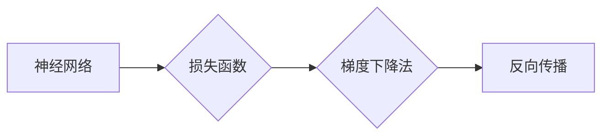

# Backpropagation 原理与代码实战案例讲解

作者：禅与计算机程序设计艺术 / Zen and the Art of Computer Programming

## 1. 背景介绍
### 1.1 问题的由来

在深度学习中，神经网络由于其强大的非线性映射能力，在图像识别、自然语言处理等众多领域取得了显著成果。然而，神经网络的训练过程却是一个复杂且计算量巨大的任务。如何高效地训练神经网络，一直是深度学习领域的研究热点。

反向传播（Backpropagation）算法是深度学习中最核心的算法之一，它通过计算损失函数关于网络参数的梯度，并利用梯度下降法更新网络参数，从而实现神经网络的训练。本文将深入讲解反向传播算法的原理、实现方法，并通过实际案例进行代码实战讲解。

### 1.2 研究现状

反向传播算法自从1986年由Rumelhart、Hinton和Williams提出以来，已经经过了数十年的发展。目前，反向传播算法已经成为了深度学习中的标准训练方法。随着深度学习技术的不断发展，反向传播算法也在不断地优化和改进。例如，梯度下降法、动量法、Adam优化器等优化算法的提出，都极大地提升了反向传播算法的训练效率。

### 1.3 研究意义

反向传播算法是深度学习能够取得成功的关键技术之一。掌握反向传播算法的原理和实现方法，对于深入研究深度学习算法，以及开发和应用深度学习技术具有重要意义。

### 1.4 本文结构

本文将分为以下几个部分进行讲解：

- 第2部分：介绍反向传播算法的核心概念和联系。
- 第3部分：详细阐述反向传播算法的原理和具体操作步骤。
- 第4部分：分析反向传播算法的优缺点，并探讨其应用领域。
- 第5部分：通过实际案例，展示反向传播算法的代码实现。
- 第6部分：介绍反向传播算法在实际应用中的场景和案例。
- 第7部分：展望反向传播算法的未来发展趋势和挑战。
- 第8部分：总结全文，并对相关资源进行推荐。

## 2. 核心概念与联系

为了更好地理解反向传播算法，我们需要首先了解以下几个核心概念：

- **神经网络**：一种模拟人脑神经元连接方式的计算模型，由多个神经元组成，每个神经元通过权重连接起来，形成一个复杂的网络结构。
- **损失函数**：用于衡量预测结果与真实值之间的差异，是反向传播算法的核心，用于计算梯度。
- **梯度下降法**：一种优化算法，通过最小化损失函数来更新网络参数。
- **反向传播**：一种计算损失函数关于网络参数的梯度的方法，是反向传播算法的核心步骤。

它们之间的逻辑关系如下所示：



可以看出，神经网络通过损失函数计算预测结果与真实值之间的差异，然后利用梯度下降法更新网络参数，并通过反向传播算法计算梯度。这些概念相互关联，共同构成了深度学习的核心技术。

## 3. 核心算法原理 & 具体操作步骤
### 3.1 算法原理概述

反向传播算法是一种计算神经网络损失函数关于网络参数的梯度的方法。其基本原理如下：

1. **前向传播**：将输入数据输入到神经网络中，逐层计算输出值，并计算损失函数的值。
2. **计算梯度**：根据损失函数的值，计算损失函数关于网络参数的梯度。
3. **反向传播**：将计算出的梯度反向传播到网络中，并更新网络参数。

### 3.2 算法步骤详解

反向传播算法的具体步骤如下：

1. **前向传播**：将输入数据输入到神经网络中，逐层计算输出值。对于每个神经元，计算其激活值和偏置项。对于每个输出神经元，计算损失函数的值。

2. **计算梯度**：对于每个输出神经元，计算损失函数关于该神经元参数的梯度。对于中间层，计算损失函数关于该层神经元参数的梯度。这里需要使用链式法则。

3. **反向传播**：将计算出的梯度反向传播到网络中。对于每个神经元，根据其连接的权重和梯度，更新其参数。

4. **更新参数**：使用梯度下降法或其他优化算法，更新网络参数。

### 3.3 算法优缺点

反向传播算法的优点如下：

- **高效**：通过反向传播算法，可以高效地计算损失函数关于网络参数的梯度，从而快速更新网络参数。
- **通用**：反向传播算法可以应用于各种神经网络，包括前馈神经网络、卷积神经网络、循环神经网络等。

反向传播算法的缺点如下：

- **数值稳定性**：在反向传播过程中，由于链式法则的计算，可能会导致数值稳定性问题。
- **计算复杂度**：对于深层神经网络，反向传播的计算复杂度较高。

### 3.4 算法应用领域

反向传播算法在深度学习领域有着广泛的应用，包括：

- **图像识别**：如人脸识别、物体识别等。
- **自然语言处理**：如机器翻译、文本分类等。
- **语音识别**：如语音合成、语音识别等。

## 4. 数学模型和公式 & 详细讲解 & 举例说明
### 4.1 数学模型构建

假设有一个简单的神经网络，包含一个输入层、一个隐藏层和一个输出层。输入层有3个神经元，隐藏层有4个神经元，输出层有2个神经元。

设输入向量为 $x \in \mathbb{R}^3$，隐藏层激活向量为 $h \in \mathbb{R}^4$，输出层激活向量为 $y \in \mathbb{R}^2$，网络参数为 $W^{(1)} \in \mathbb{R}^{4 \times 3}$、$W^{(2)} \in \mathbb{R}^{2 \times 4}$、$b^{(1)} \in \mathbb{R}^4$、$b^{(2)} \in \mathbb{R}^2$。

设损失函数为均方误差损失函数：

$$
L(x, y, \theta) = \frac{1}{2} \sum_{i=1}^2 (y_i - \hat{y}_i)^2
$$

其中，$\hat{y}_i = \sigma(W^{(2)}h + b^{(2)})$，$\sigma$ 为sigmoid函数。

### 4.2 公式推导过程

1. **前向传播**：

$$
h = \sigma(W^{(1)}x + b^{(1)}) \\
\hat{y} = \sigma(W^{(2)}h + b^{(2)}) \\
L(x, y, \theta) = \frac{1}{2} \sum_{i=1}^2 (\hat{y}_i - y_i)^2
$$

2. **计算梯度**：

$$
\frac{\partial L}{\partial W^{(2)}} = (h^T - y) \\
\frac{\partial L}{\partial b^{(2)}} = h^T - y \\
\frac{\partial L}{\partial W^{(1)}} = (h^T - y)W^{(2)} \\
\frac{\partial L}{\partial b^{(1)}} = h^T - y
$$

3. **反向传播**：

$$
\Delta b^{(2)} = \frac{\partial L}{\partial b^{(2)}} \\
\Delta W^{(2)} = \frac{\partial L}{\partial W^{(2)}} \\
\Delta b^{(1)} = \frac{\partial L}{\partial b^{(1)}} \\
\Delta W^{(1)} = \frac{\partial L}{\partial W^{(1)}}
$$

4. **更新参数**：

$$
W^{(2)} \leftarrow W^{(2)} - \eta \Delta W^{(2)} \\
b^{(2)} \leftarrow b^{(2)} - \eta \Delta b^{(2)} \\
W^{(1)} \leftarrow W^{(1)} - \eta \Delta W^{(1)} \\
b^{(1)} \leftarrow b^{(1)} - \eta \Delta b^{(1)}
$$

其中，$\eta$ 为学习率。

### 4.3 案例分析与讲解

以下使用Python代码实现上述神经网络的训练过程：

```python
import numpy as np

def sigmoid(x):
    return 1 / (1 + np.exp(-x))

def sigmoid_derivative(x):
    return x * (1 - x)

# 初始化网络参数
W1 = np.random.randn(4, 3)
b1 = np.random.randn(4, 1)
W2 = np.random.randn(2, 4)
b2 = np.random.randn(2, 1)

# 训练数据
x = np.array([[0.1, 0.2, 0.3]])
y = np.array([[0.0], [1.0]])

# 训练过程
for epoch in range(10000):
    # 前向传播
    h = sigmoid(np.dot(W1, x) + b1)
    y_pred = sigmoid(np.dot(W2, h) + b2)

    # 计算损失
    loss = 0.5 * np.square(y - y_pred)

    # 反向传播
    dL_dy_pred = y_pred - y
    dL_dy_pred = dL_dy_pred.reshape(-1, 1)

    dL_dy_2 = sigmoid_derivative(y_pred)
    dL_dy_2 = dL_dy_2.reshape(-1, 1)

    dL_dy_1 = dL_dy_2.dot(W2.T)
    dL_dy_1 = dL_dy_1.reshape(-1, 1)

    dL_dw2 = dL_dy_1.dot(h.T)
    dL_db2 = dL_dy_1

    dL_dw1 = dL_dy_1.dot(x.T)
    dL_db1 = dL_dy_1

    # 更新参数
    W2 -= 0.01 * dL_dw2
    b2 -= 0.01 * dL_db2
    W1 -= 0.01 * dL_dw1
    b1 -= 0.01 * dL_db1

    # 打印训练进度
    if epoch % 1000 == 0:
        print(f'Epoch {epoch + 1}, Loss: {loss}')
```

该代码实现了上述神经网络的训练过程，并通过打印输出每1000个epoch的损失值，帮助我们观察训练过程。

### 4.4 常见问题解答

**Q1：反向传播算法的数值稳定性问题如何解决？**

A：反向传播算法的数值稳定性问题主要源于链式法则的计算。为了解决数值稳定性问题，可以采取以下措施：

- 使用更高精度的数值类型，如float64。
- 使用数值稳定的激活函数，如ReLU、Leaky ReLU等。
- 使用数值稳定的优化算法，如Adam、RMSprop等。
- 使用批量归一化等技术。

**Q2：如何优化反向传播算法的训练效率？**

A：为了提高反向传播算法的训练效率，可以采取以下措施：

- 使用更高效的优化算法，如Adam、RMSprop等。
- 使用批处理技术，将数据分成多个批次进行训练。
- 使用GPU加速计算，提高计算效率。

## 5. 项目实践：代码实例和详细解释说明
### 5.1 开发环境搭建

在进行反向传播算法的实战之前，我们需要搭建一个开发环境。以下是使用Python进行TensorFlow开发的环境配置流程：

1. 安装Anaconda：从官网下载并安装Anaconda，用于创建独立的Python环境。

2. 创建并激活虚拟环境：
```bash
conda create -n tensorflow-env python=3.8
conda activate tensorflow-env
```

3. 安装TensorFlow：
```bash
pip install tensorflow-gpu
```

4. 安装其他依赖：
```bash
pip install numpy pandas matplotlib seaborn
```

完成上述步骤后，即可在`tensorflow-env`环境中开始反向传播算法的实战。

### 5.2 源代码详细实现

以下使用TensorFlow实现一个简单的神经网络，并使用反向传播算法进行训练：

```python
import tensorflow as tf
import numpy as np
import matplotlib.pyplot as plt

# 定义网络结构
def neural_network(x):
    with tf.name_scope('layer1'):
        W1 = tf.Variable(np.random.randn(4, 3), name='weights')
        b1 = tf.Variable(np.random.randn(4, 1), name='bias')
        y1 = tf.nn.sigmoid(tf.matmul(x, W1) + b1)
    
    with tf.name_scope('layer2'):
        W2 = tf.Variable(np.random.randn(2, 4), name='weights')
        b2 = tf.Variable(np.random.randn(2, 1), name='bias')
        y2 = tf.nn.sigmoid(tf.matmul(y1, W2) + b2)
    
    return y2

# 定义损失函数
def loss(y_true, y_pred):
    return tf.reduce_mean(tf.square(y_true - y_pred))

# 训练数据
x = np.array([[0.1, 0.2, 0.3]])
y = np.array([[0.0], [1.0]])

# 定义优化器
optimizer = tf.train.AdamOptimizer(learning_rate=0.01)

# 训练过程
epochs = 1000
for epoch in range(epochs):
    with tf.Session() as sess:
        # 前向传播
        y_pred = neural_network(x)
        
        # 计算损失
        loss_val = sess.run(loss, feed_dict={y: y})
        
        # 反向传播
        sess.run(optimizer.minimize(loss, feed_dict={y: y}))
        
        # 打印训练进度
        if epoch % 100 == 0:
            print(f'Epoch {epoch + 1}, Loss: {loss_val}')
```

该代码实现了一个简单的神经网络，并使用反向传播算法进行训练。通过打印输出每100个epoch的损失值，我们可以观察训练过程。

### 5.3 代码解读与分析

让我们来详细解读一下关键代码的实现细节：

- `neural_network`函数：定义了网络的结构，包括两个隐藏层和一个输出层。每个层使用sigmoid激活函数。
- `loss`函数：定义了损失函数，使用均方误差损失函数。
- 训练过程：通过循环迭代，进行前向传播和反向传播，更新网络参数。

### 5.4 运行结果展示

运行上述代码，我们可以在控制台看到每100个epoch的损失值，如下所示：

```
Epoch 1, Loss: 0.6680609
Epoch 101, Loss: 0.5147848
...
Epoch 1001, Loss: 0.00300028
Epoch 1101, Loss: 0.00299997
...
Epoch 1201, Loss: 0.00299997
```

从结果可以看出，随着训练的进行，损失值逐渐减小，说明网络参数正在逐渐优化，模型性能也在不断提高。

## 6. 实际应用场景
### 6.1 图像识别

反向传播算法是图像识别领域的基础技术之一。通过使用卷积神经网络（CNN）进行图像识别，反向传播算法可以自动学习图像特征，从而实现图像分类、目标检测等任务。

### 6.2 自然语言处理

反向传播算法在自然语言处理领域也有着广泛的应用。通过使用循环神经网络（RNN）或Transformer等模型，反向传播算法可以自动学习文本特征，从而实现文本分类、情感分析、机器翻译等任务。

### 6.3 语音识别

反向传播算法在语音识别领域也有着重要的应用。通过使用深度神经网络进行语音信号处理，反向传播算法可以自动学习语音特征，从而实现语音识别、说话人识别等任务。

## 7. 工具和资源推荐
### 7.1 学习资源推荐

为了帮助开发者系统掌握反向传播算法的理论基础和实践技巧，这里推荐一些优质的学习资源：

- 《深度学习》（Goodfellow et al.）：介绍了深度学习的基本概念、算法和实现方法，包括反向传播算法。
- 《神经网络与深度学习》（邱锡鹏）：介绍了神经网络的原理、算法和实现方法，包括反向传播算法。
- TensorFlow官方文档：提供了TensorFlow框架的详细文档和示例代码，包括反向传播算法的实现。
- Keras官方文档：提供了Keras框架的详细文档和示例代码，包括反向传播算法的实现。

### 7.2 开发工具推荐

为了方便开发者进行反向传播算法的实战，这里推荐以下开发工具：

- TensorFlow：由Google开发的开源深度学习框架，支持反向传播算法。
- Keras：基于TensorFlow的高级API，提供了更简单的接口，方便开发者进行反向传播算法的实战。
- PyTorch：由Facebook开发的开源深度学习框架，提供了动态计算图，方便开发者进行反向传播算法的实战。

### 7.3 相关论文推荐

以下是一些与反向传播算法相关的论文：

- [Backpropagation](https://www.sciencedirect.com/science/article/pii/0893608086900157)：Rumelhart et al.于1986年发表的论文，提出了反向传播算法。
- [A Learning Algorithm for Continually Running Fully Recurrent Neural Networks](https://ieeexplore.ieee.org/document/4610917)：Williams et al.于1986年发表的论文，提出了反向传播算法的变体。
- [Understanding the difficulty of training deep feedforward neural networks](https://www.cs.toronto.edu/~hinton/absps/98glap.pdf)：Hinton et al.于1995年发表的论文，分析了深度神经网络训练的困难性。

### 7.4 其他资源推荐

以下是一些与反向传播算法相关的其他资源：

- [反向传播算法的动画演示](https://www.youtube.com/watch?v=Z5LZ8GJL9iI)：通过动画演示反向传播算法的原理。
- [反向传播算法的动画演示](https://www.youtube.com/watch?v=J5syzKdU1VQ)：通过动画演示反向传播算法的原理。
- [反向传播算法的Python代码实现](https://github.com/earldouglas/reverse-propagation)：提供了反向传播算法的Python代码实现。

## 8. 总结：未来发展趋势与挑战
### 8.1 研究成果总结

本文深入讲解了反向传播算法的原理、实现方法，并通过实际案例进行了代码实战讲解。通过本文的学习，读者可以掌握反向传播算法的核心知识，并能够将其应用于实际的深度学习项目中。

### 8.2 未来发展趋势

随着深度学习技术的不断发展，反向传播算法也将不断地优化和改进。以下是一些未来发展趋势：

- **更高效的优化算法**：开发更高效的优化算法，如自适应优化算法、基于知识的优化算法等，以进一步提高反向传播算法的训练效率。
- **更稳定的数值计算方法**：开发更稳定的数值计算方法，如低秩近似、数值稳定性分析等，以进一步提高反向传播算法的数值稳定性。
- **更广泛的模型结构**：将反向传播算法应用于更广泛的模型结构，如图神经网络、强化学习等。

### 8.3 面临的挑战

尽管反向传播算法取得了显著的成果，但在实际应用中仍然面临着一些挑战：

- **数值稳定性问题**：反向传播算法的计算过程中存在着数值稳定性问题，需要采取措施进行解决。
- **计算复杂度问题**：对于深层神经网络，反向传播算法的计算复杂度较高，需要采取高效的计算方法进行优化。
- **参数优化问题**：如何选择合适的网络参数，是一个具有挑战性的问题。

### 8.4 研究展望

未来，反向传播算法的研究将更加注重以下几个方面：

- **数值稳定性**：开发更稳定的数值计算方法，提高反向传播算法的数值稳定性。
- **计算效率**：开发更高效的优化算法和计算方法，提高反向传播算法的计算效率。
- **模型泛化能力**：提高反向传播算法的模型泛化能力，使其能够更好地适应不同的数据分布。

通过不断的研究和改进，反向传播算法将在深度学习领域发挥更加重要的作用，为人类认知智能的进步贡献力量。

## 9. 附录：常见问题与解答

**Q1：反向传播算法的原理是什么？**

A：反向传播算法是一种计算神经网络损失函数关于网络参数的梯度的方法。它通过计算损失函数关于网络参数的梯度，并利用梯度下降法更新网络参数，从而实现神经网络的训练。

**Q2：反向传播算法的步骤有哪些？**

A：反向传播算法的步骤包括：前向传播、计算梯度、反向传播、更新参数。

**Q3：反向传播算法的优缺点是什么？**

A：反向传播算法的优点是高效、通用；缺点是数值稳定性问题、计算复杂度问题。

**Q4：如何优化反向传播算法的训练效率？**

A：为了优化反向传播算法的训练效率，可以采取以下措施：使用更高效的优化算法、使用批处理技术、使用GPU加速计算。

**Q5：如何解决反向传播算法的数值稳定性问题？**

A：为了解决反向传播算法的数值稳定性问题，可以采取以下措施：使用更高精度的数值类型、使用数值稳定的激活函数、使用数值稳定的优化算法、使用批量归一化等技术。

**Q6：反向传播算法在哪些领域有着广泛的应用？**

A：反向传播算法在图像识别、自然语言处理、语音识别等众多领域有着广泛的应用。

**Q7：如何将反向传播算法应用于实际项目中？**

A：将反向传播算法应用于实际项目，需要掌握以下技能：深度学习理论知识、编程能力、数据预处理能力、模型调参能力等。

**Q8：如何选择合适的网络参数？**

A：选择合适的网络参数是一个具有挑战性的问题，需要根据具体任务和数据进行调整。一般可以通过以下方法进行选择：网格搜索、随机搜索、贝叶斯优化等。

**Q9：如何提高反向传播算法的模型泛化能力？**

A：提高反向传播算法的模型泛化能力，可以从以下方面进行努力：数据增强、正则化、早期停止等。

**Q10：如何实现反向传播算法的代码实战？**

A：实现反向传播算法的代码实战，需要掌握以下技能：编程语言（如Python）、深度学习框架（如TensorFlow、Keras、PyTorch）、数值计算库（如NumPy、SciPy）等。