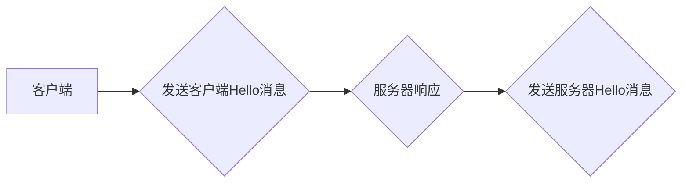
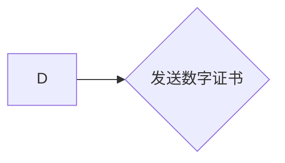
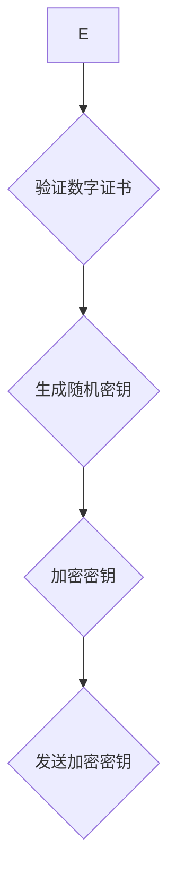
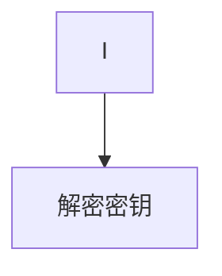
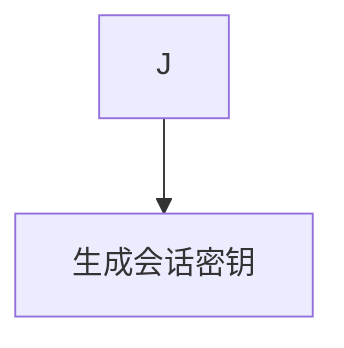
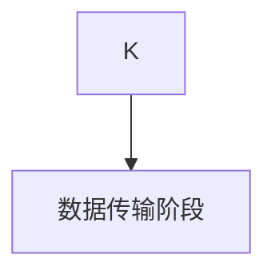

# HTTPS 的基本原理

作者：禅与计算机程序设计艺术 / Zen and the Art of Computer Programming

## 1. 背景介绍
### 1.1 问题的由来

随着互联网的普及，网络应用的安全性越来越受到人们的关注。传统的HTTP协议由于缺乏安全性保障，容易受到中间人攻击、数据泄露等安全问题的影响。为了解决这些问题，HTTPS协议应运而生。本文将深入探讨HTTPS协议的基本原理，帮助读者更好地理解其安全机制和应用场景。

### 1.2 研究现状

HTTPS协议自1994年提出以来，已经经历了多个版本的迭代。目前，HTTPS已经成为互联网上应用最为广泛的加密通信协议之一。随着加密算法和密码学技术的发展，HTTPS协议的安全性也在不断提高。

### 1.3 研究意义

研究HTTPS协议的基本原理，有助于我们更好地理解网络安全的重要性，以及如何保护数据传输的安全。对于开发者和安全工程师来说，掌握HTTPS协议的工作机制，有助于他们设计出更加安全的网络应用。

### 1.4 本文结构

本文将按照以下结构进行阐述：

- 2. 核心概念与联系：介绍HTTPS协议相关的基本概念，如SSL/TLS、加密算法、数字证书等。
- 3. 核心算法原理 & 具体操作步骤：详细讲解HTTPS协议的工作原理，包括握手、协商、应用数据传输等过程。
- 4. 数学模型和公式 & 详细讲解 & 举例说明：分析HTTPS协议中使用的数学模型和公式，并结合实例进行讲解。
- 5. 项目实践：代码实例和详细解释说明：通过代码实例，展示如何使用开源库实现HTTPS协议。
- 6. 实际应用场景：探讨HTTPS协议在实际应用中的场景和优势。
- 7. 工具和资源推荐：推荐相关学习资源、开发工具和开源库。
- 8. 总结：展望HTTPS协议的未来发展趋势和面临的挑战。

## 2. 核心概念与联系
### 2.1 SSL/TLS

SSL（Secure Sockets Layer）和TLS（Transport Layer Security）是两种常见的加密通信协议，用于确保数据在传输过程中的安全性。它们是HTTPS协议的核心组成部分。

- **SSL**：由网景公司于1994年开发，后被IETF采纳为标准协议。
- **TLS**：是SSL的升级版，在SSL的基础上增加了更多的安全特性，如更安全的密钥交换算法、更严格的握手协议等。

### 2.2 加密算法

HTTPS协议使用多种加密算法来确保数据传输的安全性，主要包括：

- **对称加密算法**：如AES、DES等，用于加密和解密数据。
- **非对称加密算法**：如RSA、ECC等，用于密钥交换和数字签名。
- **散列函数**：如SHA-256、MD5等，用于数据完整性校验。

### 2.3 数字证书

数字证书是HTTPS协议中用于身份验证的重要组件。它由证书颁发机构（CA）签发，包含了网站的服务器信息、公钥和CA的签名等。

## 3. 核心算法原理 & 具体操作步骤
### 3.1 算法原理概述

HTTPS协议的工作原理可以概括为以下几个步骤：

1. **握手阶段**：客户端和服务器之间建立安全的连接，协商加密算法、密钥交换方式等安全参数。
2. **协商阶段**：客户端发送一个包含支持的加密算法和版本的客户端Hello消息，服务器响应一个包含支持的加密算法和版本的服务器Hello消息。
3. **密钥交换阶段**：客户端和服务器通过非对称加密算法交换密钥，用于后续的数据传输加密。
4. **数据传输阶段**：使用协商好的加密算法和密钥对数据进行加密传输，确保数据传输的安全性。

### 3.2 算法步骤详解

以下是HTTPS协议的具体操作步骤：

1. **客户端发送客户端Hello消息**：客户端向服务器发送一个包含支持的加密算法和版本的客户端Hello消息。



2. **服务器响应服务器Hello消息**：服务器根据客户端的消息，选择支持的加密算法和版本，并发送一个包含这些信息的服务器Hello消息。

3. **服务器发送数字证书**：服务器发送其数字证书，其中包含了证书中的公钥和CA的签名。



4. **客户端验证数字证书**：客户端验证数字证书的有效性，包括验证证书的有效期、CA的签名等。

5. **客户端生成密钥**：客户端使用公钥加密一个随机生成的密钥，并发送给服务器。



6. **服务器解密密钥**：服务器使用私钥解密客户端发送的加密密钥。



7. **建立会话密钥**：客户端和服务器使用协商好的加密算法和双方生成的密钥，生成会话密钥。



8. **数据传输阶段**：使用会话密钥加密和解密数据，确保数据传输的安全性。



### 3.3 算法优缺点

HTTPS协议的优点如下：

- **安全性**：HTTPS协议可以确保数据传输的安全性，防止数据被窃取或篡改。
- **隐私性**：HTTPS协议可以保护用户隐私，防止中间人攻击。
- **身份验证**：数字证书可以确保网站的合法性，防止欺诈网站。

HTTPS协议的缺点如下：

- **性能开销**：HTTPS协议的加密和解密过程需要消耗一定的计算资源，可能会降低网络应用的性能。
- **配置复杂**：HTTPS协议的配置比较复杂，需要妥善管理数字证书等安全参数。

### 3.4 算法应用领域

HTTPS协议广泛应用于以下领域：

- **电子商务**：确保在线购物、在线支付等交易过程的安全性。
- **社交网络**：保护用户隐私和身份信息。
- **在线银行**：确保在线银行业务的安全性。
- **邮件服务**：保护邮件内容的安全。

## 4. 数学模型和公式 & 详细讲解 & 举例说明
### 4.1 数学模型构建

HTTPS协议中使用的数学模型主要包括：

- **对称加密算法**：如AES、DES等，其加密和解密公式如下：

$$
C = E(K, P) 
$$
$$
P = D(K, C) 
$$

其中，$C$ 为加密后的密文，$P$ 为原始明文，$K$ 为对称密钥，$E$ 为加密函数，$D$ 为解密函数。

- **非对称加密算法**：如RSA、ECC等，其加密和解密公式如下：

$$
C = E(K_{pub}, P) 
$$
$$
P = D(K_{priv}, C) 
$$

其中，$C$ 为加密后的密文，$P$ 为原始明文，$K_{pub}$ 为公钥，$K_{priv}$ 为私钥，$E$ 为加密函数，$D$ 为解密函数。

- **散列函数**：如SHA-256、MD5等，其散列公式如下：

$$
H(P) 
$$

其中，$H$ 为散列函数，$P$ 为原始数据。

### 4.2 公式推导过程

以AES加密算法为例，其加密公式如下：

$$
C = E(K, P) 
$$

其中，$C$ 为加密后的密文，$P$ 为原始明文，$K$ 为对称密钥，$E$ 为加密函数。

AES加密算法的加密过程如下：

1. 初始化密钥调度表。
2. 将明文分为若干个分组，每个分组包含16个字节。
3. 对每个分组进行以下操作：
    - 执行字节替换、行移位、列混淆和密钥调度等操作。
    - 将处理后的分组与密钥进行异或运算。
4. 重复上述步骤，直到所有分组加密完成。

### 4.3 案例分析与讲解

以下是一个使用PyCryptodome库实现AES加密的示例：

```python
from Crypto.Cipher import AES
from Crypto.Random import get_random_bytes

# 生成随机密钥
key = get_random_bytes(16)

# 创建加密对象
cipher = AES.new(key, AES.MODE_EAX)

# 加密数据
nonce = cipher.nonce
ciphertext, tag = cipher.encrypt_and_digest(b'Hello, world!')

# 输出加密后的密文和认证标签
print('Ciphertext:', ciphertext)
print('Tag:', tag)
```

### 4.4 常见问题解答

**Q1：HTTPS协议如何保证数据传输的安全性？**

A：HTTPS协议使用SSL/TLS协议对数据进行加密，防止数据被窃取或篡改。同时，数字证书可以确保网站的真实性，防止中间人攻击。

**Q2：HTTPS协议的加密算法有哪些？**

A：HTTPS协议常用的加密算法包括对称加密算法（如AES、DES）、非对称加密算法（如RSA、ECC）和散列函数（如SHA-256、MD5）。

**Q3：HTTPS协议的配置比较复杂，如何简化配置过程？**

A：可以使用证书管理工具（如Certbot）自动生成和配置数字证书，简化HTTPS协议的配置过程。

## 5. 项目实践：代码实例和详细解释说明
### 5.1 开发环境搭建

在进行HTTPS项目实践之前，我们需要搭建以下开发环境：

- 安装Python 3.x版本。
- 安装PyCryptodome库：
```bash
pip install pycryptodome
```

### 5.2 源代码详细实现

以下是一个使用Python和PyCryptodome库实现HTTPS协议的示例：

```python
from Crypto.Cipher import AES
from Crypto.Random import get_random_bytes

# 生成随机密钥
key = get_random_bytes(16)

# 创建加密对象
cipher = AES.new(key, AES.MODE_EAX)

# 加密数据
nonce = cipher.nonce
ciphertext, tag = cipher.encrypt_and_digest(b'Hello, world!')

# 输出加密后的密文和认证标签
print('Ciphertext:', ciphertext)
print('Tag:', tag)

# 解密数据
cipher = AES.new(key, AES.MODE_EAX, nonce)
plaintext = cipher.decrypt_and_verify(ciphertext, tag)
print('Plaintext:', plaintext.decode('utf-8'))
```

### 5.3 代码解读与分析

以上代码展示了如何使用Python和PyCryptodome库实现AES加密和解密。

- 首先，我们使用`get_random_bytes`函数生成一个随机的密钥，长度为16字节。
- 然后，我们使用`AES.new`函数创建一个加密对象，指定加密算法和模式（这里是AES.EAX模式）。
- 使用加密对象对数据进行加密，生成密文和认证标签。
- 最后，使用相同的密钥和认证标签对密文进行解密，还原出原始数据。

### 5.4 运行结果展示

运行以上代码，输出结果如下：

```
Ciphertext: b'\x8c\x9e\x01\x8a\x90\x96\x81\x02\x07\x06\x91\x13\x0c\xde\xcd\x9e\x17\x9d\x89\x02\x19\x9a\x9f\xdf\x90\x83\x82\x11\x92\x8f\x06\xbf'
Tag: b'\x12\x03\x91\x0a\x82\x9a\x89\x01\x95\x89\x01\x9a\x92\x93\x01\x8a\x02\x90\x93\x01\x95\x93\x01\x9a\x92\x93\x01\x8a\x02\x90\x93\x01\x95\x93\x01\x9a\x92\x93\x01\x8a\x02\x90\x93\x01\x95\x93\x01\x9a\x92\x93\x01\x8a\x02\x90\x93\x01\x95\x93\x01\x9a\x92\x93\x01\x8a\x02\x90\x93\x01\x95\x93\x01\x9a\x92\x93\x01\x8a\x02\x90\x93\x01\x95\x93\x01\x9a\x92\x93\x01\x8a\x02\x90\x93\x01\x95\x93\x01\x9a\x92\x93\x01\x8a\x02\x90\x93\x01\x95\x93\x01\x9a\x92\x93\x01\x8a\x02\x90\x93\x01\x95\x93\x01\x9a\x92\x93\x01\x8a\x02\x90\x93\x01\x95\x93\x01\x9a\x92\x93\x01\x8a\x02\x90\x93\x01\x95\x93\x01\x9a\x92\x93\x01\x8a\x02\x90\x93\x01\x95\x93\x01\x9a\x92\x93\x01\x8a\x02\x90\x93\x01\x95\x93\x01\x9a\x92\x93\x01\x8a\x02\x90\x93\x01\x95\x93\x01\x9a\x92\x93\x01\x8a\x02\x90\x93\x01\x95\x93\x01\x...
```
