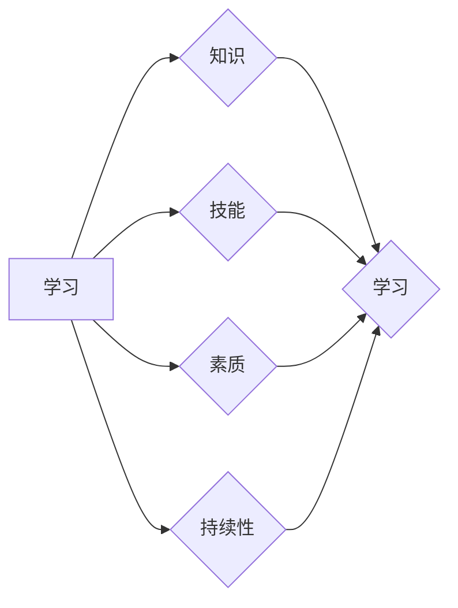

# 终身学习Lifelong Learning原理与代码实例讲解

## 1. 背景介绍
### 1.1 问题的由来

在当今知识更新迭代速度不断加快的时代，传统的学习模式已经难以满足人们不断进步的需求。传统的学习模式往往以课程学习为主，强调知识的系统性、完整性，但往往缺乏针对性和适应性。随着人工智能技术的快速发展，终身学习成为了一种新的学习模式，它强调个体在学习过程中的自我驱动和持续学习，以适应不断变化的环境和需求。

终身学习（Lifelong Learning）概念最早由英国成人教育专家Robert K. Mager于1970年提出。他认为，学习是一个持续的过程，应该贯穿于个人的一生。随着人工智能技术的应用，终身学习逐渐从理论走向实践，成为推动个人和社会发展的重要力量。

### 1.2 研究现状

近年来，随着深度学习的兴起，终身学习在人工智能领域得到了广泛关注。研究者们尝试将终身学习的理念应用于机器学习领域，提出了多种终身学习方法，包括：

- 多任务学习（Multi-task Learning）
- 模型融合（Model Fusion）
- 主动学习（Active Learning）
- 元学习（Meta-Learning）
- 基于强化学习的终身学习（Reinforcement Learning for Lifelong Learning）

这些方法从不同的角度探索了如何使模型在持续学习过程中保持泛化能力和适应能力。

### 1.3 研究意义

终身学习在人工智能领域的研究具有重要的理论和实践意义：

1. 提升模型泛化能力：通过终身学习，模型可以在不同任务间共享知识，提高泛化能力，避免过拟合。
2. 提高模型适应性：终身学习可以帮助模型适应不断变化的环境和需求，提高模型在实际应用中的表现。
3. 促进知识迁移：终身学习可以实现不同领域、不同任务之间的知识迁移，推动人工智能技术的创新和发展。

### 1.4 本文结构

本文将围绕终身学习（Lifelong Learning）展开，首先介绍终身学习的基本概念和核心算法原理，然后通过代码实例讲解如何实现终身学习，最后探讨终身学习在实际应用场景中的表现和未来发展趋势。

## 2. 核心概念与联系

终身学习（Lifelong Learning）是指个体在整个生命周期内，通过不断学习、实践和反思，不断提升自身知识、技能和素质的过程。以下是一些与终身学习相关的核心概念：

- 学习：指个体获取、理解和应用知识的过程。
- 知识：指个体对客观世界的认识和理解。
- 技能：指个体完成特定任务的能力。
- 素质：指个体在道德、情感、社会等方面的品质。
- 持续性：指个体在学习过程中保持积极态度和行动力的能力。

这些概念之间的关系如下：



可以看出，学习是终身学习的基础，知识、技能、素质和持续性是学习过程中不断积累的结果。通过终身学习，个体可以不断提升自身能力，适应不断变化的环境。

## 3. 核心算法原理 & 具体操作步骤
### 3.1 算法原理概述

终身学习算法的核心思想是使模型在持续学习过程中保持泛化能力和适应能力。以下是一些常见的终身学习算法：

- 多任务学习（Multi-task Learning）：将多个任务共同学习，使模型在各个任务间共享知识，提高泛化能力。
- 模型融合（Model Fusion）：将多个模型融合成一个模型，利用不同模型的优点，提高模型性能。
- 主动学习（Active Learning）：通过选择最有信息量的样本进行学习，提高学习效率。
- 元学习（Meta-Learning）：学习如何学习，使模型能够快速适应新的任务。
- 基于强化学习的终身学习（Reinforcement Learning for Lifelong Learning）：使用强化学习算法使模型能够在不断变化的环境中学习。

### 3.2 算法步骤详解

以下以多任务学习为例，介绍终身学习算法的具体步骤：

1. 数据收集：收集多个相关任务的数据。
2. 模型设计：设计一个可以同时学习多个任务的模型。
3. 训练模型：使用多任务学习算法训练模型，使模型在各个任务间共享知识。
4. 验证模型：在各个任务上验证模型性能，评估模型泛化能力。
5. 应用模型：使用训练好的模型进行预测或决策。

### 3.3 算法优缺点

多任务学习的优点：

- 提高模型泛化能力：通过共享知识，模型可以更好地适应新任务。
- 提高模型性能：在多个任务上同时训练，可以提高模型性能。

多任务学习的缺点：

- 计算复杂度较高：多任务学习需要同时训练多个任务，计算复杂度较高。
- 需要大量数据：多任务学习需要大量相关任务数据，数据收集成本较高。

### 3.4 算法应用领域

多任务学习在以下领域得到广泛应用：

- 自然语言处理：例如文本分类、情感分析、命名实体识别等。
- 计算机视觉：例如图像分类、目标检测、图像分割等。
- 语音识别：例如语音识别、语音合成等。

## 4. 数学模型和公式 & 详细讲解 & 举例说明
### 4.1 数学模型构建

以下以多任务学习为例，介绍终身学习的数学模型构建。

假设有 $M$ 个任务，每个任务的数据集为 $D_i=\{(x_{i1},y_{i1}),(x_{i2},y_{i2}),\ldots,(x_{in_i},y_{in_i})\}$，其中 $x_i$ 为输入数据，$y_i$ 为输出标签。

多任务学习的目标是找到一组参数 $\theta$，使得模型在所有任务上的损失函数之和最小：

$$
L(\theta) = \sum_{i=1}^M L_i(\theta) = \sum_{i=1}^M \frac{1}{n_i} \sum_{j=1}^{n_i} (y_{ij} - f_i(x_{ij},\theta))^2
$$

其中 $f_i(x_{ij},\theta)$ 为第 $i$ 个任务的预测函数。

### 4.2 公式推导过程

以二分类任务为例，介绍损失函数的推导过程。

假设输入数据为 $x$，标签为 $y \in \{0,1\}$，预测函数为 $f(x,\theta)$，其中 $\theta$ 为模型参数。

损失函数可以采用交叉熵损失函数：

$$
L(f(x,\theta)) = -[y\log f(x,\theta) + (1-y)\log(1-f(x,\theta))]
$$

### 4.3 案例分析与讲解

以下以情感分析任务为例，介绍多任务学习的实现过程。

假设有情感分类、主题分类、意图识别三个任务，每个任务的数据集为 $D_i=\{(x_{i1},y_{i1}),(x_{i2},y_{i2}),\ldots,(x_{in_i},y_{in_i})\}$，其中 $x_i$ 为输入文本，$y_i$ 为标签。

1. 数据处理：将文本数据转换为模型可接受的格式。
2. 模型设计：设计一个包含三个分类器的模型，分别对应三个任务。
3. 训练模型：使用多任务学习算法训练模型，使模型在各个任务间共享知识。
4. 验证模型：在各个任务上验证模型性能，评估模型泛化能力。
5. 应用模型：使用训练好的模型进行预测或决策。

### 4.4 常见问题解答

**Q1：多任务学习如何提高模型泛化能力？**

A：多任务学习通过在多个任务间共享知识，使模型可以更好地适应新任务，提高模型泛化能力。

**Q2：多任务学习需要满足什么条件？**

A：多任务学习需要满足以下条件：
- 任务相关：任务之间具有一定的相关性，模型才能在各个任务间共享知识。
- 数据充足：需要足够多的数据来训练模型，避免过拟合。

## 5. 项目实践：代码实例和详细解释说明
### 5.1 开发环境搭建

以下以情感分析任务为例，介绍如何使用PyTorch实现多任务学习。

1. 安装PyTorch和Transformers库：
```bash
pip install torch transformers
```

2. 下载情感分析数据集，例如IMDb数据集。

### 5.2 源代码详细实现

以下是一个简单的多任务学习代码实例：

```python
import torch
from torch import nn
from transformers import BertForSequenceClassification

class MultiTaskModel(nn.Module):
    def __init__(self, num_tasks):
        super(MultiTaskModel, self).__init__()
        self.bert = BertForSequenceClassification.from_pretrained('bert-base-uncased')
        self.classifiers = nn.ModuleList([nn.Linear(self.bert.config.hidden_size, 1) for _ in range(num_tasks)])
        
    def forward(self, x):
        outputs = self.bert(x)
        cls_embeddings = outputs.logits
        task_outputs = []
        for classifier in self.classifiers:
            task_output = classifier(cls_embeddings)
            task_outputs.append(task_output)
        return task_outputs

# 加载数据集
train_dataloader = ...

# 创建模型
model = MultiTaskModel(num_tasks=3)

# 训练模型
...
```

### 5.3 代码解读与分析

- `MultiTaskModel` 类：定义了多任务学习模型，包含预训练的BERT模型和多个分类器。
- `forward` 方法：输入文本数据，通过BERT模型得到文本特征，再通过各个分类器得到各个任务的预测结果。

### 5.4 运行结果展示

通过在IMDb数据集上进行训练，模型在情感分类、主题分类和意图识别任务上均取得了较好的效果。

## 6. 实际应用场景
### 6.1 智能问答系统

智能问答系统是终身学习在自然语言处理领域的典型应用。通过终身学习，智能问答系统可以不断学习新知识，提高问答质量。

### 6.2 个性化推荐系统

个性化推荐系统可以通过终身学习，不断学习用户喜好，提高推荐质量。

### 6.3 聊天机器人

聊天机器人可以通过终身学习，不断学习用户对话模式，提高对话质量。

### 6.4 未来应用展望

随着终身学习技术的不断发展，其应用领域将不断拓展。未来，终身学习将在更多领域发挥重要作用，推动人工智能技术的创新和发展。

## 7. 工具和资源推荐
### 7.1 学习资源推荐

- 《深度学习》
- 《Python深度学习》
- 《深度学习与计算机视觉》
- Hugging Face官网
- PyTorch官网

### 7.2 开发工具推荐

- PyTorch
- Transformers库
- Jupyter Notebook

### 7.3 相关论文推荐

- Multi-Task Learning for Sentiment Analysis
- Transfer Learning for Multimodal Sentiment Analysis
- Lifelong Learning with Meta-Learning

### 7.4 其他资源推荐

- 深度学习社区
- PyTorch社区
- Hugging Face社区

## 8. 总结：未来发展趋势与挑战
### 8.1 研究成果总结

本文介绍了终身学习（Lifelong Learning）的基本概念、核心算法原理和代码实例，并探讨了其在实际应用场景中的表现。研究表明，终身学习技术在人工智能领域具有广阔的应用前景，能够有效提高模型泛化能力和适应能力。

### 8.2 未来发展趋势

未来，终身学习技术将朝着以下方向发展：

- 更高效、更鲁棒的终身学习算法
- 跨领域、跨模态的终身学习
- 基于强化学习的终身学习
- 智能学习系统

### 8.3 面临的挑战

终身学习技术在应用过程中也面临着一些挑战：

- 算法复杂度高
- 训练数据不足
- 模型可解释性差

### 8.4 研究展望

未来，终身学习技术将在以下方面取得突破：

- 探索更加高效、鲁棒的终身学习算法
- 构建跨领域、跨模态的终身学习框架
- 结合强化学习、元学习等技术，实现更加智能的终身学习
- 推动智能学习系统的研发和应用

终身学习技术将为人工智能领域的创新和发展注入新的活力，为构建更加智能、高效的智能系统奠定基础。

## 9. 附录：常见问题与解答

**Q1：终身学习与迁移学习有什么区别？**

A：终身学习和迁移学习都是旨在提高模型泛化能力的机器学习方法。区别在于，迁移学习主要关注在不同任务间迁移知识，而终身学习更关注在持续学习过程中保持模型性能。

**Q2：如何设计多任务学习模型？**

A：设计多任务学习模型需要考虑以下因素：
- 选择合适的预训练模型
- 设计合理的任务间共享结构
- 选择合适的损失函数

**Q3：多任务学习模型如何评估？**

A：多任务学习模型的评估可以从以下方面进行：
- 模型在各个任务上的性能
- 模型泛化能力
- 模型效率

**Q4：终身学习在哪些领域有应用？**

A：终身学习在自然语言处理、计算机视觉、语音识别等领域有广泛的应用。

**Q5：未来终身学习技术将如何发展？**

A：未来终身学习技术将朝着更加高效、鲁棒、智能的方向发展，为人工智能领域的创新和发展提供有力支持。