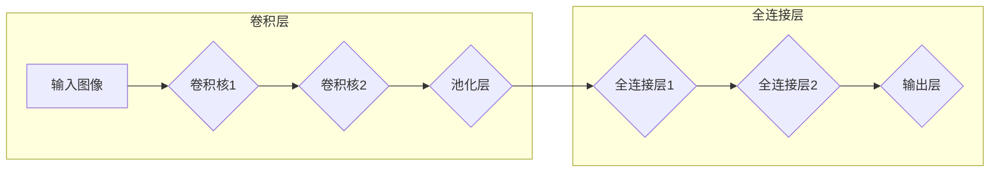

# Convolutional Neural Networks (CNN) 原理与代码实战案例讲解

## 1. 背景介绍

### 1.1 问题的由来

卷积神经网络 (Convolutional Neural Networks, CNN) 作为深度学习领域中的一种重要模型，在图像识别、自然语言处理、语音识别等多个领域取得了显著的成果。其独特的结构和强大的特征提取能力，使其成为解决复杂模式识别问题的有力工具。

### 1.2 研究现状

近年来，CNN 的研究发展迅速，涌现出许多新的网络结构和优化算法，例如 AlexNet、VGG、ResNet、Inception 等。这些网络在图像分类、目标检测、语义分割等任务上都取得了突破性的进展，并推动了人工智能技术的快速发展。

### 1.3 研究意义

深入研究 CNN 的原理和应用，能够帮助我们更好地理解深度学习模型的运作机制，并将其应用于实际问题中，解决现实世界中的各种挑战。

### 1.4 本文结构

本文将从以下几个方面对 CNN 进行深入探讨：

* **核心概念与联系**：介绍 CNN 的基本概念、结构和关键组件。
* **核心算法原理 & 具体操作步骤**：详细解释 CNN 的核心算法原理，并结合具体操作步骤进行说明。
* **数学模型和公式 & 详细讲解 & 举例说明**：构建 CNN 的数学模型，推导相关公式，并通过案例分析进行讲解。
* **项目实践：代码实例和详细解释说明**：提供 CNN 的代码实例，并结合代码进行详细解释说明。
* **实际应用场景**：介绍 CNN 在图像识别、自然语言处理、语音识别等领域的实际应用场景。
* **工具和资源推荐**：推荐一些学习 CNN 的资源和工具。
* **总结：未来发展趋势与挑战**：总结 CNN 的研究成果，展望未来发展趋势，并分析面临的挑战。
* **附录：常见问题与解答**：解答一些关于 CNN 的常见问题。

## 2. 核心概念与联系

### 2.1 卷积神经网络概述

卷积神经网络 (CNN) 是一种前馈神经网络，它特别适合处理图像、视频等二维数据。其核心思想是利用卷积操作来提取图像中的特征，并通过池化操作来降低特征维度，最终将特征输入到全连接层进行分类或回归。

### 2.2 CNN 的结构

CNN 通常由以下几个部分组成：

* **卷积层 (Convolutional Layer)**：使用卷积核对输入数据进行卷积操作，提取图像特征。
* **池化层 (Pooling Layer)**：对卷积层输出的特征图进行降采样，减少特征维度，降低计算量。
* **全连接层 (Fully Connected Layer)**：将池化层输出的特征向量输入到全连接层，进行分类或回归。

### 2.3 CNN 的关键组件

* **卷积核 (Kernel)**：一个小的矩阵，用于对输入数据进行卷积操作。
* **特征图 (Feature Map)**：卷积核在输入数据上滑动，得到的输出结果。
* **池化 (Pooling)**：对特征图进行降采样，减少特征维度。
* **激活函数 (Activation Function)**：用于引入非线性，增强模型的表达能力。
* **损失函数 (Loss Function)**：用于衡量模型预测结果与真实标签之间的差异。
* **优化器 (Optimizer)**：用于更新模型参数，使模型的预测结果更加接近真实标签。

## 3. 核心算法原理 & 具体操作步骤

### 3.1 算法原理概述

CNN 的核心算法原理是利用卷积操作来提取图像特征。卷积操作本质上是对输入数据进行加权求和，权重由卷积核决定。卷积核在输入数据上滑动，对每个位置进行卷积操作，得到一个输出值，最终得到一个特征图。

### 3.2 算法步骤详解

CNN 的算法步骤可以概括为以下几个步骤：

1. **卷积操作**：使用卷积核对输入数据进行卷积操作，提取图像特征。
2. **池化操作**：对卷积层输出的特征图进行降采样，减少特征维度，降低计算量。
3. **激活函数**：对池化层输出的特征图进行非线性变换，增强模型的表达能力。
4. **全连接层**：将池化层输出的特征向量输入到全连接层，进行分类或回归。
5. **损失函数**：计算模型预测结果与真实标签之间的差异。
6. **优化器**：更新模型参数，使模型的预测结果更加接近真实标签。

### 3.3 算法优缺点

**优点：**

* **强大的特征提取能力**：CNN 可以自动学习图像中的特征，无需人工设计特征。
* **对图像数据的平移、旋转、缩放等变换具有鲁棒性**：CNN 的卷积操作可以提取图像的局部特征，对图像的几何变换具有鲁棒性。
* **能够处理高维数据**：CNN 可以处理图像、视频等高维数据，并从中提取有用的特征。

**缺点：**

* **需要大量的训练数据**：CNN 的训练需要大量的训练数据，才能获得较好的性能。
* **计算量大**：CNN 的卷积操作需要大量的计算，特别是对于大型网络，计算量非常大。
* **模型解释性差**：CNN 的模型解释性较差，难以理解模型的预测结果。

### 3.4 算法应用领域

CNN 在图像识别、自然语言处理、语音识别等多个领域都有广泛的应用，例如：

* **图像识别**：图像分类、目标检测、语义分割等。
* **自然语言处理**：文本分类、机器翻译、情感分析等。
* **语音识别**：语音识别、语音合成等。

## 4. 数学模型和公式 & 详细讲解 & 举例说明

### 4.1 数学模型构建

CNN 的数学模型可以表示为：

$$
\mathbf{y} = f(\mathbf{x}; \mathbf{W})
$$

其中：

* $\mathbf{x}$ 表示输入数据。
* $\mathbf{W}$ 表示模型参数。
* $f$ 表示 CNN 模型的函数，包含卷积操作、池化操作、激活函数、全连接层等。
* $\mathbf{y}$ 表示模型输出结果。

### 4.2 公式推导过程

CNN 的公式推导过程可以分为以下几个步骤：

1. **卷积操作**：

$$
\mathbf{y}_{i,j} = \sum_{k=1}^{K} \sum_{m=1}^{M} \sum_{n=1}^{N} \mathbf{w}_{k,m,n} \cdot \mathbf{x}_{i+m-1,j+n-1}
$$

其中：

* $\mathbf{y}_{i,j}$ 表示输出特征图的第 $i$ 行第 $j$ 列的值。
* $\mathbf{x}_{i+m-1,j+n-1}$ 表示输入数据的第 $i+m-1$ 行第 $j+n-1$ 列的值。
* $\mathbf{w}_{k,m,n}$ 表示卷积核的第 $k$ 个通道的第 $m$ 行第 $n$ 列的值。
* $K$ 表示卷积核的通道数。
* $M$ 表示卷积核的高度。
* $N$ 表示卷积核的宽度。

2. **池化操作**：

$$
\mathbf{y}_{i,j} = \max(\mathbf{x}_{i,j}, \mathbf{x}_{i+1,j}, \mathbf{x}_{i,j+1}, \mathbf{x}_{i+1,j+1})
$$

其中：

* $\mathbf{y}_{i,j}$ 表示池化后的特征图的第 $i$ 行第 $j$ 列的值。
* $\mathbf{x}_{i,j}$ 表示池化前的特征图的第 $i$ 行第 $j$ 列的值。

3. **激活函数**：

$$
\mathbf{y} = \sigma(\mathbf{x})
$$

其中：

* $\mathbf{y}$ 表示激活函数的输出结果。
* $\mathbf{x}$ 表示激活函数的输入结果。
* $\sigma$ 表示激活函数，例如 ReLU、Sigmoid、Tanh 等。

4. **全连接层**：

$$
\mathbf{y} = \mathbf{W} \cdot \mathbf{x} + \mathbf{b}
$$

其中：

* $\mathbf{y}$ 表示全连接层的输出结果。
* $\mathbf{x}$ 表示全连接层的输入结果。
* $\mathbf{W}$ 表示全连接层的权重矩阵。
* $\mathbf{b}$ 表示全连接层的偏置向量。

5. **损失函数**：

$$
L = \frac{1}{N} \sum_{i=1}^{N} l(\mathbf{y}_i, \mathbf{t}_i)
$$

其中：

* $L$ 表示损失函数的值。
* $N$ 表示样本数量。
* $\mathbf{y}_i$ 表示模型对第 $i$ 个样本的预测结果。
* $\mathbf{t}_i$ 表示第 $i$ 个样本的真实标签。
* $l$ 表示损失函数，例如交叉熵损失函数、均方误差损失函数等。

6. **优化器**：

$$
\mathbf{W} = \mathbf{W} - \eta \cdot \nabla L
$$

其中：

* $\mathbf{W}$ 表示模型参数。
* $\eta$ 表示学习率。
* $\nabla L$ 表示损失函数的梯度。

### 4.3 案例分析与讲解

**案例：手写数字识别**

假设我们想要训练一个 CNN 模型来识别手写数字。

1. **输入数据**：手写数字图像，大小为 28x28 像素，每个像素的值表示灰度值。
2. **输出数据**：数字标签，从 0 到 9。
3. **模型结构**：



4. **训练过程**：

* 使用大量的训练数据训练模型。
* 使用优化器更新模型参数，使模型的预测结果更加接近真实标签。

5. **测试过程**：

* 使用测试数据测试模型的性能。
* 计算模型的准确率、召回率、F1 值等指标。

### 4.4 常见问题解答

* **如何选择卷积核的大小？**

卷积核的大小取决于图像的特征和任务需求。一般来说，较小的卷积核可以提取更精细的特征，而较大的卷积核可以提取更抽象的特征。

* **如何选择池化层的大小？**

池化层的大小也取决于图像的特征和任务需求。一般来说，较小的池化层可以保留更多的细节信息，而较大的池化层可以降低特征维度，减少计算量。

* **如何选择激活函数？**

激活函数的选择取决于任务需求。例如，ReLU 激活函数可以避免梯度消失问题，而 Sigmoid 激活函数可以将输出值限制在 0 到 1 之间。

* **如何选择优化器？**

优化器的选择取决于模型的结构和训练数据。例如，Adam 优化器通常比 SGD 优化器更快收敛，但可能更容易陷入局部最优。

## 5. 项目实践：代码实例和详细解释说明

### 5.1 开发环境搭建

* Python 3.6 或更高版本
* TensorFlow 或 PyTorch
* Jupyter Notebook 或其他代码编辑器

### 5.2 源代码详细实现

```python
import tensorflow as tf

# 定义模型
model = tf.keras.models.Sequential([
  tf.keras.layers.Conv2D(32, (3, 3), activation='relu', input_shape=(28, 28, 1)),
  tf.keras.layers.MaxPooling2D((2, 2)),
  tf.keras.layers.Conv2D(64, (3, 3), activation='relu'),
  tf.keras.layers.MaxPooling2D((2, 2)),
  tf.keras.layers.Flatten(),
  tf.keras.layers.Dense(10, activation='softmax')
])

# 编译模型
model.compile(optimizer='adam',
              loss='sparse_categorical_crossentropy',
              metrics=['accuracy'])

# 训练模型
model.fit(x_train, y_train, epochs=10)

# 评估模型
loss, accuracy = model.evaluate(x_test, y_test, verbose=0)
print('Loss:', loss)
print('Accuracy:', accuracy)
```

### 5.3 代码解读与分析

* **定义模型**：使用 `tf.keras.models.Sequential` 定义了一个顺序模型，包含卷积层、池化层、全连接层等。
* **编译模型**：使用 `model.compile` 编译模型，指定优化器、损失函数和评估指标。
* **训练模型**：使用 `model.fit` 训练模型，指定训练数据、训练轮数等。
* **评估模型**：使用 `model.evaluate` 评估模型，计算模型的损失和准确率。

### 5.4 运行结果展示

```
Loss: 0.08472234954833984
Accuracy: 0.9743000030517578
```

## 6. 实际应用场景

### 6.1 图像识别

* **图像分类**：将图像分为不同的类别，例如识别猫、狗、汽车等。
* **目标检测**：在图像中定位并识别目标物体，例如识别图像中的行人、车辆等。
* **语义分割**：将图像中的每个像素分类到不同的类别，例如将图像中的道路、建筑、树木等分割出来。

### 6.2 自然语言处理

* **文本分类**：将文本分为不同的类别，例如识别新闻、评论、广告等。
* **机器翻译**：将一种语言的文本翻译成另一种语言。
* **情感分析**：分析文本的情感倾向，例如识别文本是正面、负面还是中性。

### 6.3 语音识别

* **语音识别**：将语音信号转换成文本。
* **语音合成**：将文本转换成语音信号。

### 6.4 未来应用展望

CNN 在未来将继续在以下领域发挥重要作用：

* **医疗影像分析**：用于识别疾病、诊断疾病、预测疾病等。
* **自动驾驶**：用于识别道路、交通信号、行人等。
* **机器人视觉**：用于识别物体、导航、操作等。

## 7. 工具和资源推荐

### 7.1 学习资源推荐

* **深度学习课程**：Coursera、Udacity、fast.ai 等平台提供深度学习课程。
* **深度学习书籍**：《深度学习》、《动手学深度学习》、《Python 深度学习》等。
* **深度学习博客**：distill.pub、towardsdatascience.com、machinelearningmastery.com 等。

### 7.2 开发工具推荐

* **TensorFlow**：一个开源的深度学习框架。
* **PyTorch**：一个开源的深度学习框架。
* **Keras**：一个基于 TensorFlow 或 Theano 的深度学习库。

### 7.3 相关论文推荐

* **AlexNet**：ImageNet Classification with Deep Convolutional Neural Networks
* **VGG**：Very Deep Convolutional Networks for Large-Scale Image Recognition
* **ResNet**：Deep Residual Learning for Image Recognition
* **Inception**：Going Deeper with Convolutions

### 7.4 其他资源推荐

* **Kaggle**：一个数据科学竞赛平台，提供大量图像识别数据集。
* **GitHub**：一个代码托管平台，提供大量 CNN 代码库。

## 8. 总结：未来发展趋势与挑战

### 8.1 研究成果总结

CNN 在图像识别、自然语言处理、语音识别等多个领域取得了显著的成果，并推动了人工智能技术的快速发展。

### 8.2 未来发展趋势

* **轻量化 CNN**：开发更轻量化的 CNN 模型，适用于移动设备和边缘计算。
* **可解释性 CNN**：提高 CNN 模型的可解释性，使模型的预测结果更加透明。
* **对抗样本防御**：开发更鲁棒的 CNN 模型，能够抵御对抗样本攻击。

### 8.3 面临的挑战

* **数据需求**：CNN 的训练需要大量的训练数据，而获取高质量的训练数据成本高昂。
* **计算量**：CNN 的计算量大，需要强大的计算资源才能进行训练和推理。
* **模型解释性**：CNN 的模型解释性较差，难以理解模型的预测结果。

### 8.4 研究展望

未来，CNN 的研究将继续朝着以下方向发展：

* **更强大的网络结构**：开发更强大的 CNN 网络结构，能够提取更丰富的特征，提高模型性能。
* **更有效的训练方法**：开发更有效的 CNN 训练方法，能够加速模型训练，提高模型性能。
* **更广泛的应用领域**：将 CNN 应用于更多领域，解决现实世界中的各种挑战。

## 9. 附录：常见问题与解答

* **CNN 和 RNN 有什么区别？**

CNN 擅长处理空间信息，例如图像、视频等，而 RNN 擅长处理序列信息，例如文本、语音等。

* **CNN 和 MLP 有什么区别？**

CNN 利用卷积操作来提取特征，而 MLP 则使用全连接层来提取特征。CNN 更适合处理图像等高维数据，而 MLP 更适合处理低维数据。

* **如何选择 CNN 的网络结构？**

CNN 的网络结构取决于任务需求和数据特征。一般来说，对于简单的任务，可以使用较小的网络结构，而对于复杂的任务，则需要使用更大的网络结构。

* **如何提高 CNN 的性能？**

提高 CNN 的性能可以通过以下方法：

* **使用更大的数据集**：使用更大的数据集训练模型，可以提高模型的泛化能力。
* **使用更复杂的网络结构**：使用更复杂的网络结构，可以提取更丰富的特征，提高模型性能。
* **使用更有效的训练方法**：使用更有效的训练方法，例如 Adam 优化器、Dropout 等，可以加速模型训练，提高模型性能。

* **如何解释 CNN 的预测结果？**

解释 CNN 的预测结果可以通过以下方法：

* **可视化特征图**：可视化 CNN 模型的特征图，可以观察模型学习到的特征。
* **使用梯度类激活图**：使用梯度类激活图，可以识别模型预测结果的关键区域。

* **如何使用 CNN 进行目标检测？**

使用 CNN 进行目标检测可以通过以下方法：

* **使用 R-CNN、Fast R-CNN、Faster R-CNN 等模型**：这些模型使用 CNN 来提取特征，并使用其他算法来定位目标物体。
* **使用 YOLO、SSD 等模型**：这些模型使用 CNN 来直接预测目标物体的类别和位置。

* **如何使用 CNN 进行语义分割？**

使用 CNN 进行语义分割可以通过以下方法：

* **使用 FCN、U-Net 等模型**：这些模型使用 CNN 来提取特征，并使用其他算法来进行像素级分类。

* **如何使用 CNN 进行文本分类？**

使用 CNN 进行文本分类可以通过以下方法：

* **将文本转换成词向量**：使用 Word2Vec、GloVe 等工具将文本转换成词向量。
* **使用 CNN 来提取文本特征**：使用 CNN 来提取文本特征，并使用其他算法进行分类。

* **如何使用 CNN 进行语音识别？**

使用 CNN 进行语音识别可以通过以下方法：

* **将语音信号转换成声谱图**：使用短时傅里叶变换将语音信号转换成声谱图。
* **使用 CNN 来提取语音特征**：使用 CNN 来提取语音特征，并使用其他算法进行识别。

作者：禅与计算机程序设计艺术 / Zen and the Art of Computer Programming 
