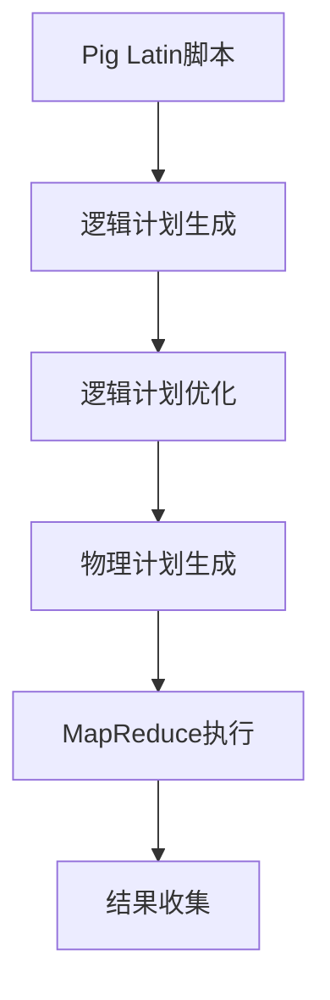

# Pig大规模数据分析平台原理与代码实例讲解

## 1. 背景介绍

### 1.1 问题的由来

在大数据时代,海量的结构化和非结构化数据不断产生和积累。传统的数据处理方式已经无法满足大规模数据分析的需求。如何高效、便捷地处理和分析大规模数据集成为当前企业和组织面临的重大挑战。

### 1.2 研究现状  

Apache Pig作为一种高级数据流语言,为大规模数据分析提供了一种简单、高效的解决方案。Pig可以在Apache Hadoop集群上运行,利用Hadoop的HDFS和MapReduce框架进行大规模数据处理和分析。Pig的出现大大降低了大数据分析的门槛,使得数据分析师和开发人员无需直接编写复杂的MapReduce程序,就能够快速编写数据分析脚本进行大规模数据处理。

### 1.3 研究意义

本文将深入探讨Pig大规模数据分析平台的核心原理和实现细节,包括Pig Latin语言、执行流程、优化策略等,并结合大量实践案例和代码示例,为读者提供全面的Pig学习和应用指导。通过本文的学习,读者将能够掌握Pig的使用方法,并利用Pig高效地处理和分析大规模数据集。

### 1.4 本文结构

本文共分为9个章节,首先介绍Pig的背景和意义,然后详细阐述Pig的核心概念、原理和算法,包括Pig Latin语言、执行流程、优化策略等。接下来通过数学模型和公式说明Pig的内在机制,并配以大量代码实例和详细解释。最后探讨Pig的实际应用场景、发展趋势和面临的挑战。

## 2. 核心概念与联系

Pig是一种基于Hadoop的大规模数据分析平台,主要包括以下核心概念:

1. **Pig Latin**:Pig的数据分析脚本语言,提供了一组丰富的操作符,用于描述复杂的数据处理流程。

2. **数据模型**:Pig采用关系型数据模型,所有数据都被组织为数据集(Bag)。

3. **执行流程**:Pig Latin脚本被转换为一系列的MapReduce任务,在Hadoop集群上并行执行。

4. **优化策略**:Pig内置了多种优化策略,如投影剪枝、MapReduce任务合并等,以提高执行效率。

5. **运行模式**:Pig支持本地和MapReduce两种运行模式,适用于不同的数据量级。

这些核心概念相互关联、协同工作,共同构建了Pig大规模数据分析平台。下面将对每个概念进行详细阐述。

## 3. 核心算法原理 & 具体操作步骤  

### 3.1 算法原理概述

Pig的核心算法原理可以概括为以下几个方面:

1. **Pig Latin解析**:将Pig Latin脚本解析为一系列的逻辑计划(Logical Plan)。

2. **逻辑计划优化**:对逻辑计划进行一系列的优化转换,如投影剪枝、Filter推导等。

3. **物理计划生成**:将优化后的逻辑计划转换为一个或多个MapReduce任务的物理计划。

4. **MapReduce执行**:将物理计划提交到Hadoop集群上执行,并行处理大规模数据集。

5. **结果收集**:从Hadoop集群收集MapReduce任务的输出结果。

该算法原理保证了Pig能够高效地将用户编写的Pig Latin脚本转换并执行于Hadoop集群之上。

### 3.2 算法步骤详解

1. **Pig Latin解析**

   Pig Latin解析器将Pig Latin脚本解析为一个逻辑计划树(Logical Plan),树中的每个节点代表一个关系运算符(如LOAD、FILTER、GROUP等)。

2. **逻辑计划优化**

   逻辑计划优化器对逻辑计划树进行一系列优化,以提高执行效率:

   - 投影剪枝:去除不需要的字段投影
   - Filter推导:将Filter操作尽可能下推
   - MapSide合并:合并连续的Map端操作
   - ReduceSide合并:合并连续的Reduce端操作

3. **物理计划生成**

   物理计划生成器将优化后的逻辑计划转换为一个或多个MapReduce任务的物理计划。每个MapReduce任务包含Map端和Reduce端的具体实现。

4. **MapReduce执行**  

   Pig将生成的物理计划提交到Hadoop集群上执行。MapReduce任务在集群上并行处理输入数据,生成中间结果。

5. **结果收集**

   MapReduce任务执行完毕后,Pig从HDFS上收集输出结果,并返回给用户。



### 3.3 算法优缺点

**优点:**

1. 简化了大数据处理流程,无需编写复杂的MapReduce程序。
2. 提供了丰富的数据处理操作符,支持复杂的数据分析需求。
3. 自动优化执行计划,提高了执行效率。
4. 良好的可扩展性,能够在大规模Hadoop集群上运行。

**缺点:**

1. 对于简单的数据处理任务,Pig的开销可能较大。
2. 对于需要跨多个MapReduce任务的复杂操作,性能可能受到影响。
3. 对于实时数据处理场景,Pig可能不太适合。

### 3.4 算法应用领域

Pig适用于以下大数据分析场景:

- 日志数据分析
- 网络数据挖掘
- 推荐系统
- 机器学习与数据挖掘
- 生物信息学数据分析
- ...

任何需要对大规模数据集进行ETL、统计分析、数据挖掘等操作的场景,都可以使用Pig作为数据处理和分析平台。

## 4. 数学模型和公式 & 详细讲解 & 举例说明

### 4.1 数学模型构建

Pig采用关系代数作为其数学基础模型。所有数据都被组织为关系(Relation),即数据集(Bag)。一个Bag由元组(Tuple)组成,每个元组包含多个字段(Field)。

可以使用下列数学符号对Pig的数据模型进行形式化描述:

- 设$R$为一个关系,即一个数据集
- $R = \{t_1, t_2, ..., t_n\}$,其中$t_i$为元组
- $t_i = \langle v_1, v_2, ..., v_m\rangle$,其中$v_j$为字段值

Pig支持标准的关系代数操作,如:

- 选择(Selection): $\sigma_{条件}(R)$
- 投影(Projection): $\pi_{字段列表}(R)$
- 并集(Union): $R_1 \cup R_2$
- 差集(Minus): $R_1 - R_2$
- 笛卡尔积(Cross Product): $R_1 \times R_2$
- ...

用户可以在Pig Latin中使用这些操作符对数据集进行转换和处理。

### 4.2 公式推导过程

以WordCount(单词计数)为例,推导MapReduce作业的数学公式:

输入数据集:$D = \{d_1, d_2, ..., d_n\}$,其中$d_i$为一个文档(文本行)

Map阶段:

$$\begin{align*}
map(k_1, v_1) &\rightarrow \langle\text{word}, 1\rangle \\
               &\rightarrow list(\langle\text{word}_1, 1\rangle, \langle\text{word}_2, 1\rangle, ...)
\end{align*}$$

其中$k_1$为文档偏移量,$v_1$为文档内容。

Reduce阶段:

$$\begin{align*}
reduce(\text{word}, \langle1, 1, ..., 1\rangle) &\rightarrow \langle\text{word}, \sum{count}\rangle \\
                                   &\rightarrow list(\langle\text{word}_1, count_1\rangle, \langle\text{word}_2, count_2\rangle, ...)
\end{align*}$$

最终输出:

$$Output = \bigcup_{word}\langle\text{word}, count\rangle$$

通过这种数学模型,我们可以清晰地描述和推导MapReduce作业的执行过程。

### 4.3 案例分析与讲解  

下面以一个网页点击流日志分析的案例,说明如何使用Pig Latin进行数据处理:

输入数据:网页点击流日志文件

```
127.0.0.1,user1,/index.html,2023-05-01 10:00:00
192.168.0.2,user2,/product.html,2023-05-01 10:05:12
127.0.0.1,user1,/cart.html,2023-05-01 10:10:34
...
```

需求:统计每个用户访问的页面数量

Pig Latin脚本:

```pig
-- 加载日志数据
logs = LOAD 'logs.txt' AS (ip, user, page, timestamp);

-- 按用户分组,并统计每个用户的页面访问数
user_visits = GROUP logs BY user;
visit_counts = FOREACH user_visits GENERATE group AS user, COUNT(logs) AS visit_count;

-- 按访问数降序排列
ordered_visits = ORDER visit_counts BY visit_count DESC;

-- 存储结果
STORE ordered_visits INTO 'output' USING PigStorage(',');
```

上述脚本首先加载原始日志数据,然后按用户分组并统计每个用户的页面访问数量。最后按访问数降序排列,并将结果存储到HDFS上。

输出结果示例:

```
user1,5
user2,3
user3,8
...
```

通过这个案例,我们可以看到Pig Latin语言的简洁性和强大功能,能够高效地完成日志数据的处理和分析任务。

### 4.4 常见问题解答

1. **Pig与Hive有何区别?**

   Pig和Hive都是基于Hadoop的大数据处理工具,但有一些区别:
   - Pig采用过程化的数据流语言Pig Latin,而Hive采用类SQL的声明式查询语言HiveQL。
   - Pig更适合于复杂的数据处理流程,如ETL、数据挖掘等,而Hive更适合于数据仓库的查询分析。
   - Pig可以更好地处理非结构化数据,而Hive主要针对结构化数据。

2. **Pig是否支持实时数据处理?**

   Pig主要面向大规模的批处理数据分析场景,不太适合实时数据处理。但是,Pig可以与其他实时计算框架(如Apache Storm)集成,以支持准实时的数据处理需求。

3. **如何提高Pig的执行效率?**

   可以从以下几个方面优化Pig的执行效率:
   - 合理设置执行参数,如并行度、内存大小等。
   - 优化Pig Latin脚本,如合并连续的操作、避免不必要的操作等。
   - 利用Pig内置的优化策略,如投影剪枝、Filter推导等。
   - 对输入数据进行分区,提高数据局部性。
   - 使用Pig的缓存机制,避免重复计算。

## 5. 项目实践:代码实例和详细解释说明

### 5.1 开发环境搭建

1. **安装Hadoop**

   Pig需要运行在Hadoop集群环境中,因此首先需要安装配置Hadoop。可以参考Apache Hadoop官方文档进行安装。

2. **安装Pig**

   下载Pig发行版,并将其解压到合适的目录下。修改Pig的配置文件`pig.properties`,确保其能够连接到Hadoop集群。

3. **启动Pig**

   进入Pig的`bin`目录,执行以下命令启动Pig:

   ```
   ./pig
   ```

   这将进入Pig的交互式命令行界面,称为Grunt Shell。在这里,我们可以执行Pig Latin脚本。

4. **测试环境**

   执行以下Pig Latin语句,验证环境是否正常:

   ```pig
   grunt> fs -ls /
   ```

   如果能够正常列出HDFS文件系统的根目录内容,则说明环境已正确配置。

### 5.2 源代码详细实现

下面以一个简单的WordCount示例,展示Pig Latin的具体实现:

```pig
-- 加载输入文件
lines = LOAD '/data/input/words.txt' AS (line:chararray);

-- 将每行拆分为单词
words = FOREACH lines GENERATE FLATTEN(TOKENIZE(line)) AS word;