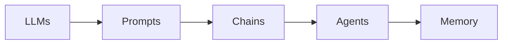

# 【LangChain编程：从入门到实践】LangChain的未来展望

## 1. 背景介绍

### 1.1 问题的由来

近年来，大型语言模型（LLMs）的能力取得了显著的进步，如 OpenAI 的 GPT-4 和 Google 的 PaLM 2。这些模型在理解和生成类人文本方面表现出色，为各种应用开辟了新的可能性。然而，将 LLMs 集成到实际应用程序中并非易事。开发人员面临着许多挑战，例如：

* **复杂接口**: LLMs 通常具有复杂的 API，需要深入的技术知识才能有效使用。
* **状态管理**: LLMs 本质上是无状态的，这意味着它们无法记住过去的交互或维护对话历史。
* **外部数据集成**:  LLMs 在其训练数据中存储了大量信息，但它们无法访问外部数据源或数据库来完成需要最新信息的任务。

为了解决这些挑战并简化 LLM 应用的开发，LangChain 应运而生。

### 1.2 研究现状

LangChain 是一个快速发展的开源框架，旨在为开发由语言模型驱动的应用程序提供更简单、更结构化的方法。它提供了一套模块化组件、抽象和工具，使开发人员能够轻松构建利用 LLMs 强大功能的应用程序。

目前，LangChain 已经成为 GitHub 上最受欢迎的机器学习项目之一，拥有庞大而活跃的社区。它被广泛应用于各种领域，包括：

* **聊天机器人**: 构建更智能、更具吸引力的聊天机器人，能够进行更自然、更富有成效的对话。
* **问答系统**: 开发能够理解复杂问题并提供准确答案的问答系统。
* **文本摘要**:  自动从长文档或文章中提取关键信息，生成简洁的摘要。
* **代码生成**:  根据自然语言描述生成代码，提高开发人员的生产力。

### 1.3 研究意义

LangChain 的出现具有重要的意义：

* **降低 LLM 应用开发门槛**:  LangChain 简化了 LLM 应用的开发过程，使更多开发人员能够利用 LLMs 的强大功能。
* **促进 LLM 应用生态系统发展**:  LangChain 提供了一个通用的框架和一组标准组件，促进了 LLM 应用生态系统的发展。
* **推动人工智能技术进步**:  LangChain 推动了 LLM 技术的进步，使其更易于使用、更可靠、更强大。

### 1.4 本文结构

本文将深入探讨 LangChain，涵盖以下内容：

* **核心概念与联系**:  介绍 LangChain 的核心概念，例如 Chains、Agents、Prompts 等，并解释它们之间的联系。
* **核心算法原理 & 具体操作步骤**:  深入研究 LangChain 的核心算法原理，并提供详细的操作步骤，帮助读者快速上手。
* **数学模型和公式 & 详细讲解 & 举例说明**:  对于 LangChain 中涉及的数学模型和公式，提供详细的讲解和举例说明，帮助读者更好地理解其工作原理。
* **项目实践：代码实例和详细解释说明**:  通过实际项目案例，展示 LangChain 的应用，并提供详细的代码实例和解释说明，帮助读者学习如何使用 LangChain 构建自己的应用程序。
* **实际应用场景**:  介绍 LangChain 的实际应用场景，例如聊天机器人、问答系统等，并分析其优势和局限性。
* **未来应用展望**:  展望 LangChain 的未来发展趋势，并探讨其潜在的应用领域。
* **工具和资源推荐**:  推荐学习 LangChain 的有用工具和资源，帮助读者进一步学习和研究。
* **总结：未来发展趋势与挑战**:  总结 LangChain 的研究成果、未来发展趋势以及面临的挑战，并提出研究展望。
* **附录：常见问题与解答**:  提供 LangChain 常见问题与解答，帮助读者解决使用过程中遇到的问题。

## 2. 核心概念与联系

LangChain 的核心概念包括：

* **LLMs**:  大型语言模型，例如 GPT-4 和 PaLM 2，是 LangChain 的基础，用于理解和生成文本。
* **Prompts**:  提示是发送给 LLMs 的指令或问题，用于引导其生成特定类型的响应。
* **Chains**:  链是一系列步骤，用于将多个 LLM 调用或其他工具组合在一起，以执行更复杂的任务。
* **Agents**:  代理是更高级别的抽象，它们可以根据用户的输入选择要使用的工具或链。
* **Memory**:  内存用于存储对话历史或其他相关信息，以便 LLMs 能够记住过去的交互。

下图展示了这些核心概念之间的关系：



## 3. 核心算法原理 & 具体操作步骤

### 3.1 算法原理概述

LangChain 的核心算法原理是基于**提示工程**和**模块化设计**。

* **提示工程**:  LangChain 提供了丰富的工具和技术，帮助开发人员设计有效的提示，以引导 LLMs 生成所需的输出。
* **模块化设计**:  LangChain 将 LLM 应用分解为一系列可重用的模块，例如 Prompts、Chains、Agents 等，使开发人员能够轻松构建复杂应用程序。

### 3.2 算法步骤详解

使用 LangChain 构建 LLM 应用的一般步骤如下：

1. **定义问题**:  明确要解决的问题，并确定需要使用哪些 LLMs 或其他工具。
2. **设计提示**:  根据问题和 LLMs 的特性，设计有效的提示，以引导 LLMs 生成所需的输出。
3. **创建链**:  将多个 LLM 调用或其他工具组合成链，以执行更复杂的任务。
4. **构建代理**:  根据用户的输入选择要使用的工具或链，并管理对话历史和其他相关信息。
5. **测试和优化**:  测试应用程序并根据需要进行优化，例如改进提示、调整模型参数等。

### 3.3 算法优缺点

**优点**:

* **易于使用**:  LangChain 简化了 LLM 应用的开发过程，使更多开发人员能够利用 LLMs 的强大功能。
* **模块化**:  LangChain 的模块化设计使得构建和维护复杂应用程序变得更加容易。
* **灵活性**:  LangChain 支持各种 LLMs 和其他工具，为开发人员提供了很大的灵活性。
* **活跃的社区**:  LangChain 拥有庞大而活跃的社区，为开发人员提供了丰富的资源和支持。

**缺点**:

* **性能**:  由于 LangChain 需要管理多个组件和调用，因此在某些情况下可能会影响性能。
* **复杂性**:  对于复杂的应用程序，LangChain 的配置和管理可能会变得复杂。

### 3.4 算法应用领域

LangChain 可以应用于各种领域，例如：

* **聊天机器人**
* **问答系统**
* **文本摘要**
* **代码生成**
* **机器翻译**
* **情感分析**

## 4. 数学模型和公式 & 详细讲解 & 举例说明

LangChain 中涉及的数学模型和公式主要与 LLMs 和自然语言处理 (NLP) 相关。

### 4.1 数学模型构建

LLMs 通常基于 Transformer 架构，这是一种强大的神经网络架构，擅长处理序列数据，例如文本。Transformer 模型使用自注意力机制来学习输入序列中不同单词之间的关系。

### 4.2 公式推导过程

自注意力机制的公式如下：

$$
Attention(Q, K, V) = softmax(\frac{QK^T}{\sqrt{d_k}})V
$$

其中：

* $Q$ 是查询矩阵。
* $K$ 是键矩阵。
* $V$ 是值矩阵。
* $d_k$ 是键的维度。

### 4.3 案例分析与讲解

假设我们有一个句子："The cat sat on the mat."。自注意力机制将计算句子中每个单词与其他单词之间的注意力权重。例如，"cat" 这个词可能会更多地关注 "sat" 和 "mat" 这两个词，因为它们在句子中具有语义上的联系。

### 4.4 常见问题解答

* **什么是 Transformer 模型？**

Transformer 模型是一种神经网络架构，擅长处理序列数据，例如文本。

* **什么是自注意力机制？**

自注意力机制是一种允许模型关注输入序列中不同部分的技术。

## 5. 项目实践：代码实例和详细解释说明

### 5.1 开发环境搭建

要使用 LangChain，您需要安装 Python 和以下库：

```
pip install langchain openai
```

您还需要从 OpenAI 获取 API 密钥。

### 5.2 源代码详细实现

以下是一个简单的 LangChain 应用程序，用于生成文本：

```python
from langchain.llms import OpenAI

# 初始化 OpenAI LLM
llm = OpenAI(openai_api_key="YOUR_API_KEY")

# 定义提示
prompt = "写一篇关于 LangChain 的简短文章。"

# 生成文本
text = llm(prompt)

# 打印文本
print(text)
```

### 5.3 代码解读与分析

* 首先，我们导入 `OpenAI` 类并使用 API 密钥初始化它。
* 然后，我们定义一个提示，要求 LLM 写一篇关于 LangChain 的简短文章。
* 接下来，我们使用 `llm()` 方法调用 LLM 并传递提示。
* 最后，我们将生成的文本打印到控制台。

### 5.4 运行结果展示

运行此代码将生成一篇关于 LangChain 的简短文章。

## 6. 实际应用场景

### 6.1 聊天机器人

LangChain 可以用于构建更智能、更具吸引力的聊天机器人。通过使用 LLMs 和 LangChain 提供的工具，开发人员可以创建能够进行更自然、更富有成效的对话的聊天机器人。

### 6.2 问答系统

LangChain 可以用于开发能够理解复杂问题并提供准确答案的问答系统。通过将 LLMs 与外部知识库集成，LangChain 可以构建能够回答各种主题问题的问答系统。

### 6.3 文本摘要

LangChain 可以用于自动从长文档或文章中提取关键信息，生成简洁的摘要。

### 6.4 未来应用展望

随着 LLMs 的不断发展，LangChain 的应用前景将更加广阔。以下是一些潜在的应用领域：

* **个性化教育**:  LangChain 可以用于创建个性化的学习体验，根据学生的个人需求和学习风格提供定制化的内容和反馈。
* **智能医疗**:  LangChain 可以用于开发能够诊断疾病、推荐治疗方案并提供患者教育的智能医疗助手。
* **智能客服**:  LangChain 可以用于构建能够处理更复杂查询并提供更个性化服务的智能客服系统。

## 7. 工具和资源推荐

### 7.1 学习资源推荐

* **LangChain 文档**:  https://langchain.readthedocs.io/
* **LangChain GitHub**:  https://github.com/hwchase17/langchain

### 7.2 开发工具推荐

* **Python**:  https://www.python.org/
* **Visual Studio Code**:  https://code.visualstudio.com/

### 7.3 相关论文推荐

* **Language Models are Few-Shot Learners**:  https://arxiv.org/abs/2005.14165

### 7.4 其他资源推荐

* **OpenAI**:  https://openai.com/

## 8. 总结：未来发展趋势与挑战

### 8.1 研究成果总结

LangChain 是一个强大的框架，用于构建由语言模型驱动的应用程序。它简化了 LLM 应用的开发过程，并为开发人员提供了丰富的工具和资源。

### 8.2 未来发展趋势

* **更强大的 LLMs**:  随着 LLMs 的不断发展，LangChain 将能够利用更强大的模型来构建更先进的应用程序。
* **更广泛的应用**:  LangChain 的应用领域将不断扩大，涵盖更多领域，例如医疗保健、教育和金融。
* **更易于使用**:  LangChain 将继续发展，变得更加用户友好，即使是非技术用户也能轻松构建 LLM 应用。

### 8.3 面临的挑战

* **性能**:  LangChain 需要管理多个组件和调用，因此在某些情况下可能会影响性能。
* **安全性**:  使用 LLMs 构建应用程序带来了新的安全挑战，例如对抗性攻击和数据隐私。
* **伦理**:  使用 LLMs 构建应用程序引发了伦理问题，例如偏见和滥用。

### 8.4 研究展望

LangChain 的未来充满了希望。随着 LLMs 的不断发展和 LangChain 的不断改进，我们可以期待看到更多创新和令人兴奋的 LLM 应用出现。

## 9. 附录：常见问题与解答

**问：LangChain 支持哪些 LLMs？**

答：LangChain 支持各种 LLMs，包括 OpenAI 的 GPT-4 和 Google 的 PaLM 2。

**问：如何安装 LangChain？**

答：您可以使用 pip 安装 LangChain：

```
pip install langchain
```

**问：在哪里可以找到 LangChain 的文档？**

答：您可以在以下位置找到 LangChain 的文档：

https://langchain.readthedocs.io/

作者：禅与计算机程序设计艺术 / Zen and the Art of Computer Programming 
