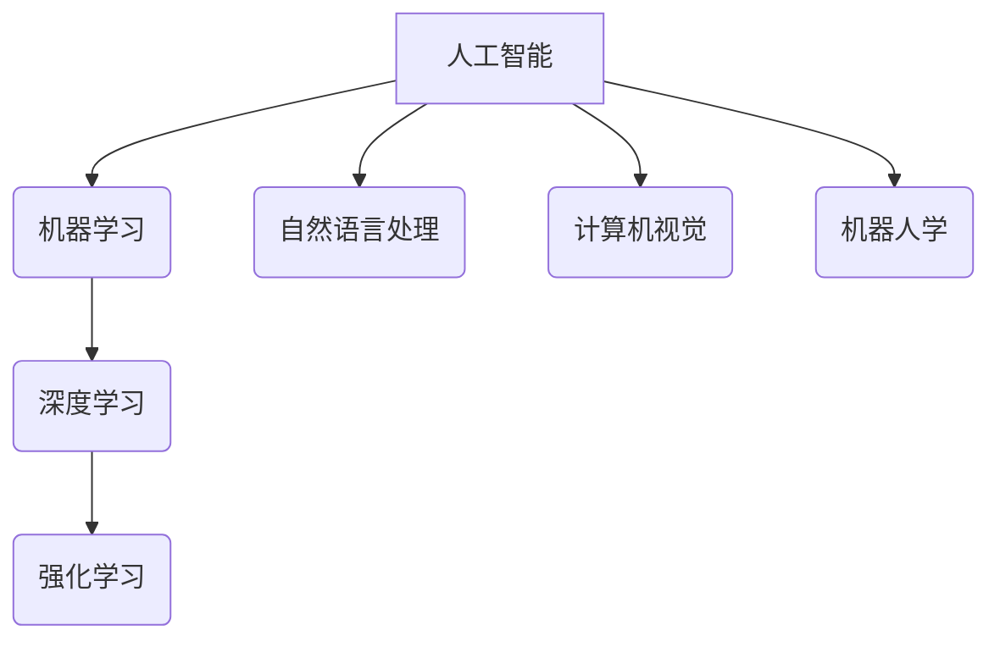

# Andrej Karpathy：人工智能的未来发展挑战

> 关键词：人工智能，机器学习，深度学习，Andrej Karpathy，未来挑战，伦理，可解释性，通用人工智能，AI伦理

## 1. 背景介绍

安德烈·卡帕西（Andrej Karpathy）是一位杰出的计算机科学家，以其在深度学习和自然语言处理（NLP）领域的贡献而闻名。他在Twitter上发表了多篇关于人工智能（AI）未来的深刻思考，引发了对AI发展挑战的广泛讨论。本文将基于卡帕西的观点，探讨人工智能的未来发展趋势及其面临的挑战。

## 2. 核心概念与联系

### 2.1 人工智能的定义

人工智能（AI）是计算机科学的一个分支，旨在创建能够执行任务通常需要人类智能的机器。AI可以分为几个层次，从简单的算法到能够学习、适应和执行复杂任务的系统。



### 2.2 AI发展的关键概念

- **机器学习**：一种AI技术，使机器能够从数据中学习并改进其性能。
- **深度学习**：一种机器学习方法，通过多层神经网络模拟人脑处理信息的方式。
- **强化学习**：一种机器学习方法，通过奖励和惩罚机制使机器学习如何执行特定任务。
- **自然语言处理**：AI的一个子领域，旨在让计算机理解和生成人类语言。
- **计算机视觉**：AI的一个子领域，使计算机能够理解和解释图像和视频。
- **机器人学**：AI的一个子领域，涉及设计能够执行物理任务的机器人。

## 3. 核心算法原理 & 具体操作步骤

### 3.1 算法原理概述

AI算法的原理通常涉及以下步骤：

1. **数据收集**：从各种来源收集大量数据。
2. **数据预处理**：清洗、标注和转换数据，以便模型学习。
3. **模型选择**：选择合适的模型架构。
4. **训练**：使用训练数据训练模型。
5. **评估**：使用测试数据评估模型的性能。
6. **优化**：根据评估结果调整模型参数。

### 3.2 算法步骤详解

- **数据收集**：数据可以是结构化的（如数据库）或非结构化的（如图像、文本和视频）。
- **数据预处理**：包括去除噪声、填充缺失值、归一化等。
- **模型选择**：选择合适的模型，如神经网络、决策树或支持向量机。
- **训练**：使用梯度下降等优化算法训练模型。
- **评估**：使用诸如准确率、召回率和F1分数等指标评估模型性能。
- **优化**：根据评估结果调整模型参数或选择不同的模型。

### 3.3 算法优缺点

- **优点**：AI模型能够处理大量数据，发现复杂模式，并自动进行决策。
- **缺点**：AI模型可能难以解释其决策过程，可能存在偏见，并且需要大量的计算资源。

### 3.4 算法应用领域

AI算法广泛应用于各个领域，包括医疗、金融、交通、娱乐和制造业。

## 4. 数学模型和公式 & 详细讲解 & 举例说明

### 4.1 数学模型构建

AI模型通常基于数学模型，如神经网络、决策树和支持向量机。以下是一个简单的神经网络模型：

$$
f(\mathbf{x}) = \sigma(W\mathbf{x} + b)
$$

其中，$\mathbf{x}$ 是输入，$W$ 是权重，$b$ 是偏置，$\sigma$ 是激活函数。

### 4.2 公式推导过程

神经网络的推导过程涉及微积分、线性代数和概率论。

### 4.3 案例分析与讲解

以卷积神经网络（CNN）为例，它被广泛用于图像识别任务。CNN通过卷积层、池化层和全连接层等构建，能够自动学习图像中的特征。

## 5. 项目实践：代码实例和详细解释说明

### 5.1 开发环境搭建

为了进行AI项目实践，需要安装Python、TensorFlow或PyTorch等库。

### 5.2 源代码详细实现

以下是一个简单的神经网络模型的Python代码实现：

```python
import tensorflow as tf

model = tf.keras.Sequential([
    tf.keras.layers.Dense(64, activation='relu', input_shape=(784,)),
    tf.keras.layers.Dense(10, activation='softmax')
])

model.compile(optimizer='adam',
              loss='categorical_crossentropy',
              metrics=['accuracy'])

model.fit(x_train, y_train, epochs=5, batch_size=32)
```

### 5.3 代码解读与分析

这段代码使用TensorFlow构建了一个简单的神经网络，用于分类任务。它包含一个输入层和一个输出层，以及一个ReLU激活函数。

### 5.4 运行结果展示

运行上述代码后，模型将在训练数据上训练5个epoch，并评估其性能。

## 6. 实际应用场景

### 6.1 医疗诊断

AI在医疗诊断中的应用，如通过图像识别技术辅助诊断疾病。

### 6.2 金融风险控制

AI在金融领域的应用，如通过预测市场趋势来控制风险。

### 6.3 自动驾驶

AI在自动驾驶中的应用，如通过计算机视觉技术实现车辆的自动导航。

## 7. 工具和资源推荐

### 7.1 学习资源推荐

- Coursera上的《机器学习》课程
- TensorFlow和PyTorch官方文档

### 7.2 开发工具推荐

- TensorFlow
- PyTorch
- Keras

### 7.3 相关论文推荐

- Yann LeCun、Yoshua Bengio和Geoffrey Hinton的论文集

## 8. 总结：未来发展趋势与挑战

### 8.1 研究成果总结

AI在各个领域取得了显著的进展，但仍然面临许多挑战。

### 8.2 未来发展趋势

- AI将继续向更复杂、更智能的方向发展。
- AI将更加普及，并集成到更多日常应用中。

### 8.3 面临的挑战

- AI的伦理和道德问题。
- AI的可解释性。
- AI的通用人工智能（AGI）。

### 8.4 研究展望

未来的AI研究需要更加关注伦理、可解释性和通用人工智能，以确保AI技术能够造福人类社会。

## 9. 附录：常见问题与解答

### 9.1 常见问题

- **Q1：什么是人工智能？**
  A1：人工智能是计算机科学的一个分支，旨在创建能够执行任务通常需要人类智能的机器。
  
- **Q2：AI的挑战有哪些？**
  A2：AI的挑战包括伦理问题、可解释性、通用人工智能等。

- **Q3：AI的未来发展趋势是什么？**
  A3：AI的未来发展趋势包括向更复杂、更智能的方向发展，并更加普及。

作者：禅与计算机程序设计艺术 / Zen and the Art of Computer Programming