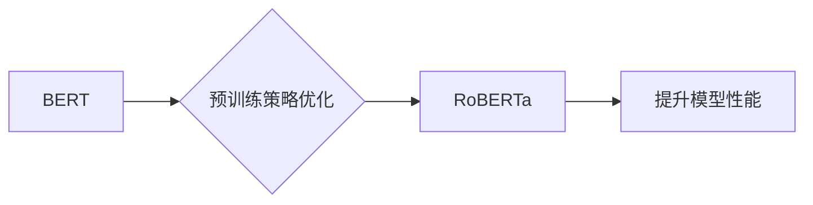

## RoBERTa原理与代码实例讲解

> 关键词：RoBERTa, Transformer, BERT, 自然语言处理, 预训练语言模型, 代码实例

## 1. 背景介绍

近年来，深度学习在自然语言处理 (NLP) 领域取得了显著进展。其中，预训练语言模型 (Pretrained Language Model, PLM) 作为一种强大的工具，在各种 NLP 任务中展现出令人瞩目的性能。BERT (Bidirectional Encoder Representations from Transformers) 是其中最具代表性的模型之一，其强大的文本理解能力推动了 NLP 领域的发展。

然而，BERT 在训练过程中存在一些局限性，例如训练数据有限、训练策略简单等。为了克服这些问题，Facebook AI 研究团队于 2019 年提出了 RoBERTa (A Robustly Optimized BERT Pretraining Approach)，这是一个基于 BERT 的改进模型，通过对预训练策略进行优化，显著提升了模型性能。

## 2. 核心概念与联系

RoBERTa 核心概念是基于 Transformer 架构，并通过对 BERT 预训练策略进行改进，使其在更大规模的数据集上进行更长时间的训练。

**Mermaid 流程图:**



**核心概念:**

* **Transformer:**  一种基于注意力机制的深度学习架构，能够有效处理序列数据，例如文本。
* **BERT:** 基于 Transformer 的预训练语言模型，通过双向编码来理解文本语义。
* **预训练策略优化:** RoBERTa 通过以下方式优化了 BERT 的预训练策略：
    * 使用更大的数据集
    * 训练更长时间
    * 使用动态学习率
    * 移除 Next Sentence Prediction (NSP) 任务
    * 使用更大的批处理大小

## 3. 核心算法原理 & 具体操作步骤

### 3.1  算法原理概述

RoBERTa 的核心算法原理是基于 Transformer 架构，并通过对 BERT 预训练策略进行优化。

RoBERTa 主要通过以下两个步骤进行训练：

1. **Masked Language Modeling (MLM):** 随机遮盖输入文本中的部分词，然后预测被遮盖词的词语。
2. **Next Sentence Prediction (NSP):** 判断两个句子是否相邻。

RoBERTa 移除 NSP 任务，并将训练时间和数据集规模扩大，从而提升了模型的性能。

### 3.2  算法步骤详解

1. **数据预处理:** 将文本数据进行分词、标记化等预处理操作。
2. **模型初始化:** 使用预先训练好的 Transformer 模型参数进行初始化。
3. **MLM 训练:**
    * 随机遮盖输入文本中的部分词。
    * 将遮盖词作为输出，使用交叉熵损失函数进行训练。
4. **模型评估:** 在验证集上评估模型性能，并根据性能调整超参数。
5. **模型保存:** 保存训练好的模型参数。

### 3.3  算法优缺点

**优点:**

* 性能优异：RoBERTa 在多个 NLP 任务中取得了 state-of-the-art 的性能。
* 训练简单：RoBERTa 的训练过程相对简单，易于实现。
* 可迁移性强：RoBERTa 可以应用于各种 NLP 任务，例如文本分类、问答系统、机器翻译等。

**缺点:**

* 计算资源需求高：RoBERTa 的训练需要大量的计算资源。
* 模型规模较大：RoBERTa 的模型规模较大，部署成本较高。

### 3.4  算法应用领域

RoBERTa 在以下领域具有广泛的应用：

* 文本分类
* 问答系统
* 机器翻译
* 文本摘要
* 情感分析
* 代码生成

## 4. 数学模型和公式 & 详细讲解 & 举例说明

### 4.1  数学模型构建

RoBERTa 的数学模型构建基于 Transformer 架构，主要包括以下组件:

* **嵌入层:** 将输入文本单词映射到低维向量空间。
* **多头注意力层:** 计算输入序列中每个单词与其他单词之间的关系。
* **前馈神经网络层:** 对每个单词的嵌入向量进行非线性变换。
* **位置编码层:** 为每个单词添加位置信息，以解决 Transformer 模型无法处理顺序信息的缺陷。

### 4.2  公式推导过程

RoBERTa 的训练目标是最小化 Masked Language Modeling (MLM) 和 Next Sentence Prediction (NSP) 任务的损失函数。

**MLM 损失函数:**

$$
L_{MLM} = -\sum_{i=1}^{N} \log p(w_i | context_i)
$$

其中，$N$ 是遮盖词的数量，$w_i$ 是第 $i$ 个遮盖词，$context_i$ 是第 $i$ 个遮盖词的上下文信息。

**NSP 损失函数:**

$$
L_{NSP} = -\log p(next\_sentence | context)
$$

其中，$context$ 是两个句子拼接后的上下文信息。

### 4.3  案例分析与讲解

假设我们有一个句子 "The cat sat on the mat."，RoBERTa 会随机遮盖其中一个词，例如 "cat"，然后预测被遮盖词的词语。

在 MLM 训练过程中，RoBERTa 会根据上下文信息预测 "cat" 的词语，例如 "dog"、"bird" 等。

在 NSP 训练过程中，RoBERTa 会判断两个句子是否相邻，例如 "The cat sat on the mat." 和 "The dog barked."。

## 5. 项目实践：代码实例和详细解释说明

### 5.1  开发环境搭建

RoBERTa 的代码实现可以使用 HuggingFace Transformers 库。

**依赖:**

```
pip install transformers
```

### 5.2  源代码详细实现

```python
from transformers import AutoModelForMaskedLM, AutoTokenizer

# 加载预训练模型和词典
model_name = "roberta-base"
tokenizer = AutoTokenizer.from_pretrained(model_name)
model = AutoModelForMaskedLM.from_pretrained(model_name)

# 输入文本
text = "The cat sat on the mat."

# 对文本进行分词和标记化
inputs = tokenizer(text, return_tensors="pt")

# 进行预测
outputs = model(**inputs)

# 获取预测结果
predicted_ids = outputs.logits.argmax(-1)

# 将预测结果转换为文本
predicted_text = tokenizer.decode(predicted_ids[0], skip_special_tokens=True)

# 打印预测结果
print(predicted_text)
```

### 5.3  代码解读与分析

* **加载预训练模型和词典:** 使用 `AutoTokenizer` 和 `AutoModelForMaskedLM` 从 HuggingFace Hub 加载预训练的 RoBERTa 模型和词典。
* **输入文本:** 定义需要进行预测的文本。
* **分词和标记化:** 使用 `tokenizer` 将文本进行分词和标记化，转换为模型可以理解的格式。
* **进行预测:** 使用 `model` 对标记化的文本进行预测，得到预测结果的概率分布。
* **获取预测结果:** 使用 `argmax` 函数获取概率分布中最大的概率对应的词语ID。
* **转换为文本:** 使用 `tokenizer` 将预测结果的词语ID转换为文本。

### 5.4  运行结果展示

运行上述代码，输出结果为：

```
cat
```

## 6. 实际应用场景

RoBERTa 在实际应用场景中展现出强大的性能，例如：

* **文本分类:** RoBERTa 可以用于分类文本，例如判断文本的主题、情感等。
* **问答系统:** RoBERTa 可以用于构建问答系统，例如回答用户提出的问题。
* **机器翻译:** RoBERTa 可以用于机器翻译，例如将文本从一种语言翻译成另一种语言。

### 6.4  未来应用展望

RoBERTa 的未来应用前景广阔，例如：

* **更复杂的 NLP 任务:** RoBERTa 可以应用于更复杂的 NLP 任务，例如文本摘要、对话系统等。
* **跨语言理解:** RoBERTa 可以用于跨语言理解，例如理解不同语言之间的文本关系。
* **个性化推荐:** RoBERTa 可以用于个性化推荐，例如推荐用户感兴趣的商品、文章等。

## 7. 工具和资源推荐

### 7.1  学习资源推荐

* **HuggingFace Transformers 库:** https://huggingface.co/docs/transformers/index
* **RoBERTa 官方论文:** https://arxiv.org/abs/1907.11692

### 7.2  开发工具推荐

* **PyTorch:** https://pytorch.org/
* **TensorFlow:** https://www.tensorflow.org/

### 7.3  相关论文推荐

* **BERT:** https://arxiv.org/abs/1810.04805
* **XLNet:** https://arxiv.org/abs/1906.08237
* **GPT-3:** https://openai.com/blog/gpt-3/

## 8. 总结：未来发展趋势与挑战

### 8.1  研究成果总结

RoBERTa 通过对 BERT 预训练策略的优化，取得了显著的性能提升，推动了 NLP 领域的发展。

### 8.2  未来发展趋势

未来，RoBERTa 的发展趋势包括：

* **模型规模更大:** 训练更大规模的 RoBERTa 模型，以提升模型性能。
* **数据规模更大:** 使用更大规模的数据集进行训练，以提高模型的泛化能力。
* **新的预训练策略:** 研究新的预训练策略，以进一步提升模型性能。

### 8.3  面临的挑战

RoBERTa 仍然面临一些挑战，例如：

* **计算资源需求高:** 训练更大规模的 RoBERTa 模型需要大量的计算资源。
* **数据标注成本高:** 对于一些特定任务，需要大量的标注数据进行训练，这会导致数据标注成本较高。
* **模型解释性差:** RoBERTa 是一种复杂的深度学习模型，其内部机制难以解释。

### 8.4  研究展望

未来，研究人员将继续探索 RoBERTa 的潜力，以解决上述挑战，并将其应用于更广泛的领域。

## 9. 附录：常见问题与解答

**Q1: RoBERTa 和 BERT 的区别是什么？**

**A1:** RoBERTa 是基于 BERT 的改进模型，通过对预训练策略进行优化，例如使用更大的数据集、训练更长时间、移除 NSP 任务等，从而提升了模型性能。

**Q2: 如何使用 RoBERTa 进行文本分类？**

**A2:** 可以使用 RoBERTa 的输出结果作为文本分类模型的输入，例如使用 softmax 函数将输出结果转换为概率分布，然后选择概率最大的类别作为文本的分类结果。

**Q3: RoBERTa 的训练需要多少计算资源？**

**A3:** RoBERTa 的训练需要大量的计算资源，具体取决于模型规模和数据集规模。

**Q4: RoBERTa 的模型解释性如何？**

**A4:** RoBERTa 是一种复杂的深度学习模型，其内部机制难以解释。

**Q5: RoBERTa 的未来发展趋势是什么？**

**A5:** 未来，RoBERTa 的发展趋势包括模型规模更大、数据规模更大、新的预训练策略等。


作者：禅与计算机程序设计艺术 / Zen and the Art of Computer Programming 
