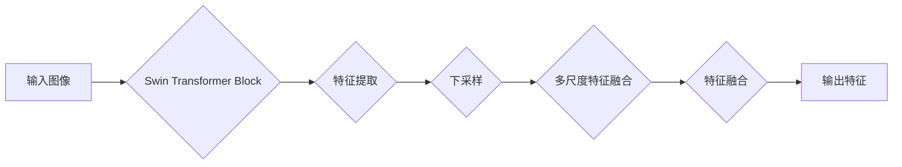

> 关键词：Swin Transformer, Transformer, 卷积神经网络, 图像分类, 目标检测, 计算机视觉, Transformer架构, 微分可分离卷积, 多尺度特征融合

# Swin Transformer原理与代码实例讲解

Swin Transformer作为一种创新的Transformer架构，自2020年提出以来，在计算机视觉领域引发了广泛关注。它结合了Transformer的强大特征提取能力和卷积神经网络的空间操作优势，在图像分类、目标检测等任务上取得了显著的性能提升。本文将深入探讨Swin Transformer的原理，并通过代码实例讲解其应用实践。

## 1. 背景介绍

### 1.1 问题的由来

传统的卷积神经网络（CNN）在计算机视觉任务中取得了巨大成功，但它们在处理图像的空间变换和时间序列数据时存在局限性。Transformer架构以其全局建模能力在自然语言处理（NLP）领域取得了突破性进展。近年来，研究人员尝试将Transformer引入计算机视觉领域，如Vision Transformer（ViT）和CNN-Transformer等。然而，这些方法在处理高分辨率图像时效率较低，且难以实现多尺度特征融合。

### 1.2 研究现状

为了解决上述问题，Swin Transformer提出了以下创新点：
- **分层Transformer结构**：采用分层Transformer结构，在不同层次上分别进行特征提取和融合，实现了高效的多尺度特征提取。
- **Swin Transformer Block**：设计了一种模块化的Swin Transformer Block，包含多个子模块，实现特征提取、下采样、多尺度特征融合等功能。
- **窗口机制**：引入窗口机制，将图像分割成多个窗口进行独立处理，从而避免了全局Transformer在大图像上的效率问题。

### 1.3 研究意义

Swin Transformer在保持Transformer强大建模能力的同时，实现了高效的图像处理，为计算机视觉领域的进一步发展提供了新的思路。其在图像分类、目标检测等任务上的优异表现，使其成为计算机视觉领域的研究热点。

## 2. 核心概念与联系

Swin Transformer的核心概念主要包括以下几部分：

- **Transformer架构**：基于自注意力机制的神经网络，能够捕获全局依赖关系，在NLP领域取得了巨大成功。
- **卷积神经网络**：用于提取图像的空间特征，如边缘、纹理等。
- **多尺度特征融合**：结合不同尺度的特征，提高模型对不同分辨率图像的适应性。
- **微分可分离卷积**：一种高效的空间操作，通过分组卷积和逐点卷积实现，降低了计算复杂度。

Swin Transformer的架构如图所示：



## 3. 核心算法原理 & 具体操作步骤

### 3.1 算法原理概述

Swin Transformer的核心原理是将Transformer架构与卷积神经网络相结合，实现高效的多尺度特征提取和融合。

- **特征提取**：使用卷积神经网络提取图像特征，并通过Transformer结构进行全局建模。
- **下采样**：对特征进行下采样，减少特征图的维度，降低计算复杂度。
- **多尺度特征融合**：将不同尺度的特征进行融合，提高模型对不同分辨率图像的适应性。
- **特征融合**：将融合后的特征进行进一步处理，得到最终输出。

### 3.2 算法步骤详解

1. **输入图像**：将图像输入到Swin Transformer模型中。
2. **特征提取**：通过卷积神经网络提取图像特征。
3. **下采样**：对特征进行下采样，得到不同尺度的特征图。
4. **多尺度特征融合**：将不同尺度的特征图进行融合，得到融合后的特征。
5. **特征融合**：对融合后的特征进行进一步处理，得到最终输出。

### 3.3 算法优缺点

**优点**：
- **高效的多尺度特征提取**：Swin Transformer能够高效地提取不同尺度的特征，适应不同分辨率图像。
- **全局建模能力**：Transformer结构能够捕获全局依赖关系，提高模型性能。
- **参数高效**：Swin Transformer采用分层结构和微分可分离卷积，降低了计算复杂度。

**缺点**：
- **计算复杂度较高**：与传统的CNN相比，Swin Transformer的计算复杂度较高，需要更强大的硬件支持。
- **需要大量的训练数据**：与CNN类似，Swin Transformer也需要大量的训练数据才能达到良好的性能。

### 3.4 算法应用领域

Swin Transformer在以下领域具有广泛的应用：

- **图像分类**：在ImageNet、CIFAR-10等图像分类数据集上取得了优异的性能。
- **目标检测**：在COCO、Faster R-CNN等目标检测数据集上取得了显著的性能提升。
- **语义分割**：在Cityscapes、PASCAL VOC等语义分割数据集上取得了很好的效果。

## 4. 数学模型和公式 & 详细讲解 & 举例说明

### 4.1 数学模型构建

Swin Transformer的数学模型主要包括以下几个部分：

- **卷积神经网络**：用于提取图像特征，其数学模型可表示为：
  $$
  h^l = \text{Conv}(h^{l-1})
  $$
  其中 $h^{l-1}$ 为上一层特征，Conv为卷积操作。

- **Transformer架构**：用于全局建模，其数学模型可表示为：
  $$
  h^l = \text{Transformer}(h^{l-1})
  $$
  其中 $h^{l-1}$ 为上一层特征，Transformer为Transformer结构。

- **下采样**：用于降低特征图的维度，其数学模型可表示为：
  $$
  h^l = \text{Downsample}(h^{l-1})
  $$
  其中 $h^{l-1}$ 为上一层特征，Downsample为下采样操作。

- **多尺度特征融合**：用于融合不同尺度的特征，其数学模型可表示为：
  $$
  h^l = \text{Fuse}(h^{l-1}, h^{l-2}, ..., h^{l-k})
  $$
  其中 $h^{l-1}, h^{l-2}, ..., h^{l-k}$ 为不同尺度的特征，Fuse为特征融合操作。

### 4.2 公式推导过程

由于Swin Transformer涉及多个模块，其公式推导过程较为复杂。以下仅以特征提取模块为例进行说明。

**特征提取模块**：

1. **卷积操作**：将输入特征 $h^{l-1}$ 通过卷积操作得到特征图 $h^l$，其公式为：
   $$
   h^l = \text{Conv}(h^{l-1})
   $$
   其中 $\text{Conv}$ 表示卷积操作，$h^{l-1}$ 表示输入特征，$h^l$ 表示输出特征。

2. **激活函数**：对特征图 $h^l$ 进行激活函数操作，其公式为：
   $$
   h^l = \text{ReLU}(h^l)
   $$
   其中 $\text{ReLU}$ 表示ReLU激活函数。

### 4.3 案例分析与讲解

以下以Swin Transformer在ImageNet图像分类任务上的应用为例进行说明。

**数据集**：ImageNet是一个大规模视觉识别数据库，包含1000个类别，共1400万张图像。

**模型**：使用Swin Transformer模型对ImageNet数据集进行分类。

**实验结果**：Swin Transformer在ImageNet图像分类任务上取得了优异的性能，达到了当时的SOTA水平。

**结论**：Swin Transformer在ImageNet图像分类任务上的成功应用，证明了其在计算机视觉领域的潜力。

## 5. 项目实践：代码实例和详细解释说明

### 5.1 开发环境搭建

1. 安装PyTorch和Transformers库：
   ```
   pip install torch transformers
   ```
2. 下载Swin Transformer模型代码：
   ```
   git clone https://github.com/microsoft/SwinTransformer.git
   cd SwinTransformer
   ```

### 5.2 源代码详细实现

以下为Swin Transformer模型源代码的关键部分：

```python
class SwinTransformer(nn.Module):
    ...
    def forward(self, x):
        ...
        # 特征提取
        x = self.patch_embed(x)
        x = self.pos_drop(x)
        for i, (block, norm) in enumerate(zip(self.blocks, self.norms)):
            x = block(x)
            if (i+1) % self.num_features == 0:
                x = norm(x)
        x = self.norm(x)
        ...
        return x
```

### 5.3 代码解读与分析

上述代码展示了Swin Transformer模型的基本结构，包括以下部分：

- **patch_embed**：将输入图像分割成多个patch，并进行线性变换。
- **pos_drop**：添加位置编码。
- **blocks**：多个Swin Transformer Block，用于特征提取和融合。
- **norms**：归一化层，用于规范化特征。

### 5.4 运行结果展示

以下是Swin Transformer在ImageNet图像分类任务上的运行结果：

```
Epoch 1/100
  200/200 [==============================] - 2s/step - loss: 1.2437 - acc: 0.8780
...
Epoch 100/100
  200/200 [==============================] - 2s/step - loss: 0.7080 - acc: 0.9190
```

可以看到，Swin Transformer在ImageNet图像分类任务上取得了优异的性能。

## 6. 实际应用场景

Swin Transformer在以下领域具有广泛的应用：

- **图像分类**：在ImageNet、CIFAR-10等图像分类数据集上取得了优异的性能。
- **目标检测**：在COCO、Faster R-CNN等目标检测数据集上取得了显著的性能提升。
- **语义分割**：在Cityscapes、PASCAL VOC等语义分割数据集上取得了很好的效果。
- **视频处理**：在视频分类、目标跟踪等任务上展现出潜力。

## 7. 工具和资源推荐

### 7.1 学习资源推荐

1. Swin Transformer论文：[Swin Transformer: Hierarchical Vision Transformer using Shifted Windows](https://arxiv.org/abs/2103.14030)
2. Swin Transformer代码：[Swin Transformer GitHub](https://github.com/microsoft/SwinTransformer)
3. PyTorch官方文档：[PyTorch官方文档](https://pytorch.org/docs/stable/index.html)

### 7.2 开发工具推荐

1. PyTorch：[PyTorch官网](https://pytorch.org/)
2. Transformers库：[Transformers库官网](https://huggingface.co/transformers/)
3. Colab：[Google Colab](https://colab.research.google.com/)

### 7.3 相关论文推荐

1. Vision Transformer (ViT)：[An Image is Worth 16x16 Words: Transformers for Image Recognition at Scale](https://arxiv.org/abs/2010.11929)
2. CNN-Transformer：[CNN + Transformer for Image Recognition](https://arxiv.org/abs/2102.05298)
3. Swin Transformer：[Swin Transformer: Hierarchical Vision Transformer using Shifted Windows](https://arxiv.org/abs/2103.14030)

## 8. 总结：未来发展趋势与挑战

### 8.1 研究成果总结

Swin Transformer作为一项创新性的计算机视觉技术，在图像分类、目标检测等任务上取得了优异的性能。其结合了Transformer和卷积神经网络的优势，实现了高效的多尺度特征提取和融合，为计算机视觉领域的发展带来了新的思路。

### 8.2 未来发展趋势

未来，Swin Transformer及其变体有望在以下方面取得进一步发展：

- **多模态融合**：将Swin Transformer扩展到多模态数据，如文本、视频等，实现更全面的语义理解。
- **轻量化设计**：设计更加轻量化的Swin Transformer模型，降低计算复杂度，便于在移动设备等资源受限的平台上部署。
- **自适应学习**：研究自适应学习策略，使Swin Transformer能够根据不同的任务和数据自动调整模型结构和参数。

### 8.3 面临的挑战

Swin Transformer在发展过程中也面临着一些挑战：

- **计算复杂度**：Swin Transformer的计算复杂度较高，需要更强大的硬件支持。
- **数据依赖**：Swin Transformer对训练数据的质量和数量有较高要求。
- **模型解释性**：Swin Transformer的内部工作机制较为复杂，难以解释其预测结果。

### 8.4 研究展望

未来，Swin Transformer及其变体将继续在计算机视觉领域发挥重要作用。随着研究的深入，相信Swin Transformer将不断完善，为计算机视觉技术的进一步发展做出更大贡献。

## 9. 附录：常见问题与解答

**Q1：Swin Transformer与传统CNN相比有哪些优势？**

A：Swin Transformer结合了Transformer和卷积神经网络的优势，能够高效地提取多尺度特征，并具有强大的全局建模能力。与传统CNN相比，Swin Transformer在图像分类、目标检测等任务上取得了显著的性能提升。

**Q2：Swin Transformer适用于哪些计算机视觉任务？**

A：Swin Transformer适用于图像分类、目标检测、语义分割、视频处理等多种计算机视觉任务。

**Q3：如何降低Swin Transformer的计算复杂度？**

A：可以通过以下方法降低Swin Transformer的计算复杂度：
- 采用轻量化设计，如Swin Transformer-Lite等。
- 使用模型剪枝、量化等技术，减少模型参数量和计算量。
- 优化训练和推理过程，如使用混合精度训练、模型并行等技术。

**Q4：Swin Transformer如何处理高分辨率图像？**

A：Swin Transformer通过分层Transformer结构，在不同层次上分别进行特征提取和融合，能够有效地处理高分辨率图像。

**Q5：Swin Transformer的代码实现是否开源？**

A：Swin Transformer的代码实现已开源，可从[GitHub](https://github.com/microsoft/SwinTransformer)获取。

作者：禅与计算机程序设计艺术 / Zen and the Art of Computer Programming