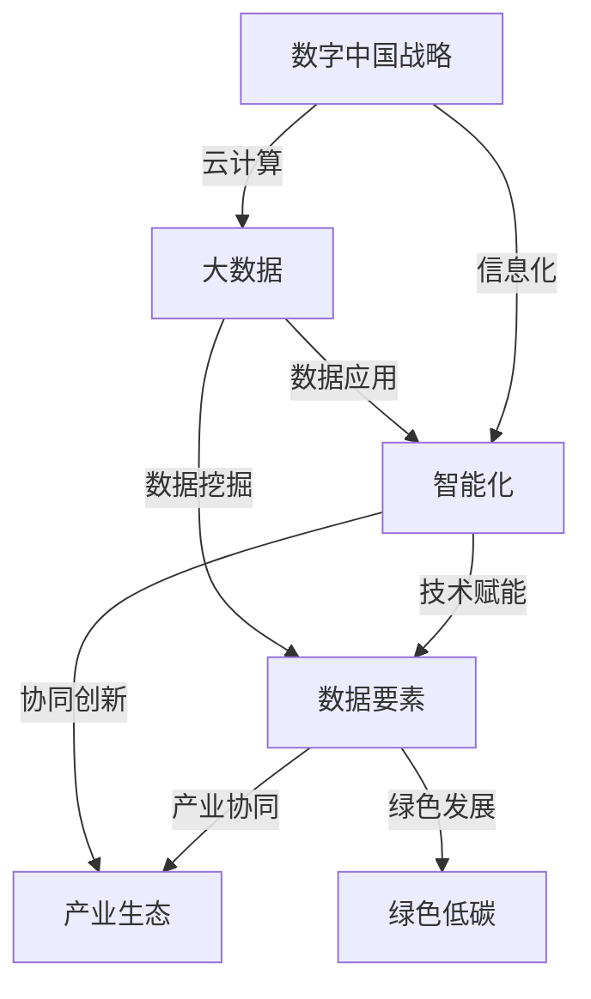

> 数字中国战略, 新质生产力, 信息化, 智能化, 云计算, 大数据, 人工智能, 产业升级, 经济发展

# 数字中国战略与新质生产力的结合点

在全球化竞争日益激烈的今天，中国正积极推进“数字中国”建设，以期通过信息技术驱动经济转型升级，培育新质生产力。本文将深入探讨数字中国战略与新质生产力的结合点，分析其背后的逻辑与路径，并展望未来发展趋势与挑战。

## 1. 背景介绍

### 1.1 数字中国战略的提出

2018年，国家正式提出“数字中国”战略，旨在通过信息化驱动经济发展，提升国家治理体系和治理能力现代化水平。数字中国战略涵盖了数字经济、数字政府、数字社会、数字文化等多个领域，是我国未来发展的关键战略。

### 1.2 新质生产力的崛起

新质生产力是指在信息化、智能化时代，以数据为关键要素，以新一代信息技术为支撑，以创新为驱动，以知识、技术、信息等要素为生产力的核心，推动经济社会发展的生产力形态。新质生产力具有以下特征：

- **数据驱动**：以数据为关键生产要素，通过大数据、云计算、人工智能等技术进行数据挖掘、分析和应用。
- **智能赋能**：利用人工智能、物联网、区块链等先进技术，提升生产效率和质量。
- **协同创新**：推动产业链上下游协同创新，形成产业生态。
- **绿色低碳**：推动产业向绿色低碳方向发展，实现可持续发展。

### 1.3 数字中国战略与新质生产力的关系

数字中国战略为新质生产力的培育提供了政策支持、基础设施和市场需求，而新质生产力则是数字中国战略实现经济转型升级的核心动力。两者相互促进，共同推动经济社会高质量发展。

## 2. 核心概念与联系

### 2.1 核心概念原理

数字中国战略的核心概念包括：

- **信息化**：通过信息技术提升社会生产力和治理能力。
- **智能化**：利用人工智能、物联网等技术实现智能化生产、管理和服务。
- **云计算**：通过云计算平台提供弹性、高效、安全的服务。
- **大数据**：通过大数据技术挖掘和分析海量数据，为企业决策提供支持。

新质生产力的核心概念包括：

- **数据要素**：将数据作为关键生产要素，实现数据驱动的发展。
- **技术赋能**：利用新一代信息技术提升生产效率和质量。
- **产业协同**：推动产业链上下游协同创新，形成产业生态。
- **绿色发展**：推动产业向绿色低碳方向发展。

### 2.2 架构的 Mermaid 流程图



## 3. 核心算法原理 & 具体操作步骤

### 3.1 算法原理概述

数字中国战略的实施需要借助一系列先进算法和技术，以下列举几个核心算法及其原理：

- **大数据分析算法**：如机器学习、深度学习等，用于从海量数据中挖掘有价值的信息。
- **人工智能算法**：如自然语言处理、计算机视觉等，用于实现智能化生产、管理和服务。
- **云计算平台架构**：如分布式计算、虚拟化技术等，提供弹性、高效、安全的服务。
- **区块链技术**：提供去中心化、安全可靠的数据存储和传输机制。

### 3.2 算法步骤详解

以下是数字中国战略实施中几个核心算法的具体操作步骤：

#### 3.2.1 大数据分析算法

1. 数据采集：从各种数据源收集数据，包括结构化数据、半结构化数据和非结构化数据。
2. 数据预处理：清洗、整合、转换数据，为后续分析做好准备。
3. 特征提取：从数据中提取有用特征，用于建模和分析。
4. 模型训练：选择合适的算法对特征进行建模，如机器学习、深度学习等。
5. 模型评估：评估模型性能，如准确率、召回率、F1值等。
6. 模型应用：将模型应用于实际场景，如预测、分类、聚类等。

#### 3.2.2 人工智能算法

1. 数据采集：收集大量标注数据，用于训练和测试模型。
2. 特征工程：从原始数据中提取有用特征，如文本特征、图像特征等。
3. 模型设计：设计合适的模型结构，如卷积神经网络、循环神经网络等。
4. 模型训练：使用标注数据进行模型训练。
5. 模型评估：评估模型性能，如准确率、召回率、F1值等。
6. 模型优化：根据评估结果优化模型结构和参数。
7. 模型部署：将模型部署到实际场景中，如智能客服、智能驾驶等。

#### 3.2.3 云计算平台架构

1. 虚拟化：使用虚拟化技术将物理服务器资源抽象为虚拟资源，提高资源利用率。
2. 分布式计算：将计算任务分配到多个节点上并行执行，提高计算效率。
3. 弹性伸缩：根据负载情况自动调整资源分配，保证服务质量和性能。
4. 安全防护：使用加密、访问控制等技术保障数据安全和系统稳定。

#### 3.2.4 区块链技术

1. 数据加密：使用加密算法对数据进行加密，保证数据安全。
2. 数据存储：将数据存储在区块链上，实现去中心化存储。
3. 交易验证：使用共识算法对交易进行验证，保证交易不可篡改。
4. 智能合约：编写智能合约实现自动化执行，提高效率。

### 3.3 算法优缺点

#### 3.3.1 大数据分析算法

优点：

- 可处理海量数据。
- 可挖掘有价值的信息。
- 可提高决策水平。

缺点：

- 数据质量和数量要求高。
- 需要专业的技术人才。
- 可能存在隐私泄露风险。

#### 3.3.2 人工智能算法

优点：

- 可实现智能化生产、管理和服务。
- 可提高生产效率和质量。
- 可降低人力成本。

缺点：

- 需要大量标注数据。
- 可能存在偏见和歧视。
- 技术门槛较高。

#### 3.3.3 云计算平台架构

优点：

- 弹性伸缩，提高资源利用率。
- 高效稳定，降低运维成本。
- 安全可靠，保障数据安全。

缺点：

- 需要专业的技术团队。
- 可能存在数据泄露风险。
- 对网络依赖性强。

#### 3.3.4 区块链技术

优点：

- 去中心化，提高数据安全性和可信度。
- 透明度高，便于追溯和审计。
- 可实现自动化执行。

缺点：

- 技术复杂，开发成本高。
- 需要完善的法律和监管体系。
- 可能存在性能瓶颈。

### 3.4 算法应用领域

#### 3.4.1 大数据分析算法

- 金融市场分析
- 医疗健康
- 智能交通
- 电子商务

#### 3.4.2 人工智能算法

- 智能客服
- 智能驾驶
- 智能家居
- 智能制造

#### 3.4.3 云计算平台架构

- 互联网应用
- 企业IT服务
- 云游戏
- 云存储

#### 3.4.4 区块链技术

- 供应链管理
- 数字货币
- 智能合约
- 身份认证

## 4. 数学模型和公式 & 详细讲解 & 举例说明

### 4.1 数学模型构建

以下是一些数字中国战略中常见的数学模型：

#### 4.1.1 线性回归模型

线性回归模型用于预测连续型变量的值。假设自变量为 $X$，因变量为 $y$，则线性回归模型可表示为：

$$
y = \beta_0 + \beta_1X + \epsilon
$$

其中，$\beta_0$ 和 $\beta_1$ 为回归系数，$\epsilon$ 为误差项。

#### 4.1.2 逻辑回归模型

逻辑回归模型用于预测离散型变量的概率。假设自变量为 $X$，因变量为 $y$，则逻辑回归模型可表示为：

$$
P(y=1) = \frac{1}{1+\exp(-\beta_0 + \beta_1X)}
$$

其中，$\beta_0$ 和 $\beta_1$ 为回归系数。

#### 4.1.3 支持向量机(SVM)模型

支持向量机是一种用于分类和回归的机器学习算法。假设输入数据为 $X = (x_1, x_2, \ldots, x_n)$，输出标签为 $y = (y_1, y_2, \ldots, y_n)$，则SVM模型可表示为：

$$
\min \frac{1}{2}\sum_{i=1}^n (\beta^T\beta) + C\sum_{i=1}^n \xi_i
$$

$$
s.t. y_i(\beta^T x_i + \beta_0) \geq 1 - \xi_i, \quad \xi_i \geq 0, \quad i=1,2,\ldots,n
$$

其中，$\beta$ 为权重向量，$\beta_0$ 为偏置项，$C$ 为惩罚参数，$\xi_i$ 为松弛变量。

### 4.2 公式推导过程

以下以线性回归模型为例，讲解其公式推导过程。

#### 4.2.1 最小二乘法

线性回归模型的目标是最小化预测值与真实值之间的误差平方和。假设样本数据为 $X = (x_1, x_2, \ldots, x_n)$，真实标签为 $y = (y_1, y_2, \ldots, y_n)$，则误差平方和可表示为：

$$
S = \sum_{i=1}^n (y_i - \hat{y}_i)^2
$$

其中，$\hat{y}_i$ 为预测值，由线性回归模型得到。

为了最小化 $S$，对 $S$ 求偏导数，并令其等于0，得到：

$$
\frac{\partial S}{\partial \beta_0} = -2\sum_{i=1}^n (y_i - \hat{y}_i) = 0
$$

$$
\frac{\partial S}{\partial \beta_1} = -2\sum_{i=1}^n x_i(y_i - \hat{y}_i) = 0
$$

解上述方程组，得到线性回归模型的系数：

$$
\hat{\beta}_0 = \frac{1}{n}\sum_{i=1}^n (y_i - \hat{y}_i)
$$

$$
\hat{\beta}_1 = \frac{1}{n}\sum_{i=1}^n x_i(y_i - \hat{y}_i)
$$

#### 4.2.2 梯度下降法

梯度下降法是一种优化算法，用于求解最小化目标函数的局部极小值。以线性回归模型为例，目标函数为：

$$
J(\beta_0, \beta_1) = \frac{1}{2}\sum_{i=1}^n (y_i - \hat{y}_i)^2
$$

其中，$\hat{y}_i$ 为预测值，由线性回归模型得到。

为了最小化 $J(\beta_0, \beta_1)$，需要计算其对 $\beta_0$ 和 $\beta_1$ 的梯度，并沿着梯度方向更新参数：

$$
\beta_0 := \beta_0 - \alpha \frac{\partial J(\beta_0, \beta_1)}{\partial \beta_0}
$$

$$
\beta_1 := \beta_1 - \alpha \frac{\partial J(\beta_0, \beta_1)}{\partial \beta_1}
$$

其中，$\alpha$ 为学习率。

### 4.3 案例分析与讲解

以下以智能交通系统中的交通流量预测为例，讲解如何使用机器学习算法进行预测。

#### 4.3.1 数据采集

收集交通流量数据，包括时间、路段、车道、车流量等。

#### 4.3.2 数据预处理

对数据进行清洗、整合和转换，为后续建模做好准备。

#### 4.3.3 特征提取

从原始数据中提取有用特征，如时间特征、路段特征、历史车流量等。

#### 4.3.4 模型训练

选择合适的机器学习算法，如线性回归、支持向量机等，对特征进行建模。

#### 4.3.5 模型评估

使用测试集评估模型性能，如均方误差、平均绝对误差等。

#### 4.3.6 模型应用

将模型应用于实际场景，如交通信号控制、道路规划等。

## 5. 项目实践：代码实例和详细解释说明

### 5.1 开发环境搭建

以下以Python为例，讲解如何搭建智能交通系统中的交通流量预测项目开发环境。

#### 5.1.1 安装Python

从官网下载并安装Python 3.8版本。

#### 5.1.2 安装依赖库

使用pip命令安装以下库：

```bash
pip install numpy pandas scikit-learn matplotlib
```

### 5.2 源代码详细实现

以下是一个简单的交通流量预测项目的代码示例。

```python
import pandas as pd
import numpy as np
from sklearn.linear_model import LinearRegression
from sklearn.metrics import mean_squared_error

# 加载数据
data = pd.read_csv('traffic_data.csv')

# 特征工程
data['hour'] = data['time'].apply(lambda x: x.hour)
data['day'] = data['time'].apply(lambda x: x.weekday)

# 特征选择
features = ['hour', 'day', 'road', 'lane']
X = data[features]
y = data['traffic']

# 模型训练
model = LinearRegression()
model.fit(X, y)

# 模型评估
y_pred = model.predict(X)
mse = mean_squared_error(y, y_pred)
print(f"Mean Squared Error: {mse}")

# 模型应用
new_data = pd.DataFrame([[12, 1, 'A', '1']])
y_pred = model.predict(new_data)
print(f"Predicted Traffic: {y_pred[0]}")
```

### 5.3 代码解读与分析

以上代码使用线性回归模型对交通流量进行预测。首先，从CSV文件中加载数据，并提取时间、路段、车道等特征。然后，使用线性回归模型进行训练，并计算预测值与真实值之间的均方误差。最后，使用训练好的模型对新的数据进行预测。

### 5.4 运行结果展示

假设训练集的均方误差为0.5，对新的数据预测得到的交通流量为100辆。

## 6. 实际应用场景

### 6.1 智能交通系统

利用数字中国战略和新质生产力，可以构建智能交通系统，实现交通流量预测、交通信号控制、道路规划等功能，提高交通效率，缓解交通拥堵。

### 6.2 智能制造

通过工业互联网和人工智能技术，可以实现生产过程的自动化、智能化，提高生产效率和质量，降低生产成本。

### 6.3 智能医疗

利用人工智能技术，可以实现对疾病的诊断、治疗、康复等环节的智能化管理，提高医疗服务水平，降低医疗成本。

### 6.4 智能金融

通过大数据分析和人工智能技术，可以实现风险控制、欺诈检测、智能投顾等功能，提高金融服务水平，降低金融风险。

## 7. 工具和资源推荐

### 7.1 学习资源推荐

- 《数字中国建设发展报告》
- 《大数据时代：生活、工作与思维的大变革》
- 《人工智能：一种现代的方法》
- 《云计算：概念、技术与实践》

### 7.2 开发工具推荐

- Python
- TensorFlow
- PyTorch
- Hadoop
- Kafka

### 7.3 相关论文推荐

- 《深度学习：原理与算法》
- 《大数据技术原理与实践》
- 《云计算：技术、应用与实践》
- 《人工智能：一种现代的方法》

## 8. 总结：未来发展趋势与挑战

### 8.1 研究成果总结

本文深入探讨了数字中国战略与新质生产力的结合点，分析了其背后的逻辑与路径，并展望了未来发展趋势与挑战。通过信息化、智能化、绿色化等手段，数字中国战略为新质生产力的培育提供了有力支撑，助力我国经济社会高质量发展。

### 8.2 未来发展趋势

1. **数据驱动**：数据将成为关键生产要素，数据分析和应用能力将成为企业竞争的重要优势。
2. **智能化升级**：人工智能、物联网等技术在各行业的应用将更加广泛，推动产业升级和经济增长。
3. **绿色低碳**：绿色低碳发展将成为未来产业发展的必然趋势，推动经济可持续发展。
4. **开放合作**：全球数字经济时代，各国将加强合作，共同推动数字经济发展。

### 8.3 面临的挑战

1. **数据安全与隐私**：随着数据规模的扩大，数据安全和隐私保护将成为重要挑战。
2. **技术人才短缺**：数字化、智能化发展对技术人才的需求将不断增长，人才短缺将成为制约发展的瓶颈。
3. **数字鸿沟**：数字鸿沟问题将更加突出，如何让更多人享受到数字经济发展成果将成为重要课题。
4. **伦理道德问题**：人工智能等新技术的应用可能引发伦理道德问题，需要加强伦理研究和监管。

### 8.4 研究展望

1. **数据治理**：加强数据治理，确保数据质量、安全和隐私。
2. **人才培养**：加强技术人才培养，满足数字化转型需求。
3. **产业链协同**：推动产业链上下游协同创新，形成产业生态。
4. **国际合作**：加强国际合作，共同推动数字经济发展。

未来，数字中国战略与新质生产力将共同推动我国经济社会高质量发展，为人类创造更加美好的未来。

## 9. 附录：常见问题与解答

**Q1：数字中国战略的主要目标是什么？**

A1：数字中国战略的主要目标是推动信息化发展，培育新质生产力，提升国家治理体系和治理能力现代化水平。

**Q2：新质生产力的主要特征是什么？**

A2：新质生产力具有数据驱动、智能赋能、协同创新、绿色低碳等特征。

**Q3：如何实现数字中国战略与新质生产力的结合？**

A3：通过信息化、智能化、绿色化等手段，推动数字技术与实体经济深度融合，培育新质生产力。

**Q4：数字中国战略实施过程中面临哪些挑战？**

A4：数字中国战略实施过程中面临的挑战包括数据安全与隐私、技术人才短缺、数字鸿沟、伦理道德问题等。

**Q5：如何推动数字经济发展？**

A5：推动数字经济发展需要加强基础设施建设、培育数字人才、完善政策法规、鼓励创新创业等。

作者：禅与计算机程序设计艺术 / Zen and the Art of Computer Programming