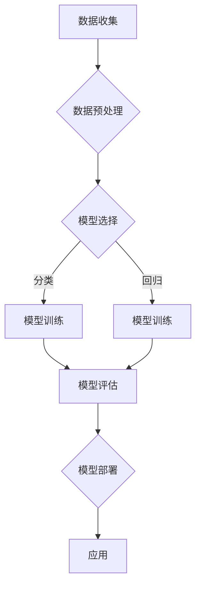

# 监督学习 原理与代码实例讲解

> 关键词：监督学习，机器学习，分类算法，回归算法，决策树，神经网络，Scikit-learn，Python

## 1. 背景介绍

监督学习是机器学习领域中最基础也最常用的学习方法之一。它通过学习已知标签的数据，让模型学会如何对未知数据进行分类或回归。监督学习在图像识别、自然语言处理、推荐系统等领域有着广泛的应用。

本文将深入浅出地介绍监督学习的基本原理，并通过Python代码实例讲解如何使用Scikit-learn库进行监督学习任务。

## 2. 核心概念与联系

### 2.1 监督学习的定义

监督学习是一种从标注数据中学习映射关系的机器学习方法。它要求输入数据和对应的标签都是已知的。

### 2.2 监督学习的类型

- **分类**：将数据分为不同的类别。
- **回归**：预测一个连续的数值输出。

### 2.3 监督学习的流程

1. 数据收集：收集用于训练的数据集。
2. 数据预处理：清洗、转换和标准化数据。
3. 模型选择：选择合适的机器学习算法。
4. 模型训练：使用训练数据训练模型。
5. 模型评估：使用测试数据评估模型性能。
6. 模型部署：将模型应用到实际场景中。

### 2.4 Mermaid 流程图



## 3. 核心算法原理 & 具体操作步骤

### 3.1 算法原理概述

监督学习算法主要包括以下几类：

- **基于实例的学习**：如K最近邻(K-Nearest Neighbors, KNN)。
- **基于决策树**：如分类与回归树(Classification and Regression Trees, CART)。
- **基于支持向量机**：如支持向量机(Support Vector Machine, SVM)。
- **基于贝叶斯**：如朴素贝叶斯(Naive Bayes)。
- **基于神经网络**：如多层感知器(Multi-Layer Perceptron, MLP)。

### 3.2 算法步骤详解

1. **数据收集**：收集数据集，并标注每个样本的类别或数值标签。
2. **数据预处理**：清洗数据，处理缺失值，标准化或归一化数据。
3. **模型选择**：根据任务类型和数据特点选择合适的算法。
4. **模型训练**：使用训练数据训练模型参数。
5. **模型评估**：使用测试数据评估模型性能，调整模型参数。
6. **模型部署**：将模型应用到实际场景中。

### 3.3 算法优缺点

以下是几种常见监督学习算法的优缺点：

- **KNN**：
  - 优点：简单易懂，对异常值不敏感。
  - 缺点：计算量大，难以处理高维数据。
- **CART**：
  - 优点：易于理解，可以处理高维数据。
  - 缺点：可能产生过拟合。
- **SVM**：
  - 优点：泛化能力强，可以处理非线性问题。
  - 缺点：计算复杂度较高。
- **朴素贝叶斯**：
  - 优点：简单高效，适用于文本分类。
  - 缺点：假设特征之间相互独立，可能不适用于复杂问题。
- **MLP**：
  - 优点：可以学习复杂的非线性关系。
  - 缺点：需要大量参数和计算资源。

### 3.4 算法应用领域

监督学习算法在以下领域有着广泛的应用：

- **图像识别**：如人脸识别、物体识别。
- **自然语言处理**：如文本分类、情感分析。
- **推荐系统**：如电影推荐、商品推荐。
- **医疗诊断**：如疾病诊断、药物推荐。

## 4. 数学模型和公式 & 详细讲解 & 举例说明

### 4.1 数学模型构建

监督学习的数学模型通常可以表示为：

$$
y = f(x, \theta)
$$

其中，$y$ 为输出，$x$ 为输入，$\theta$ 为模型参数。

### 4.2 公式推导过程

以线性回归为例，其数学模型可以表示为：

$$
y = \theta_0 + \theta_1x_1 + \theta_2x_2 + \ldots + \theta_nx_n
$$

其中，$\theta_0, \theta_1, \ldots, \theta_n$ 为模型参数，$x_1, x_2, \ldots, x_n$ 为输入特征。

### 4.3 案例分析与讲解

以下是一个使用Scikit-learn库进行线性回归的Python代码实例：

```python
from sklearn.linear_model import LinearRegression
from sklearn.model_selection import train_test_split
from sklearn.metrics import mean_squared_error
import numpy as np

# 创建数据集
X = np.array([[1, 2], [3, 4], [5, 6], [7, 8], [9, 10]])
y = np.array([1, 4, 9, 16, 25])

# 划分训练集和测试集
X_train, X_test, y_train, y_test = train_test_split(X, y, test_size=0.2, random_state=42)

# 创建线性回归模型
model = LinearRegression()

# 训练模型
model.fit(X_train, y_train)

# 预测测试集结果
y_pred = model.predict(X_test)

# 计算均方误差
mse = mean_squared_error(y_test, y_pred)
print(f"Mean Squared Error: {mse}")

# 输出模型参数
print(f"Coefficients: {model.coef_}")
print(f"Intercept: {model.intercept_}")
```

运行上述代码，将输出测试集的均方误差以及模型参数。通过均方误差可以评估模型的预测性能。

## 5. 项目实践：代码实例和详细解释说明

### 5.1 开发环境搭建

在进行监督学习项目实践之前，需要准备以下开发环境：

- Python 3.x
- Scikit-learn
- NumPy
- Matplotlib

### 5.2 源代码详细实现

以下是一个使用Scikit-learn库进行KNN分类的Python代码实例：

```python
from sklearn.neighbors import KNeighborsClassifier
from sklearn.model_selection import train_test_split
from sklearn.metrics import accuracy_score
import numpy as np

# 创建数据集
X = np.array([[1, 2], [2, 3], [3, 4], [4, 5], [5, 6]])
y = np.array([0, 0, 1, 1, 1])

# 划分训练集和测试集
X_train, X_test, y_train, y_test = train_test_split(X, y, test_size=0.2, random_state=42)

# 创建KNN分类器
model = KNeighborsClassifier(n_neighbors=3)

# 训练模型
model.fit(X_train, y_train)

# 预测测试集结果
y_pred = model.predict(X_test)

# 计算准确率
accuracy = accuracy_score(y_test, y_pred)
print(f"Accuracy: {accuracy}")
```

运行上述代码，将输出测试集的准确率。

### 5.3 代码解读与分析

以上代码首先创建了一个简单的二维数据集，并划分了训练集和测试集。然后，使用KNN分类器进行训练，并在测试集上进行预测。最后，计算并输出模型的准确率。

### 5.4 运行结果展示

假设测试集的准确率为80%，这表明KNN分类器在该数据集上表现良好。

## 6. 实际应用场景

监督学习在以下领域有着广泛的应用：

- **图像识别**：如人脸识别、物体识别。
- **自然语言处理**：如文本分类、情感分析。
- **推荐系统**：如电影推荐、商品推荐。
- **医疗诊断**：如疾病诊断、药物推荐。

## 7. 工具和资源推荐

### 7.1 学习资源推荐

- **书籍**：
  - 《Python机器学习》
  - 《统计学习方法》
- **在线课程**：
  - Coursera上的《机器学习》课程
  - edX上的《机器学习》课程

### 7.2 开发工具推荐

- **Python**：Python是一种功能强大的编程语言，拥有丰富的机器学习库。
- **Scikit-learn**：Scikit-learn是一个开源机器学习库，提供了多种机器学习算法的实现。
- **NumPy**：NumPy是一个科学计算库，用于数值计算。
- **Matplotlib**：Matplotlib是一个绘图库，用于数据可视化。

### 7.3 相关论文推荐

- **《A Few Useful Things to Know about Machine Learning》**
- **《Statistical Learning with Python》**

## 8. 总结：未来发展趋势与挑战

### 8.1 研究成果总结

本文介绍了监督学习的基本原理、核心算法、数学模型以及实际应用。通过Python代码实例，展示了如何使用Scikit-learn库进行监督学习任务。

### 8.2 未来发展趋势

- **深度学习**：深度学习在监督学习领域取得了巨大成功，未来将继续发展，并在更多领域得到应用。
- **强化学习**：强化学习与监督学习相结合，将在决策优化、控制等领域得到应用。
- **迁移学习**：迁移学习将使得监督学习更容易应用于新任务。

### 8.3 面临的挑战

- **数据获取**：获取高质量的标注数据仍然是一个挑战。
- **模型可解释性**：如何解释模型的决策过程是一个挑战。
- **算法复杂度**：如何降低算法的复杂度是一个挑战。

### 8.4 研究展望

未来，监督学习将继续发展，并在更多领域得到应用。同时，研究者需要解决数据获取、模型可解释性、算法复杂度等挑战，以推动机器学习技术的发展。

## 9. 附录：常见问题与解答

**Q1：监督学习与无监督学习有什么区别？**

A：监督学习需要标注数据，而无监督学习不需要。监督学习适用于分类和回归任务，而无监督学习适用于聚类和降维任务。

**Q2：如何选择合适的机器学习算法？**

A：选择合适的机器学习算法需要考虑数据特点、任务类型和计算资源等因素。通常需要尝试多种算法，并通过实验比较它们的性能。

**Q3：如何提高模型的性能？**

A：提高模型性能的方法包括数据预处理、特征工程、模型选择、超参数调优等。

**Q4：如何避免过拟合？**

A：避免过拟合的方法包括正则化、交叉验证、早停法等。

**Q5：什么是交叉验证？**

A：交叉验证是一种评估模型性能的方法，将数据集分为多个子集，轮流用作训练集和测试集，计算模型在各个子集上的性能指标，取平均值作为最终性能指标。

作者：禅与计算机程序设计艺术 / Zen and the Art of Computer Programming