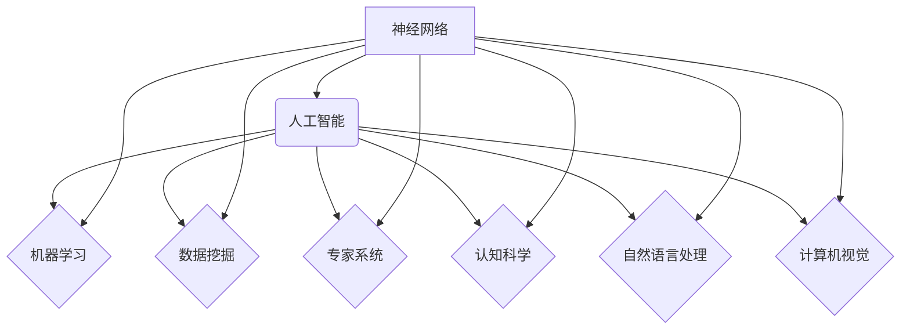

# 神经网络：人工智能的基石

> 关键词：神经网络，深度学习，人工智能，机器学习，感知器，反向传播，深度神经网络，卷积神经网络，循环神经网络

## 1. 背景介绍

自20世纪50年代以来，人工智能（AI）一直是计算机科学领域的一个核心研究领域。从早期的符号主义到连接主义，再到今天的深度学习，AI的研究方法经历了多次重大变革。而神经网络作为连接主义的代表，已经成为现代AI技术的基石。本文将深入探讨神经网络的原理、算法和应用，旨在为读者提供一个全面而深入的理解。

## 2. 核心概念与联系

### 2.1 神经网络的概念

神经网络是一种模仿人脑神经元连接方式的计算模型。它由大量的神经元组成，每个神经元都与其他神经元通过突触连接，形成一个复杂的网络结构。通过学习数据，神经网络能够提取特征、识别模式并作出决策。

### 2.2 神经网络与人工智能的联系

神经网络是人工智能的核心技术之一，它为AI提供了强大的学习和推理能力。以下是一个Mermaid流程图，展示了神经网络与人工智能之间的联系：



### 2.3 神经网络与其他机器学习算法的联系

神经网络与其他机器学习算法，如支持向量机（SVM）、决策树、随机森林等，都是基于不同的学习机制。神经网络通过多层非线性变换来学习数据中的复杂模式，而其他算法则通常使用线性模型或基于规则的决策过程。

## 3. 核心算法原理 & 具体操作步骤

### 3.1 算法原理概述

神经网络的算法原理基于以下几个关键概念：

- 神经元：神经网络的基本单元，负责接收输入、处理数据和产生输出。
- 突触：连接神经元之间的连接，可以传递信号。
- 激活函数：用于决定神经元是否激活的函数，如Sigmoid、ReLU、Tanh等。
- 权重：连接神经元之间的强度参数，可以通过学习进行调整。
- 损失函数：用于评估模型预测结果与真实值之间的差异，如均方误差（MSE）、交叉熵等。
- 反向传播算法：用于更新神经网络的权重，使损失函数最小化。

### 3.2 算法步骤详解

神经网络的学习过程通常分为以下步骤：

1. 初始化权重和偏置。
2. 前向传播：将输入数据传递到网络，通过多层神经元计算输出。
3. 计算损失函数，用于评估模型的预测结果。
4. 反向传播：计算损失函数对权重和偏置的梯度，并更新参数。
5. 迭代：重复步骤2-4，直到损失函数收敛或满足其他停止条件。

### 3.3 算法优缺点

神经网络的优点：

- 能够处理非线性问题。
- 能够学习复杂的特征和模式。
- 具有很好的泛化能力。
- 能够自动提取特征。

神经网络的缺点：

- 训练过程可能需要大量数据和计算资源。
- 模型参数难以解释。
- 可能会陷入局部最小值。

### 3.4 算法应用领域

神经网络在以下领域有广泛的应用：

- 图像识别：如人脸识别、物体检测等。
- 自然语言处理：如机器翻译、情感分析等。
- 音频处理：如语音识别、音乐生成等。
- 医疗诊断：如疾病预测、药物发现等。

## 4. 数学模型和公式 & 详细讲解 & 举例说明

### 4.1 数学模型构建

神经网络的数学模型基于以下公式：

$$
y = f(\mathbf{W} \mathbf{x} + \mathbf{b})
$$

其中，$y$ 是输出，$\mathbf{W}$ 是权重矩阵，$\mathbf{x}$ 是输入向量，$\mathbf{b}$ 是偏置向量，$f$ 是激活函数。

### 4.2 公式推导过程

以下是一个简单的神经网络模型，包含一个输入层、一个隐藏层和一个输出层。

- 输入层：有3个神经元，分别对应输入特征 $x_1, x_2, x_3$。
- 隐藏层：有2个神经元，每个神经元使用ReLU激活函数。
- 输出层：有1个神经元，使用Sigmoid激活函数。

该模型的输出可以表示为：

$$
\begin{align*}
h_1 &= \max(0, W_{11}x_1 + W_{12}x_2 + W_{13}x_3 + b_1) \\
h_2 &= \max(0, W_{21}x_1 + W_{22}x_2 + W_{23}x_3 + b_2) \\
y &= \sigma(W_{31}h_1 + W_{32}h_2 + b_3)
\end{align*}
$$

其中，$W_{ij}$ 是连接输入层和隐藏层的权重，$b_i$ 是隐藏层的偏置，$W_{ki}$ 是连接隐藏层和输出层的权重，$b_k$ 是输出层的偏置，$\sigma$ 是Sigmoid激活函数。

### 4.3 案例分析与讲解

以下是一个使用Python和PyTorch框架实现的多层感知器（MLP）神经网络的例子：

```python
import torch
import torch.nn as nn

class MLP(nn.Module):
    def __init__(self):
        super(MLP, self).__init__()
        self.fc1 = nn.Linear(3, 10)  # 输入层到隐藏层
        self.fc2 = nn.Linear(10, 1)  # 隐藏层到输出层

    def forward(self, x):
        x = torch.relu(self.fc1(x))
        x = self.fc2(x)
        return x

# 实例化模型
model = MLP()

# 定义损失函数和优化器
criterion = nn.BCEWithLogitsLoss()
optimizer = torch.optim.SGD(model.parameters(), lr=0.01)

# 训练数据
x_train = torch.randn(100, 3)
y_train = torch.randint(0, 2, (100,))

# 训练模型
for epoch in range(100):
    optimizer.zero_grad()
    output = model(x_train)
    loss = criterion(output, y_train)
    loss.backward()
    optimizer.step()

    if epoch % 10 == 0:
        print(f"Epoch {epoch}, Loss: {loss.item()}")
```

在这个例子中，我们创建了一个包含两个全连接层的多层感知器模型。我们使用随机生成的训练数据对这个模型进行训练，并使用BCEWithLogitsLoss损失函数来评估模型的性能。

## 5. 项目实践：代码实例和详细解释说明

### 5.1 开发环境搭建

要开始神经网络的项目实践，您需要以下开发环境：

- Python 3.x
- PyTorch库
- NumPy库

您可以使用pip命令安装所需的库：

```bash
pip install torch numpy
```

### 5.2 源代码详细实现

以下是一个使用PyTorch实现卷积神经网络（CNN）的例子，用于图像分类任务：

```python
import torch
import torch.nn as nn
import torch.optim as optim

class CNN(nn.Module):
    def __init__(self):
        super(CNN, self).__init__()
        self.conv1 = nn.Conv2d(1, 16, kernel_size=3, stride=1, padding=1)
        self.relu = nn.ReLU()
        self.maxpool = nn.MaxPool2d(kernel_size=2, stride=2)
        self.fc1 = nn.Linear(16 * 14 * 14, 128)
        self.fc2 = nn.Linear(128, 10)

    def forward(self, x):
        x = self.relu(self.conv1(x))
        x = self.maxpool(x)
        x = x.view(-1, 16 * 14 * 14)
        x = self.relu(self.fc1(x))
        x = self.fc2(x)
        return x

# 实例化模型
model = CNN()

# 定义损失函数和优化器
criterion = nn.CrossEntropyLoss()
optimizer = optim.Adam(model.parameters(), lr=0.001)

# 训练数据
x_train = torch.randn(100, 1, 28, 28)
y_train = torch.randint(0, 10, (100,))

# 训练模型
for epoch in range(10):
    optimizer.zero_grad()
    output = model(x_train)
    loss = criterion(output, y_train)
    loss.backward()
    optimizer.step()

    if epoch % 1 == 0:
        print(f"Epoch {epoch}, Loss: {loss.item()}")
```

在这个例子中，我们创建了一个简单的CNN模型，用于对黑白图像进行分类。我们使用随机生成的训练数据对这个模型进行训练，并使用交叉熵损失函数来评估模型的性能。

### 5.3 代码解读与分析

这个CNN模型由一个卷积层、一个ReLU激活函数、一个最大池化层、一个全连接层和一个输出层组成。卷积层用于提取图像特征，ReLU激活函数用于引入非线性，最大池化层用于降低特征的空间维度，全连接层用于分类。

### 5.4 运行结果展示

在训练完成后，您可以使用测试数据来评估模型的性能。以下是一个简单的测试代码：

```python
# 测试数据
x_test = torch.randn(10, 1, 28, 28)
y_test = torch.randint(0, 10, (10,))

# 测试模型
output = model(x_test)
loss = criterion(output, y_test)

print(f"Test Loss: {loss.item()}")
```

## 6. 实际应用场景

神经网络在以下领域有广泛的应用：

- 图像识别：如人脸识别、物体检测等。
- 自然语言处理：如机器翻译、情感分析等。
- 音频处理：如语音识别、音乐生成等。
- 医疗诊断：如疾病预测、药物发现等。

## 7. 工具和资源推荐

### 7.1 学习资源推荐

- 《深度学习》（Goodfellow, Bengio, Courville著）
- 《神经网络与深度学习》（邱锡鹏著）
- PyTorch官方文档：https://pytorch.org/docs/stable/index.html

### 7.2 开发工具推荐

- PyTorch：https://pytorch.org/
- TensorFlow：https://www.tensorflow.org/

### 7.3 相关论文推荐

- “A Learning Algorithm for Continually Running Fully Connected Neural Networks”（Hinton et al., 1986）
- “Back-Propagation: The Basic Learning Mechanism of Biological Neural Networks”（Rumelhart et al., 1986）
- “Improving Neural Networks by Detecting and Re-solving Errors”（Hinton et al., 1989）

## 8. 总结：未来发展趋势与挑战

### 8.1 研究成果总结

神经网络作为人工智能的基石，已经取得了显著的成果。从简单的感知器到复杂的深度学习模型，神经网络在各个领域都取得了突破性的进展。

### 8.2 未来发展趋势

- 模型压缩和加速：为了提高神经网络的性能和效率，研究者正在探索模型压缩和加速技术，如量化、剪枝、知识蒸馏等。
- 可解释性：为了提高神经网络的透明度和可信度，研究者正在研究可解释性神经网络，如注意力机制、对抗样本等。
- 多模态学习：为了处理多模态数据，研究者正在研究多模态神经网络，如图神经网络、视频神经网络等。

### 8.3 面临的挑战

- 计算资源：神经网络的训练和推理需要大量的计算资源，特别是深度神经网络。
- 数据隐私：在训练和推理过程中，神经网络可能暴露用户的隐私数据。
- 模型泛化能力：神经网络容易过拟合，需要更多的数据来提高其泛化能力。

### 8.4 研究展望

随着技术的不断发展，神经网络将在人工智能领域发挥越来越重要的作用。未来，神经网络将与其他人工智能技术结合，如知识表示、因果推理、强化学习等，共同推动人工智能的发展。

## 9. 附录：常见问题与解答

**Q1：什么是神经网络？**

A：神经网络是一种模仿人脑神经元连接方式的计算模型，它由大量的神经元组成，每个神经元都与其他神经元通过突触连接，形成一个复杂的网络结构。

**Q2：什么是深度学习？**

A：深度学习是一种基于神经网络的机器学习技术，它通过多层神经网络来学习数据中的复杂模式。

**Q3：神经网络如何工作？**

A：神经网络通过前向传播和反向传播来学习数据中的模式。在前向传播过程中，数据通过网络的层进行传递和处理。在反向传播过程中，根据损失函数计算梯度并更新网络参数。

**Q4：什么是激活函数？**

A：激活函数是一种非线性函数，用于引入非线性变换，使神经网络能够学习更复杂的模式。

**Q5：什么是反向传播算法？**

A：反向传播算法是一种用于更新神经网络参数的算法，它通过计算损失函数对参数的梯度来优化网络性能。

**Q6：神经网络有哪些应用？**

A：神经网络在图像识别、自然语言处理、音频处理、医疗诊断等多个领域有广泛的应用。

**Q7：神经网络有哪些挑战？**

A：神经网络面临的挑战包括计算资源、数据隐私、模型泛化能力等。

**Q8：如何选择合适的神经网络架构？**

A：选择合适的神经网络架构取决于具体的应用场景和任务类型。对于不同的任务，可能需要尝试不同的架构来找到最佳模型。

**Q9：如何评估神经网络的性能？**

A：可以使用多种方法来评估神经网络的性能，如准确率、召回率、F1分数等。

**Q10：神经网络未来有哪些发展方向？**

A：神经网络的未来发展方向包括模型压缩和加速、可解释性、多模态学习等。