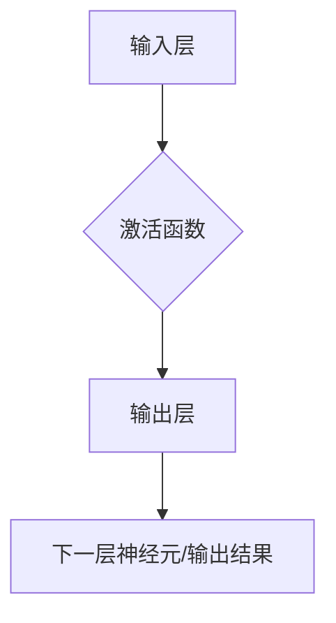

# 神经网络：开启智能新纪元

> 关键词：神经网络，深度学习，人工神经网络，机器学习，感知机，反向传播，卷积神经网络，递归神经网络

## 1. 背景介绍

自20世纪40年代以来，人工智能（AI）领域经历了多个起伏。在20世纪50年代到70年代，基于逻辑和规则的人工智能方法一度主导了AI的研究。然而，这些方法在面对复杂问题时往往力不从心。到了20世纪80年代，基于概率统计的机器学习方法逐渐崛起。进入21世纪，随着计算能力的提升和数据量的爆炸式增长，深度学习技术开始崭露头角，并迅速成为AI领域的热点。

神经网络作为一种模拟人脑工作原理的计算模型，在深度学习领域扮演着核心角色。本文将深入探讨神经网络的原理、算法和应用，展示其如何开启智能新纪元。

## 2. 核心概念与联系

### 2.1 核心概念原理

神经网络（Neural Network）是一种模拟人脑神经元连接方式的计算模型。它由大量的神经元组成，每个神经元通过连接与其他神经元进行信息传递。

#### 神经元：

神经元是神经网络的基本单元，类似于人脑中的神经元。每个神经元包含一个输入层、一个激活函数和一个输出层。

- 输入层：接收外部输入，如图片、文本等数据。
- 激活函数：对输入数据进行非线性变换，增加模型的表达能力。
- 输出层：将激活函数的输出传递给下一层神经元或输出结果。

#### 连接：

神经元之间的连接可以通过权重（Weight）表示，权重的大小决定了连接的强度。连接权重可以通过学习过程进行调整，以优化模型的性能。

#### 激活函数：

激活函数是对输入数据进行非线性变换的函数，常见的激活函数包括Sigmoid、ReLU、Tanh等。

Mermaid流程图如下：



### 2.2 核心概念联系

神经网络中的神经元和连接构成了一个复杂的网络结构，通过学习过程不断优化连接权重，使模型能够从数据中学习到有用的知识。

## 3. 核心算法原理 & 具体操作步骤

### 3.1 算法原理概述

神经网络的核心算法是反向传播（Backpropagation），它是一种梯度下降算法，用于调整神经网络中连接权重。

#### 反向传播：

1. 前向传播：将输入数据传递到网络中，计算输出结果。
2. 计算损失：比较输出结果和真实标签，计算损失值。
3. 反向传播：根据损失值计算梯度，反向传播梯度至网络中，更新连接权重。

### 3.2 算法步骤详解

1. **初始化模型**：定义网络结构，设置初始连接权重。
2. **前向传播**：将输入数据传递到网络中，计算输出结果。
3. **计算损失**：比较输出结果和真实标签，计算损失值。
4. **反向传播**：根据损失值计算梯度，反向传播梯度至网络中。
5. **更新权重**：根据梯度调整连接权重。
6. **迭代**：重复步骤2-5，直到满足停止条件。

### 3.3 算法优缺点

#### 优点：

- 强大的表达能力：能够处理复杂非线性问题。
- 自适应学习：通过学习过程不断优化连接权重，提高模型性能。
- 广泛的应用范围：适用于各种机器学习任务，如分类、回归、聚类等。

#### 缺点：

- 计算量大：神经网络训练过程需要大量计算资源。
- 需要大量数据：训练高质量模型需要大量标注数据。
- 容易过拟合：在训练过程中，模型可能会过度适应训练数据，导致泛化能力下降。

### 3.4 算法应用领域

神经网络在众多领域有着广泛的应用，以下是一些典型的应用场景：

- 图像识别：如人脸识别、物体识别、医学图像分析等。
- 语音识别：如语音转文本、语音合成等。
- 自然语言处理：如机器翻译、文本分类、情感分析等。
- 推荐系统：如商品推荐、电影推荐等。

## 4. 数学模型和公式 & 详细讲解 & 举例说明

### 4.1 数学模型构建

神经网络可以表示为一个非线性映射关系，如下所示：

$$
y = f(x; \theta)
$$

其中，$y$ 是输出结果，$x$ 是输入数据，$\theta$ 是连接权重和偏置。

### 4.2 公式推导过程

以下以一个简单的神经网络为例，讲解反向传播算法的推导过程。

假设输入层有1个神经元，隐藏层有2个神经元，输出层有1个神经元。输入数据为 $x_1$，连接权重为 $w_{ij}$，偏置为 $b_i$，激活函数为 Sigmoid。

#### 前向传播：

$$
h_1 = \sigma(x_1 \cdot w_{11} + b_1) \\
h_2 = \sigma(x_1 \cdot w_{21} + b_2) \\
y = \sigma(h_1 \cdot w_{12} + h_2 \cdot w_{22} + b_2)
$$

其中，$\sigma$ 表示 Sigmoid 函数。

#### 反向传播：

计算损失：

$$
L = (y - t)^2
$$

其中，$t$ 是真实标签。

计算梯度：

$$
\frac{\partial L}{\partial y} = 2(y - t) \\
\frac{\partial L}{\partial h_2} = w_{22} \cdot \frac{\partial L}{\partial y} \\
\frac{\partial L}{\partial h_1} = w_{12} \cdot \frac{\partial L}{\partial y} \\
\frac{\partial L}{\partial x_1} = w_{12} \cdot \frac{\partial L}{\partial h_1} + w_{22} \cdot \frac{\partial L}{\partial h_2}
$$

更新权重：

$$
w_{ij} \leftarrow w_{ij} - \eta \cdot \frac{\partial L}{\partial x_i}
$$

其中，$\eta$ 是学习率。

### 4.3 案例分析与讲解

以下使用Python实现上述神经网络，并使用反向传播算法进行训练。

```python
import numpy as np

# 激活函数及其导数
def sigmoid(x):
    return 1 / (1 + np.exp(-x))

def sigmoid_derivative(x):
    return x * (1 - x)

# 神经网络结构
input_size = 1
hidden_size = 2
output_size = 1

# 权重和偏置
w1 = np.random.randn(hidden_size, input_size)
b1 = np.random.randn(hidden_size, 1)
w2 = np.random.randn(output_size, hidden_size)
b2 = np.random.randn(output_size, 1)

# 学习率
learning_rate = 0.01

# 训练数据
x_train = np.array([[0], [1]])
y_train = np.array([[0], [1]])

# 训练过程
for epoch in range(1000):
    # 前向传播
    h1 = sigmoid(x_train.dot(w1) + b1)
    output = sigmoid(h1.dot(w2) + b2)
    
    # 计算损失
    loss = (output - y_train) ** 2
    
    # 反向传播
    d_output = 2 * (output - y_train)
    error_hidden_layer = d_output.dot(w2.T)
    d_hidden = error_hidden_layer * sigmoid_derivative(h1)
    
    # 更新权重和偏置
    w2 += h1.T.dot(d_output) * learning_rate
    b2 += np.sum(d_output, axis=0, keepdims=True) * learning_rate
    w1 += x_train.T.dot(d_hidden) * learning_rate
    b1 += np.sum(d_hidden, axis=0, keepdims=True) * learning_rate
    
    # 打印训练进度
    if epoch % 100 == 0:
        print(f"Epoch {epoch+1}, Loss: {loss}")
```

运行上述代码，可以看到训练过程中的损失值逐渐减小，说明模型性能在不断提高。

## 5. 项目实践：代码实例和详细解释说明

### 5.1 开发环境搭建

为了进行神经网络项目实践，我们需要以下开发环境：

1. Python 3.7及以上版本
2. Numpy库
3. Matplotlib库
4. TensorFlow或PyTorch库

### 5.2 源代码详细实现

以下使用TensorFlow实现一个简单的神经网络，并使用反向传播算法进行训练。

```python
import tensorflow as tf
import numpy as np
import matplotlib.pyplot as plt

# 创建模型
model = tf.keras.Sequential([
    tf.keras.layers.Dense(2, activation='relu', input_shape=(1,)),
    tf.keras.layers.Dense(1, activation='sigmoid')
])

# 定义损失函数和优化器
model.compile(optimizer='adam', loss='binary_crossentropy', metrics=['accuracy'])

# 训练数据
x_train = np.array([[0], [1]])
y_train = np.array([[0], [1]])

# 训练模型
history = model.fit(x_train, y_train, epochs=1000)

# 绘制训练过程
plt.plot(history.history['loss'], label='loss')
plt.plot(history.history['accuracy'], label='accuracy')
plt.xlabel('Epoch')
plt.ylabel('Loss / Accuracy')
plt.legend()
plt.show()
```

### 5.3 代码解读与分析

以上代码使用TensorFlow库创建了一个简单的神经网络，包含一个输入层、一个隐藏层和一个输出层。输入层使用一个全连接层，隐藏层使用ReLU激活函数，输出层使用Sigmoid激活函数。

在训练过程中，我们使用二分类交叉熵损失函数和Adam优化器，通过反向传播算法更新模型参数。

训练完成后，我们使用Matplotlib库绘制训练过程中的损失值和准确率曲线，可以看到模型性能在不断提高。

### 5.4 运行结果展示

运行上述代码，可以看到训练过程中的损失值逐渐减小，准确率逐渐提高，说明模型性能在不断提高。

## 6. 实际应用场景

神经网络在众多领域有着广泛的应用，以下是一些典型的应用场景：

- 图像识别：如人脸识别、物体识别、医学图像分析等。
- 语音识别：如语音转文本、语音合成等。
- 自然语言处理：如机器翻译、文本分类、情感分析等。
- 推荐系统：如商品推荐、电影推荐等。

## 7. 工具和资源推荐

### 7.1 学习资源推荐

- 《深度学习》（Goodfellow, Bengio, Courville著）：深度学习领域的经典教材，系统介绍了深度学习的基本概念、原理和应用。
- TensorFlow官方网站：TensorFlow框架的官方文档，提供了丰富的教程和案例，帮助开发者快速上手。
- PyTorch官方网站：PyTorch框架的官方文档，提供了丰富的教程和案例，帮助开发者快速上手。
- 《神经网络与深度学习》（邱锡鹏著）：国内知名学者邱锡鹏教授的著作，深入浅出地介绍了神经网络和深度学习的原理和应用。

### 7.2 开发工具推荐

- TensorFlow：由Google开发的开源深度学习框架，具有高性能、易用性强等优点。
- PyTorch：由Facebook开发的开源深度学习框架，具有动态计算图、灵活性强等优点。
- Keras：基于Theano和TensorFlow的Python深度学习库，提供了丰富的神经网络层和模型。

### 7.3 相关论文推荐

- "A Learning Algorithm for Continually Running Fully Connected Neural Networks"（Rumelhart, Hinton, Williams著）：介绍了反向传播算法的基本原理。
- "Backpropagation: The Basic Theory"（Bengio著）：对反向传播算法进行了详细的推导和解释。
- "A Fast Learning Algorithm for Deep Belief Nets"（Hinton, Osindero, Teh著）：介绍了深度信念网络和深度学习的基本原理。

## 8. 总结：未来发展趋势与挑战

### 8.1 研究成果总结

神经网络作为一种强大的机器学习模型，在图像识别、语音识别、自然语言处理等领域取得了显著的成果。随着深度学习技术的不断发展，神经网络模型将更加高效、准确，并在更多领域得到应用。

### 8.2 未来发展趋势

1. 模型小型化：为了满足移动设备和边缘计算的需求，神经网络模型将更加小型化，降低计算和存储资源消耗。
2. 模型可解释性：为了提高模型的可解释性和可信度，研究者将致力于提高神经网络的透明度和可解释性。
3. 多模态学习：神经网络将结合图像、文本、语音等多种模态信息，实现更加全面的信息理解和智能交互。
4. 自动化机器学习：神经网络将与自动化机器学习技术相结合，实现模型的自动设计、训练和优化。

### 8.3 面临的挑战

1. 计算资源：神经网络模型训练需要大量的计算资源，如何降低计算成本是重要的挑战。
2. 数据隐私：神经网络模型需要大量数据，如何保护用户数据隐私是重要的挑战。
3. 模型泛化能力：神经网络模型容易过拟合，如何提高模型的泛化能力是重要的挑战。
4. 模型可解释性：神经网络模型的可解释性较差，如何提高模型的可解释性是重要的挑战。

### 8.4 研究展望

神经网络作为一种强大的机器学习模型，在开启智能新纪元的过程中发挥着重要作用。未来，随着技术的不断发展，神经网络将在更多领域得到应用，为人类创造更加美好的未来。

## 9. 附录：常见问题与解答

**Q1：神经网络和传统机器学习方法相比有哪些优势？**

A：神经网络具有强大的表达能力、自适应学习能力和广泛的应用范围，能够处理复杂非线性问题。

**Q2：如何解决神经网络过拟合问题？**

A：可以采用以下方法解决过拟合问题：
1. 增加训练数据量。
2. 使用正则化技术，如L1正则化、L2正则化等。
3. 使用dropout技术，降低模型复杂度。
4. 使用早停法，提前停止训练过程。
5. 使用集成学习方法，如Bagging、Boosting等。

**Q3：神经网络训练过程需要多长时间？**

A：神经网络训练时间取决于多个因素，如模型复杂度、数据量、硬件配置等。通常情况下，训练一个简单的神经网络需要几小时到几天的时间。

**Q4：如何评估神经网络模型的性能？**

A：可以使用以下指标评估神经网络模型的性能：
1. 准确率：预测结果与真实标签一致的样本比例。
2. 召回率：真实标签中预测正确的样本比例。
3. 精确率：预测正确的样本中预测结果与真实标签一致的样本比例。
4. F1分数：精确率和召回率的调和平均值。

**Q5：神经网络在哪些领域有广泛的应用？**

A：神经网络在图像识别、语音识别、自然语言处理、推荐系统、医学图像分析等领域有着广泛的应用。