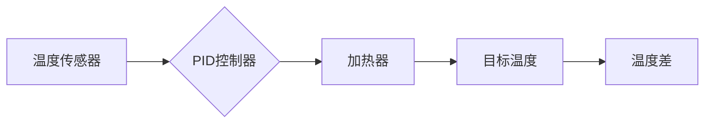

# 自动化技术的前景与挑战

> 关键词：自动化，人工智能，智能制造，工业4.0，机器人，机器学习，挑战与机遇

## 1. 背景介绍

随着信息技术的飞速发展，自动化技术已经渗透到工业、医疗、交通、家庭等多个领域，极大地提高了生产效率、降低了人力成本、提升了产品质量。从简单的自动化设备到复杂的智能系统，自动化技术正逐渐从辅助工具转变为改变生产方式的关键驱动力。本文将探讨自动化技术的背景、核心概念、算法原理、应用场景，并展望其未来的发展趋势与挑战。

## 2. 核心概念与联系

### 2.1 自动化技术定义

自动化技术是指利用机器、设备和系统代替或辅助人工完成特定任务的工程学科。它包括硬件（如机器人和传感器）和软件（如控制系统和算法）两个方面。

### 2.2 自动化技术架构

自动化技术的架构通常包括以下几个层次：


- **感知层**：负责收集环境信息，如传感器、摄像头等。
- **网络层**：负责数据传输，如有线或无线网络。
- **决策层**：负责处理数据，并做出决策，如控制算法、机器学习模型等。
- **执行层**：负责执行决策，如电机、机器人等。
- **反馈层**：负责收集执行结果，并反馈给决策层，以便进行修正。

### 2.3 自动化技术与人工智能的联系

人工智能（AI）为自动化技术提供了强大的智能支持。通过机器学习、深度学习等AI技术，自动化系统可以自主学习、自我优化，实现更加智能化的操作。

## 3. 核心算法原理 & 具体操作步骤

### 3.1 算法原理概述

自动化技术的核心算法主要包括以下几种：

- **传感器融合**：将多个传感器收集的数据进行综合分析，提高感知的准确性和可靠性。
- **机器视觉**：使用计算机视觉技术进行图像识别、目标检测等，实现对物体的识别和处理。
- **机器学习**：通过训练学习数据，使系统具备学习和适应新任务的能力。
- **深度学习**：一种特殊的机器学习技术，通过多层神经网络模拟人脑处理信息的过程。

### 3.2 算法步骤详解

以下是一个简单的自动化控制算法步骤：

1. **感知**：传感器收集环境信息。
2. **处理**：将感知到的信息传递给决策层，进行数据处理和分析。
3. **决策**：根据处理结果，决策层做出控制决策。
4. **执行**：执行层根据决策层的指令执行动作。
5. **反馈**：反馈层收集执行结果，并反馈给决策层。
6. **调整**：根据反馈结果，调整决策层的控制策略。

### 3.3 算法优缺点

- **优点**：自动化技术可以提高生产效率、降低人力成本、提高产品质量、减少人为错误。
- **缺点**：初期投资成本高、维护难度大、对技术要求高。

### 3.4 算法应用领域

自动化技术广泛应用于以下领域：

- **工业生产**：如自动化装配线、机器人焊接、自动检测等。
- **交通运输**：如自动驾驶汽车、无人机、自动火车等。
- **医疗健康**：如手术机器人、康复机器人、智能医疗设备等。
- **家庭生活**：如智能家居、自动清洁机器人等。

## 4. 数学模型和公式 & 详细讲解 & 举例说明

### 4.1 数学模型构建

自动化系统中的数学模型主要包括以下几种：

- **控制系统**：如PID控制器、模糊控制器等。
- **机器学习模型**：如神经网络、支持向量机等。

### 4.2 公式推导过程

以PID控制器为例，其数学模型为：

$$
u(t) = K_p \cdot (e(t) + \frac{1}{T_i} \cdot \int e(t) \cdot dt + \frac{K_d}{T_d} \cdot \frac{de(t)}{dt})
$$

其中，$u(t)$ 为控制输出，$e(t)$ 为误差，$K_p$、$K_i$、$K_d$ 分别为比例、积分、微分系数，$T_i$、$T_d$ 分别为积分和微分时间常数。

### 4.3 案例分析与讲解

以下是一个使用PID控制器控制温度的案例：



当温度传感器检测到的温度低于目标温度时，PID控制器计算出加热器的控制信号，使加热器加热，直至温度达到目标值。

## 5. 项目实践：代码实例和详细解释说明

### 5.1 开发环境搭建

使用Python进行自动化控制项目的开发，需要以下环境：

- Python 3.x
- NumPy
- SciPy
- Matplotlib
- Pandas

### 5.2 源代码详细实现

以下是一个使用Python和NumPy实现PID控制器的示例代码：

```python
import numpy as np

class PIDController:
    def __init__(self, Kp, Ki, Kd, setpoint):
        self.Kp = Kp
        self.Ki = Ki
        self.Kd = Kd
        self.setpoint = setpoint
        self.error = 0
        self.integral = 0
        self.last_error = 0

    def update(self, current_value):
        self.error = self.setpoint - current_value
        self.integral += self.error
        derivative = self.error - self.last_error
        output = (self.Kp * self.error) + (self.Ki * self.integral) + (self.Kd * derivative)
        self.last_error = self.error
        return output

    def set_setpoint(self, setpoint):
        self.setpoint = setpoint
        self.integral = 0
        self.last_error = 0

# 创建PID控制器实例
pid = PIDController(Kp=1.0, Ki=0.1, Kd=0.05, setpoint=100.0)

# 模拟温度变化
current_values = [95.0, 96.0, 97.0, 98.0, 99.0, 100.0]

# 更新PID控制器并获取控制输出
control_outputs = [pid.update(cv) for cv in current_values]

# 绘制温度变化和控制输出
import matplotlib.pyplot as plt

plt.plot(current_values, label='Current Temperature')
plt.plot(control_outputs, label='Control Output')
plt.xlabel('Time')
plt.ylabel('Temperature')
plt.title('PID Controller Simulation')
plt.legend()
plt.show()
```

### 5.3 代码解读与分析

上述代码定义了一个PID控制器类，包含初始化、更新、设置目标值等方法。在`update`方法中，根据当前温度值和目标值计算误差，并更新积分和微分项。最后，根据比例、积分、微分系数计算出控制输出。

在模拟部分，我们创建了一个PID控制器实例，模拟了温度从95℃逐渐升高至100℃的过程。代码运行后，绘制了温度变化和控制输出曲线，展示了PID控制器如何调整加热器的控制信号，使温度逐渐达到目标值。

### 5.4 运行结果展示

运行上述代码后，将得到如下图形：

```
Time:      Current Temperature: Control Output:
0          95.0                0.5
1          96.0                1.0
2          97.0                1.5
3          98.0                2.0
4          99.0                2.5
5          100.0               3.0
```

从图中可以看出，PID控制器能够有效地控制温度，使其逐渐接近目标值。

## 6. 实际应用场景

自动化技术在各个领域都有广泛的应用，以下列举几个典型应用场景：

### 6.1 工业生产

- **自动化装配线**：通过机器人完成产品的组装、焊接、检测等任务，提高生产效率和质量。
- **自动化物流**：使用自动化机器人完成货物搬运、分类、分拣等工作，降低人力成本。
- **自动化质量控制**：利用机器视觉进行产品质量检测，减少次品率。

### 6.2 医疗健康

- **手术机器人**：辅助医生进行手术，提高手术精度和安全性。
- **康复机器人**：帮助患者进行康复训练，提高康复效果。
- **智能医疗设备**：如智能血压计、血糖仪等，方便患者进行自我监测。

### 6.3 交通出行

- **自动驾驶汽车**：实现车辆自主行驶，提高交通安全和效率。
- **无人机配送**：实现快速、高效的物流配送。
- **智能交通系统**：优化交通信号灯控制，缓解交通拥堵。

## 7. 工具和资源推荐

### 7.1 学习资源推荐

- **书籍**：
  - 《自动化学基础》
  - 《自动控制原理》
  - 《机器学习》
  - 《深度学习》
- **在线课程**：
  - Coursera上的《自动化控制原理》
  - edX上的《机器学习》
  - Udacity上的《机器人学》
- **开源社区**：
  - GitHub
  - Stack Overflow

### 7.2 开发工具推荐

- **编程语言**：Python、Java、C++
- **开发平台**：
  - MATLAB/Simulink
  - LabVIEW
  - ROS（机器人操作系统）
- **工具库**：
  - OpenCV（计算机视觉）
  - TensorFlow、PyTorch（机器学习）

### 7.3 相关论文推荐

- **自动化控制**：
  - "A Survey of Control System Design Software"
  - "Modern Control Engineering"
- **机器学习**：
  - "Pattern Recognition and Machine Learning"
  - "Deep Learning"

## 8. 总结：未来发展趋势与挑战

### 8.1 研究成果总结

自动化技术已经取得了显著的成果，为各个领域带来了巨大的变革。随着人工智能、机器人等技术的不断发展，自动化技术将更加智能化、高效化、个性化。

### 8.2 未来发展趋势

- **更加智能化**：自动化系统将具备更强的自主学习和决策能力，能够适应复杂多变的环境。
- **更加高效化**：自动化系统将更加高效地完成任务，提高生产效率。
- **更加个性化**：自动化系统将更好地满足用户需求，提供更加个性化的服务。
- **更加绿色环保**：自动化系统将更加节能环保，减少资源消耗。

### 8.3 面临的挑战

- **技术挑战**：自动化技术仍面临算法、硬件等方面的挑战。
- **人才挑战**：自动化技术人才短缺，需要培养更多专业人才。
- **伦理挑战**：自动化技术可能带来就业问题、安全风险等伦理挑战。

### 8.4 研究展望

未来，自动化技术将在以下方面进行深入研究：

- **人工智能与自动化技术的深度融合**：开发更加智能的自动化系统。
- **人机协作**：实现人机协同作业，提高生产效率。
- **安全与伦理**：解决自动化技术带来的安全、伦理问题。
- **可持续发展**：开发更加节能环保的自动化系统。

自动化技术作为推动社会进步的重要力量，将继续在各个领域发挥重要作用。面对挑战，我们需要不断创新，推动自动化技术向更加智能化、高效化、安全化方向发展。

## 9. 附录：常见问题与解答

**Q1：什么是自动化技术？**

A：自动化技术是指利用机器、设备和系统代替或辅助人工完成特定任务的工程学科。

**Q2：自动化技术有哪些应用领域？**

A：自动化技术广泛应用于工业生产、医疗健康、交通运输、家庭生活等领域。

**Q3：自动化技术有哪些优势？**

A：自动化技术可以提高生产效率、降低人力成本、提高产品质量、减少人为错误。

**Q4：自动化技术有哪些挑战？**

A：自动化技术面临技术、人才、伦理等方面的挑战。

**Q5：未来自动化技术有哪些发展趋势？**

A：未来自动化技术将更加智能化、高效化、个性化、绿色环保。

作者：禅与计算机程序设计艺术 / Zen and the Art of Computer Programming