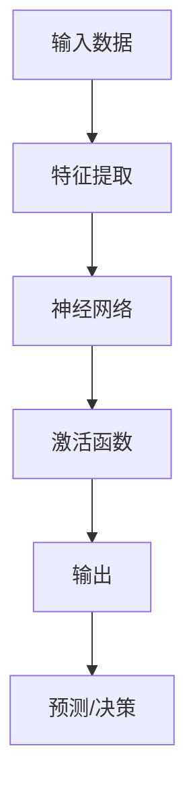
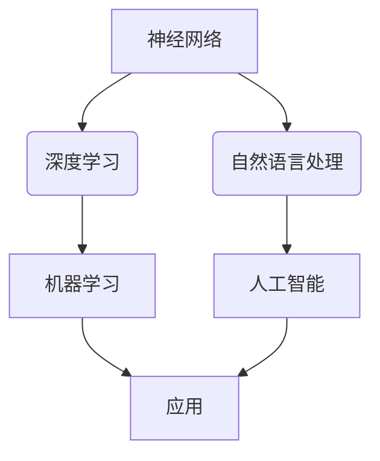

> 人工智能，机器学习，深度学习，神经网络，自然语言处理，智能驾驶，自动化，自动化决策，人机交互

# Andrej Karpathy：人工智能的未来发展前景

## 1. 背景介绍

在当今世界，人工智能（AI）已经从科幻小说的想象跃然成为现实，深刻地影响着我们的生活。Andrej Karpathy，作为一位杰出的AI科学家，以其在自然语言处理（NLP）和机器学习领域的贡献而闻名。本文将探讨Andrej Karpathy的工作及其对人工智能未来发展的潜在影响。

### 1.1 问题的由来

人工智能的快速发展引发了广泛的社会关注。人们对于AI的潜在影响、伦理问题以及其在不同领域的应用前景充满了好奇和担忧。Andrej Karpathy的研究和观点为我们提供了一个深入洞察AI未来的窗口。

### 1.2 研究现状

Karpathy在NLP领域的工作主要集中在神经网络和深度学习技术，特别是其与自然语言理解的结合。他的研究对AI领域产生了深远的影响，推动了一系列技术的发展和应用。

### 1.3 研究意义

Karpathy的工作不仅推动了AI技术的进步，而且对AI的伦理和未来发展提出了深刻的见解。了解他的工作对于理解AI的未来发展至关重要。

### 1.4 本文结构

本文将分为以下几个部分：
- 介绍Karpathy的核心概念和他在AI领域的贡献。
- 探讨深度学习在AI中的应用和挑战。
- 分析AI在不同领域的实际应用场景。
- 展望AI的未来发展趋势和面临的挑战。
- 提供相关学习资源和发展建议。

## 2. 核心概念与联系

### 2.1 核心概念原理

在AI领域，有几个核心概念对理解Karpathy的工作至关重要：

- **神经网络**：由相互连接的神经元组成的计算系统，能够通过学习数据来识别模式和进行预测。
- **深度学习**：一种特殊的神经网络结构，能够处理大规模数据集，并在视觉、语音和语言理解等领域取得了显著成果。
- **自然语言处理**：使计算机能够理解和生成人类语言的技术。

以下是这些概念的Mermaid流程图：



### 2.2 关系图

这些概念之间的关系可以用以下流程图表示：



## 3. 核心算法原理 & 具体操作步骤

### 3.1 算法原理概述

Karpathy在AI领域的工作主要集中在深度学习和NLP。以下是一些关键算法原理：

- **反向传播（Backpropagation）**：一种用于训练神经网络的算法，通过计算误差来调整网络权重。
- **词嵌入（Word Embeddings）**：将词汇转换为向量表示，使计算机能够理解词汇的语义关系。
- **循环神经网络（RNN）**：一种特殊的神经网络，能够处理序列数据，如文本。

### 3.2 算法步骤详解

以下是这些算法的详细步骤：

- **反向传播**：
  1. 前向传播：将输入数据通过网络，计算输出。
  2. 计算损失：比较输出与真实标签，计算损失值。
  3. 反向传播：计算梯度，更新网络权重以减少损失。

- **词嵌入**：
  1. 收集词汇表和相应的文本数据。
  2. 使用预训练的词嵌入模型或自训练词嵌入模型。
  3. 将词汇转换为向量表示。

- **RNN**：
  1. 设计RNN结构，如LSTM或GRU。
  2. 使用预训练词嵌入作为输入。
  3. 训练RNN模型以预测下一个词或序列。

### 3.3 算法优缺点

- **反向传播**：
  - 优点：能够有效训练深层神经网络。
  - 缺点：计算量大，收敛速度慢。

- **词嵌入**：
  - 优点：能够捕捉词汇的语义关系。
  - 缺点：需要大量的计算资源进行训练。

- **RNN**：
  - 优点：能够处理序列数据。
  - 缺点：难以捕捉长距离依赖。

### 3.4 算法应用领域

这些算法在以下领域得到广泛应用：

- 自然语言处理
- 计算机视觉
- 语音识别
- 医疗诊断

## 4. 数学模型和公式 & 详细讲解 & 举例说明

### 4.1 数学模型构建

以下是一些关键的数学模型：

- **神经网络**：由多层神经元组成，每层由加权连接和激活函数组成。

$$
y = f(W_1 \cdot x + b_1) + f(W_2 \cdot f(W_1 \cdot x + b_1) + b_2) + \ldots + f(W_n \cdot f(\ldots) + b_n)
$$

- **词嵌入**：将词汇转换为向量表示。

$$
v_w = \mathcal{T}(w)
$$

- **RNN**：使用递归函数来处理序列数据。

$$
h_t = f(W_x \cdot x_t + W_h \cdot h_{t-1} + b_h)
$$

### 4.2 公式推导过程

以下是对上述公式的推导过程：

- **神经网络**：每一层的输出都是前一层输出和权重矩阵的乘积加上偏置向量，再应用激活函数。
- **词嵌入**：词嵌入模型通常使用无监督学习或监督学习的方法来学习词汇的向量表示。
- **RNN**：递归神经网络通过递归函数来处理序列数据，其中 $h_t$ 是在第 $t$ 步的隐藏状态。

### 4.3 案例分析与讲解

以下是一个简单的例子，使用神经网络来分类文本：

1. **数据准备**：收集一组文本数据，并为每个文本分配一个类别标签。
2. **预处理**：将文本转换为词嵌入向量。
3. **模型构建**：构建一个包含多个隐藏层的神经网络。
4. **训练**：使用反向传播算法训练模型。
5. **评估**：在测试集上评估模型性能。

## 5. 项目实践：代码实例和详细解释说明

### 5.1 开发环境搭建

为了进行AI项目，需要以下开发环境：

- 编程语言：Python
- 框架：TensorFlow或PyTorch
- 工具：NumPy、Matplotlib等

### 5.2 源代码详细实现

以下是一个简单的神经网络文本分类器的代码示例：

```python
import tensorflow as tf
from tensorflow.keras.preprocessing.text import Tokenizer
from tensorflow.keras.preprocessing.sequence import pad_sequences
from tensorflow.keras.models import Sequential
from tensorflow.keras.layers import Embedding, Dense

# 加载数据
texts = [...]  # 文本数据
labels = [...]  # 标签数据

# 分词和序列化
tokenizer = Tokenizer()
tokenizer.fit_on_texts(texts)
sequences = tokenizer.texts_to_sequences(texts)
padded = pad_sequences(sequences, maxlen=200)

# 构建模型
model = Sequential()
model.add(Embedding(input_dim=len(tokenizer.word_index) + 1, output_dim=64, input_length=200))
model.add(Dense(64, activation='relu'))
model.add(Dense(1, activation='sigmoid'))

# 编译模型
model.compile(loss='binary_crossentropy', optimizer='adam', metrics=['accuracy'])

# 训练模型
model.fit(padded, labels, batch_size=32, epochs=10)

# 评估模型
# ...
```

### 5.3 代码解读与分析

这段代码首先导入了必要的库，然后加载数据并对其进行预处理。接下来，构建了一个简单的神经网络模型，包括嵌入层、全连接层和输出层。最后，编译和训练模型。

### 5.4 运行结果展示

运行上述代码后，模型会在训练集和测试集上进行训练和评估。根据模型性能，可以调整模型结构、超参数等。

## 6. 实际应用场景

AI在以下领域有广泛的应用：

- **智能驾驶**：使用深度学习技术识别道路上的物体，实现自动驾驶。
- **自动化**：通过机器人自动化重复性任务，提高生产效率。
- **自动化决策**：使用AI系统进行决策，如信贷审批、投资管理等。
- **人机交互**：开发更自然的人机交互界面，如聊天机器人、语音助手等。

## 7. 工具和资源推荐

### 7.1 学习资源推荐

- 《深度学习》（Goodfellow, Bengio, Courville）
- 《Python深度学习》（Goodfellow, Bengio, Courville）
- 《机器学习实战》（Peter Harrington）

### 7.2 开发工具推荐

- TensorFlow
- PyTorch
- Keras

### 7.3 相关论文推荐

- "Deep Learning for NLP"（Zarefatpour, Socher, Hopcroft）
- "Attention is All You Need"（Vaswani et al.）
- "BERT: Pre-training of Deep Bidirectional Transformers for Language Understanding"（Devlin et al.）

## 8. 总结：未来发展趋势与挑战

### 8.1 研究成果总结

Karpathy的工作在AI领域取得了显著的成果，推动了深度学习和NLP技术的发展。他的研究为我们理解AI的未来发展提供了宝贵的见解。

### 8.2 未来发展趋势

- **多模态学习**：结合文本、图像、音频等多种模态数据进行学习。
- **强化学习**：使用强化学习进行决策和优化。
- **无监督学习**：减少对标注数据的依赖。

### 8.3 面临的挑战

- **数据隐私**：如何保护用户数据隐私。
- **模型可解释性**：如何解释AI模型的决策过程。
- **安全性和可靠性**：如何确保AI系统的安全性和可靠性。

### 8.4 研究展望

AI的未来充满潜力，但也面临诸多挑战。我们需要不断探索和创新，以应对这些挑战，推动AI技术的健康发展。

## 9. 附录：常见问题与解答

**Q1：什么是深度学习？**

A1：深度学习是一种特殊的机器学习技术，它使用多层神经网络来学习数据的复杂模式。

**Q2：什么是自然语言处理？**

A2：自然语言处理是使计算机能够理解和生成人类语言的技术。

**Q3：AI有哪些应用？**

A3：AI的应用包括智能驾驶、自动化、自动化决策、人机交互等。

**Q4：AI的未来发展趋势是什么？**

A4：AI的未来发展趋势包括多模态学习、强化学习和无监督学习。

**Q5：AI面临哪些挑战？**

A5：AI面临的数据隐私、模型可解释性和安全性和可靠性等挑战。

作者：禅与计算机程序设计艺术 / Zen and the Art of Computer Programming