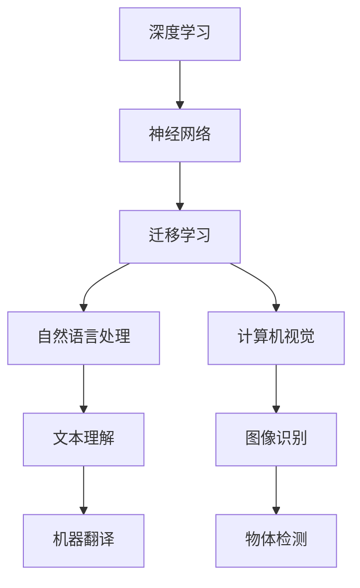

# Andrej Karpathy：人工智能的未来发展方向

> 关键词：Andrej Karpathy, 人工智能，深度学习，神经网络，迁移学习，自然语言处理，计算机视觉，未来趋势

## 1. 背景介绍

Andrej Karpathy 是一位杰出的计算机科学家和工程师，以其在自然语言处理（NLP）和计算机视觉领域的贡献而闻名。他在 OpenAI 工作了多年，并在那里参与了 GPT 和其他关键项目。在本文中，我们将探讨 Andrej Karpathy 关于人工智能未来发展方向的观点，并分析这些趋势如何影响我们理解和构建智能系统。

## 2. 核心概念与联系

### 2.1 核心概念

- **深度学习**：一种机器学习技术，通过多层神经网络学习数据的复杂模式。
- **神经网络**：由相互连接的神经元组成的计算模型，能够模拟人脑的学习和决策过程。
- **迁移学习**：将一个任务领域学到的知识应用于另一个相关但不同的任务领域。
- **自然语言处理（NLP）**：人工智能的一个分支，专注于使计算机能够理解、解释和生成人类语言。
- **计算机视觉**：人工智能的一个分支，涉及让计算机理解和解释图像和视频。

### 2.2 Mermaid 流程图



## 3. 核心算法原理 & 具体操作步骤

### 3.1 算法原理概述

Andrej Karpathy 强调了深度学习在人工智能中的核心作用，特别是神经网络在学习和模拟复杂模式方面的能力。迁移学习是实现这一目标的关键，因为它允许我们利用已经在一个领域学习到的知识来解决另一个领域的问题。

### 3.2 算法步骤详解

1. **数据收集**：从不同的来源收集大量数据，包括文本、图像和视频。
2. **预处理**：清洗、标注和格式化数据，以便神经网络可以处理。
3. **模型选择**：选择合适的神经网络架构，如卷积神经网络（CNN）用于计算机视觉，循环神经网络（RNN）用于NLP。
4. **训练**：使用标注数据训练神经网络，调整权重以最小化损失函数。
5. **迁移学习**：利用预训练模型作为起点，仅在特定任务上微调模型。
6. **评估**：使用测试数据评估模型性能，并进行调整以优化结果。

### 3.3 算法优缺点

**优点**：
- **强大的泛化能力**：深度学习模型能够从大量数据中学习到通用模式。
- **迁移学习**：预训练模型可以快速适应新任务，减少从头训练的需要。

**缺点**：
- **数据需求**：需要大量高质量的数据来训练模型。
- **计算资源**：深度学习模型需要大量的计算资源进行训练。

### 3.4 算法应用领域

- **自然语言处理**：机器翻译、文本摘要、情感分析。
- **计算机视觉**：图像识别、物体检测、视频分析。
- **语音识别**：语音到文本转换、语音合成。

## 4. 数学模型和公式 & 详细讲解 & 举例说明

### 4.1 数学模型构建

神经网络的核心是神经元，每个神经元都是一个简单的计算单元，其输出由输入、权重和偏置决定。

$$
y = f(w \cdot x + b)
$$

其中 $y$ 是神经元的输出，$w$ 是权重，$x$ 是输入，$b$ 是偏置，$f$ 是激活函数。

### 4.2 公式推导过程

神经网络通过反向传播算法进行训练，该算法通过计算梯度来调整权重和偏置。

$$
\delta w = \eta \cdot x \cdot \delta y
$$

其中 $\delta w$ 是权重的更新量，$\eta$ 是学习率，$x$ 是输入，$\delta y$ 是神经元的误差。

### 4.3 案例分析与讲解

以图像识别任务为例，我们可以使用卷积神经网络（CNN）来识别图像中的物体。

1. **数据收集**：收集大量带有标签的图像数据。
2. **预处理**：对图像进行缩放、裁剪和归一化。
3. **模型选择**：选择一个预训练的CNN模型，如VGG或ResNet。
4. **迁移学习**：在特定任务上微调预训练模型的顶层。
5. **评估**：在测试集上评估模型性能。

## 5. 项目实践：代码实例和详细解释说明

### 5.1 开发环境搭建

- 安装Python、PyTorch等必要的库。

### 5.2 源代码详细实现

```python
import torch
import torch.nn as nn

# 定义CNN模型
class CNN(nn.Module):
    def __init__(self):
        super(CNN, self).__init__()
        self.conv1 = nn.Conv2d(3, 32, kernel_size=3, padding=1)
        self.relu = nn.ReLU()
        self.pool = nn.MaxPool2d(kernel_size=2, stride=2)
        self.fc = nn.Linear(32 * 7 * 7, 10)

    def forward(self, x):
        x = self.pool(self.relu(self.conv1(x)))
        x = x.view(-1, 32 * 7 * 7)
        x = self.fc(x)
        return x

# 训练模型
model = CNN()
criterion = nn.CrossEntropyLoss()
optimizer = torch.optim.Adam(model.parameters(), lr=0.001)

for epoch in range(num_epochs):
    for data in train_loader:
        inputs, labels = data
        optimizer.zero_grad()
        outputs = model(inputs)
        loss = criterion(outputs, labels)
        loss.backward()
        optimizer.step()
```

### 5.3 代码解读与分析

这段代码定义了一个简单的CNN模型，用于图像识别任务。模型包含一个卷积层、ReLU激活函数、最大池化层和一个全连接层。我们使用Adam优化器和交叉熵损失函数来训练模型。

### 5.4 运行结果展示

在测试集上评估模型性能：

```python
correct = 0
total = 0
with torch.no_grad():
    for data in test_loader:
        images, labels = data
        outputs = model(images)
        _, predicted = torch.max(outputs.data, 1)
        total += labels.size(0)
        correct += (predicted == labels).sum().item()

print('Accuracy of the network on the test images: %d %%' % (100 * correct / total))
```

## 6. 实际应用场景

Andrej Karpathy 的工作展示了人工智能在自然语言处理和计算机视觉领域的实际应用，例如：

- **自然语言处理**：使用深度学习模型进行机器翻译、文本摘要和情感分析。
- **计算机视觉**：使用深度学习模型进行图像识别、物体检测和视频分析。

## 7. 工具和资源推荐

### 7.1 学习资源推荐

- Coursera上的《深度学习专项课程》
- 《深度学习》（Goodfellow et al.）
- 《神经网络与深度学习》（邱锡鹏）

### 7.2 开发工具推荐

- PyTorch
- TensorFlow
- Keras

### 7.3 相关论文推荐

- "ImageNet Classification with Deep Convolutional Neural Networks"（ Krizhevsky et al.）
- "A Neural Turing Machine"（Graves et al.）
- "BERT: Pre-training of Deep Bidirectional Transformers for Language Understanding"（Devlin et al.）

## 8. 总结：未来发展趋势与挑战

### 8.1 研究成果总结

Andrej Karpathy 的工作展示了深度学习在人工智能领域的巨大潜力，特别是在自然语言处理和计算机视觉方面。

### 8.2 未来发展趋势

- **更强大的模型**：开发更复杂的神经网络和模型，以处理更复杂的任务。
- **更有效的训练方法**：开发更有效的训练方法，以减少训练时间和计算资源。
- **更广泛的应用**：将人工智能应用于更多领域，如医疗、教育、交通等。

### 8.3 面临的挑战

- **数据隐私**：确保人工智能系统在处理数据时保护个人隐私。
- **伦理问题**：确保人工智能系统符合伦理标准，避免歧视和偏见。
- **可解释性**：提高人工智能系统的可解释性，使人们能够理解其决策过程。

### 8.4 研究展望

未来的研究将致力于解决这些挑战，同时探索人工智能的更多可能性，以推动社会的进步和发展。

## 9. 附录：常见问题与解答

**Q1：什么是深度学习？**

A1：深度学习是一种机器学习技术，通过多层神经网络学习数据的复杂模式。

**Q2：什么是迁移学习？**

A2：迁移学习是一种机器学习技术，将一个任务领域学到的知识应用于另一个相关但不同的任务领域。

**Q3：什么是自然语言处理？**

A3：自然语言处理是人工智能的一个分支，专注于使计算机能够理解、解释和生成人类语言。

**Q4：什么是计算机视觉？**

A4：计算机视觉是人工智能的一个分支，涉及让计算机理解和解释图像和视频。

**Q5：人工智能的挑战是什么？**

A5：人工智能的挑战包括数据隐私、伦理问题和可解释性。

---

作者：禅与计算机程序设计艺术 / Zen and the Art of Computer Programming