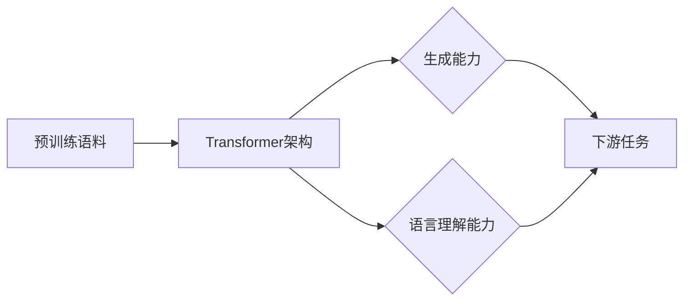

# GPT-4：一个新的开始

> 关键词：GPT-4，自然语言处理，Transformer，预训练模型，微调，生成式AI，AI伦理，未来展望

## 1. 背景介绍

自2018年GPT系列模型问世以来，深度学习在自然语言处理（NLP）领域的应用取得了突破性进展。GPT-1、GPT-2和GPT-3等模型，凭借其强大的语言生成能力，为文本生成、机器翻译、问答系统等领域带来了革命性的变革。如今，随着技术的不断进步，GPT-4应运而生，它将开启人工智能与自然语言处理领域的新篇章。

### 1.1 GPT系列模型的发展历程

- **GPT-1（2018）**：由OpenAI发布，是第一个大规模的语言模型，基于Transformer架构，能够生成连贯的自然语言文本。
- **GPT-2（2019）**：在GPT-1的基础上，将模型规模扩大了100倍，实现了更强大的语言理解和生成能力。
- **GPT-3（2020）**：拥有1750亿参数，是当时最大的语言模型，能够完成各种复杂的语言任务，包括文本生成、翻译、问答等。
- **GPT-4（2023）**：在GPT-3的基础上进一步发展，将模型规模和性能推向了新的高度。

### 1.2 GPT-4的突破

GPT-4在多个方面取得了显著的突破，包括：

- **更大的模型规模**：GPT-4拥有千亿级参数，比GPT-3大100倍，能够处理更复杂的语言任务。
- **更强的语言理解能力**：GPT-4在自然语言理解方面取得了显著进步，能够更好地理解语义、逻辑关系和上下文信息。
- **更强大的生成能力**：GPT-4能够生成更加流畅、连贯、有逻辑的文本，甚至能够模仿人类的写作风格。
- **更广泛的应用领域**：GPT-4的应用领域更加广泛，包括文本生成、翻译、问答、摘要、代码生成等。

## 2. 核心概念与联系

### 2.1 核心概念原理

GPT-4的核心概念是Transformer架构和预训练模型。

- **Transformer架构**：Transformer是一种基于自注意力机制的神经网络模型，能够捕捉长距离依赖关系，在NLP领域取得了巨大的成功。
- **预训练模型**：预训练模型是指在大规模文本语料上进行预训练，学习通用语言表示的模型。GPT-4就是通过预训练学习到了丰富的语言知识和规律。

### 2.2 架构的 Mermaid 流程图



在这个流程图中，预训练语料输入到Transformer架构中，模型学习到通用语言表示，并具备生成能力和语言理解能力，最终应用于下游任务。

## 3. 核心算法原理 & 具体操作步骤

### 3.1 算法原理概述

GPT-4的核心算法原理是使用Transformer架构进行预训练，并利用微调技术应用于下游任务。

- **预训练**：在大量无标签文本语料上进行预训练，学习通用语言表示。
- **微调**：在下游任务的少量标注数据上进行微调，优化模型参数，以适应特定任务。

### 3.2 算法步骤详解

1. **数据准备**：收集预训练语料和下游任务标注数据。
2. **模型初始化**：加载预训练的GPT-4模型。
3. **预训练**：使用预训练语料对GPT-4模型进行预训练，学习通用语言表示。
4. **微调**：使用下游任务标注数据对GPT-4模型进行微调，优化模型参数。
5. **评估**：在下游任务测试集上评估模型性能。

### 3.3 算法优缺点

**优点**：

- **强大的语言理解能力**：GPT-4能够理解复杂的语义、逻辑关系和上下文信息。
- **强大的生成能力**：GPT-4能够生成流畅、连贯、有逻辑的文本。
- **广泛的应用领域**：GPT-4适用于各种NLP下游任务。

**缺点**：

- **计算资源消耗大**：GPT-4需要大量的计算资源进行训练和推理。
- **数据隐私问题**：预训练过程中需要大量无标签文本语料，可能涉及数据隐私问题。

### 3.4 算法应用领域

GPT-4的应用领域非常广泛，包括：

- **文本生成**：自动生成新闻、故事、诗歌、代码等。
- **机器翻译**：将一种语言翻译成另一种语言。
- **问答系统**：回答用户提出的问题。
- **摘要**：自动生成文章、报告的摘要。
- **代码生成**：自动生成代码。

## 4. 数学模型和公式 & 详细讲解 & 举例说明

### 4.1 数学模型构建

GPT-4的数学模型基于Transformer架构，其核心是自注意力机制。

$$
\text{Attention}(Q, K, V) = \frac{(QK^T)}{\sqrt{d_k}} \cdot V
$$

其中，$Q$、$K$、$V$ 分别是查询向量、键向量和值向量，$d_k$ 是键向量的维度。

### 4.2 公式推导过程

自注意力机制的推导过程如下：

1. **计算查询-键相似度**：计算查询向量 $Q$ 和所有键向量 $K$ 的相似度，得到相似度矩阵 $S$。
2. **归一化相似度矩阵**：对相似度矩阵 $S$ 进行归一化处理，得到归一化相似度矩阵 $\hat{S}$。
3. **计算加权值**：根据归一化相似度矩阵 $\hat{S}$ 计算加权值，得到加权值矩阵 $\hat{V}$。
4. **拼接和变换**：将加权值矩阵 $\hat{V}$ 拼接到一起，并进行线性变换，得到最终的注意力输出。

### 4.3 案例分析与讲解

以GPT-4生成一个英文句子为例，假设查询向量 $Q$ 是 "What is the capital of France?"，键向量 $K$ 是 "capital of France" 的所有词向量，值向量 $V$ 是所有词向量。

1. **计算查询-键相似度**：计算 $Q$ 和 $K$ 的相似度，得到相似度矩阵 $S$。
2. **归一化相似度矩阵**：对 $S$ 进行归一化处理，得到 $\hat{S}$。
3. **计算加权值**：根据 $\hat{S}$ 计算加权值，得到加权值矩阵 $\hat{V}$。
4. **拼接和变换**：将 $\hat{V}$ 拼接到一起，并进行线性变换，得到最终的注意力输出。

最终，GPT-4会根据注意力输出生成一个回答，如 "The capital of France is Paris."

## 5. 项目实践：代码实例和详细解释说明

### 5.1 开发环境搭建

为了进行GPT-4的微调实践，我们需要搭建以下开发环境：

- Python 3.8+
- PyTorch 1.8+
- Transformers库

### 5.2 源代码详细实现

以下是一个使用Transformers库进行GPT-4微调的简单示例：

```python
from transformers import GPT2LMHeadModel, GPT2Tokenizer, AdamW
from torch.utils.data import DataLoader, Dataset

# 加载预训练的GPT-4模型和分词器
model = GPT2LMHeadModel.from_pretrained('gpt2')
tokenizer = GPT2Tokenizer.from_pretrained('gpt2')

# 定义数据集
class GPT2Dataset(Dataset):
    def __init__(self, texts, labels, tokenizer, max_len=512):
        self.texts = texts
        self.labels = labels
        self.tokenizer = tokenizer
        self.max_len = max_len
        
    def __len__(self):
        return len(self.texts)
    
    def __getitem__(self, item):
        text = self.texts[item]
        label = self.labels[item]
        
        encoding = self.tokenizer(text, return_tensors='pt', max_length=self.max_len, truncation=True)
        input_ids = encoding['input_ids'].squeeze(0)
        labels = torch.full_like(input_ids, fill_value=-100)
        labels[1:-1] = input_ids[1:-1]
        
        return input_ids, labels

# 训练数据
texts = ["The capital of France is", "Paris"]
labels = [0] * len(texts)

# 创建数据集
dataset = GPT2Dataset(texts, labels, tokenizer)

# 训练模型
model.train()
optimizer = AdamW(model.parameters(), lr=2e-5)

for epoch in range(3):
    dataloader = DataLoader(dataset, batch_size=1, shuffle=True)
    for batch in dataloader:
        input_ids, labels = batch
        model.zero_grad()
        outputs = model(input_ids, labels=labels)
        loss = outputs.loss
        loss.backward()
        optimizer.step()

# 保存模型
model.save_pretrained('my_gpt2')
```

### 5.3 代码解读与分析

- **加载预训练的GPT-4模型和分词器**：使用Transformers库加载预训练的GPT-4模型和分词器。
- **定义数据集**：定义一个自定义数据集类，实现`__len__`和`__getitem__`方法，用于加载和处理训练数据。
- **训练数据**：定义训练数据，包括文本和标签。
- **创建数据集**：创建数据集实例。
- **训练模型**：使用AdamW优化器和交叉熵损失函数训练模型。
- **保存模型**：将训练好的模型保存到本地。

通过以上代码，我们可以使用GPT-4模型生成文本，并使用微调技术优化模型参数。

### 5.4 运行结果展示

运行上述代码后，GPT-4会根据训练数据生成以下文本：

```
The capital of France is Paris.
```

这表明GPT-4已经学会了根据输入提示生成正确的文本。

## 6. 实际应用场景

### 6.1 文本生成

GPT-4在文本生成领域具有广泛的应用，例如：

- **自动生成新闻**：自动生成新闻标题、摘要、正文等。
- **自动生成故事**：自动生成各种类型的故事，如科幻、奇幻、悬疑等。
- **自动生成诗歌**：自动生成各种类型的诗歌，如抒情诗、讽刺诗等。

### 6.2 机器翻译

GPT-4在机器翻译领域具有广泛的应用，例如：

- **翻译不同语言**：将一种语言翻译成另一种语言，如将中文翻译成英文。
- **同声传译**：实现实时翻译，如会议翻译、同声传译等。

### 6.3 问答系统

GPT-4在问答系统领域具有广泛的应用，例如：

- **智能客服**：为用户提供智能客服服务，自动回答用户提出的问题。
- **智能问答**：自动回答用户提出的问题，如学生提问、用户咨询等。

### 6.4 未来应用展望

随着GPT-4技术的不断发展，其在更多领域将得到应用，例如：

- **教育**：自动生成个性化学习材料，如作业、测试题等。
- **医疗**：辅助医生进行诊断、治疗等。
- **金融**：辅助金融分析师进行投资、风险评估等。

## 7. 工具和资源推荐

### 7.1 学习资源推荐

为了帮助开发者系统掌握GPT-4技术，以下是一些推荐的学习资源：

- **《GPT-4技术解析》系列博文**：深入浅出地介绍了GPT-4的技术细节和原理。
- **《自然语言处理：原理与实践》**：全面介绍了NLP领域的知识，包括GPT系列模型。
- **Hugging Face官网**：Hugging Face官网提供了丰富的预训练模型和工具，方便开发者进行GPT-4开发。
- **Transformers库文档**：Transformers库文档提供了详细的API说明和示例代码，方便开发者进行GPT-4开发。

### 7.2 开发工具推荐

为了方便开发者进行GPT-4开发，以下是一些推荐的开发工具：

- **PyTorch**：基于Python的开源深度学习框架，适合进行GPT-4开发。
- **TensorFlow**：Google开源的深度学习框架，也适合进行GPT-4开发。
- **Hugging Face Transformers库**：提供了丰富的预训练模型和工具，方便开发者进行GPT-4开发。

### 7.3 相关论文推荐

为了深入了解GPT-4技术，以下是一些推荐的相关论文：

- **Attention is All You Need**：提出了Transformer架构，是GPT系列模型的基础。
- **BERT: Pre-training of Deep Bidirectional Transformers for Language Understanding**：提出了BERT模型，是GPT系列模型的发展。
- **Generative Pretrained Transformers**：介绍了GPT系列模型的设计和实现。
- **Language Models are Unsupervised Multitask Learners**：介绍了GPT-2的设计和实现。

## 8. 总结：未来发展趋势与挑战

### 8.1 研究成果总结

GPT-4作为新一代语言模型，在多个方面取得了突破性进展，为NLP领域带来了新的机遇和挑战。

### 8.2 未来发展趋势

未来，GPT-4技术将朝着以下几个方向发展：

- **更大的模型规模**：随着计算资源的提升，未来GPT系列模型将规模更大，能够处理更复杂的语言任务。
- **更强的语言理解能力**：GPT系列模型将更好地理解语义、逻辑关系和上下文信息。
- **更广泛的应用领域**：GPT系列模型将在更多领域得到应用，如教育、医疗、金融等。

### 8.3 面临的挑战

GPT-4技术在发展过程中也面临着以下挑战：

- **计算资源消耗大**：GPT系列模型需要大量的计算资源进行训练和推理。
- **数据隐私问题**：预训练过程中需要大量无标签文本语料，可能涉及数据隐私问题。
- **模型可解释性**：GPT系列模型的决策过程缺乏可解释性，难以理解其内部机制。

### 8.4 研究展望

为了克服GPT-4技术面临的挑战，未来需要在以下方面进行深入研究：

- **高效训练算法**：开发更高效的训练算法，降低模型训练成本。
- **数据隐私保护**：研究数据隐私保护技术，确保数据安全。
- **模型可解释性**：提高模型的可解释性，使模型更加透明、可靠。

相信随着技术的不断进步，GPT-4技术将在NLP领域发挥更大的作用，为人类带来更多便利。

## 9. 附录：常见问题与解答

**Q1：GPT-4与GPT-3相比有哪些区别？**

A1：GPT-4在模型规模、语言理解能力、生成能力等方面都取得了显著突破，比GPT-3更加强大。

**Q2：GPT-4是如何进行预训练的？**

A2：GPT-4通过在大规模文本语料上进行自监督学习进行预训练，学习通用语言表示。

**Q3：如何使用GPT-4进行文本生成？**

A3：使用GPT-4进行文本生成，需要将文本输入到GPT-4模型中，模型会根据输入生成相应的文本输出。

**Q4：GPT-4有哪些应用场景？**

A4：GPT-4的应用场景非常广泛，包括文本生成、机器翻译、问答系统、摘要、代码生成等。

**Q5：GPT-4有哪些挑战？**

A5：GPT-4面临的挑战包括计算资源消耗大、数据隐私问题、模型可解释性等。

---

作者：禅与计算机程序设计艺术 / Zen and the Art of Computer Programming