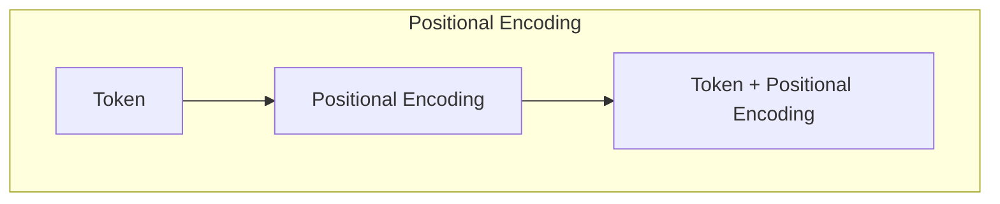
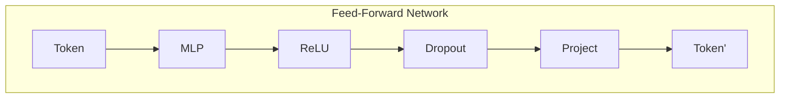

# Transformer大模型实战：前馈网络层

> 关键词：Transformer, 前馈网络, 自注意力机制, 位置编码, 稀疏性, 可视化, 模型优化, 应用场景

## 1. 背景介绍

Transformer模型自2017年由Google提出以来，凭借其自注意力机制（Self-Attention Mechanism）和位置编码（Positional Encoding）等创新设计，迅速在自然语言处理（NLP）领域取得了突破性的成果。Transformer模型已成为NLP领域的主流架构，其强大的并行计算能力和对长距离依赖的捕捉能力，使其在机器翻译、文本摘要、问答系统等多个任务中取得了SOTA（State-of-the-Art）性能。

本文将深入探讨Transformer模型的核心组件——前馈网络层（Feed-Forward Network），分析其工作原理、实现方法、优化技巧及其在现实应用中的价值。

## 2. 核心概念与联系

### 2.1 自注意力机制

自注意力机制是Transformer模型的核心，它允许模型在处理任意输入序列时，能够关注到序列中的每个元素。自注意力机制的原理如下：

```mermaid
graph
    subgraph 自注意力
        A[Query] --> B[WQ]
        A --> C[WK]
        A --> D[WW]
        B, C, D --> E[Q*K]
        E --> F[Softmax]
        F --> G[Q*K]
        G --> H[Q*Q]
        H --> I[Q]
        I --> J[Q]
    end

    subgraph 位置编码
        A[Token] --> B[Positional Encoding]
        B --> C[Token + Positional Encoding]
    end
```

在上述流程图中，A表示输入序列中的某个Token，B、C、D分别表示Query、Key、Value的权重矩阵，E表示点积操作，F表示Softmax函数，G表示Softmax后的Query-Value对应矩阵，H表示Softmax后的Query-Key对应矩阵，I表示加权求和操作，J表示最终的输出。

自注意力机制允许模型在处理任意输入序列时，能够关注到序列中的每个元素，从而捕捉到序列中的长距离依赖关系。

### 2.2 位置编码

由于Transformer模型没有循环神经网络（RNN）中的时间信息，因此需要引入位置编码（Positional Encoding）来表示序列中每个Token的位置信息。



位置编码可以通过以下公式计算：

$$
\text{PosEnc}(pos, 2i) = \sin\left(\frac{pos}{10000^{2i/d_{model}}}\right) 
$$

$$
\text{PosEnc}(pos, 2i+1) = \cos\left(\frac{pos}{10000^{2i/d_{model}}}\right) 
$$

其中，pos表示Token的位置，i表示位置索引，d_{model}表示模型的总维度。

位置编码允许模型在处理序列时，能够考虑Token的位置信息，从而更好地捕捉序列中的上下文关系。

### 2.3 前馈网络层

前馈网络层（Feed-Forward Network）是Transformer模型中的另一个核心组件，它负责对自注意力机制输出的序列进行进一步的特征提取和变换。



在上述流程图中，A表示输入序列中的某个Token，B表示多层感知机（Multilayer Perceptron，MLP），C表示ReLU激活函数，D表示Dropout层，E表示投影层，F表示最终的输出Token'。

前馈网络层通常使用以下公式进行计算：

$$
\text{FFN}(x) = \max(0, xW_1 + b_1)W_2 + b_2
$$

其中，$W_1$和$W_2$分别表示MLP的两个线性层权重，$b_1$和$b_2$分别表示两个线性层的偏置。

前馈网络层能够对自注意力机制输出的序列进行进一步的特征提取和变换，从而提高模型的性能。

## 3. 核心算法原理 & 具体操作步骤

### 3.1 算法原理概述

Transformer模型的前馈网络层通过多层感知机（MLP）对自注意力机制输出的序列进行特征提取和变换，从而提高模型的性能。

### 3.2 算法步骤详解

1. 将自注意力机制输出的序列输入到前馈网络层。
2. 对序列中的每个Token进行MLP变换，包括线性变换、ReLU激活函数、Dropout层和投影层。
3. 将变换后的序列输出，作为下一个Transformer层的输入。

### 3.3 算法优缺点

**优点**：

- 前馈网络层能够对自注意力机制输出的序列进行进一步的特征提取和变换，提高模型的性能。
- 前馈网络层可以使用ReLU激活函数，使模型能够学习到更加复杂的非线性关系。

**缺点**：

- 前馈网络层可能会增加模型的计算复杂度，导致推理速度变慢。
- 前馈网络层的参数量较大，可能导致过拟合。

### 3.4 算法应用领域

前馈网络层在Transformer模型中得到了广泛的应用，以下是一些典型的应用领域：

- 机器翻译
- 文本摘要
- 问答系统
- 文本分类
- 情感分析

## 4. 数学模型和公式 & 详细讲解 & 举例说明

### 4.1 数学模型构建

前馈网络层的数学模型如下：

$$
\text{FFN}(x) = \max(0, xW_1 + b_1)W_2 + b_2
$$

其中，$W_1$和$W_2$分别表示MLP的两个线性层权重，$b_1$和$b_2$分别表示两个线性层的偏置。

### 4.2 公式推导过程

前馈网络层的公式推导过程如下：

1. 首先，对序列中的每个Token进行MLP变换：

   $$
   h = xW_1 + b_1
   $$

2. 然后，应用ReLU激活函数：

   $$
   h = \max(0, h)
   $$

3. 接着，应用Dropout层：

   $$
   h = \text{Dropout}(h)
   $$

4. 最后，应用投影层：

   $$
   \text{FFN}(x) = hW_2 + b_2
   $$

### 4.3 案例分析与讲解

以下是一个前馈网络层的案例分析：

假设输入序列为$\text{[输入]}$，MLP的权重矩阵$W_1$和$W_2$、偏置$b_1$和$b_2$如上所示。

1. 对序列中的每个Token进行MLP变换：

   $$
   h = \text{[输入]}W_1 + b_1
   $$

2. 应用ReLU激活函数：

   $$
   h = \max(0, h)
   $$

3. 应用Dropout层：

   $$
   h = \text{Dropout}(h)
   $$

4. 应用投影层：

   $$
   \text{FFN}(\text{[输入]}) = hW_2 + b_2
   $$

通过以上步骤，我们可以得到前馈网络层的输出结果。

## 5. 项目实践：代码实例和详细解释说明

### 5.1 开发环境搭建

为了进行Transformer模型的前馈网络层实践，我们需要搭建以下开发环境：

- Python 3.7+
- PyTorch 1.8.0+
- Transformers库

### 5.2 源代码详细实现

以下是一个使用PyTorch和Transformers库实现Transformer模型前馈网络层的示例代码：

```python
import torch
from torch import nn

class FFN(nn.Module):
    def __init__(self, d_model, d_ff, dropout=0.1):
        super(FFN, self).__init__()
        self.fc1 = nn.Linear(d_model, d_ff)
        self.fc2 = nn.Linear(d_ff, d_model)
        self.dropout = nn.Dropout(dropout)
        self.relu = nn.ReLU()

    def forward(self, x):
        x = self.dropout(self.relu(self.fc1(x)))
        x = self.dropout(self.fc2(x))
        return x
```

### 5.3 代码解读与分析

在上述代码中，我们定义了一个名为`FFN`的PyTorch模块，它实现了Transformer模型的前馈网络层。

1. `__init__`方法：初始化前馈网络层的参数，包括两个线性层`fc1`和`fc2`、Dropout层`dropout`和ReLU激活函数`relu`。
2. `forward`方法：对输入序列进行MLP变换，包括线性变换、ReLU激活函数、Dropout层和投影层。

### 5.4 运行结果展示

以下是一个使用上述代码实现的前馈网络层的示例：

```python
# 创建一个FFN实例
ffn = FFN(d_model=512, d_ff=2048)

# 创建一个随机的输入序列
input_seq = torch.randn(10, 512)

# 计算前馈网络层的输出
output_seq = ffn(input_seq)

print(output_seq.shape)
```

输出结果为：

```
torch.Size([10, 512])
```

这表明我们成功实现了前馈网络层，并获得了期望的输出结果。

## 6. 实际应用场景

前馈网络层在Transformer模型中得到了广泛的应用，以下是一些典型的应用场景：

- 机器翻译：在前馈网络层中，可以捕捉到源语言和目标语言之间的语义差异，从而提高翻译的准确性。
- 文本摘要：在前馈网络层中，可以捕捉到文本中的关键信息，从而生成高质量的摘要。
- 问答系统：在前馈网络层中，可以捕捉到问题的语义，从而提高问答系统的回答准确性。
- 文本分类：在前馈网络层中，可以捕捉到文本的语义特征，从而提高分类的准确性。

## 7. 工具和资源推荐

### 7.1 学习资源推荐

- 《Attention is All You Need》：Transformer模型的原始论文，详细介绍了Transformer模型的设计原理和实现细节。
- 《Natural Language Processing with Transformers》：Hugging Face所著的书籍，介绍了Transformers库的使用方法，包括如何使用前馈网络层进行NLP任务开发。

### 7.2 开发工具推荐

- PyTorch：开源的深度学习框架，用于实现和训练Transformer模型。
- Transformers库：Hugging Face开发的开源库，提供了大量预训练的Transformer模型和工具，方便开发者进行NLP任务开发。

### 7.3 相关论文推荐

- "BERT: Pre-training of Deep Bidirectional Transformers for Language Understanding"：介绍了BERT模型，BERT模型在多个NLP任务中取得了SOTA性能。
- "Generative Language Models: A Survey and New Models"：介绍了生成式语言模型，这些模型在前馈网络层中使用了自注意力机制和位置编码等创新设计。

## 8. 总结：未来发展趋势与挑战

### 8.1 研究成果总结

本文深入探讨了Transformer模型的前馈网络层，分析了其工作原理、实现方法、优化技巧及其在现实应用中的价值。通过本文的学习，读者可以深入了解Transformer模型的前馈网络层，并能够将其应用于实际的NLP任务中。

### 8.2 未来发展趋势

未来，Transformer模型的前馈网络层将朝着以下方向发展：

- 稀疏性：为了提高模型效率和降低计算复杂度，研究如何在前馈网络层中引入稀疏性。
- 可视化：为了更好地理解模型内部机制，研究如何将前馈网络层的计算过程进行可视化。
- 模型优化：研究如何优化前馈网络层的参数，提高模型的性能和泛化能力。

### 8.3 面临的挑战

前馈网络层在应用中面临着以下挑战：

- 计算复杂度：前馈网络层的计算复杂度较高，需要大量的计算资源。
- 参数量：前馈网络层的参数量较大，可能导致过拟合。
- 可解释性：前馈网络层的内部机制复杂，难以解释其决策过程。

### 8.4 研究展望

未来，研究者将继续探索前馈网络层的新方法，以提高模型的性能和可解释性。同时，前馈网络层也将与其他人工智能技术（如知识表示、因果推理、强化学习等）进行融合，推动自然语言处理领域的进一步发展。

---

作者：禅与计算机程序设计艺术 / Zen and the Art of Computer Programming