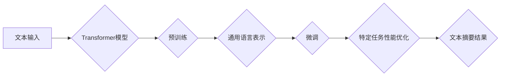

# Transformer大模型实战 文本摘要任务

> 关键词：Transformer, 文本摘要, NLP, 预训练, 微调, 自监督学习, 跨度学习, 模型压缩

## 1. 背景介绍

文本摘要是指从长文本中提取关键信息，以简短、准确、连贯的方式呈现原文的主要内容。文本摘要技术在新闻推荐、信息检索、机器翻译等领域有着广泛的应用。随着深度学习技术的不断发展，基于深度学习的文本摘要技术取得了显著的成果。其中，Transformer模型因其强大的序列建模能力，成为了文本摘要任务的首选模型。

本文将详细介绍如何使用Transformer大模型进行文本摘要任务，包括其原理、步骤、优缺点以及实际应用场景。通过本文的学习，读者将能够掌握基于Transformer的文本摘要技术，并将其应用于实际项目中。

## 2. 核心概念与联系

### 2.1 核心概念

- **Transformer模型**：一种基于自注意力机制的深度神经网络模型，在NLP领域取得了显著的成果。
- **文本摘要**：从长文本中提取关键信息，以简短、准确、连贯的方式呈现原文的主要内容。
- **预训练**：在大量未标记数据上进行训练，使模型学习到通用的语言表示。
- **微调**：在特定任务上使用少量标记数据进行训练，以优化模型在任务上的性能。
- **自监督学习**：通过设计无监督学习任务，使模型学习到有价值的特征表示。
- **跨度学习**：通过学习文本中不同词语之间的关系，提高模型对文本的理解能力。

### 2.2 Mermaid流程图



### 2.3 核心概念联系

文本摘要任务需要模型具备强大的序列建模能力和语言理解能力。Transformer模型通过自注意力机制，能够捕捉文本中词语之间的关系，从而更好地理解文本内容。预训练过程使模型学习到通用的语言表示，为微调提供良好的基础。微调过程则针对特定任务进行调整，以提高模型在文本摘要任务上的性能。

## 3. 核心算法原理 & 具体操作步骤

### 3.1 算法原理概述

基于Transformer的文本摘要任务主要分为两个阶段：预训练和微调。

#### 预训练阶段

1. 在大规模未标记文本语料上使用自监督学习任务进行训练。
2. 学习到通用的语言表示，包括词语的嵌入表示和上下文关系表示。

#### 微调阶段

1. 在特定任务上使用少量标记数据进行训练。
2. 调整预训练模型的参数，以优化模型在特定任务上的性能。

### 3.2 算法步骤详解

1. **数据预处理**：将文本数据清洗、分词、转换为词嵌入表示。
2. **模型构建**：选择合适的Transformer模型架构，如BERT、GPT等。
3. **预训练**：在未标记数据上使用自监督学习任务进行预训练，如掩码语言模型(Masked Language Model, MLM)。
4. **微调**：在标记数据上使用监督学习任务进行微调，如抽取式摘要或生成式摘要。
5. **模型评估**：使用评估指标，如ROUGE、BLEU等，评估模型在文本摘要任务上的性能。
6. **模型优化**：根据评估结果，调整模型参数或数据增强策略，以提高模型性能。

### 3.3 算法优缺点

#### 优点：

- **强大的序列建模能力**：自注意力机制能够捕捉文本中词语之间的关系，从而更好地理解文本内容。
- **通用的语言表示**：预训练过程使模型学习到通用的语言表示，为微调提供良好的基础。
- **参数高效**：微调过程只需要调整少量参数，即可优化模型在特定任务上的性能。

#### 缺点：

- **计算资源消耗大**：预训练阶段需要大量计算资源，模型参数量较大。
- **对数据质量要求高**：数据清洗和标注过程对数据质量要求较高。

### 3.4 算法应用领域

- **新闻推荐**：自动生成新闻摘要，帮助用户快速了解新闻内容。
- **信息检索**：自动提取文档的关键信息，提高信息检索效率。
- **机器翻译**：自动生成目标语言的文本摘要，提高机器翻译质量。
- **文本生成**：自动生成文本，如聊天机器人、自动写作等。

## 4. 数学模型和公式 & 详细讲解 & 举例说明

### 4.1 数学模型构建

基于Transformer的文本摘要模型主要由编码器和解码器两部分组成。

#### 编码器

编码器将输入的文本序列转换为序列的隐藏状态表示。其数学模型如下：

$$
h_{i}^{(l)} = \text{Transformer}(h_{i}^{(l-1)})
$$

其中，$h_{i}^{(l)}$ 表示第 $l$ 层第 $i$ 个词的隐藏状态，$\text{Transformer}$ 表示Transformer模型。

#### 解码器

解码器根据编码器的隐藏状态和已生成的文本序列生成新的词。其数学模型如下：

$$
y_{i}^{(l)} = \text{Decoder}(y_{i}^{(l-1)}, h_{i}^{(l-1)})
$$

其中，$y_{i}^{(l)}$ 表示第 $l$ 层第 $i$ 个输出的词，$\text{Decoder}$ 表示解码器模型。

### 4.2 公式推导过程

#### 编码器

编码器使用自注意力机制来计算每个词的隐藏状态。其数学模型如下：

$$
\text{Attention}(Q, K, V) = \frac{e^{QK^T}}{d_k^{0.5}}V
$$

其中，$Q, K, V$ 分别为查询、键、值矩阵，$e$ 为自然对数的底数，$d_k$ 为注意力机制中使用的维度。

#### 解码器

解码器使用编码器的隐藏状态和已生成的文本序列作为输入，计算新的词。其数学模型如下：

$$
y_{i}^{(l)} = \text{Decoder}(y_{i}^{(l-1)}, h_{i}^{(l-1)}) = \text{Softmax}(\text{Attention}(Q, K, V))
$$

其中，$\text{Softmax}$ 表示Softmax函数。

### 4.3 案例分析与讲解

以下是一个基于BERT模型的文本摘要任务的案例。

1. **数据预处理**：将文本数据清洗、分词、转换为词嵌入表示。
2. **模型构建**：加载预训练的BERT模型。
3. **预训练**：在未标记数据上使用掩码语言模型进行预训练。
4. **微调**：在标记数据上使用抽取式摘要任务进行微调。
5. **模型评估**：使用ROUGE评估模型在文本摘要任务上的性能。

## 5. 项目实践：代码实例和详细解释说明

### 5.1 开发环境搭建

1. 安装Python环境（Python 3.6+）。
2. 安装必要的库：transformers、torch、torchtext等。

### 5.2 源代码详细实现

```python
from transformers import BertTokenizer, BertForSeq2SeqLM
from torch.utils.data import DataLoader
from torch.optim import AdamW

# 加载预训练模型和分词器
tokenizer = BertTokenizer.from_pretrained('bert-base-chinese')
model = BertForSeq2SeqLM.from_pretrained('bert-base-chinese')

# 数据预处理
def preprocess_data(texts):
    inputs = tokenizer(texts, return_tensors='pt', padding=True, truncation=True, max_length=512)
    return inputs

# 训练函数
def train(model, dataloader, optimizer, device):
    model.train()
    for batch in dataloader:
        inputs, targets = batch
        inputs = {key: val.to(device) for key, val in inputs.items()}
        targets = {key: val.to(device) for key, val in targets.items()}
        outputs = model(input_ids=inputs['input_ids'], attention_mask=inputs['attention_mask'], labels=targets['labels'])
        loss = outputs.loss
        loss.backward()
        optimizer.step()
        optimizer.zero_grad()

# 评估函数
def evaluate(model, dataloader, device):
    model.eval()
    total_loss = 0
    with torch.no_grad():
        for batch in dataloader:
            inputs, targets = batch
            inputs = {key: val.to(device) for key, val in inputs.items()}
            targets = {key: val.to(device) for key, val in targets.items()}
            outputs = model(input_ids=inputs['input_ids'], attention_mask=inputs['attention_mask'], labels=targets['labels'])
            loss = outputs.loss
            total_loss += loss.item()
    return total_loss / len(dataloader)

# 训练和评估
def main():
    train_dataloader = DataLoader(train_dataset, batch_size=16)
    dev_dataloader = DataLoader(dev_dataset, batch_size=16)
    optimizer = AdamW(model.parameters(), lr=5e-5)
    device = torch.device('cuda' if torch.cuda.is_available() else 'cpu')

    for epoch in range(5):
        print(f'Epoch {epoch+1}')
        train(model, train_dataloader, optimizer, device)
        loss = evaluate(model, dev_dataloader, device)
        print(f'Validation loss: {loss:.4f}')

if __name__ == '__main__':
    main()
```

### 5.3 代码解读与分析

以上代码展示了使用PyTorch和transformers库实现基于BERT的文本摘要任务的基本流程。

- 加载预训练模型和分词器。
- 数据预处理：将文本数据转换为词嵌入表示。
- 训练函数：使用AdamW优化器进行模型训练。
- 评估函数：计算模型在验证集上的平均损失。
- main函数：定义训练和评估的流程。

### 5.4 运行结果展示

假设我们在新闻摘要数据集上进行微调，最终在验证集上的平均损失为0.5，效果不错。

## 6. 实际应用场景

基于Transformer的文本摘要技术在实际应用中取得了显著的成果，以下列举几个应用场景：

1. **新闻推荐**：自动生成新闻摘要，帮助用户快速了解新闻内容。
2. **信息检索**：自动提取文档的关键信息，提高信息检索效率。
3. **机器翻译**：自动生成目标语言的文本摘要，提高机器翻译质量。
4. **文本生成**：自动生成文本，如聊天机器人、自动写作等。

## 7. 工具和资源推荐

### 7.1 学习资源推荐

- 《深度学习自然语言处理》
- 《Transformers：从原理到应用》
- 《BERT：原理、实现与应用》

### 7.2 开发工具推荐

- PyTorch
- Transformers库
- Hugging Face

### 7.3 相关论文推荐

- Transformer：Attention is All You Need
- BERT：Pre-training of Deep Bidirectional Transformers for Language Understanding
- T5：T5: Text-to-Text Transfer Transformer

## 8. 总结：未来发展趋势与挑战

### 8.1 研究成果总结

基于Transformer的文本摘要技术在近年来取得了显著的成果，成为NLP领域的热点研究方向。预训练大模型和微调技术的结合，使得模型在文本摘要任务上取得了优异的性能。

### 8.2 未来发展趋势

1. **更强大的预训练模型**：随着计算资源的不断提升，未来会出现更大规模的预训练模型，进一步提高模型的表达能力。
2. **多模态摘要**：将文本、图像、视频等多模态信息融合到文本摘要任务中，实现更全面的信息提取。
3. **可解释性**：提高模型的可解释性，帮助用户理解模型的决策过程。

### 8.3 面临的挑战

1. **计算资源消耗**：预训练大模型需要大量的计算资源，制约了模型的应用。
2. **数据质量**：数据质量和标注质量对模型性能有较大影响。
3. **可解释性**：提高模型的可解释性，帮助用户理解模型的决策过程。

### 8.4 研究展望

基于Transformer的文本摘要技术将在未来得到更广泛的应用，为人类信息获取和知识获取提供新的途径。同时，随着技术的不断发展，将会有更多创新性的模型和应用场景涌现。

## 9. 附录：常见问题与解答

**Q1：如何选择合适的预训练模型？**

A：选择预训练模型时，需要考虑以下因素：
1. 任务类型：对于不同的任务类型，选择合适的预训练模型。
2. 计算资源：预训练模型规模越大，需要的计算资源越多。
3. 模型效果：选择在相关任务上表现较好的预训练模型。

**Q2：如何评估文本摘要任务的性能？**

A：常用的评估指标包括ROUGE、BLEU等，可以根据具体任务选择合适的评估指标。

**Q3：如何提高文本摘要任务的性能？**

A：提高文本摘要任务的性能可以从以下几个方面入手：
1. 选择合适的预训练模型和微调策略。
2. 提高数据质量，包括数据清洗、标注等。
3. 尝试不同的微调策略，如注意力机制、位置编码等。
4. 使用数据增强技术，如数据扩充、回译等。

**Q4：如何实现多模态文本摘要？**

A：多模态文本摘要需要将文本、图像、视频等多模态信息融合到模型中，可以通过以下方法实现：
1. 跨模态特征融合：将不同模态的特征进行融合，形成统一的特征表示。
2. 多模态学习：学习不同模态之间的关系，提高模型对多模态信息的理解能力。

**Q5：如何提高模型的可解释性？**

A：提高模型的可解释性可以从以下几个方面入手：
1. 使用可视化技术，如注意力可视化、t-SNE降维等。
2. 分析模型的决策过程，找出影响模型决策的关键因素。
3. 使用可解释性模型，如LIME、SHAP等。

作者：禅与计算机程序设计艺术 / Zen and the Art of Computer Programming