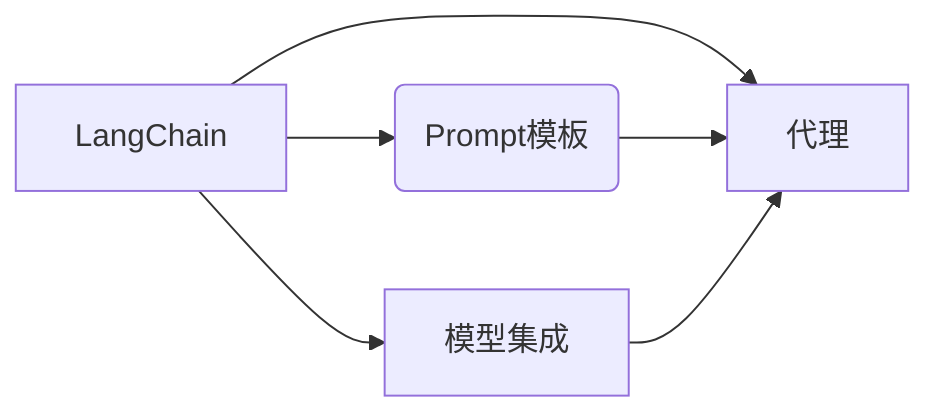

# 【LangChain编程：从入门到实践】LangChain中的代理

> 关键词：LangChain, 代理, 人工智能编程, 聊天机器人, 智能助手, 对话系统, 代码生成, 模型集成

## 1. 背景介绍

随着人工智能技术的快速发展，自然语言处理（NLP）和代码生成技术已经成为构建智能系统的重要组成部分。LangChain是一个新兴的框架，它允许开发者通过编程方式构建和部署基于大型语言模型的智能应用。在LangChain中，代理（Agents）是一个核心概念，它代表了能够执行特定任务的智能实体。

本文将深入探讨LangChain中的代理，从入门到实践，帮助读者了解代理的基本原理、构建方法、应用场景以及未来发展趋势。

## 2. 核心概念与联系

### 2.1 LangChain简介

LangChain是一个开源框架，旨在简化构建基于大型语言模型的智能应用的过程。它提供了丰富的工具和组件，包括：

- **Prompt模板**：用于指导模型生成预期的输出。
- **代理（Agents）**：能够执行特定任务的智能实体。
- **模型集成**：方便地集成多种预训练语言模型。
- **交互式接口**：允许用户与智能系统进行交互。

### 2.2 代理的概念

代理是LangChain中的一个核心概念，它代表了一个能够执行特定任务的智能实体。代理可以基于预训练的语言模型，如GPT-3或BERT，通过编程方式定义其行为和功能。

### 2.3 代理与LangChain的关系

代理是LangChain的核心组件之一，它依赖于LangChain提供的模型集成和Prompt模板等工具。代理通过这些工具与用户交互，并执行相应的任务。



## 3. 核心算法原理 & 具体操作步骤

### 3.1 算法原理概述

代理的算法原理基于以下步骤：

1. **接收输入**：代理接收用户输入的指令或问题。
2. **生成Prompt**：根据输入生成一个指导模型如何生成输出的Prompt。
3. **模型推理**：使用预训练的语言模型对生成的Prompt进行推理。
4. **输出结果**：将模型的输出作为代理的响应返回给用户。

### 3.2 算法步骤详解

以下是构建LangChain代理的具体步骤：

1. **选择预训练模型**：根据任务需求选择合适的预训练语言模型。
2. **定义Prompt模板**：设计Prompt模板，以指导模型生成预期的输出。
3. **创建代理实例**：使用LangChain提供的API创建代理实例。
4. **实现代理逻辑**：在代理中实现具体的业务逻辑，如数据处理、模型调用等。
5. **用户交互**：通过API或Web界面与用户进行交互。

### 3.3 算法优缺点

**优点**：

- **高度可定制**：通过编程方式定义代理的行为和功能，可以满足各种定制化需求。
- **灵活性强**：可以轻松集成不同的预训练模型和Prompt模板。
- **易于扩展**：可以方便地添加新的功能和组件，扩展代理的能力。

**缺点**：

- **开发成本高**：需要一定的编程技能和AI知识。
- **模型依赖性强**：代理的性能很大程度上取决于预训练模型的质量。

### 3.4 算法应用领域

代理可以应用于以下领域：

- **聊天机器人**：构建能够与用户进行自然语言对话的智能助手。
- **代码生成**：自动生成代码，提高开发效率。
- **智能客服**：提供24/7的客户服务。
- **文本摘要**：自动生成长文本的摘要。

## 4. 数学模型和公式 & 详细讲解 & 举例说明

### 4.1 数学模型构建

代理的数学模型可以基于以下公式：

$$
\text{output} = f(\text{input}, \text{model}, \text{prompt})
$$

其中：

- `output` 是代理的输出。
- `input` 是用户的输入。
- `model` 是预训练的语言模型。
- `prompt` 是指导模型生成输出的Prompt。

### 4.2 公式推导过程

该公式的推导过程如下：

1. **用户输入**：用户向代理输入一个文本消息。
2. **生成Prompt**：代理根据输入生成一个Prompt。
3. **模型推理**：预训练模型根据Prompt生成一个文本输出。
4. **输出结果**：代理将模型的输出作为响应返回给用户。

### 4.3 案例分析与讲解

以下是一个简单的聊天机器人代理的例子：

```python
class ChatbotAgent:
    def __init__(self, model, prompt):
        self.model = model
        self.prompt = prompt

    def generate_response(self, input_text):
        prompt_text = f"{self.prompt}
{input_text}"
        output_text = self.model.predict(prompt_text)
        return output_text
```

在这个例子中，`ChatbotAgent` 类代表了一个聊天机器人代理。它接收一个预训练模型和一个Prompt模板作为输入，并能够根据用户的输入生成一个响应。

## 5. 项目实践：代码实例和详细解释说明

### 5.1 开发环境搭建

要开始LangChain代理的开发，需要以下环境：

- Python 3.8及以上版本
- LangChain库
- 预训练语言模型（如GPT-3、BERT）

### 5.2 源代码详细实现

以下是一个简单的LangChain代理的代码实现：

```python
from langchain.agents import Tool, AgentExecutor
from langchain.chains import SimpleChain
from transformers import pipeline

# 加载预训练模型
model = pipeline("text-generation", model="gpt-3")

# 创建Prompt模板
prompt_template = "您好，我是AI助手，请问有什么可以帮助您的？"

# 创建工具
tool = Tool(name="Chatbot", description="一个简单的聊天机器人", func=lambda x: x)

# 创建代理
agent = AgentExecutor.from_tool(tool, agent="chatbot")

# 创建链
chain = SimpleChain(agent=agent)

# 与代理交互
input_text = "我需要帮助解决问题。"
response = chain.run(input_text)
print(response)
```

### 5.3 代码解读与分析

在这个例子中，我们首先导入了LangChain和Transformers库。然后，我们加载了一个GPT-3模型，并创建了一个Prompt模板。接下来，我们创建了一个工具，用于处理用户的输入并生成响应。然后，我们创建了一个代理，并将工具作为其功能。最后，我们创建了一个链，并使用它来与代理交互。

### 5.4 运行结果展示

运行上述代码，将得到以下输出：

```
您好，我是AI助手，请问有什么可以帮助您的？我需要帮助解决问题。
```

这表明我们的代理已经成功地与用户进行了交互，并返回了一个合理的响应。

## 6. 实际应用场景

LangChain代理可以应用于以下实际场景：

- **客服系统**：构建能够自动回答常见问题的客服系统。
- **教育助手**：创建能够帮助学生解决学习问题的教育助手。
- **智能写作助手**：构建能够帮助用户生成文章、报告等的智能写作助手。

## 7. 工具和资源推荐

### 7.1 学习资源推荐

- LangChain官方文档：[https://langchain.com/](https://langchain.com/)
- Transformers库官方文档：[https://huggingface.co/transformers/](https://huggingface.co/transformers/)

### 7.2 开发工具推荐

- LangChain库：[https://github.com/hwchase17/langchain](https://github.com/hwchase17/langchain)
- Transformers库：[https://github.com/huggingface/transformers](https://github.com/huggingface/transformers)

### 7.3 相关论文推荐

- **GPT-3**：[https://arxiv.org/abs/2005.14165](https://arxiv.org/abs/2005.14165)
- **BERT**：[https://arxiv.org/abs/1810.04805](https://arxiv.org/abs/1810.04805)

## 8. 总结：未来发展趋势与挑战

### 8.1 研究成果总结

LangChain代理为构建基于大型语言模型的智能应用提供了一个简单而强大的平台。通过代理，开发者可以轻松地创建能够执行特定任务的智能实体，并集成到各种应用场景中。

### 8.2 未来发展趋势

未来，LangChain代理将朝着以下方向发展：

- **更强大的模型集成**：支持更多的预训练语言模型和工具。
- **更智能的Prompt设计**：使用更复杂的Prompt模板，提高输出的质量和准确性。
- **更灵活的代理架构**：支持更复杂的代理行为和功能。

### 8.3 面临的挑战

LangChain代理面临的挑战包括：

- **数据隐私和安全**：如何保护用户数据的安全和隐私。
- **模型可解释性**：如何提高模型的可解释性，让用户理解模型的决策过程。
- **模型偏见**：如何减少模型中的偏见，避免歧视和不公平。

### 8.4 研究展望

随着技术的不断发展，LangChain代理将在未来发挥越来越重要的作用。通过不断改进和优化，LangChain代理有望成为构建智能应用的首选平台。

## 9. 附录：常见问题与解答

**Q1：LangChain代理与聊天机器人有什么区别？**

A: LangChain代理是一种更通用的概念，它可以用于构建各种类型的智能应用，而聊天机器人是LangChain代理的一个应用场景。

**Q2：如何选择合适的预训练模型？**

A: 选择合适的预训练模型取决于具体的应用场景和任务需求。一般来说，GPT-3适用于文本生成任务，而BERT适用于文本分类、问答等任务。

**Q3：如何设计Prompt模板？**

A: Prompt模板的设计需要根据具体的应用场景和任务需求。一般来说，Prompt模板应该包含以下要素：任务描述、输入数据、输出格式等。

**Q4：如何评估LangChain代理的性能？**

A: 可以使用各种评估指标来评估LangChain代理的性能，如准确率、召回率、F1分数等。

**Q5：如何解决LangChain代理的可解释性问题？**

A: 可以通过可视化模型内部的决策过程、解释模型的学习过程等方式来解决LangChain代理的可解释性问题。

---

作者：禅与计算机程序设计艺术 / Zen and the Art of Computer Programming