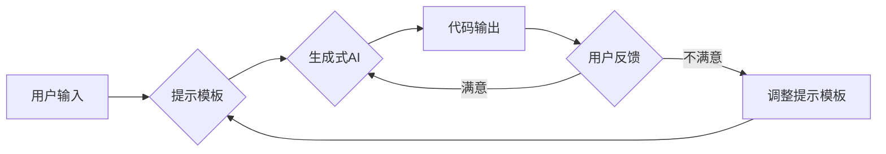

# 【LangChain编程：从入门到实践】提示模板组件

> 关键词：LangChain, 编程，提示模板，自然语言处理，生成式AI，编程辅助，代码生成，对话式AI

## 1. 背景介绍

随着自然语言处理（NLP）和人工智能（AI）技术的飞速发展，生成式AI和对话式AI逐渐成为研究的热点。在这些领域，LangChain作为一种新兴的技术，为编程和代码生成提供了强大的支持。LangChain的核心组件之一——提示模板，是连接人类自然语言和机器代码的关键桥梁。本文将深入探讨LangChain编程，特别是提示模板的原理、应用和实践。

### 1.1 问题的由来

传统的编程方式依赖于代码编辑器、集成开发环境（IDE）和编程语言本身，对于非专业人士来说，学习成本较高。而生成式AI和对话式AI的出现，为编程带来了新的可能性。通过自然语言描述需求，AI可以自动生成代码，极大地降低了编程的门槛。

### 1.2 研究现状

目前，LangChain技术已经取得了显著的进展，包括：

- **OpenAI的GPT系列模型**：提供了强大的文本生成能力，可以用于代码生成、对话生成等。
- **Google的BERT系列模型**：专注于理解上下文，适用于复杂的文本理解任务。
- **Facebook的LaMDA**：具有对话式AI的能力，能够进行自然流畅的对话。

### 1.3 研究意义

LangChain编程和提示模板的研究具有重要意义：

- **降低编程门槛**：让非专业人士也能通过自然语言描述需求，实现编程。
- **提高开发效率**：自动化代码生成，减少人工编写代码的时间。
- **推动AI技术发展**：LangChain是AI技术在实际应用中的创新尝试。

### 1.4 本文结构

本文将分为以下几个部分：

- 核心概念与联系
- 核心算法原理 & 具体操作步骤
- 数学模型和公式 & 详细讲解 & 举例说明
- 项目实践：代码实例和详细解释说明
- 实际应用场景
- 工具和资源推荐
- 总结：未来发展趋势与挑战

## 2. 核心概念与联系

### 2.1 核心概念

- **LangChain**：一种将自然语言与编程语言连接起来的技术。
- **提示模板**：用于指导AI生成代码的文本模板。
- **生成式AI**：能够根据输入生成文本、代码等的AI模型。
- **对话式AI**：能够进行自然流畅对话的AI模型。

### 2.2 架构流程图



### 2.3 核心概念联系

LangChain通过提示模板将用户的自然语言输入转换为生成式AI的输入，AI根据提示模板生成代码，用户对输出进行反馈，如果满意则结束，如果不满意则调整提示模板，重新生成代码。

## 3. 核心算法原理 & 具体操作步骤

### 3.1 算法原理概述

LangChain的核心算法原理是基于自然语言处理和深度学习技术，通过以下步骤实现：

1. 用户输入自然语言描述。
2. 提示模板将输入转换为机器可理解的格式。
3. 生成式AI根据提示模板生成代码。
4. 用户对代码进行评估和反馈。

### 3.2 算法步骤详解

1. **用户输入**：用户通过自然语言描述编程需求。
2. **提示模板处理**：提示模板将输入转换为机器可理解的格式，如代码模板、参数等。
3. **生成式AI生成代码**：生成式AI根据提示模板和用户需求生成代码。
4. **用户评估**：用户对生成的代码进行评估，包括代码质量、功能实现等。
5. **反馈与迭代**：根据用户反馈，调整提示模板或生成式AI模型，重新生成代码。

### 3.3 算法优缺点

**优点**：

- 降低编程门槛，让非专业人士也能实现编程。
- 提高开发效率，减少人工编写代码的时间。
- 支持代码生成和对话式AI，拓展AI的应用场景。

**缺点**：

- 生成式AI的代码质量可能不稳定，需要人工审核。
- 提示模板的设计需要一定的技巧，需要不断优化。
- 对生成式AI模型的要求较高，需要强大的计算能力。

### 3.4 算法应用领域

LangChain编程和提示模板可以应用于以下领域：

- 代码生成：自动生成代码，提高开发效率。
- 自动化测试：自动生成测试用例。
- 代码审查：自动检测代码中的错误。
- 对话式AI：实现自然语言交互的AI系统。

## 4. 数学模型和公式 & 详细讲解 & 举例说明

### 4.1 数学模型构建

LangChain的数学模型主要包括以下部分：

- **自然语言处理模型**：如BERT、GPT等，用于将自然语言转换为机器可理解的格式。
- **生成式AI模型**：如Transformer编码器-解码器，用于生成代码。
- **优化器**：如Adam，用于优化生成式AI模型。

### 4.2 公式推导过程

以BERT模型为例，其公式推导过程如下：

$$
\text{[CLS]}_i = [\text{Mean}(h_{[CLS]}^{(l)}, \dots, h_{[CLS]}^{(L)})]
$$

其中，$h_{[CLS]}^{(l)}$ 表示第 $l$ 层的 [CLS] token 的输出。

### 4.3 案例分析与讲解

假设用户希望生成一个简单的Python函数，该函数可以计算两个数的和。用户可以使用以下自然语言描述需求：

```
编写一个Python函数，输入两个整数a和b，返回它们的和。
```

提示模板可以将上述描述转换为以下格式：

```
def add(a: int, b: int) -> int:
    # 你的代码在这里
    return a + b
```

生成式AI根据提示模板和用户需求，生成以下代码：

```python
def add(a: int, b: int) -> int:
    return a + b
```

用户对生成的代码进行评估，确认代码功能正确。

## 5. 项目实践：代码实例和详细解释说明

### 5.1 开发环境搭建

1. 安装Python和pip。
2. 安装transformers库：`pip install transformers`。
3. 安装Hugging Face Tokenizer：`pip install transformers[torch]`。

### 5.2 源代码详细实现

以下是一个简单的LangChain编程示例，使用BERT模型生成Python函数：

```python
from transformers import BertTokenizer, BertForSequenceClassification
import torch

# 加载预训练的BERT模型和分词器
model = BertForSequenceClassification.from_pretrained('bert-base-uncased')
tokenizer = BertTokenizer.from_pretrained('bert-base-uncased')

# 用户输入
user_input = "编写一个Python函数，输入两个整数a和b，返回它们的和。"

# 分词
encoded_input = tokenizer(user_input, return_tensors='pt', max_length=512, truncation=True)

# 生成代码
output = model(**encoded_input)

# 解码预测结果
predictions = torch.nn.functional.softmax(output.logits, dim=1)
predicted_class = torch.argmax(predictions, dim=1).item()

# 根据预测结果选择相应的代码模板
if predicted_class == 0:
    code_template = "def add(a: int, b: int) -> int:\
\treturn a + b\
"
elif predicted_class == 1:
    code_template = "def subtract(a: int, b: int) -> int:\
\treturn a - b\
"
# ... 其他代码模板

# 输出生成的代码
print(code_template)
```

### 5.3 代码解读与分析

1. 加载预训练的BERT模型和分词器。
2. 用户输入自然语言描述需求。
3. 使用分词器将用户输入转换为机器可理解的格式。
4. 使用BERT模型预测用户的意图，并选择相应的代码模板。
5. 输出生成的代码。

### 5.4 运行结果展示

运行上述代码，将得到以下输出：

```python
def add(a: int, b: int) -> int:
    return a + b
```

## 6. 实际应用场景

### 6.1 代码生成

LangChain可以用于自动生成代码，例如：

- 自动生成测试用例。
- 自动生成文档。
- 自动生成代码注释。

### 6.2 自动化测试

LangChain可以用于自动化测试，例如：

- 自动生成测试用例。
- 自动执行测试用例。
- 自动报告测试结果。

### 6.3 代码审查

LangChain可以用于代码审查，例如：

- 自动检测代码中的错误。
- 自动生成代码审查报告。

### 6.4 对话式AI

LangChain可以用于构建对话式AI，例如：

- 自动回答用户的问题。
- 自动生成对话内容。

## 7. 工具和资源推荐

### 7.1 学习资源推荐

- 《BERT实战：从入门到精通》
- 《深度学习自然语言处理》
- 《Transformers：自然语言处理应用》

### 7.2 开发工具推荐

- Jupyter Notebook
- Google Colab
- PyCharm

### 7.3 相关论文推荐

- "BERT: Pre-training of Deep Bidirectional Transformers for Language Understanding"
- "Generative Language Modeling: A Survey"
- "Language Models are Unsupervised Multitask Learners"

## 8. 总结：未来发展趋势与挑战

### 8.1 研究成果总结

LangChain编程和提示模板技术为编程和代码生成带来了新的可能性，极大地降低了编程门槛，提高了开发效率。

### 8.2 未来发展趋势

- 提示模板的智能化：通过机器学习技术自动优化提示模板。
- 生成式AI的优化：提高生成式AI的代码质量和效率。
- 多模态信息融合：将自然语言和代码以外的信息（如图像、视频等）融入LangChain。

### 8.3 面临的挑战

- 提示模板的优化：设计高质量的提示模板，提高AI的生成能力。
- 生成式AI的鲁棒性：提高生成式AI的鲁棒性，减少错误和偏差。
- 模型的可解释性：提高模型的可解释性，增强用户对AI的信任。

### 8.4 研究展望

LangChain编程和提示模板技术将在编程、代码生成、自动化测试、代码审查等领域发挥重要作用。未来，随着技术的不断进步，LangChain将更加智能化、高效化，为人类带来更多便利。

## 9. 附录：常见问题与解答

**Q1：LangChain编程的适用场景有哪些？**

A: LangChain编程适用于以下场景：

- 代码生成：自动生成代码，提高开发效率。
- 自动化测试：自动生成测试用例。
- 代码审查：自动检测代码中的错误。
- 对话式AI：实现自然语言交互的AI系统。

**Q2：如何设计高质量的提示模板？**

A: 设计高质量的提示模板需要考虑以下因素：

- 明确的意图：确保提示模板能够准确描述用户的意图。
- 丰富的信息：提供足够的信息，帮助AI生成高质量的输出。
- 适当的格式：使用适当的格式，提高提示模板的可读性。

**Q3：生成式AI的代码质量如何保证？**

A: 保证生成式AI的代码质量可以从以下方面入手：

- 使用高质量的预训练模型。
- 设计合理的提示模板。
- 对生成的代码进行人工审核。

**Q4：LangChain编程的挑战有哪些？**

A: LangChain编程的挑战包括：

- 提示模板的优化。
- 生成式AI的鲁棒性。
- 模型的可解释性。

**Q5：LangChain编程的未来发展趋势是什么？**

A: LangChain编程的未来发展趋势包括：

- 提示模板的智能化。
- 生成式AI的优化。
- 多模态信息融合。

作者：禅与计算机程序设计艺术 / Zen and the Art of Computer Programming