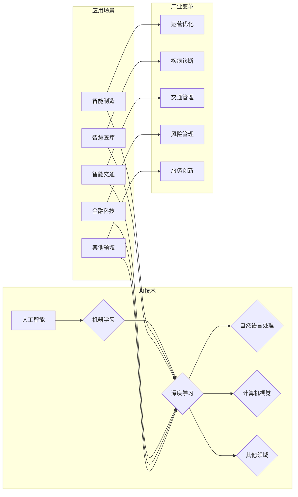

# 产业变革中的AI技术应用

> 关键词：人工智能，产业变革，技术应用，数字化转型，机器学习，深度学习，案例研究

## 1. 背景介绍

随着科技的飞速发展，人工智能（AI）已经从科幻领域步入现实，成为推动产业变革的重要力量。从智能制造到智慧医疗，从智能交通到金融科技，AI技术正在深刻地改变着各行各业的生产方式、商业模式和生活方式。本文将探讨AI技术在产业变革中的应用，分析其核心概念、原理、实践案例，并展望未来发展趋势与挑战。

## 2. 核心概念与联系

### 2.1 核心概念

#### 2.1.1 人工智能

人工智能（Artificial Intelligence，AI）是研究、开发用于模拟、延伸和扩展人的智能的理论、方法、技术及应用系统的学科。它包括机器学习、深度学习、自然语言处理、计算机视觉等多个分支。

#### 2.1.2 机器学习

机器学习（Machine Learning，ML）是人工智能的一个重要分支，通过算法和统计方法，使计算机系统能够从数据中学习，做出决策或预测。

#### 2.1.3 深度学习

深度学习（Deep Learning，DL）是机器学习的一种方法，使用深层神经网络模拟人脑的学习和认知过程。

#### 2.1.4 数字化转型

数字化转型是指利用数字技术改变组织运营、商业模式和用户体验的过程。

### 2.2 核心概念联系



## 3. 核心算法原理 & 具体操作步骤

### 3.1 算法原理概述

#### 3.1.1 机器学习

机器学习算法根据数据类型和任务类型可以分为监督学习、无监督学习和强化学习。其中，监督学习是最常见的机器学习类型，它需要标注数据进行训练。

#### 3.1.2 深度学习

深度学习算法通常使用多层神经网络进行特征提取和模型训练。常见的神经网络结构包括卷积神经网络（CNN）、循环神经网络（RNN）和Transformer。

### 3.2 算法步骤详解

#### 3.2.1 机器学习步骤

1. 数据收集：收集相关领域的原始数据。
2. 数据预处理：清洗、转换和标准化数据。
3. 模型选择：选择合适的机器学习算法。
4. 模型训练：使用标注数据进行训练。
5. 模型评估：使用验证集评估模型性能。
6. 模型优化：调整参数和模型结构，提升模型性能。

#### 3.2.2 深度学习步骤

1. 数据收集：收集相关领域的原始数据。
2. 数据预处理：清洗、转换和标准化数据。
3. 网络构建：设计神经网络结构。
4. 模型训练：使用标注数据进行训练。
5. 模型评估：使用验证集评估模型性能。
6. 模型优化：调整参数和模型结构，提升模型性能。

### 3.3 算法优缺点

#### 3.3.1 机器学习

优点：

- 灵活，适用于各种类型的数据和任务。
- 易于理解和解释。

缺点：

- 需要大量标注数据。
- 模型可解释性较差。

#### 3.3.2 深度学习

优点：

- 在图像识别、语音识别等领域表现出色。
- 自动提取特征，无需人工设计。

缺点：

- 计算量大，需要大量的计算资源。
- 模型可解释性较差。

### 3.4 算法应用领域

机器学习和深度学习在多个领域都有广泛的应用，如：

- 自然语言处理：机器翻译、文本分类、情感分析等。
- 计算机视觉：图像识别、目标检测、人脸识别等。
- 医疗诊断：疾病诊断、药物研发、健康管理等。
- 金融科技：风险管理、欺诈检测、信用评分等。

## 4. 数学模型和公式 & 详细讲解 & 举例说明

### 4.1 数学模型构建

#### 4.1.1 机器学习

假设我们有一个线性回归问题，其数学模型如下：

$$
y = \beta_0 + \beta_1x_1 + \beta_2x_2 + \cdots + \beta_nx_n + \epsilon
$$

其中，$x_i$ 是输入特征，$y$ 是输出标签，$\beta_i$ 是模型参数，$\epsilon$ 是误差项。

#### 4.1.2 深度学习

以卷积神经网络（CNN）为例，其数学模型如下：

$$
h_{\text{CNN}} = f(f(\cdots f(h_{\text{input}}; \mathbf{W}_1, \mathbf{b}_1); \mathbf{W}_2, \mathbf{b}_2) \cdots \mathbf{W}_L, \mathbf{b}_L)
$$

其中，$h_{\text{input}}$ 是输入数据，$f$ 是激活函数，$\mathbf{W}$ 是权重矩阵，$\mathbf{b}$ 是偏置项。

### 4.2 公式推导过程

#### 4.2.1 机器学习

线性回归模型的损失函数通常使用均方误差（MSE）：

$$
L(y, \hat{y}) = \frac{1}{2}(y - \hat{y})^2
$$

其中，$y$ 是真实标签，$\hat{y}$ 是模型预测值。

#### 4.2.2 深度学习

卷积神经网络的前向传播过程如下：

1. 输入层：将输入数据 $h_{\text{input}}$ 输入到第一层卷积层。
2. 卷积层：使用卷积核 $\mathbf{W}_1$ 对输入数据进行卷积运算，得到输出 $h_{\text{conv1}}$。
3. 激活函数：对输出 $h_{\text{conv1}}$ 应用激活函数 $f$，得到激活后的输出 $h_{\text{act1}}$。
4. 池化层：对 $h_{\text{act1}}$ 应用池化层，得到输出 $h_{\text{pool1}}$。
5. 重复步骤2-4，得到后续层的输出。
6. 输出层：将最后一层输出 $h_{\text{actL}}$ 输入到全连接层，得到最终预测值 $\hat{y}$。

### 4.3 案例分析与讲解

#### 4.3.1 自然语言处理

以机器翻译任务为例，使用BERT模型进行微调。首先，收集大量源语言-目标语言的平行语料库，对数据进行预处理，包括分词、去除停用词等。然后，将预处理后的数据输入BERT模型进行预训练，学习通用的语言表示。最后，针对特定翻译任务，收集少量标注数据，对模型进行微调，提升模型在翻译任务上的性能。

#### 4.3.2 计算机视觉

以图像分类任务为例，使用卷积神经网络（CNN）进行训练。首先，收集大量标注图像数据，对数据进行预处理，包括图像裁剪、缩放等。然后，设计CNN模型结构，包括卷积层、池化层和全连接层。接下来，使用预处理后的数据进行模型训练，学习图像特征。最后，使用训练好的模型对未标注图像进行分类。

## 5. 项目实践：代码实例和详细解释说明

### 5.1 开发环境搭建

1. 安装Python环境。
2. 安装深度学习框架（如PyTorch、TensorFlow）。
3. 安装相关库（如NumPy、Pandas、Scikit-learn等）。

### 5.2 源代码详细实现

以使用PyTorch进行图像分类为例，以下是一个简单的代码示例：

```python
import torch
import torchvision
import torchvision.transforms as transforms
import torch.nn as nn
import torch.optim as optim

# 加载图像数据集
transform = transforms.Compose([
    transforms.Resize(256),
    transforms.CenterCrop(224),
    transforms.ToTensor(),
    transforms.Normalize(mean=[0.485, 0.456, 0.406], std=[0.229, 0.224, 0.225])
])

train_dataset = torchvision.datasets.ImageFolder(root='./data/train', transform=transform)
train_loader = torch.utils.data.DataLoader(dataset=train_dataset, batch_size=32, shuffle=True)

# 加载预训练模型
model = torchvision.models.resnet18(pretrained=True)
num_ftrs = model.fc.in_features
model.fc = nn.Linear(num_ftrs, 2)

# 定义损失函数和优化器
criterion = nn.CrossEntropyLoss()
optimizer = optim.SGD(model.parameters(), lr=0.001, momentum=0.9)

# 训练模型
for epoch in range(10):
    running_loss = 0.0
    for i, data in enumerate(train_loader, 0):
        inputs, labels = data
        optimizer.zero_grad()
        outputs = model(inputs)
        loss = criterion(outputs, labels)
        loss.backward()
        optimizer.step()
        running_loss += loss.item()
    print(f'Epoch {epoch+1}, Loss: {running_loss/len(train_loader)}')
```

### 5.3 代码解读与分析

以上代码展示了使用PyTorch进行图像分类的基本流程：

1. 加载图像数据集并定义数据预处理。
2. 加载预训练的ResNet18模型，并修改全连接层用于分类任务。
3. 定义损失函数和优化器。
4. 进行模型训练，包括前向传播、反向传播和参数更新。

### 5.4 运行结果展示

训练完成后，可以使用测试集评估模型性能，例如计算准确率：

```python
# 加载测试数据集
test_dataset = torchvision.datasets.ImageFolder(root='./data/test', transform=transform)
test_loader = torch.utils.data.DataLoader(dataset=test_dataset, batch_size=32, shuffle=False)

# 计算准确率
correct = 0
total = 0
with torch.no_grad():
    for data in test_loader:
        images, labels = data
        outputs = model(images)
        _, predicted = torch.max(outputs.data, 1)
        total += labels.size(0)
        correct += (predicted == labels).sum().item()

print(f'Accuracy of the network on the 10000 test images: {100 * correct / total}%')
```

## 6. 实际应用场景

### 6.1 智能制造

在智能制造领域，AI技术可以用于产品质量检测、设备故障诊断、生产过程优化等。例如，使用计算机视觉技术对产品进行缺陷检测，提高生产效率和质量。

### 6.2 智慧医疗

在智慧医疗领域，AI技术可以用于疾病诊断、药物研发、健康管理、医疗辅助决策等。例如，使用深度学习技术进行医学影像分析，辅助医生进行疾病诊断。

### 6.3 智能交通

在智能交通领域，AI技术可以用于交通流量预测、自动驾驶、交通事故预防等。例如，使用机器学习技术进行交通流量预测，优化交通信号灯控制策略。

### 6.4 金融科技

在金融科技领域，AI技术可以用于风险控制、欺诈检测、智能投顾、客户服务等。例如，使用机器学习技术进行欺诈检测，降低金融风险。

### 6.5 其他领域

AI技术还应用于教育、零售、能源、物流等多个领域，推动产业变革。

## 7. 工具和资源推荐

### 7.1 学习资源推荐

1. 《深度学习》[Goodfellow, Bengio, Courville]：深度学习领域的经典教材，全面介绍了深度学习的理论基础和实践方法。
2. 《统计学习方法》[李航]：统计学习领域的经典教材，介绍了多种统计学习方法及其应用。
3. 《Python机器学习》[ Sebastian Raschka, Vincent Granville]：Python机器学习领域的入门书籍，适合初学者。
4. Coursera、edX等在线课程：提供大量机器学习、深度学习、自然语言处理等课程。

### 7.2 开发工具推荐

1. PyTorch：易于使用的深度学习框架，适合快速原型开发。
2. TensorFlow：功能强大的深度学习框架，适合大规模部署。
3. Keras：Python深度学习库，构建神经网络简单易用。
4. Jupyter Notebook：交互式计算环境，方便数据探索和分析。

### 7.3 相关论文推荐

1. "ImageNet Classification with Deep Convolutional Neural Networks" [Alex Krizhevsky, Ilya Sutskever, Geoffrey Hinton]
2. "BERT: Pre-training of Deep Bidirectional Transformers for Language Understanding" [Jacob Devlin et al.]
3. "Attention is All You Need" [Ashish Vaswani et al.]

## 8. 总结：未来发展趋势与挑战

### 8.1 研究成果总结

AI技术在产业变革中发挥着越来越重要的作用，推动了各行各业的发展。机器学习和深度学习等技术的快速发展，为AI应用提供了强大的技术支撑。

### 8.2 未来发展趋势

1. 人工智能将更加普及，渗透到更多行业和领域。
2. 模型将更加高效，资源消耗将大幅降低。
3. 模型将更加可解释，提高模型的可靠性和可信度。
4. 跨学科研究将更加深入，AI与其他领域技术相结合，创造新的应用场景。

### 8.3 面临的挑战

1. 数据质量：高质量的数据是AI应用的基础，如何获取和清洗数据是重要挑战。
2. 算力：深度学习模型需要大量的计算资源，如何高效利用计算资源是重要挑战。
3. 可解释性：提高模型的可解释性，增强模型的可靠性和可信度是重要挑战。
4. 隐私保护：在数据收集和处理过程中，如何保护用户隐私是重要挑战。

### 8.4 研究展望

未来，AI技术将在以下方面取得突破：

1. 针对特定领域的AI专用芯片设计。
2. 新型学习算法和模型结构研究。
3. AI与其他领域技术的融合。
4. AI伦理和安全研究。

相信通过不断的努力，AI技术将为人类创造更加美好的未来。

## 9. 附录：常见问题与解答

**Q1：AI技术是否会取代人类工作？**

A：AI技术可以替代一些重复性和低技能的工作，但无法完全取代人类。AI技术将更多地与人类合作，提高工作效率和生活质量。

**Q2：如何选择合适的AI技术？**

A：选择合适的AI技术需要根据具体任务和应用场景进行评估。例如，对于图像识别任务，可以选择深度学习中的卷积神经网络；对于自然语言处理任务，可以选择深度学习中的循环神经网络或Transformer。

**Q3：AI技术有哪些伦理问题？**

A：AI技术可能存在偏见、歧视、隐私泄露等伦理问题。需要加强AI伦理研究，确保AI技术的合理、安全使用。

**Q4：AI技术是否会引发失业？**

A：AI技术可能会替代一些工作，但也会创造新的就业机会。长期来看，AI技术将促进产业升级和经济发展，创造更多就业岗位。

**Q5：如何确保AI技术的安全性？**

A：确保AI技术的安全性需要从算法设计、数据安全、系统安全等多个方面进行考虑。需要加强AI安全研究，提高AI技术的可靠性和可信度。

作者：禅与计算机程序设计艺术 / Zen and the Art of Computer Programming