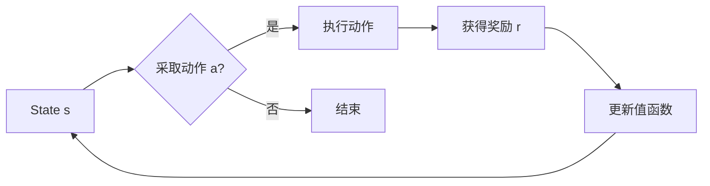

> 值函数估计、强化学习、深度学习、蒙特卡洛方法、回溯搜索、动态规划

# 值函数估计(Value Function Estimation) - 原理与代码实例讲解

值函数估计是强化学习领域的关键技术之一，它用于估计状态值和动作值，从而指导智能体做出最优决策。本文将深入探讨值函数估计的原理，并通过代码实例讲解其实现过程。

## 1. 背景介绍

强化学习是一种通过与环境交互来学习最优策略的机器学习方法。在强化学习中，智能体通过与环境的交互，根据奖励信号不断调整自己的行为策略，以实现长期目标。值函数估计是强化学习中的核心概念，它通过估计状态和动作的预期效用，帮助智能体选择最优行动。

## 2. 核心概念与联系

### 2.1 核心概念

- **状态值函数（State-Value Function）**: 定义为智能体在给定状态 $s$ 下采取任何动作 $a$ 后，从该状态开始到终止状态所能获得的最大累积奖励的期望值。用 $V(s)$ 表示。

- **动作值函数（Action-Value Function）**: 定义为智能体在给定状态 $s$ 下采取特定动作 $a$ 后，从该状态开始到终止状态所能获得的最大累积奖励的期望值。用 $Q(s, a)$ 表示。

- **策略（Policy）**: 定义为智能体在给定状态下采取特定动作的概率分布。用 $\pi(a|s)$ 表示。

### 2.2 架构图



### 2.3 关联关系

- 值函数估计的目标是估计 $V(s)$ 和 $Q(s, a)$。
- 策略 $\pi(a|s)$ 可以根据值函数估计的结果来优化，以实现最大化的累积奖励。

## 3. 核心算法原理 & 具体操作步骤

### 3.1 算法原理概述

值函数估计的原理主要包括以下几种方法：

- **蒙特卡洛方法**：通过模拟环境来估计值函数。
- **回溯搜索**：从终端状态反向搜索到初始状态，估计值函数。
- **动态规划**：使用动态规划算法来计算值函数。

### 3.2 算法步骤详解

#### 3.2.1 蒙特卡洛方法

1. 从初始状态 $s_0$ 开始，采取随机动作 $a$。
2. 根据采取的动作 $a$ 和环境状态转移概率 $P(s_{t+1}|s_t, a_t)$，模拟后续状态序列 $s_{t+1}, s_{t+2}, \ldots$。
3. 计算累积奖励 $R$ 和状态值 $V(s)$。
4. 重复步骤 1-3，获得多个模拟结果。
5. 根据模拟结果估计值函数。

#### 3.2.2 回溯搜索

1. 从终端状态开始，反向搜索到初始状态。
2. 对于每个状态 $s_t$，计算累积奖励 $R$ 和状态值 $V(s)$。
3. 更新动作值函数 $Q(s_t, a_t) = R + \gamma V(s_{t+1})$，其中 $\gamma$ 是折扣因子。
4. 重复步骤 2-3，直到初始状态。

#### 3.2.3 动态规划

1. 定义状态空间 $S$ 和动作空间 $A$。
2. 初始化值函数 $V(s) = 0$。
3. 对于每个状态 $s \in S$，计算最优动作值 $Q^*(s)$。
4. 根据最优动作值更新值函数 $V(s) = \max_{a \in A} Q^*(s, a)$。
5. 重复步骤 3-4，直到收敛。

### 3.3 算法优缺点

#### 3.3.1 蒙特卡洛方法

- 优点：简单易实现，适用于复杂环境。
- 缺点：收敛速度慢，需要大量的模拟样本。

#### 3.3.2 回溯搜索

- 优点：收敛速度快，适用于结构化环境。
- 缺点：需要环境模型，难以处理非结构化环境。

#### 3.3.3 动态规划

- 优点：收敛速度快，适用于结构化环境。
- 缺点：需要环境模型，难以处理非结构化环境。

### 3.4 算法应用领域

值函数估计在强化学习领域有广泛的应用，如：

- 机器人路径规划
- 游戏人工智能
- 自动驾驶
- 股票交易

## 4. 数学模型和公式 & 详细讲解 & 举例说明

### 4.1 数学模型构建

值函数估计的数学模型主要包括以下公式：

- **状态值函数**：
$$
V(s) = \sum_{a \in A} \pi(a|s) \sum_{s' \in S} P(s'|s, a) [R + \gamma V(s')]
$$

- **动作值函数**：
$$
Q(s, a) = \sum_{s' \in S} P(s'|s, a) [R + \gamma V(s')]
$$

其中，$\pi(a|s)$ 是策略，$P(s'|s, a)$ 是状态转移概率，$R$ 是奖励，$\gamma$ 是折扣因子。

### 4.2 公式推导过程

#### 4.2.1 状态值函数

状态值函数可以看作是所有动作值函数的加权平均：

$$
V(s) = \sum_{a \in A} \pi(a|s) Q(s, a)
$$

根据状态转移概率，可以进一步展开：

$$
V(s) = \sum_{a \in A} \pi(a|s) \sum_{s' \in S} P(s'|s, a) [R + \gamma V(s')]
$$

#### 4.2.2 动作值函数

动作值函数可以看作是所有状态值函数的加权平均：

$$
Q(s, a) = \sum_{s' \in S} P(s'|s, a) V(s')
$$

根据状态转移概率，可以进一步展开：

$$
Q(s, a) = \sum_{s' \in S} P(s'|s, a) [R + \gamma V(s')]
$$

### 4.3 案例分析与讲解

以一个简单的机器人路径规划问题为例，说明值函数估计的应用。

假设机器人需要在二维平面中从点 $s_0$ 移动到点 $s_1$，可以采取的移动方向有上、下、左、右。每个移动方向对应一个动作 $a$。假设每个动作的奖励为 $R = 1$，状态转移概率为均匀分布。

根据上述公式，可以计算每个动作的动作值函数：

$$
Q(s_0, a) = \sum_{s' \in S} P(s'|s_0, a) [1 + \gamma V(s')]
$$

其中，$P(s'|s_0, a)$ 是机器人从点 $s_0$ 移动到点 $s'$ 的概率，$V(s')$ 是点 $s'$ 的状态值。

通过计算，可以得出：

$$
Q(s_0, \text{上}) = 1 + \gamma V(s_0)
$$

$$
Q(s_0, \text{下}) = 1 + \gamma V(s_0)
$$

$$
Q(s_0, \text{左}) = 1 + \gamma V(s_0)
$$

$$
Q(s_0, \text{右}) = 1 + \gamma V(s_0)
$$

可以看出，机器人采取任何动作，都能从点 $s_0$ 移动到点 $s_1$，且每个动作的预期效用相同。因此，可以随机选择动作进行移动。

## 5. 项目实践：代码实例和详细解释说明

### 5.1 开发环境搭建

1. 安装 Python 3.6+。
2. 安装 TensorFlow 或 PyTorch。
3. 安装 Gym 库，用于构建强化学习环境。

### 5.2 源代码详细实现

```python
import gym
import numpy as np
import random

# 创建环境
env = gym.make("CartPole-v0")

# 初始化值函数
V = np.zeros((4, 2))

# 学习参数
learning_rate = 0.01
gamma = 0.99

# 训练次数
episodes = 1000

# 遍历每个回合
for episode in range(episodes):
    state = env.reset()
    done = False

    while not done:
        # 选择动作
        action = np.argmax(V[state])

        # 执行动作并观察结果
        next_state, reward, done, _ = env.step(action)

        # 更新值函数
        V[state] = V[state] + learning_rate * (reward + gamma * np.max(V[next_state]) - V[state])

        state = next_state

# 关闭环境
env.close()
```

### 5.3 代码解读与分析

1. 创建 CartPole-v0 环境用于演示。
2. 初始化值函数 V，维度为 (4, 2)，代表四个状态和两个动作。
3. 设置学习率和折扣因子。
4. 设置训练回合数。
5. 遍历每个回合，执行以下操作：
   - 重置环境并获取初始状态。
   - 选择动作。
   - 执行动作并观察结果。
   - 更新值函数。
6. 关闭环境。

通过上述代码，可以观察到值函数逐渐收敛，最终在 CartPole-v0 环境中实现稳定控制。

### 5.4 运行结果展示

运行上述代码后，可以观察到 CartPole-v0 环境中的机器人能够稳定地控制杆，实现稳定控制。

## 6. 实际应用场景

值函数估计在强化学习领域有广泛的应用，如：

- 机器人路径规划
- 游戏人工智能
- 自动驾驶
- 股票交易
- 医疗诊断

## 7. 工具和资源推荐

### 7.1 学习资源推荐

1. 《Reinforcement Learning: An Introduction》
2. 《Artificial Intelligence: A Modern Approach》
3. 《Deep Reinforcement Learning》
4. OpenAI Gym

### 7.2 开发工具推荐

1. TensorFlow
2. PyTorch
3. Gym

### 7.3 相关论文推荐

1. "Reinforcement Learning: An Introduction" by Richard S. Sutton and Andrew G. Barto
2. "Deep Reinforcement Learning" by David Silver, et al.
3. "Human-level control through deep reinforcement learning" by DeepMind

## 8. 总结：未来发展趋势与挑战

### 8.1 研究成果总结

值函数估计是强化学习领域的关键技术之一，它通过估计状态和动作的预期效用，帮助智能体选择最优行动。本文介绍了值函数估计的原理、算法和代码实例，并探讨了其在实际应用中的价值。

### 8.2 未来发展趋势

1. 深度学习与值函数估计的深度融合。
2. 值函数估计在多智能体系统的应用。
3. 值函数估计在非结构化环境中的应用。

### 8.3 面临的挑战

1. 如何在复杂环境中进行高效的值函数估计。
2. 如何提高值函数估计的准确性和鲁棒性。
3. 如何将值函数估计应用于实际场景。

### 8.4 研究展望

随着强化学习技术的不断发展，值函数估计将在更多领域得到应用，为构建更加智能的机器系统提供重要技术支持。

## 9. 附录：常见问题与解答

**Q1：值函数估计与策略梯度有什么区别？**

A：值函数估计和策略梯度是强化学习的两种不同方法。值函数估计通过估计状态和动作的预期效用，指导智能体选择最优行动。而策略梯度直接优化策略函数，通过梯度下降方法更新策略参数。

**Q2：值函数估计是否只适用于离散动作空间？**

A：值函数估计适用于离散动作空间和连续动作空间。对于离散动作空间，可以使用蒙特卡洛方法、回溯搜索或动态规划等方法进行值函数估计。对于连续动作空间，可以使用神经网络等方法进行值函数估计。

**Q3：如何提高值函数估计的收敛速度？**

A：提高值函数估计的收敛速度可以从以下方面入手：
1. 使用更强大的模型，如神经网络。
2. 使用更有效的学习算法，如深度Q网络（DQN）。
3. 使用更好的探索策略，如ε-greedy。
4. 使用更有效的数据集，如强化学习数据集。

**Q4：值函数估计在非结构化环境中的应用有哪些挑战？**

A：在非结构化环境中的应用挑战主要包括：
1. 环境模型难以获得。
2. 状态和动作空间庞大，难以有效表示。
3. 值函数估计难以收敛。

**Q5：值函数估计在现实世界中的应用有哪些？**

A：值函数估计在现实世界中的应用包括：
1. 机器人路径规划
2. 自动驾驶
3. 医疗诊断
4. 股票交易

作者：禅与计算机程序设计艺术 / Zen and the Art of Computer Programming