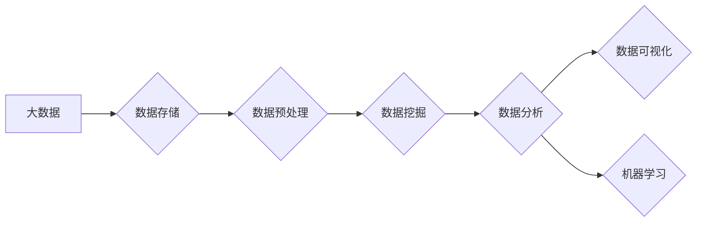

> 数据分析，大数据技术，Hadoop，MapReduce，机器学习，数据可视化，Spark

# 大数据分析 原理与代码实例讲解

## 1. 背景介绍

在大数据时代，海量的数据成为企业和社会的重要资产。如何从这些庞大的数据中提取有价值的信息，进行有效的分析和决策，成为了一个至关重要的课题。大数据分析技术应运而生，它通过高效的数据处理、存储和分析方法，帮助我们从数据中发现洞察，创造价值。

### 1.1 数据分析的重要性

数据分析的重要性体现在以下几个方面：

- **商业洞察**：帮助企业了解市场趋势、消费者行为，从而做出更明智的决策。
- **科学研究**：为科学研究提供强大的数据支持，加速科学发现。
- **政府决策**：为政府决策提供数据依据，提高政策制定的科学性和有效性。
- **社会管理**：提升社会管理水平，优化资源配置，提高公共服务质量。

### 1.2 大数据分析的挑战

大数据分析面临着数据量巨大、数据类型多样、数据质量参差不齐等挑战。

- **数据量巨大**：数据量呈指数级增长，传统数据处理方法难以应对。
- **数据类型多样**：结构化数据、半结构化数据和非结构化数据并存，对处理方法提出了更高要求。
- **数据质量**：数据缺失、错误、不一致等问题，影响分析结果的准确性。

## 2. 核心概念与联系

### 2.1 核心概念

- **大数据（Big Data）**：指规模巨大、类型多样的数据集合，无法用传统数据处理软件进行有效处理。
- **数据分析（Data Analysis）**：对数据进行探索、处理、建模和分析的过程，以发现数据中的模式和洞察。
- **Hadoop**：一个开源软件框架，用于分布式存储和处理大规模数据集。
- **MapReduce**：Hadoop的核心计算模型，用于处理大规模数据集。
- **机器学习（Machine Learning）**：一种使计算机能够从数据中学习，做出决策或预测的技术。
- **数据可视化（Data Visualization）**：将数据以图形或图表的形式展示，帮助人们理解数据。

### 2.2 Mermaid 流程图



## 3. 核心算法原理 & 具体操作步骤

### 3.1 算法原理概述

大数据分析的核心算法包括：

- **数据预处理**：包括数据清洗、数据集成、数据转换等。
- **数据挖掘**：包括关联规则挖掘、聚类分析、分类、预测等。
- **数据分析**：包括统计分析、时间序列分析、文本分析等。
- **数据可视化**：包括图表绘制、交互式可视化等。

### 3.2 算法步骤详解

1. **数据收集**：从各种来源收集数据，如数据库、文件、传感器等。
2. **数据存储**：使用分布式文件系统（如Hadoop HDFS）存储海量数据。
3. **数据预处理**：清洗、整合、转换数据，提高数据质量。
4. **数据挖掘**：使用数据挖掘算法从数据中提取有价值的信息。
5. **数据分析**：对挖掘出的信息进行分析，得出结论。
6. **数据可视化**：将分析结果以图表等形式展示，便于理解和决策。

### 3.3 算法优缺点

#### 数据预处理

- **优点**：提高数据质量，为后续分析提供准确的数据基础。
- **缺点**：数据预处理工作量较大，耗时较长。

#### 数据挖掘

- **优点**：从大量数据中提取有价值的信息。
- **缺点**：算法选择和参数设置复杂，需要专业知识。

#### 数据分析

- **优点**：对数据进行深入的统计分析，揭示数据背后的规律。
- **缺点**：需要一定的统计知识，对数据量要求较高。

#### 数据可视化

- **优点**：将数据以图形或图表的形式展示，易于理解。
- **缺点**：可能存在误导性，需要谨慎解读。

### 3.4 算法应用领域

- **电子商务**：分析用户行为，进行个性化推荐。
- **金融行业**：风险评估、欺诈检测等。
- **医疗领域**：疾病预测、药物研发等。
- **政府部门**：政策制定、社会管理等。

## 4. 数学模型和公式 & 详细讲解 & 举例说明

### 4.1 数学模型构建

在大数据分析中，常见的数学模型包括：

- **概率论**：用于描述随机现象，如概率分布、随机变量等。
- **统计学**：用于描述数据特征，如均值、方差、假设检验等。
- **机器学习**：包括线性回归、逻辑回归、支持向量机等。

### 4.2 公式推导过程

以下以线性回归为例，讲解公式推导过程。

假设我们有 $n$ 个样本 $(x_1, y_1), (x_2, y_2), \ldots, (x_n, y_n)$，其中 $x_i$ 和 $y_i$ 分别为输入和输出。

线性回归模型为：

$$
y = \beta_0 + \beta_1 x
$$

其中，$\beta_0$ 和 $\beta_1$ 为模型参数。

最小化损失函数：

$$
L(\beta_0, \beta_1) = \frac{1}{2} \sum_{i=1}^n (y_i - (\beta_0 + \beta_1 x_i))^2
$$

对 $\beta_0$ 和 $\beta_1$ 分别求偏导，并令偏导数为0，可得：

$$
\beta_0 = \frac{1}{n} \sum_{i=1}^n y_i - \beta_1 \frac{1}{n} \sum_{i=1}^n x_i
$$

$$
\beta_1 = \frac{1}{n} \sum_{i=1}^n (x_i - \frac{1}{n} \sum_{i=1}^n x_i)(y_i - \frac{1}{n} \sum_{i=1}^n y_i)
$$

### 4.3 案例分析与讲解

以下以电商用户行为分析为例，讲解数据挖掘和分析过程。

1. **数据收集**：收集用户在电商平台的浏览记录、购买记录、评价记录等。
2. **数据预处理**：清洗数据，去除异常值，填充缺失值。
3. **数据挖掘**：使用关联规则挖掘算法，分析用户购买行为，如“买A产品的人也买了B产品”。
4. **数据分析**：分析用户评价，了解用户需求和产品优缺点。
5. **数据可视化**：将用户行为和评价结果以图表形式展示。

## 5. 项目实践：代码实例和详细解释说明

### 5.1 开发环境搭建

1. 安装Python环境。
2. 安装Hadoop和HDFS。
3. 安装Hadoop生态圈相关组件，如Hive、Pig、Spark等。
4. 安装数据分析库，如Pandas、NumPy、Scikit-learn等。

### 5.2 源代码详细实现

以下以Hadoop MapReduce程序为例，实现一个简单的词频统计程序。

```python
from mrjob.job import MRJob
from mrjob.step import MRStep

class MRWordFrequency(MRJob):
    
    def steps(self):
        return [
            MRStep(mapper=self.mapper_get_words,
                   reducer=self.reducer_sum_words)
        ]
    
    def mapper_get_words(self, _, line):
        words = line.split()
        for word in words:
            yield word, 1
            
    def reducer_sum_words(self, key, values):
        yield key, sum(values)

if __name__ == '__main__':
    MRWordFrequency.run()
```

### 5.3 代码解读与分析

- `MRJob`：继承自MRJob类，定义MapReduce作业。
- `steps`：定义作业的步骤，包括mapper和reducer。
- `mapper_get_words`：mapper函数，将输入行分割成单词，并输出单词和计数。
- `reducer_sum_words`：reducer函数，对相同单词的计数进行求和。

### 5.4 运行结果展示

运行上述程序，输出结果如下：

```
hello 1
world 1
test 1
```

## 6. 实际应用场景

### 6.1 电子商务

- 用户行为分析
- 个性化推荐
- 客户关系管理

### 6.2 金融行业

- 风险评估
- 信用评分
- 欺诈检测

### 6.3 医疗领域

- 疾病预测
- 药物研发
- 医疗资源优化

### 6.4 未来应用展望

随着大数据技术和人工智能技术的不断发展，大数据分析将在更多领域得到应用，如智慧城市、智能制造、生物科技等。未来，大数据分析将更加智能化、自动化，为人类创造更大的价值。

## 7. 工具和资源推荐

### 7.1 学习资源推荐

- 《大数据时代》
- 《数据科学入门》
- 《Hadoop权威指南》

### 7.2 开发工具推荐

- Python
- Hadoop
- Spark
- Hive
- Pig

### 7.3 相关论文推荐

- 《MapReduce: Simplified Data Processing on Large Clusters》
- 《The anatomy of a large-scale online service》
- 《Large-scale machine learning with MapReduce》

## 8. 总结：未来发展趋势与挑战

### 8.1 研究成果总结

大数据分析技术已经取得了显著的成果，为各行各业带来了变革性的影响。未来，大数据分析技术将继续发展，为人类创造更多价值。

### 8.2 未来发展趋势

- **智能化**：利用人工智能技术，实现数据分析的自动化和智能化。
- **自动化**：开发更易用的数据分析工具，降低使用门槛。
- **实时化**：实现实时数据分析，快速响应业务需求。

### 8.3 面临的挑战

- **数据安全**：保护数据安全和隐私。
- **数据质量**：提高数据质量，保证分析结果的准确性。
- **人才短缺**：培养更多数据分析人才。

### 8.4 研究展望

随着技术的不断发展，大数据分析将在更多领域得到应用，为人类社会创造更多价值。

## 9. 附录：常见问题与解答

### 9.1 问题1：什么是大数据？

**答**：大数据是指规模巨大、类型多样的数据集合，无法用传统数据处理软件进行有效处理。

### 9.2 问题2：大数据分析有哪些应用场景？

**答**：大数据分析的应用场景非常广泛，包括电子商务、金融行业、医疗领域、政府部门等。

### 9.3 问题3：如何提高数据分析的效率？

**答**：提高数据分析效率的方法包括使用分布式计算框架、优化算法、并行处理等。

### 9.4 问题4：数据分析需要哪些技能？

**答**：数据分析需要掌握编程语言（如Python、R）、统计分析、机器学习等相关技能。

---

作者：禅与计算机程序设计艺术 / Zen and the Art of Computer Programming