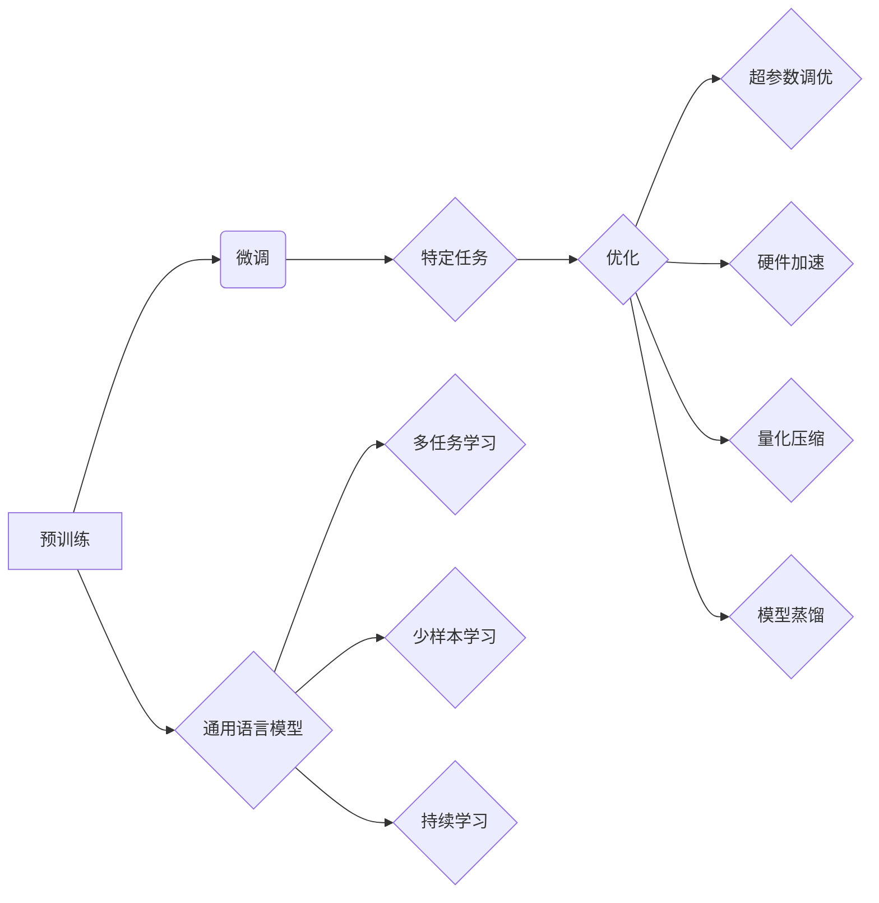

# 大语言模型原理与工程实践：大语言模型训练优化秘籍

> 关键词：大语言模型，训练优化，超参数调优，分布式训练，硬件加速，量化压缩，模型蒸馏，持续学习

## 1. 背景介绍

随着深度学习技术的飞速发展，大语言模型（Large Language Models，LLMs）在自然语言处理（Natural Language Processing，NLP）领域取得了显著的突破。这些模型通过在庞大的文本语料库上进行预训练，学习到了丰富的语言知识，并在各种NLP任务上展现出惊人的能力。然而，大语言模型的训练和优化是一个复杂而耗时的工作，涉及到众多技术细节。本文将深入探讨大语言模型的训练优化秘籍，帮助读者掌握高效训练大模型的技巧。

## 2. 核心概念与联系

### 2.1 核心概念

- **大语言模型（LLMs）**：一种在大量文本语料库上预训练的深度学习模型，能够理解和生成自然语言。
- **预训练（Pre-training）**：在大量无标签数据上训练模型，使其学习到通用的语言特征。
- **微调（Fine-tuning）**：在预训练模型的基础上，使用少量有标签数据进一步训练，以适应特定任务。
- **超参数（Hyperparameters）**：模型参数之外，对模型训练过程有显著影响的参数，如学习率、批大小等。
- **分布式训练（Distributed Training）**：将训练数据分片，在多台机器上并行训练模型。
- **硬件加速（Hardware Acceleration）**：使用GPU、TPU等硬件加速训练速度。
- **量化压缩（Quantization and Compression）**：降低模型精度和复杂度，减少模型大小和计算量。
- **模型蒸馏（Model Distillation）**：将知识从一个更大的模型迁移到一个小模型。

### 2.2 Mermaid 流程图



## 3. 核心算法原理 & 具体操作步骤

### 3.1 算法原理概述

大语言模型的训练优化主要涉及以下几个方面：

- **超参数调优**：调整模型参数之外的超参数，如学习率、批大小、优化器等，以获得最佳性能。
- **分布式训练**：将训练数据分片，在多台机器上并行训练模型，加快训练速度。
- **硬件加速**：使用GPU、TPU等硬件加速模型训练，提高效率。
- **量化压缩**：降低模型精度和复杂度，减少模型大小和计算量。
- **模型蒸馏**：将知识从一个更大的模型迁移到一个小模型，提高效率。

### 3.2 算法步骤详解

1. **数据预处理**：清洗、分词、编码训练数据。
2. **模型选择**：选择合适的预训练模型，如BERT、GPT等。
3. **超参数调优**：使用网格搜索、贝叶斯优化等方法调整超参数。
4. **分布式训练**：将数据分片，在多台机器上并行训练模型。
5. **硬件加速**：使用GPU、TPU等硬件加速模型训练。
6. **量化压缩**：对模型进行量化压缩，降低模型大小和计算量。
7. **模型蒸馏**：将知识从大模型迁移到小模型。
8. **评估与优化**：在验证集上评估模型性能，根据评估结果调整超参数和训练策略。

### 3.3 算法优缺点

- **优点**：
  - 提高训练效率。
  - 降低模型大小和计算量。
  - 提高模型性能。
- **缺点**：
  - 需要大量的计算资源和存储空间。
  - 需要专业知识和技术。
  - 可能导致过拟合。

### 3.4 算法应用领域

大语言模型的训练优化方法广泛应用于以下领域：

- **自然语言处理**：文本分类、情感分析、机器翻译、问答系统等。
- **计算机视觉**：图像识别、目标检测、语义分割等。
- **语音识别**：语音识别、语音合成、语音翻译等。
- **推荐系统**：个性化推荐、协同过滤等。

## 4. 数学模型和公式 & 详细讲解 & 举例说明

### 4.1 数学模型构建

大语言模型的训练过程可以通过以下数学模型进行描述：

$$
\theta_{new} = \theta_{old} - \alpha \cdot \nabla_{\theta} \mathcal{L}(\theta_{old})
$$

其中，$\theta$ 表示模型参数，$\alpha$ 表示学习率，$\mathcal{L}$ 表示损失函数。

### 4.2 公式推导过程

以交叉熵损失函数为例，推导其梯度计算公式：

$$
\frac{\partial \mathcal{L}}{\partial \theta} = -\frac{\partial}{\partial \theta} [y \log(\hat{y}) + (1-y) \log(1-\hat{y})]
$$

$$
= -\frac{\partial}{\partial \theta} [y \log(\hat{y})] - \frac{\partial}{\partial \theta} [(1-y) \log(1-\hat{y})]
$$

$$
= -[y \frac{1}{\hat{y}} \frac{\partial}{\partial \theta} \hat{y} + (1-y) \frac{1}{1-\hat{y}} \frac{\partial}{\partial \theta} (1-\hat{y})]
$$

$$
= -[y \frac{1}{\hat{y}} \frac{\partial}{\partial \theta} \hat{y} - (1-y) \frac{1}{1-\hat{y}} \frac{\partial}{\partial \theta} \hat{y}]
$$

$$
= -\frac{1}{\hat{y}} \frac{\partial}{\partial \theta} \hat{y}
$$

其中，$\hat{y}$ 表示模型预测的输出，$y$ 表示真实标签。

### 4.3 案例分析与讲解

以BERT模型为例，介绍如何进行超参数调优：

1. **选择预训练模型**：选择BERT-base或BERT-large模型作为预训练模型。
2. **设置超参数**：设置学习率、批大小、迭代轮数等超参数。
3. **训练模型**：在训练集上训练模型，并在验证集上评估性能。
4. **调整超参数**：根据验证集上的性能，调整学习率、批大小、迭代轮数等超参数，直到达到最佳性能。

## 5. 项目实践：代码实例和详细解释说明

### 5.1 开发环境搭建

1. 安装Python和PyTorch。
2. 安装Hugging Face的Transformers库。

### 5.2 源代码详细实现

```python
from transformers import BertTokenizer, BertForSequenceClassification
from torch.utils.data import DataLoader
from torch.optim import AdamW

# 加载预训练模型和分词器
tokenizer = BertTokenizer.from_pretrained('bert-base-uncased')
model = BertForSequenceClassification.from_pretrained('bert-base-uncased')

# 加载训练数据
train_data = ...  # 加载训练数据

# 编码训练数据
train_encodings = tokenizer(train_data['text'], padding=True, truncation=True)

# 创建DataLoader
train_dataset = DataLoader(train_encodings, batch_size=32, shuffle=True)

# 定义优化器
optimizer = AdamW(model.parameters(), lr=5e-5)

# 训练模型
for epoch in range(3):
    model.train()
    for batch in train_dataset:
        optimizer.zero_grad()
        outputs = model(**batch)
        loss = outputs.loss
        loss.backward()
        optimizer.step()
```

### 5.3 代码解读与分析

以上代码演示了如何使用PyTorch和Transformers库训练BERT模型：

1. 加载预训练模型和分词器。
2. 加载并编码训练数据。
3. 创建DataLoader。
4. 定义优化器。
5. 训练模型。

### 5.4 运行结果展示

在训练过程中，可以观察到训练集和验证集上的损失和准确率变化。根据训练结果，可以调整超参数和训练策略，以获得更好的性能。

## 6. 实际应用场景

### 6.1 自然语言处理

大语言模型的训练优化在自然语言处理领域有着广泛的应用，如：

- **文本分类**：对文本进行分类，如情感分析、主题分类等。
- **问答系统**：根据用户问题，从知识库中检索答案。
- **机器翻译**：将一种语言的文本翻译成另一种语言。

### 6.2 计算机视觉

大语言模型的训练优化在计算机视觉领域也有应用，如：

- **图像分类**：对图像进行分类，如猫狗分类、植物分类等。
- **目标检测**：检测图像中的目标物体。
- **语义分割**：对图像进行语义分割，如道路分割、人体分割等。

### 6.3 语音识别

大语言模型的训练优化在语音识别领域也有应用，如：

- **语音识别**：将语音转换为文本。
- **语音合成**：将文本转换为语音。

## 7. 工具和资源推荐

### 7.1 学习资源推荐

- 《深度学习》
- 《动手学深度学习》
- 《Hugging Face Transformers库官方文档》

### 7.2 开发工具推荐

- PyTorch
- TensorFlow
- Hugging Face Transformers库

### 7.3 相关论文推荐

- BERT: Pre-training of Deep Bidirectional Transformers for Language Understanding
- Language Models are Unsupervised Multitask Learners
- A Simple Framework for Text Classification

## 8. 总结：未来发展趋势与挑战

### 8.1 研究成果总结

本文深入探讨了大语言模型的训练优化秘籍，从核心概念、算法原理、具体步骤、数学模型到项目实践，全面介绍了大语言模型的训练优化方法。

### 8.2 未来发展趋势

- **模型规模持续扩大**：随着计算资源和数据规模的增加，大语言模型的规模将不断增大。
- **训练优化技术不断改进**：针对大规模模型的训练优化技术将不断改进，如分布式训练、量化压缩等。
- **多模态融合**：大语言模型将与其他模态信息进行融合，如图像、视频、语音等。

### 8.3 面临的挑战

- **计算资源瓶颈**：训练大规模模型需要大量的计算资源和存储空间。
- **模型可解释性**：大语言模型的可解释性较差，难以理解其内部工作机制。
- **数据安全与隐私**：训练大语言模型需要大量数据，如何保证数据安全与隐私是一个重要问题。

### 8.4 研究展望

- **更有效的训练优化技术**：开发更有效的训练优化技术，如新型优化器、分布式训练等。
- **模型可解释性**：提高大语言模型的可解释性，使其更加可靠和可信。
- **数据安全与隐私**：研究数据安全与隐私保护技术，确保数据安全。

## 9. 附录：常见问题与解答

**Q1：什么是大语言模型？**

A：大语言模型是一种在大量文本语料库上预训练的深度学习模型，能够理解和生成自然语言。

**Q2：如何进行大语言模型的训练优化？**

A：进行大语言模型的训练优化，需要进行数据预处理、模型选择、超参数调优、分布式训练、硬件加速、量化压缩、模型蒸馏等步骤。

**Q3：大语言模型的训练优化有哪些挑战？**

A：大语言模型的训练优化面临的挑战包括计算资源瓶颈、模型可解释性、数据安全与隐私等。

**Q4：如何选择合适的预训练模型？**

A：选择合适的预训练模型需要考虑任务类型、数据规模、计算资源等因素。

**Q5：如何进行超参数调优？**

A：可以使用网格搜索、贝叶斯优化等方法进行超参数调优。

作者：禅与计算机程序设计艺术 / Zen and the Art of Computer Programming