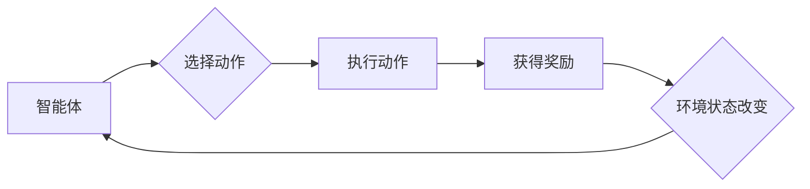

> 强化学习（Reinforcement Learning, RL），马尔可夫决策过程（Markov Decision Process, MDP），策略学习（Policy Learning），价值函数（Value Function），Q学习（Q-Learning），深度Q网络（Deep Q-Network, DQN），蒙特卡洛树搜索（Monte Carlo Tree Search, MCTS），强化学习应用

# 强化学习(Reinforcement Learning) - 原理与代码实例讲解

强化学习（Reinforcement Learning, RL）是一种使智能体在复杂环境中通过与环境交互学习最优行为策略的机器学习范式。与监督学习和无监督学习不同，强化学习中的学习过程是通过与环境的持续交互来完成的，智能体通过尝试不同的行为并从环境中获得奖励信号来学习如何做出最优决策。

## 1. 背景介绍

### 1.1 问题的由来

强化学习源于20世纪50年代，旨在模拟人类学习过程，使机器能够在没有明确指令的情况下，通过自我学习和探索来解决问题。随着深度学习技术的发展，强化学习在游戏、机器人、自动驾驶、自然语言处理等领域取得了显著的成果。

### 1.2 研究现状

近年来，强化学习研究取得了长足进步，涌现出许多经典算法和理论框架。其中，深度强化学习（Deep Reinforcement Learning, DRL）将深度学习与强化学习相结合，通过神经网络来近似价值函数或策略函数，实现了在复杂环境中的高效学习。

### 1.3 研究意义

强化学习在众多领域具有广泛的应用价值，如：

- 游戏：如AlphaGo、OpenAI Five等在国际象棋、围棋等游戏领域取得突破性成果。
- 机器人：如Boston Dynamics的机器人可以在各种复杂环境中进行自主运动和操作。
- 自动驾驶：如Waymo、Tesla等公司的自动驾驶汽车正在逐步走向商业化。
- 金融：如量化交易、风险评估等。
- 自然语言处理：如对话系统、机器翻译等。

### 1.4 本文结构

本文将系统介绍强化学习的原理、算法和应用，包括：

- 核心概念和联系
- 核心算法原理和具体操作步骤
- 数学模型和公式
- 项目实践：代码实例和详细解释说明
- 实际应用场景
- 工具和资源推荐
- 总结：未来发展趋势与挑战

## 2. 核心概念与联系

### 2.1 核心概念原理

强化学习中的核心概念包括：

- 智能体（Agent）：执行行动并从环境中获取反馈的学习实体。
- 环境（Environment）：提供状态、动作、奖励等信息的实体。
- 状态（State）：描述智能体在环境中的位置、状态等信息的集合。
- 动作（Action）：智能体可以执行的行为。
- 奖励（Reward）：环境对智能体行为的评价，通常为正值表示鼓励，为负值表示惩罚。
- 策略（Policy）：智能体在给定状态下选择动作的规则。
- 价值函数（Value Function）：衡量智能体在未来预期奖励的累积值。
- 状态-动作值函数（State-Action Value Function）：在特定状态下执行特定动作的价值。
- 策略值函数（Policy Value Function）：执行特定策略的价值。
- Q函数（Q-Function）：在特定状态下执行特定动作的预期奖励。

### 2.2 架构的 Mermaid 流程图



### 2.3 核心概念之间的联系

- 智能体通过策略在状态空间中选择动作。
- 环境根据动作提供奖励和新的状态。
- 智能体根据奖励和状态调整策略，优化自身行为。

## 3. 核心算法原理 & 具体操作步骤

### 3.1 算法原理概述

强化学习算法旨在通过与环境交互学习最优策略。主要分为以下两类：

- 基于值函数的方法：通过学习状态-动作值函数来指导智能体的行为。
- 基于策略的方法：直接学习最优策略，无需显式地学习状态-动作值函数。

### 3.2 算法步骤详解

以下以Q学习（Q-Learning）为例，介绍基于值函数的强化学习算法步骤：

1. 初始化Q表：创建一个Q表，用于存储状态-动作值函数的估计值。
2. 初始化智能体：设定智能体的初始状态和策略。
3. 迭代学习：
   a. 智能体根据当前状态选择一个动作。
   b. 执行动作，获取奖励和新的状态。
   c. 更新Q表：根据Q表更新公式，调整当前状态-动作的值。
   d. 转移到下一个状态。
4. 重复步骤3，直至达到终止条件（如达到最大步数或满足某个目标）。

### 3.3 算法优缺点

- 优点：
  a. 泛化能力强，适用于各种环境。
  b. 无需大量标注数据，适用于数据稀缺的领域。
  c. 理论基础完善，有成熟的算法和理论指导。

- 缺点：
  a. 学习速度慢，可能需要大量的交互。
  b. 对稀疏奖励敏感，难以在奖励稀疏的环境中进行学习。
  c. 算法复杂度高，需要较大的计算资源。

### 3.4 算法应用领域

- 游戏领域：如国际象棋、围棋、星际争霸等。
- 机器人领域：如自动导航、智能控制等。
- 自动驾驶：如无人驾驶汽车、无人机等。
- 金融领域：如量化交易、风险评估等。

## 4. 数学模型和公式 & 详细讲解 & 举例说明

### 4.1 数学模型构建

强化学习中的数学模型主要包括：

- 状态空间（State Space）：所有可能的状态集合，通常用 $S$ 表示。
- 动作空间（Action Space）：所有可能的动作集合，通常用 $A$ 表示。
- 奖励函数（Reward Function）：描述环境对智能体行为的评价，通常用 $R(s,a)$ 表示。
- 状态转移函数（State Transition Function）：描述环境状态变化的过程，通常用 $P(s'|s,a)$ 表示。
- 策略函数（Policy Function）：描述智能体在给定状态下选择动作的规则，通常用 $\pi(a|s)$ 表示。
- 价值函数（Value Function）：衡量智能体在未来预期奖励的累积值，通常用 $V(s)$ 和 $Q(s,a)$ 分别表示。

### 4.2 公式推导过程

以下以Q学习为例，介绍价值函数的迭代公式：

$$
Q(s,a)_{t+1} = Q(s,a)_t + \alpha [R(s',a) + \gamma \max_{a'} Q(s',a') - Q(s,a)_t]
$$

其中，$\alpha$ 为学习率，$\gamma$ 为折扣因子。

### 4.3 案例分析与讲解

以下以Flappy Bird为例，介绍如何使用深度Q网络（DQN）进行游戏学习。

1. **环境准备**：定义Flappy Bird游戏环境，实现环境状态、动作、奖励等功能。
2. **DQN模型**：使用神经网络构建DQN模型，输入为游戏画面，输出为每个动作的概率分布。
3. **经验回放**：将智能体的经验存储在经验池中，随机采样经验进行训练。
4. **训练过程**：使用经验池中的样本进行DQN模型的训练，更新Q值。
5. **智能体控制**：使用训练好的DQN模型控制Flappy Bird游戏，使其能够自主完成游戏。

## 5. 项目实践：代码实例和详细解释说明

### 5.1 开发环境搭建

以下以Python和PyTorch框架为例，介绍如何搭建强化学习开发环境：

1. 安装Python：从Python官网下载并安装Python 3.7以上版本。
2. 安装PyTorch：从PyTorch官网下载安装脚本，并按照指示进行安装。
3. 安装其他依赖：使用pip安装PyTorch、OpenAI Gym、TensorFlow等库。

### 5.2 源代码详细实现

以下以DQN为例，展示强化学习项目实现的代码示例：

```python
import torch
import torch.nn as nn
import torch.optim as optim
import numpy as np
import random

# 定义DQN模型
class DQN(nn.Module):
    def __init__(self, input_shape, output_shape):
        super(DQN, self).__init__()
        self.fc1 = nn.Linear(input_shape, 128)
        self.fc2 = nn.Linear(128, output_shape)

    def forward(self, x):
        x = torch.relu(self.fc1(x))
        x = self.fc2(x)
        return x

# 定义DQN算法
class DQNAlgorithm:
    def __init__(self, model, optimizer, loss_function, memory_size, gamma):
        self.model = model
        self.optimizer = optimizer
        self.loss_function = loss_function
        self.memory_size = memory_size
        self.gamma = gamma
        self.memory = []

    def remember(self, state, action, reward, next_state, done):
        self.memory.append((state, action, reward, next_state, done))

    def act(self, state):
        state = torch.FloatTensor(state)
        action = self.model(state)
        return action

    def replay(self, batch_size):
        states, actions, rewards, next_states, dones = zip(*random.sample(self.memory, batch_size))
        states = torch.FloatTensor(states)
        actions = torch.LongTensor(actions)
        rewards = torch.FloatTensor(rewards)
        next_states = torch.FloatTensor(next_states)
        dones = torch.FloatTensor(dones)

        q_values = self.model(states).gather(1, actions.unsqueeze(1)).squeeze(1)
        next_q_values = self.model(next_states).max(1)[0]
        expected_q_values = rewards + (1 - dones) * self.gamma * next_q_values

        loss = self.loss_function(q_values, expected_q_values)
        self.optimizer.zero_grad()
        loss.backward()
        self.optimizer.step()

# 创建环境、模型、优化器等
env = gym.make('FlappyBird-v0')
model = DQN(4, 2)
optimizer = optim.Adam(model.parameters(), lr=0.001)
loss_function = nn.MSELoss()
memory_size = 1000
gamma = 0.99
algorithm = DQNAlgorithm(model, optimizer, loss_function, memory_size, gamma)

# 训练过程
for episode in range(1000):
    state = env.reset()
    state = np.flatten(state, 2)
    done = False
    while not done:
        action = algorithm.act(state)
        next_state, reward, done, _ = env.step(action.item())
        next_state = np.flatten(next_state, 2)
        algorithm.remember(state, action.item(), reward, next_state, done)
        state = next_state
    if len(algorithm.memory) >= memory_size:
        algorithm.replay(64)

# 保存模型
torch.save(model.state_dict(), 'dqn_model.pth')

# 加载模型并测试
model.load_state_dict(torch.load('dqn_model.pth'))
state = env.reset()
state = np.flatten(state, 2)
done = False
while not done:
    action = model(torch.FloatTensor(state)).argmax().item()
    next_state, reward, done, _ = env.step(action)
    next_state = np.flatten(next_state, 2)
    state = next_state
```

### 5.3 代码解读与分析

以上代码展示了使用PyTorch和OpenAI Gym库实现DQN算法的完整过程。主要步骤如下：

1. **定义DQN模型**：使用神经网络构建DQN模型，输入为游戏画面，输出为每个动作的概率分布。
2. **定义DQN算法**：实现经验回放、动作选择、损失计算等功能。
3. **创建环境、模型、优化器等**：创建Flappy Bird游戏环境，初始化模型、优化器、损失函数等。
4. **训练过程**：通过与环境交互，将经验存储在经验池中，并随机采样经验进行训练。
5. **测试**：加载训练好的模型，进行测试。

通过以上代码，我们可以看到，使用PyTorch实现DQN算法的步骤清晰、简洁。在实际项目中，可以根据具体需求对模型结构、优化策略、经验回放等进行调整。

### 5.4 运行结果展示

运行以上代码，我们可以看到智能体在Flappy Bird游戏中能够通过不断尝试和错误，逐渐学会飞行，并最终达到游戏目标。

## 6. 实际应用场景

### 6.1 游戏

强化学习在游戏领域取得了显著的成果，如：

- **AlphaGo**：DeepMind开发的AlphaGo在2016年击败了世界围棋冠军李世石，展示了强化学习在复杂决策问题上的潜力。
- **OpenAI Five**：OpenAI开发的OpenAI Five在多人竞技游戏Dota 2中击败了人类顶级战队，证明了强化学习在多智能体交互场景中的应用价值。

### 6.2 机器人

强化学习在机器人领域也有广泛的应用，如：

- **自动导航**：使用强化学习算法让机器人自主导航到目标位置。
- **智能控制**：使用强化学习算法控制机器人的运动和操作，如抓取、搬运等。

### 6.3 自动驾驶

自动驾驶领域是强化学习的重要应用场景，如：

- **无人驾驶汽车**：使用强化学习算法控制车辆在复杂交通环境中的行驶。
- **无人机**：使用强化学习算法控制无人机在特定任务中的飞行。

### 6.4 其他应用

除了上述领域，强化学习还在自然语言处理、金融、医疗、能源等领域有广泛的应用。

## 7. 工具和资源推荐

### 7.1 学习资源推荐

1. **《Reinforcement Learning: An Introduction》**：强化学习领域的经典教材，全面介绍了强化学习的基本概念、算法和理论。
2. **《Deep Reinforcement Learning for Autonomous Agents and Robots》**：介绍深度强化学习的经典教材，涵盖了深度强化学习的基本原理和应用。
3. **《Reinforcement Learning with Python》**：使用Python实现强化学习算法的实践教程，适合初学者入门。
4. **《Reinforcement Learning: A Practitioner’s Guide》**：针对实际应用中常见问题的解决方案，帮助开发者将强化学习应用到实际项目中。

### 7.2 开发工具推荐

1. **PyTorch**：基于Python的开源深度学习框架，适合进行强化学习研究和开发。
2. **TensorFlow**：由Google主导开发的开源深度学习框架，功能强大，适合进行大规模强化学习项目。
3. **OpenAI Gym**：开源的强化学习环境库，提供了多种经典的强化学习任务和环境。
4. **MuJoCo**：开源的多机器人模拟库，适用于机器人领域的研究和开发。

### 7.3 相关论文推荐

1. **“Sarsa”和“Q-Learning”**：介绍了Q学习算法的基本原理和实现方法。
2. **“Deep Q-Network”**：介绍了DQN算法的基本原理和实现方法。
3. **“Asynchronous Advantage Actor-Critic”**：介绍了A3C算法的基本原理和实现方法。
4. **“Proximal Policy Optimization”**：介绍了PPO算法的基本原理和实现方法。
5. **“Soft Actor-Critic”**：介绍了SAC算法的基本原理和实现方法。

## 8. 总结：未来发展趋势与挑战

### 8.1 研究成果总结

本文对强化学习的基本概念、算法和应用进行了系统介绍。通过介绍核心算法原理、具体操作步骤、数学模型和公式，以及代码实例，帮助读者全面了解强化学习。同时，本文还探讨了强化学习在实际应用场景中的案例，展示了强化学习在各个领域的应用价值。

### 8.2 未来发展趋势

未来，强化学习在以下方面具有广阔的发展前景：

1. **多智能体强化学习**：研究多智能体在复杂环境中的协同合作，实现更高效的智能体群体行为。
2. **持续学习**：研究智能体在动态环境中持续学习新知识，保持性能稳定。
3. **可解释性**：研究强化学习算法的可解释性，提高算法的可靠性和可信度。
4. **安全性和鲁棒性**：研究强化学习算法的安全性和鲁棒性，确保算法在真实环境中的稳定运行。

### 8.3 面临的挑战

尽管强化学习在理论和实践中取得了显著进展，但仍面临以下挑战：

1. **探索与利用的平衡**：在有限的数据和计算资源下，如何平衡探索和利用，提高学习效率。
2. **稀疏奖励问题**：在奖励稀疏的环境中，如何快速学习并找到最优策略。
3. **可解释性和透明度**：提高强化学习算法的可解释性和透明度，增强算法的可靠性和可信度。
4. **安全性和鲁棒性**：确保强化学习算法在真实环境中的安全性和鲁棒性，避免意外事故。

### 8.4 研究展望

未来，强化学习研究者需要进一步探索以下方向：

1. **更有效的探索策略**：设计更加高效的探索策略，提高学习效率。
2. **稀疏奖励学习**：研究在奖励稀疏环境中的强化学习方法，提高算法的适应性。
3. **可解释性强化学习**：研究强化学习算法的可解释性和透明度，提高算法的可靠性和可信度。
4. **安全性和鲁棒性强化学习**：研究强化学习算法的安全性和鲁棒性，确保算法在真实环境中的稳定运行。
5. **跨领域迁移强化学习**：研究跨领域迁移强化学习方法，提高算法的泛化能力。

通过不断探索和创新，强化学习必将在更多领域发挥重要作用，推动人工智能技术的发展。

## 9. 附录：常见问题与解答

**Q1：强化学习与监督学习和无监督学习的区别是什么？**

A1：强化学习、监督学习和无监督学习是三种不同的机器学习范式。主要区别如下：

- 强化学习：智能体通过与环境交互学习最优策略，无需大量标注数据。
- 监督学习：通过已标记的训练数据学习特征映射，学习目标函数。
- 无监督学习：通过未标记的数据学习数据分布或结构，如聚类、降维等。

**Q2：如何选择合适的强化学习算法？**

A2：选择合适的强化学习算法需要考虑以下因素：

- 任务类型：如连续控制、离散决策等。
- 环境特点：如奖励结构、状态空间大小等。
- 计算资源：如内存、算力等。

**Q3：强化学习在现实世界中应用时面临哪些挑战？**

A3：强化学习在现实世界中应用时面临以下挑战：

- 环境建模：环境模型复杂且难以准确获取。
- 奖励设计：奖励设计不当可能导致学习过程陷入局部最优。
- 安全性和鲁棒性：确保算法在真实环境中的安全性和鲁棒性。

**Q4：如何评估强化学习算法的性能？**

A4：评估强化学习算法的性能可以从以下方面进行：

- 学习速度：算法在特定任务上的学习效率。
- 稳定性：算法在不同初始化、不同随机种子下的性能表现。
- 性能指标：如准确率、召回率、F1值等。

**Q5：强化学习在金融领域的应用有哪些？**

A5：强化学习在金融领域的应用包括：

- 量化交易：使用强化学习算法进行股票交易、期货交易等。
- 风险评估：使用强化学习算法进行信用评分、欺诈检测等。
- 资产配置：使用强化学习算法进行资产配置、投资组合管理等。

## 作者：禅与计算机程序设计艺术 / Zen and the Art of Computer Programming