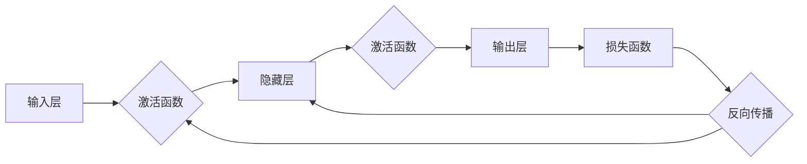

> 人工智能，神经网络，机器学习，深度学习，人类智能，共存，图灵测试，认知计算

# 神经网络：人类与机器的共存

随着人工智能技术的飞速发展，神经网络作为一种强大的机器学习模型，已经在各个领域展现出巨大的潜力。本文将深入探讨神经网络的原理、应用，以及它们如何与人类智能共存，共同推动科技进步。

## 1. 背景介绍

### 1.1 问题的由来

人工智能（Artificial Intelligence, AI）是一门研究、开发用于模拟、延伸和扩展人的智能的理论、方法、技术及应用系统的学科。自20世纪50年代以来，人工智能领域取得了长足的进步，特别是在近年来，随着计算能力的提升和大数据的涌现，深度学习技术得到了广泛应用。

神经网络作为一种模拟人脑神经元连接方式的计算模型，因其强大的非线性建模能力和自学习能力，成为了深度学习领域的研究热点。从最初的感知器到深度卷积神经网络（CNN）、循环神经网络（RNN）、长短期记忆网络（LSTM）等，神经网络在图像识别、语音识别、自然语言处理等领域取得了突破性进展。

### 1.2 研究现状

目前，神经网络已经在很多领域取得了显著成果，例如：

- **图像识别**：卷积神经网络（CNN）在ImageNet等图像分类竞赛中连续多年获得冠军，并在医学影像、自动驾驶等领域展现出巨大潜力。
- **语音识别**：循环神经网络（RNN）及其变种LSTM在语音识别领域取得了重大突破，使得语音助手等应用成为现实。
- **自然语言处理**：基于神经网络的语言模型在机器翻译、文本生成、情感分析等任务上取得了显著成果。

### 1.3 研究意义

神经网络的研究具有以下重要意义：

- **推动科技进步**：神经网络的发展推动了人工智能技术的进步，为各个领域带来了新的变革。
- **提高生产效率**：神经网络在图像识别、语音识别等领域的应用，提高了生产效率，降低了人力成本。
- **改善生活质量**：神经网络在医疗、教育、交通等领域的应用，提高了人们的生活质量。
- **拓展认知边界**：神经网络的研究拓展了人类对认知科学的认知边界，促进了人脑研究的发展。

### 1.4 本文结构

本文将按照以下结构进行阐述：

- 第2章介绍神经网络的 core 概念与联系。
- 第3章详细讲解神经网络的核心算法原理和具体操作步骤。
- 第4章探讨神经网络的数学模型、公式和案例。
- 第5章展示神经网络的项目实践和代码实例。
- 第6章分析神经网络的实际应用场景和未来展望。
- 第7章推荐神经网络相关的学习资源和开发工具。
- 第8章总结神经网络的研究成果、发展趋势和挑战。
- 第9章提供神经网络常见问题与解答。

## 2. 核心概念与联系

神经网络作为一种模拟人脑神经元连接方式的计算模型，其核心概念如下：

- **神经元**：神经网络的基本单元，负责接收输入信号，经过激活函数处理后输出结果。
- **连接权重**：神经元之间的连接权重，决定了输入信号对输出结果的影响程度。
- **激活函数**：用于将输入信号转换为输出信号的非线性函数，常用的激活函数有Sigmoid、ReLU、Tanh等。
- **损失函数**：用于衡量模型预测结果与真实标签之间的差异，常用的损失函数有均方误差（MSE）、交叉熵（CE）等。
- **反向传播算法**：用于计算模型参数梯度的算法，是神经网络训练的核心。

神经网络的核心概念原理和架构的Mermaid流程图如下：



在上述流程图中，输入层接收原始数据，经过激活函数处理后传递到隐藏层；隐藏层通过激活函数处理后传递到输出层；输出层生成预测结果，并通过损失函数计算与真实标签之间的差异；最后，反向传播算法根据损失函数计算出的梯度来更新网络参数。

## 3. 核心算法原理 & 具体操作步骤

### 3.1 算法原理概述

神经网络的核心算法是多层感知机（Multilayer Perceptron, MLP），它由输入层、隐藏层和输出层组成。输入层接收原始数据，隐藏层通过激活函数处理后传递到输出层，输出层生成预测结果。

### 3.2 算法步骤详解

神经网络的具体操作步骤如下：

1. **数据预处理**：对原始数据进行标准化、归一化等处理，以便输入神经网络。
2. **初始化参数**：随机初始化网络参数，包括连接权重和偏置项。
3. **前向传播**：将预处理后的数据输入网络，逐层计算输出结果。
4. **计算损失**：计算预测结果与真实标签之间的差异，得到损失函数值。
5. **反向传播**：计算损失函数对参数的梯度，并利用梯度下降算法更新参数。
6. **迭代训练**：重复步骤3-5，直到满足预设的终止条件。

### 3.3 算法优缺点

神经网络的优点如下：

- **强大的非线性建模能力**：能够模拟复杂的非线性关系。
- **自学习能力**：通过训练数据自动学习输入和输出之间的关系。
- **泛化能力**：能够在未见过的数据上进行预测。

神经网络的缺点如下：

- **参数数量庞大**：随着层数和神经元数量的增加，参数数量会呈指数级增长，导致计算量巨大。
- **可解释性差**：神经网络的内部机制复杂，难以解释其预测结果的依据。

### 3.4 算法应用领域

神经网络在以下领域得到了广泛应用：

- **图像识别**：如人脸识别、物体识别等。
- **语音识别**：如语音合成、语音识别等。
- **自然语言处理**：如机器翻译、文本分类等。
- **医学诊断**：如疾病检测、药物研发等。
- **自动驾驶**：如环境感知、路径规划等。

## 4. 数学模型和公式 & 详细讲解 & 举例说明

### 4.1 数学模型构建

神经网络的核心数学模型包括以下部分：

- **输入层**：输入层接收原始数据，记为 $x$。
- **隐藏层**：隐藏层通过激活函数将输入数据转换为新的特征表示，记为 $h$。
- **输出层**：输出层生成预测结果，记为 $y$。
- **损失函数**：损失函数用于衡量预测结果与真实标签之间的差异，常用的损失函数有均方误差（MSE）和交叉熵（CE）。

### 4.2 公式推导过程

以下以均方误差（MSE）损失函数为例，推导其梯度下降算法。

均方误差（MSE）损失函数的定义如下：

$$
MSE(y_{\text{pred}}, y_{\text{true}}) = \frac{1}{2} ||y_{\text{pred}} - y_{\text{true}}||^2
$$

其中 $y_{\text{pred}}$ 表示预测结果，$y_{\text{true}}$ 表示真实标签。

假设神经网络只有一个神经元，其输入为 $x$，权重为 $w$，偏置项为 $b$，激活函数为 $f$，则预测结果为：

$$
y_{\text{pred}} = f(w^T x + b)
$$

对 $MSE$ 损失函数求偏导，得到：

$$
\frac{\partial MSE}{\partial w} = (y_{\text{pred}} - y_{\text{true}}) \cdot f'(w^T x + b) \cdot x
$$

其中 $f'$ 为激活函数 $f$ 的导数。

利用梯度下降算法更新权重和偏置项：

$$
w \leftarrow w - \eta \cdot \frac{\partial MSE}{\partial w}
$$

$$
b \leftarrow b - \eta \cdot \frac{\partial MSE}{\partial b}
$$

其中 $\eta$ 为学习率。

### 4.3 案例分析与讲解

以下以一个简单的二分类问题为例，讲解神经网络在图像识别任务中的应用。

假设输入数据为一张灰度图像，像素值范围在0到255之间，输出为0或1，分别代表图像为“猫”或“狗”。

1. **数据预处理**：将图像像素值归一化到0到1之间。
2. **初始化参数**：随机初始化网络参数，如连接权重和偏置项。
3. **前向传播**：将归一化后的图像输入网络，计算输出结果。
4. **计算损失**：计算预测结果与真实标签之间的差异，得到损失函数值。
5. **反向传播**：计算损失函数对参数的梯度，并利用梯度下降算法更新参数。
6. **迭代训练**：重复步骤3-5，直到满足预设的终止条件。

经过多次迭代训练后，神经网络能够学会识别图像中的猫和狗。

## 5. 项目实践：代码实例和详细解释说明

### 5.1 开发环境搭建

以下使用Python和PyTorch框架实现一个简单的神经网络，用于图像识别任务。

```bash
pip install torch torchvision
```

### 5.2 源代码详细实现

```python
import torch
import torch.nn as nn
from torchvision import datasets, transforms
from torch.utils.data import DataLoader

# 定义网络结构
class Net(nn.Module):
    def __init__(self):
        super(Net, self).__init__()
        self.conv1 = nn.Conv2d(1, 6, 5)
        self.conv2 = nn.Conv2d(6, 16, 5)
        self.fc1 = nn.Linear(16 * 5 * 5, 120)
        self.fc2 = nn.Linear(120, 84)
        self.fc3 = nn.Linear(84, 2)

    def forward(self, x):
        x = torch.relu(self.conv1(x))
        x = torch.max_pool2d(x, 2, 2)
        x = torch.relu(self.conv2(x))
        x = torch.max_pool2d(x, 2, 2)
        x = x.view(-1, 16 * 5 * 5)
        x = torch.relu(self.fc1(x))
        x = torch.relu(self.fc2(x))
        x = self.fc3(x)
        return x

# 加载数据集
transform = transforms.Compose([transforms.ToTensor()])
train_dataset = datasets.MNIST(root='./data', train=True, download=True, transform=transform)
train_loader = DataLoader(train_dataset, batch_size=64, shuffle=True)

# 实例化网络
net = Net()
net = net.to('cuda' if torch.cuda.is_available() else 'cpu')

# 损失函数和优化器
criterion = nn.CrossEntropyLoss()
optimizer = torch.optim.SGD(net.parameters(), lr=0.001, momentum=0.9)

# 训练网络
for epoch in range(10):
    for data in train_loader:
        inputs, labels = data
        inputs, labels = inputs.to('cuda' if torch.cuda.is_available() else 'cpu'), labels.to('cpu')
        optimizer.zero_grad()
        outputs = net(inputs)
        loss = criterion(outputs, labels)
        loss.backward()
        optimizer.step()
    print(f"Epoch {epoch+1}, Loss: {loss.item()}")
```

### 5.3 代码解读与分析

以上代码实现了一个简单的卷积神经网络（CNN），用于MNIST手写数字识别任务。

1. **Net类**：定义了网络结构，包括卷积层、池化层和全连接层。
2. **数据集**：加载MNIST手写数字数据集，并进行预处理。
3. **网络实例化**：实例化网络，并移动到GPU（如果可用）。
4. **损失函数和优化器**：选择交叉熵损失函数和随机梯度下降（SGD）优化器。
5. **训练网络**：在训练数据上迭代训练网络，打印每轮的训练损失。

### 5.4 运行结果展示

运行以上代码，经过多轮训练后，网络将在MNIST手写数字数据集上取得不错的识别效果。

## 6. 实际应用场景

神经网络在各个领域都得到了广泛应用，以下列举一些典型的应用场景：

### 6.1 图像识别

神经网络在图像识别领域取得了重大突破，广泛应用于人脸识别、物体识别、医疗影像分析等任务。

### 6.2 语音识别

神经网络在语音识别领域取得了显著成果，使得语音助手、语音翻译等应用成为现实。

### 6.3 自然语言处理

神经网络在自然语言处理领域取得了突破性进展，广泛应用于机器翻译、文本分类、情感分析等任务。

### 6.4 自动驾驶

神经网络在自动驾驶领域得到广泛应用，用于环境感知、路径规划、决策控制等任务。

### 6.5 医疗诊断

神经网络在医疗诊断领域具有巨大潜力，可用于疾病检测、药物研发、个性化治疗等任务。

### 6.6 金融分析

神经网络在金融分析领域得到广泛应用，可用于股票预测、风险控制、欺诈检测等任务。

### 6.7 游戏

神经网络在游戏领域得到广泛应用，可用于游戏AI、虚拟现实等任务。

## 7. 工具和资源推荐

### 7.1 学习资源推荐

- **书籍**：
  - 《深度学习》（Goodfellow et al.）
  - 《神经网络与深度学习》（邱锡鹏）
  - 《神经网络与深度学习实践》（李航）
- **在线课程**：
  - Coursera上的《神经网络与深度学习》课程
  - fast.ai的《Practical Deep Learning for Coders》课程
- **博客和社区**：
  - TensorFlow官方博客
  - PyTorch官方博客
  - Hugging Face社区

### 7.2 开发工具推荐

- **深度学习框架**：
  - TensorFlow
  - PyTorch
  - Keras
- **数据集**：
  - ImageNet
  - MNIST
  - CIFAR-10
- **工具包**：
  - NumPy
  - Matplotlib
  - Pandas

### 7.3 相关论文推荐

- **卷积神经网络**：
  - "A Learning Algorithm for Continually Running fully Connected Neural Networks" (LeCun et al., 1989)
  - "AlexNet: An Image Classification Approach" (Krizhevsky et al., 2012)
  - "VGGNet: Very Deep Convolutional Networks for Large-scale Visual Recognition" (Simonyan et al., 2014)
- **循环神经网络**：
  - "A Learning Algorithm for Continually Running fully Connected Neural Networks" (Rumelhart et al., 1986)
  - "Long Short-Term Memory" (Hochreiter et al., 1997)
  - "Sequence to Sequence Learning with Neural Networks" (Sutskever et al., 2014)
- **深度学习框架**：
  - "TensorFlow: Large-Scale Machine Learning on Heterogeneous Systems" (Abadi et al., 2016)
  - "PyTorch: An Efficient Tensor Computing Framework for Hardware Accelerated AI Applications" (Paszke et al., 2017)

## 8. 总结：未来发展趋势与挑战

### 8.1 研究成果总结

神经网络作为一种强大的机器学习模型，已经在各个领域取得了显著成果。随着深度学习技术的不断发展和应用，神经网络在未来将继续发挥重要作用。

### 8.2 未来发展趋势

以下是神经网络未来可能的发展趋势：

- **更强大的模型**：随着计算能力的提升，未来神经网络的结构将更加复杂，参数规模也将进一步扩大。
- **更有效的训练方法**：研究更加有效的训练方法和算法，提高神经网络的训练效率和精度。
- **跨模态学习**：将神经网络应用于跨模态任务，如图像-文本、图像-语音等。
- **可解释性**：研究神经网络的可解释性，使其推理过程更加透明。

### 8.3 面临的挑战

以下是神经网络面临的挑战：

- **计算资源**：神经网络需要大量的计算资源，限制了其应用范围。
- **数据质量**：神经网络对数据质量要求较高，需要大量高质量的数据进行训练。
- **模型可解释性**：神经网络的推理过程难以解释，限制了其在某些领域的应用。
- **伦理问题**：神经网络可能存在偏见和歧视，需要关注其伦理问题。

### 8.4 研究展望

为了应对挑战，未来的研究需要在以下方面进行探索：

- **轻量级神经网络**：研究轻量级神经网络，降低计算资源消耗。
- **数据增强**：研究数据增强技术，提高数据质量。
- **可解释性**：研究神经网络的可解释性，使其推理过程更加透明。
- **伦理问题**：研究神经网络的伦理问题，确保其公平、公正、透明。

## 9. 附录：常见问题与解答

### 9.1 什么是一般化神经网络？

A: 一般化神经网络是一种模拟人脑神经元连接方式的计算模型，由输入层、隐藏层和输出层组成。它通过学习输入和输出之间的关系，实现函数逼近和模式识别等功能。

### 9.2 神经网络有哪些优点？

A: 神经网络具有以下优点：
- 强大的非线性建模能力
- 自学习能力
- 泛化能力

### 9.3 神经网络有哪些缺点？

A: 神经网络具有以下缺点：
- 参数数量庞大
- 可解释性差

### 9.4 如何解决神经网络的可解释性问题？

A: 解决神经网络的可解释性问题可以从以下几个方面入手：
- 使用可解释性更强的神经网络，如LSTM
- 研究神经网络的可解释性技术，如注意力机制
- 利用可视化技术，展示神经网络的内部工作机制

### 9.5 神经网络在哪些领域得到广泛应用？

A: 神经网络在以下领域得到广泛应用：
- 图像识别
- 语音识别
- 自然语言处理
- 自动驾驶
- 医疗诊断
- 金融分析
- 游戏

作者：禅与计算机程序设计艺术 / Zen and the Art of Computer Programming