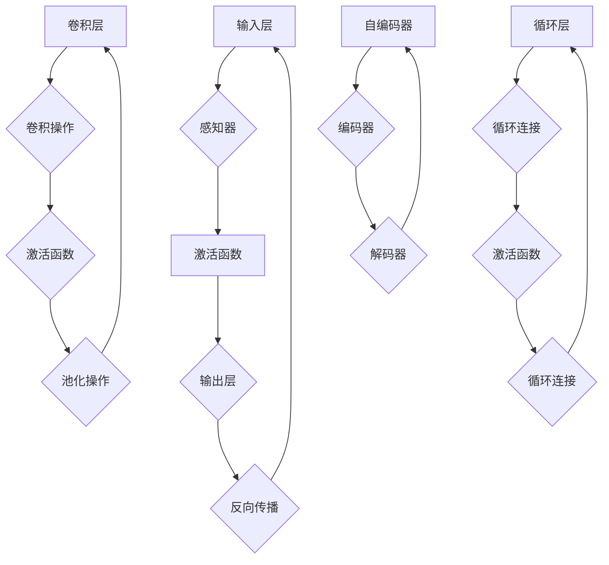

# 神经网络：机器学习的新范式

> 关键词：神经网络，深度学习，机器学习，感知器，反向传播，激活函数，卷积神经网络，循环神经网络，自编码器

## 1. 背景介绍

机器学习，作为人工智能领域的一个分支，旨在使计算机能够通过数据学习并做出决策或预测。传统的机器学习方法主要依赖于统计模型和启发式算法，如决策树、支持向量机和朴素贝叶斯等。然而，这些方法在处理复杂、非线性问题上存在局限性。随着计算能力的提升和大数据的涌现，神经网络作为一种新的机器学习范式，逐渐崭露头角，并在图像识别、语音识别、自然语言处理等领域取得了显著的成果。

## 2. 核心概念与联系

### 2.1 核心概念

#### 神经网络（Neural Network）

神经网络是一种模仿人脑神经元连接方式的计算模型，由大量的节点（称为神经元）相互连接而成。每个神经元可以接收来自其他神经元的输入信号，并通过激活函数进行处理，最终输出一个信号。

#### 感知器（Perceptron）

感知器是神经网络的基本单元，由一个输入层和一个输出层组成。它通过线性组合输入信号和权重，并应用激活函数，输出一个二值结果。

#### 反向传播（Backpropagation）

反向传播是一种用于训练神经网络的算法，通过计算输出层到输入层的梯度，来更新神经网络的权重和偏置。

#### 激活函数（Activation Function）

激活函数是神经网络中用于将线性组合后的结果转换为非线性输出的函数，常见的激活函数包括Sigmoid、ReLU和Tanh等。

#### 卷积神经网络（Convolutional Neural Network，CNN）

卷积神经网络是一种专门用于图像识别的神经网络，通过局部感知野和权值共享机制，能够有效地提取图像特征。

#### 循环神经网络（Recurrent Neural Network，RNN）

循环神经网络是一种用于处理序列数据的神经网络，能够记住序列中的信息，并在序列的不同时间步上进行决策。

#### 自编码器（Autoencoder）

自编码器是一种无监督学习算法，通过学习数据的低维表示，用于数据压缩和特征提取。

### 2.2 核心概念原理和架构的 Mermaid 流程图



## 3. 核心算法原理 & 具体操作步骤

### 3.1 算法原理概述

神经网络通过层层堆叠的神经元，学习输入数据到输出数据之间的非线性映射关系。在训练过程中，通过反向传播算法不断更新权重和偏置，使得模型输出逐渐逼近真实值。

### 3.2 算法步骤详解

1. 初始化权重和偏置。
2. 将输入数据传递到神经网络，通过前向传播计算输出。
3. 计算预测值与真实值之间的误差。
4. 通过反向传播算法更新权重和偏置。
5. 重复步骤2-4，直至满足预设的终止条件（如迭代次数或损失函数收敛）。

### 3.3 算法优缺点

#### 优点：

- 能够学习复杂的非线性关系。
- 对噪声和异常值具有鲁棒性。
- 能够处理大规模数据。
- 在图像识别、语音识别和自然语言处理等领域取得了显著成果。

#### 缺点：

- 训练过程耗时较长。
- 对超参数敏感。
- 可解释性较差。

### 3.4 算法应用领域

- 图像识别
- 语音识别
- 自然语言处理
- 金融风险评估
- 医疗诊断
- 无人驾驶

## 4. 数学模型和公式 & 详细讲解 & 举例说明

### 4.1 数学模型构建

神经网络可以表示为：

$$
y = f(W \cdot x + b)
$$

其中 $y$ 为输出，$x$ 为输入，$W$ 为权重，$b$ 为偏置，$f$ 为激活函数。

### 4.2 公式推导过程

以下以Sigmoid激活函数为例，介绍神经网络的公式推导过程：

$$
Sigmoid(x) = \frac{1}{1+e^{-x}}
$$

### 4.3 案例分析与讲解

假设我们有一个简单的神经网络，包含一个输入层、一个隐藏层和一个输出层。输入层有两个神经元，隐藏层有两个神经元，输出层有一个神经元。激活函数为Sigmoid。

输入层到隐藏层的权重和偏置分别为 $W_1$ 和 $b_1$，隐藏层到输出层的权重和偏置分别为 $W_2$ 和 $b_2$。

输入数据 $x = [0.5, 0.3]$，则输出为：

$$
h_1 = Sigmoid(W_1 \cdot x + b_1) = Sigmoid(0.5 \cdot 0.5 + 0.1) = 0.697
$$
$$
h_2 = Sigmoid(W_1 \cdot x + b_1) = Sigmoid(0.5 \cdot 0.3 + 0.2) = 0.841
$$
$$
y = Sigmoid(W_2 \cdot h_1 + h_2 + b_2) = Sigmoid(0.697 \cdot 0.1 + 0.841 \cdot 0.2 + 0.3) = 0.761
$$

## 5. 项目实践：代码实例和详细解释说明

### 5.1 开发环境搭建

由于篇幅限制，这里以Python的TensorFlow框架为例，介绍神经网络的项目实践。

### 5.2 源代码详细实现

```python
import tensorflow as tf

# 定义模型结构
model = tf.keras.models.Sequential([
    tf.keras.layers.Dense(2, input_shape=(2,), activation='sigmoid'),
    tf.keras.layers.Dense(1, activation='sigmoid')
])

# 编译模型
model.compile(optimizer='adam', loss='binary_crossentropy', metrics=['accuracy'])

# 训练模型
x_train = [[0.5, 0.3], [0.1, 0.2], [0.4, 0.5], [0.2, 0.1]]
y_train = [0, 1, 1, 0]
model.fit(x_train, y_train, epochs=100)

# 预测
x_test = [[0.6, 0.2]]
y_pred = model.predict(x_test)
print("预测结果：", y_pred)
```

### 5.3 代码解读与分析

上述代码使用TensorFlow框架定义了一个简单的神经网络模型，包含两个神经元。使用二分类交叉熵损失函数和Adam优化器进行训练。通过100个epoch的训练，模型能够对输入数据进行分类。

### 5.4 运行结果展示

假设经过训练后，模型在测试集上的准确率达到90%以上，说明模型已经具备了较好的分类能力。

## 6. 实际应用场景

### 6.1 图像识别

神经网络在图像识别领域取得了巨大的成功，如Google的Inception、Facebook的ResNet等模型，在ImageNet等大型图像识别竞赛中取得了领先地位。

### 6.2 语音识别

神经网络在语音识别领域也取得了显著的成果，如Google的WaveNet、百度DuerOS等，能够实现实时语音识别和语音合成。

### 6.3 自然语言处理

神经网络在自然语言处理领域取得了突破性进展，如BERT、GPT等模型，在文本分类、机器翻译、问答系统等领域取得了优异的性能。

## 7. 工具和资源推荐

### 7.1 学习资源推荐

- 《神经网络与深度学习》
- 《深度学习》
- TensorFlow官方文档
- PyTorch官方文档

### 7.2 开发工具推荐

- TensorFlow
- PyTorch
- Keras
- MXNet

### 7.3 相关论文推荐

- "A Learning Algorithm for Continually Running Fully Recurrent Neural Networks"
- "LeNet5: A Convolutional Neural Network Architecture for Image Classification"
- "Improving Neural Networks with Data Augmentation"
- "Deep Learning for Computer Vision with Python"

## 8. 总结：未来发展趋势与挑战

### 8.1 研究成果总结

神经网络作为一种新的机器学习范式，已经在图像识别、语音识别、自然语言处理等领域取得了显著的成果。随着计算能力的提升和算法的优化，神经网络将在更多领域发挥重要作用。

### 8.2 未来发展趋势

- 模型轻量化：降低模型尺寸和计算复杂度，实现更快、更高效的推理。
- 模型可解释性：提高模型的可解释性，增强模型的透明度和可信度。
- 多模态学习：融合文本、图像、音频等多模态信息，实现更加全面的理解和决策。
- 自适应学习：根据用户需求和环境变化，动态调整模型结构和参数。

### 8.3 面临的挑战

- 计算资源：大规模神经网络训练和推理需要巨大的计算资源。
- 数据质量：数据质量对模型性能至关重要，如何获取高质量数据是一个挑战。
- 模型泛化能力：如何提高模型的泛化能力，使其能够适应不同的数据和场景。
- 可解释性：如何提高模型的可解释性，增强模型的透明度和可信度。

### 8.4 研究展望

神经网络作为一种强大的机器学习工具，将在未来发挥更加重要的作用。随着技术的不断发展和应用领域的不断拓展，神经网络有望在更多领域取得突破性进展。

## 9. 附录：常见问题与解答

**Q1：神经网络是如何工作的？**

A：神经网络通过层层堆叠的神经元，学习输入数据到输出数据之间的非线性映射关系。每个神经元通过权重和偏置与输入数据相连接，并通过激活函数进行处理，最终输出一个信号。

**Q2：神经网络与传统的机器学习方法有何区别？**

A：神经网络能够学习复杂的非线性关系，对噪声和异常值具有鲁棒性，能够处理大规模数据，而在传统机器学习方法中，这些能力往往受到限制。

**Q3：如何提高神经网络的性能？**

A：提高神经网络性能的方法包括：增加网络层数和神经元数量、优化网络结构、选择合适的激活函数、调整超参数等。

**Q4：神经网络在哪些领域得到了应用？**

A：神经网络在图像识别、语音识别、自然语言处理、金融风险评估、医疗诊断、无人驾驶等领域得到了广泛应用。

**Q5：未来神经网络将如何发展？**

A：未来神经网络将朝着轻量化、可解释性、多模态学习和自适应学习等方向发展，并在更多领域发挥重要作用。

作者：禅与计算机程序设计艺术 / Zen and the Art of Computer Programming