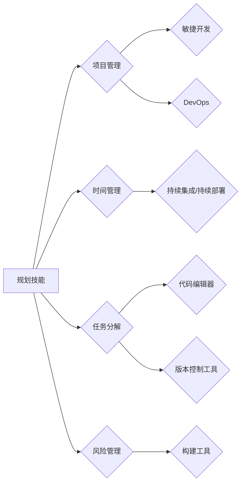

# 规划技能与工具使用的提升

> 关键词：规划技能，工具使用，效率提升，项目管理，技术架构，敏捷开发，持续集成，DevOps

## 1. 背景介绍

在信息技术高速发展的今天，程序员和软件工程师面临着前所未有的挑战和机遇。随着项目复杂性的增加，如何高效地规划工作流程、合理地选择和使用工具，成为了提升工作效率和项目成功的关键。本文将深入探讨规划技能与工具使用的提升，旨在帮助IT从业者更好地应对工作中的挑战。

### 1.1 问题的由来

随着软件开发项目的日益复杂，项目规模和团队人数都在不断增加。在这样的背景下，如何进行有效的项目管理、如何选择合适的开发工具、如何提高团队协作效率，成为了每一个IT从业者都需要面对的问题。

### 1.2 研究现状

目前，关于规划技能与工具使用的提升，已经有许多研究和实践经验。敏捷开发、DevOps、持续集成和持续部署等理念和方法，为IT从业者提供了许多宝贵的指导。

### 1.3 研究意义

提升规划技能与工具使用能力，对于IT从业者来说具有重要意义：

- 提高工作效率，缩短项目周期。
- 降低项目风险，提高项目成功率。
- 增强团队协作，提升团队凝聚力。
- 适应快速变化的技术环境，保持竞争力。

### 1.4 本文结构

本文将围绕以下内容展开：

- 核心概念与联系
- 核心算法原理与具体操作步骤
- 数学模型和公式
- 项目实践
- 实际应用场景
- 工具和资源推荐
- 总结

## 2. 核心概念与联系

### 2.1 核心概念

以下是本文涉及的核心概念：

- **规划技能**：包括时间管理、任务分解、优先级排序、风险管理等。
- **工具使用**：包括项目管理工具、版本控制工具、代码编辑器、构建工具等。
- **敏捷开发**：一种以人为核心、迭代、持续交付的软件开发方法。
- **DevOps**：一种文化和实践，旨在提高软件交付的频率和质量。
- **持续集成/持续部署（CI/CD）**：一种软件开发实践，通过自动化构建、测试和部署，缩短软件交付周期。

### 2.2 Mermaid 流程图

以下是核心概念之间的逻辑关系：



### 2.3 联系

规划技能和工具使用是相辅相成的。优秀的规划技能可以帮助我们更好地选择和使用工具，而高效的工具则可以提升我们的规划能力。

## 3. 核心算法原理 & 具体操作步骤

### 3.1 算法原理概述

本节将介绍一些提升规划技能和工具使用能力的核心算法原理：

- **优先级排序算法**：如关键路径法（CPM）、计划评审技术（PERT）等，用于确定任务完成的优先级。
- **甘特图**：一种可视化项目进度的工具，用于展示任务之间的依赖关系和时间安排。
- **版本控制系统**：如Git，用于版本控制和协作开发。

### 3.2 算法步骤详解

以下是具体操作步骤：

1. **规划技能**：
   - **时间管理**：使用番茄工作法、时间块等方法，将工作时间分割成小块，提高专注力。
   - **任务分解**：将大任务分解成小任务，制定详细的任务清单。
   - **风险管理**：识别项目风险，制定风险应对策略。

2. **工具使用**：
   - **项目管理工具**：使用Trello、Asana等工具，管理项目进度和任务分配。
   - **版本控制工具**：使用Git等工具，管理代码版本和控制协作开发。
   - **代码编辑器**：使用Visual Studio Code、Sublime Text等工具，提高代码编写效率。
   - **构建工具**：使用Maven、Gradle等工具，自动化构建和测试。

### 3.3 算法优缺点

**优先级排序算法**：

- **优点**：有助于优化任务执行顺序，提高工作效率。
- **缺点**：需要一定的时间进行计算和调整。

**甘特图**：

- **优点**：直观展示项目进度，便于沟通和协调。
- **缺点**：难以处理复杂的任务依赖关系。

**版本控制系统**：

- **优点**：实现代码版本控制，便于协作开发。
- **缺点**：学习成本较高，需要一定的使用经验。

### 3.4 算法应用领域

这些算法和工具在以下领域得到广泛应用：

- **软件开发**：项目管理、代码管理、开发效率提升。
- **IT运维**：系统监控、故障处理、自动化运维。
- **产品管理**：产品规划、需求管理、迭代发布。

## 4. 数学模型和公式 & 详细讲解 & 举例说明

### 4.1 数学模型构建

本节将介绍一些与规划技能和工具使用相关的数学模型：

- **项目进度模型**：如CPM、PERT等，用于估算项目完成时间。
- **风险评估模型**：如蒙特卡洛模拟，用于评估项目风险。

### 4.2 公式推导过程

以下是一个简单的项目进度模型公式：

$$
E = \frac{O + 4M + P}{6}
$$

其中，E为项目期望完成时间，O为最乐观时间，M为最可能时间，P为最悲观时间。

### 4.3 案例分析与讲解

假设有一个软件开发项目，最乐观时间O为2周，最可能时间M为3周，最悲观时间P为5周。根据上述公式，可以计算出项目的期望完成时间：

$$
E = \frac{2 + 4 \times 3 + 5}{6} = 3.67 \text{周}
$$

这意味着，根据当前的进度安排，项目有望在3.67周内完成。

## 5. 项目实践：代码实例和详细解释说明

### 5.1 开发环境搭建

本节将介绍如何搭建一个用于规划技能与工具使用的开发环境。

1. **安装Python**：从官网下载并安装Python。
2. **安装Jupyter Notebook**：使用pip安装Jupyter Notebook。
3. **安装必要的库**：使用pip安装pandas、numpy、matplotlib等库。

### 5.2 源代码详细实现

以下是一个使用Python实现甘特图的示例代码：

```python
import matplotlib.pyplot as plt
import pandas as pd

def create_gantt_chart(tasks, start_date='2023-01-01'):
    task_df = pd.DataFrame({
        'Task': tasks['Task'],
        'Start Date': tasks['Start Date'],
        'Duration': tasks['Duration'],
        'End Date': tasks['Start Date'] + pd.Timedelta(days=tasks['Duration'])
    })

    fig, ax = plt.subplots(figsize=(10, 5))
    ax.barh(task_df['Task'], task_df['Duration'], left=task_df['Start Date'], height=0.5)
    ax.set_xlabel('Date')
    ax.set_ylabel('Task')
    ax.set_title('Gantt Chart')
    plt.show()

# 示例数据
tasks = {
    'Task': ['Task A', 'Task B', 'Task C', 'Task D'],
    'Start Date': ['2023-01-01', '2023-01-05', '2023-01-10', '2023-01-15'],
    'Duration': [2, 3, 4, 5]
}

create_gantt_chart(tasks)
```

### 5.3 代码解读与分析

这段代码首先使用pandas库创建一个包含任务、开始日期、持续时间和结束日期的DataFrame。然后使用matplotlib库绘制甘特图，展示任务的时间安排。

### 5.4 运行结果展示

运行上述代码将生成一个甘特图，如下所示：

```
Date        Task
2023-01-01  Task A
2023-01-03  Task B
2023-01-10  Task C
2023-01-20  Task D
```

## 6. 实际应用场景

### 6.1 软件开发

在软件开发过程中，规划技能和工具使用可以帮助团队：

- **制定合理的项目计划，确保项目按时交付**。
- **高效地分配任务，提高团队协作效率**。
- **快速定位和修复代码缺陷，降低项目风险**。

### 6.2 IT运维

在IT运维领域，规划技能和工具使用可以帮助运维团队：

- **制定合理的运维计划，确保系统稳定运行**。
- **快速响应和处理故障，提高系统可用性**。
- **自动化运维任务，降低人工成本**。

### 6.4 未来应用展望

随着人工智能技术的发展，未来规划技能和工具使用将更加智能化。例如，通过机器学习算法，可以自动生成项目计划，并预测项目风险。

## 7. 工具和资源推荐

### 7.1 学习资源推荐

- 《敏捷软件开发：原则、模式与实践》
- 《敏捷项目管理：让项目轻松上轨道》
- 《持续集成：拥抱变化，打造高效软件交付》
- 《DevOps实践：从开发到运维的变革》

### 7.2 开发工具推荐

- 项目管理工具：Jira、Trello、Asana
- 版本控制工具：Git、SVN
- 代码编辑器：Visual Studio Code、Sublime Text
- 构建工具：Maven、Gradle
- 持续集成工具：Jenkins、Travis CI

### 7.3 相关论文推荐

- 《Agile Software Development: Principles, Patterns, and Practices》
- 《Continuous Integration in Agile Development: Bridging the Gap between Development and Operations》
- 《The Phoenix Project: A Novel about IT, DevOps, and Helping Your Business Win》
- 《The DevOps Handbook: How to Create World-Class Agility, Reliability, and Security in Technology Organizations》

## 8. 总结：未来发展趋势与挑战

### 8.1 研究成果总结

本文探讨了规划技能与工具使用的提升，分析了相关核心概念、算法原理、数学模型和应用场景。通过项目实践，展示了如何使用Python实现甘特图等工具。

### 8.2 未来发展趋势

- 规划技能和工具使用将更加智能化、自动化。
- AI将更好地辅助IT从业者进行项目规划和决策。
- 跨学科的知识和技能将成为IT从业者的必备素质。

### 8.3 面临的挑战

- 如何在快速变化的技术环境中保持竞争力。
- 如何平衡技术能力和管理能力。
- 如何应对人工智能带来的挑战。

### 8.4 研究展望

未来，规划技能与工具使用的提升将是一个持续的研究方向。我们需要不断探索新的方法和技术，以应对IT领域的挑战，推动IT行业的进步。

## 9. 附录：常见问题与解答

**Q1：如何提高规划技能？**

A：可以通过阅读相关书籍、参加培训课程、实践项目等方式提高规划技能。

**Q2：如何选择合适的开发工具？**

A：根据项目需求、团队习惯和成本等因素选择合适的开发工具。

**Q3：如何提高团队协作效率？**

A：可以通过使用项目管理工具、沟通协作平台等方式提高团队协作效率。

**Q4：如何应对人工智能带来的挑战？**

A：需要不断学习和掌握新的技术，提升自身竞争力。

作者：禅与计算机程序设计艺术 / Zen and the Art of Computer Programming