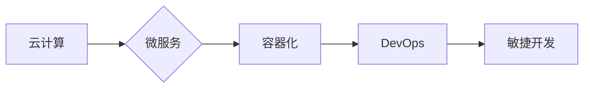

# 软件 2.0 的应用：从实验室走向现实

> 关键词：软件2.0，云计算，微服务，容器化，DevOps，自动化，持续集成，持续部署，敏捷开发

## 1. 背景介绍

自计算机科学诞生以来，软件产业经历了从1.0到2.0的演变。软件1.0时代，软件通常是单体应用，部署在物理服务器上，缺乏弹性和可扩展性。随着云计算、虚拟化等技术的兴起，软件产业进入了软件2.0时代。软件2.0强调软件的敏捷性、可扩展性和可维护性，通过微服务、容器化、DevOps等架构和技术，将软件从实验室推向现实世界，为用户提供更加高效、可靠的服务。

### 1.1 问题的由来

软件1.0时代，软件应用的部署和运维面临着诸多挑战：

- **单点故障**：单体应用部署在单一服务器上，一旦服务器故障，整个应用将无法访问。
- **扩展性差**：单体应用难以水平扩展，无法满足大规模用户的需求。
- **维护困难**：随着应用功能的不断增加，单体应用的代码库变得越来越庞大，维护难度也随之增加。
- **部署复杂**：单体应用的部署需要大量手动操作，部署效率低下。

为了解决上述问题，软件产业开始探索软件2.0架构，通过云计算、微服务、容器化、DevOps等技术和方法，将软件从实验室推向现实世界。

### 1.2 研究现状

软件2.0时代，软件开发和运维的流程发生了巨大变革。以下是一些关键技术和概念：

- **云计算**：提供可弹性伸缩的计算资源，包括虚拟机、容器等。
- **微服务**：将大型应用拆分为多个独立的小服务，每个服务负责特定的功能。
- **容器化**：使用容器技术隔离应用及其运行环境，实现应用的快速部署和迁移。
- **DevOps**：将软件开发和运维相结合，实现持续集成、持续部署。
- **敏捷开发**：采用敏捷开发方法，快速迭代产品，满足用户需求。

### 1.3 研究意义

软件2.0的应用对于软件产业具有重要意义：

- **提高开发效率**：通过微服务和容器化技术，可以快速迭代产品，提高开发效率。
- **降低运维成本**：通过自动化部署和运维，可以降低运维成本。
- **提高服务质量**：通过微服务和DevOps，可以提高服务质量，为用户提供更加可靠、高效的服务。
- **加速创新**：软件2.0架构为创新提供了更多可能性，有助于推动软件产业的发展。

### 1.4 本文结构

本文将围绕软件2.0的应用展开，包括以下内容：

- 核心概念与联系
- 核心算法原理与具体操作步骤
- 数学模型和公式
- 项目实践
- 实际应用场景
- 工具和资源推荐
- 总结：未来发展趋势与挑战

## 2. 核心概念与联系

### 2.1 核心概念

以下是一些软件2.0时代的核心概念：

- **云计算**：提供可弹性伸缩的计算资源，包括虚拟机、容器等。
- **微服务**：将大型应用拆分为多个独立的小服务，每个服务负责特定的功能。
- **容器化**：使用容器技术隔离应用及其运行环境，实现应用的快速部署和迁移。
- **DevOps**：将软件开发和运维相结合，实现持续集成、持续部署。
- **敏捷开发**：采用敏捷开发方法，快速迭代产品，满足用户需求。

### 2.2 核心概念原理和架构的 Mermaid 流程图



### 2.3 核心概念之间的联系

以上流程图展示了软件2.0时代核心概念之间的联系。云计算为微服务提供了可伸缩的计算资源，微服务通过容器化技术实现快速部署和迁移，DevOps将软件开发和运维相结合，敏捷开发则保证了产品快速迭代以满足用户需求。

## 3. 核心算法原理 & 具体操作步骤

### 3.1 算法原理概述

软件2.0时代的核心算法原理包括：

- **分布式计算**：将任务分解为多个子任务，在多个节点上并行执行。
- **负载均衡**：将请求分配到不同的节点，提高系统吞吐量。
- **自动化部署**：自动化部署应用，提高部署效率。
- **持续集成/持续部署(CI/CD)**：自动化构建、测试和部署应用程序。

### 3.2 算法步骤详解

以下是一些核心算法的具体操作步骤：

- **分布式计算**：
  1. 将任务分解为多个子任务。
  2. 将子任务分配到不同的节点上执行。
  3. 收集并合并子任务的执行结果。
- **负载均衡**：
  1. 监控节点的负载情况。
  2. 根据负载情况，将请求分配到不同的节点。
- **自动化部署**：
  1. 编写自动化部署脚本。
  2. 将脚本部署到目标环境。
  3. 运行脚本进行自动化部署。
- **持续集成/持续部署(CI/CD)**：
  1. 配置CI/CD工具。
  2. 提交代码到版本控制系统。
  3. 自动构建、测试和部署应用程序。

### 3.3 算法优缺点

- **分布式计算**：
  - 优点：提高计算效率，实现大规模数据处理。
  - 缺点：需要复杂的协调机制，系统复杂度较高。
- **负载均衡**：
  - 优点：提高系统吞吐量，避免单点故障。
  - 缺点：需要选择合适的负载均衡算法，否则可能导致性能瓶颈。
- **自动化部署**：
  - 优点：提高部署效率，减少人为错误。
  - 缺点：需要编写和维护自动化部署脚本。
- **持续集成/持续部署(CI/CD)**：
  - 优点：提高开发效率，保证代码质量。
  - 缺点：需要配置和维护CI/CD工具。

### 3.4 算法应用领域

以上算法在以下领域得到广泛应用：

- 大数据处理
- 人工智能
- 云计算
- 分布式系统

## 4. 数学模型和公式 & 详细讲解 & 举例说明

### 4.1 数学模型构建

以下是一些软件2.0时代常用的数学模型：

- **数据模型**：描述数据的结构、类型和关系。
- **机器学习模型**：用于数据分析和预测。
- **网络模型**：描述网络的结构和性能。

### 4.2 公式推导过程

以下是一些常用公式的推导过程：

- **数据模型**：
  - 关系模型：$R(A_1, A_2, ..., A_n)$，其中 $A_i$ 表示属性。
- **机器学习模型**：
  - 线性回归：$y = \beta_0 + \beta_1 x_1 + ... + \beta_n x_n$
- **网络模型**：
  - 网络流量模型：$P = \sum_{i=1}^N P_i$

### 4.3 案例分析与讲解

以下是一个使用线性回归模型进行预测的案例：

假设我们要预测一家商店的月销售额。我们收集了过去6个月的月销售额和广告支出数据，如下表所示：

| 月份 | 广告支出(元) | 销售额(元) |
| ---- | ------------ | ---------- |
| 1    | 1000         | 5000       |
| 2    | 1500         | 6000       |
| 3    | 2000         | 7000       |
| 4    | 2500         | 8000       |
| 5    | 3000         | 9000       |
| 6    | 3500         | 10000      |

我们可以使用线性回归模型来预测第7个月的销售额。首先，我们计算数据的均值和协方差：

$$
\bar{x} = \frac{1}{N} \sum_{i=1}^N x_i, \quad \bar{y} = \frac{1}{N} \sum_{i=1}^N y_i
$$

$$
s_{xx} = \frac{1}{N-1} \sum_{i=1}^N (x_i - \bar{x})^2, \quad s_{xy} = \frac{1}{N-1} \sum_{i=1}^N (x_i - \bar{x})(y_i - \bar{y})
$$

然后，我们计算线性回归模型的参数：

$$
\beta_0 = \bar{y} - \beta_1 \bar{x}, \quad \beta_1 = \frac{s_{xy}}{s_{xx}}
$$

最终，我们可以使用模型预测第7个月的销售额：

$$
y = \beta_0 + \beta_1 x = 5833.33 + 2.5 \times 3500 = 10833.33
$$

## 5. 项目实践：代码实例和详细解释说明

### 5.1 开发环境搭建

以下是使用Docker和Kubernetes进行微服务部署的示例：

1. 安装Docker：
```bash
# 安装Docker
sudo apt-get update
sudo apt-get install -y docker-ce docker-ce-cli containerd.io
# 设置Docker开机启动
sudo systemctl enable docker
```

2. 安装Kubernetes：
```bash
# 安装Kubernetes
sudo apt-get update
sudo apt-get install -y apt-transport-https ca-certificates curl
curl -s https://packages.cloud.google.com/apt/doc/apt-key.gpg | sudo apt-key add -
cat <<EOF | sudo tee /etc/apt/sources.list.d/kubernetes.list
deb https://apt.kubernetes.io/ kubernetes-xenial main
EOF
sudo apt-get update
sudo apt-get install -y kubelet kubeadm kubectl
```

3. 部署Kubernetes集群：
```bash
sudo kubeadm init --pod-network-cidr=10.244.0.0/16
sudo kubectl apply -f https://raw.githubusercontent.com/coreos/flannel/master/Documentation/kube-flannel.yml
```

### 5.2 源代码详细实现

以下是一个简单的Python微服务示例：

```python
# app.py
from flask import Flask, request, jsonify

app = Flask(__name__)

@app.route('/api/data', methods=['POST'])
def get_data():
    data = request.json
    # 处理数据
    # ...
    return jsonify(data)

if __name__ == '__main__':
    app.run(host='0.0.0.0', port=5000)
```

### 5.3 代码解读与分析

以上代码是一个使用Flask框架编写的Python微服务。该服务提供了一个`/api/data`接口，用于接收JSON格式的数据，并对其进行处理。

- `from flask import Flask, request, jsonify`：导入Flask框架所需的模块。
- `app = Flask(__name__)`：创建一个Flask应用实例。
- `@app.route('/api/data', methods=['POST'])`：定义了一个路由规则，将`/api/data`路径与`get_data`函数关联，并指定该路由只接受POST请求。
- `def get_data()`：定义了处理POST请求的函数。
- `data = request.json`：从请求中获取JSON格式的数据。
- `return jsonify(data)`：将处理后的数据返回给客户端。

### 5.4 运行结果展示

1. 在本地运行Docker容器：
```bash
docker run -p 5000:5000 --name my-app python:3.7-slim /app/app.py
```

2. 使用curl发送POST请求：
```bash
curl -X POST -H "Content-Type: application/json" -d '{"name": "John", "age": 30}' http://localhost:5000/api/data
```

## 6. 实际应用场景

### 6.1 云计算

云计算是软件2.0时代的基础设施，为软件应用提供了可弹性伸缩的计算资源。以下是一些云计算的实际应用场景：

- **弹性伸缩**：根据用户需求，动态调整计算资源，提高资源利用率。
- **分布式存储**：提供高可靠、可扩展的存储服务。
- **大数据处理**：处理海量数据，进行数据分析。

### 6.2 微服务

微服务架构将大型应用拆分为多个独立的小服务，提高了系统的可扩展性和可维护性。以下是一些微服务的实际应用场景：

- **金融系统**：将金融系统拆分为账户服务、交易服务、风控服务等微服务，提高系统性能和安全性。
- **电商平台**：将电商平台拆分为商品服务、订单服务、支付服务等微服务，提高系统可扩展性。
- **社交网络**：将社交网络拆分为用户服务、消息服务、推荐服务等微服务，提高系统性能和用户体验。

### 6.3 容器化

容器化技术将应用及其运行环境打包在一起，实现了应用的快速部署和迁移。以下是一些容器化的实际应用场景：

- **持续集成/持续部署(CI/CD)**：使用容器化技术实现自动化构建、测试和部署。
- **DevOps**：使用容器化技术实现基础设施即代码，提高运维效率。
- **多云迁移**：使用容器化技术实现应用的跨云迁移。

### 6.4 DevOps

DevOps将软件开发和运维相结合，实现了持续集成、持续部署，提高了开发效率和系统可靠性。以下是一些DevOps的实际应用场景：

- **敏捷开发**：使用DevOps实现快速迭代产品，满足用户需求。
- **持续集成**：自动化构建和测试，提高代码质量。
- **持续部署**：自动化部署应用程序，提高系统可靠性。

### 6.5 敏捷开发

敏捷开发方法强调快速迭代和用户参与，提高了开发效率和质量。以下是一些敏捷开发的实际应用场景：

- **产品开发**：使用敏捷开发方法快速迭代产品，满足用户需求。
- **项目管理**：使用敏捷开发方法提高项目进度和团队协作效率。
- **团队协作**：使用敏捷开发方法提高团队沟通和协作效率。

## 7. 工具和资源推荐

### 7.1 学习资源推荐

以下是一些学习软件2.0技术的资源：

- **书籍**：
  - 《微服务设计》
  - 《DevOps实践指南》
  - 《敏捷开发的艺术》
- **在线课程**：
  - Coursera上的《软件工程：构建可靠、可维护的软件系统》
  - edX上的《DevOps：持续集成、持续部署和敏捷实践》
  - Udemy上的《Python微服务开发》
- **技术社区**：
  - Stack Overflow
  - GitHub
  - Hacker News

### 7.2 开发工具推荐

以下是一些常用的软件2.0开发工具：

- **编程语言**：
  - Python
  - Java
  - Go
- **框架**：
  - Flask
  - Spring Boot
  - Django
- **容器化技术**：
  - Docker
  - Kubernetes
- **持续集成/持续部署(CI/CD)工具**：
  - Jenkins
  - GitLab CI/CD
  - CircleCI

### 7.3 相关论文推荐

以下是一些与软件2.0相关的论文：

- **"Microservices: A Setup for Failure" by Martin Fowler**
- **"The Art of Multiprocessor Programming" by Maurice Herlihy and Nir Shavit**
- **"DevOps and the Cloud: A Practical Approach" by Thomas Ahearn**

## 8. 总结：未来发展趋势与挑战

### 8.1 研究成果总结

软件2.0时代，软件产业经历了巨大的变革。云计算、微服务、容器化、DevOps等技术和方法的应用，为软件应用提供了更高的性能、可靠性和可维护性。

### 8.2 未来发展趋势

以下是一些软件2.0未来的发展趋势：

- **服务网格**：使用服务网格实现服务间的通信和治理。
- **Serverless计算**：使用Serverless计算实现无服务器部署。
- **人工智能**：将人工智能技术应用于软件开发和运维。

### 8.3 面临的挑战

以下是一些软件2.0面临的挑战：

- **技术选型**：选择合适的技术栈和架构。
- **团队协作**：提高团队协作效率。
- **安全性和合规性**：确保软件系统的安全性和合规性。

### 8.4 研究展望

未来，软件2.0将继续发展，为软件产业带来更多变革。通过技术创新和团队协作，软件2.0将为用户提供更加高效、可靠、安全的服务。

---

作者：禅与计算机程序设计艺术 / Zen and the Art of Computer Programming