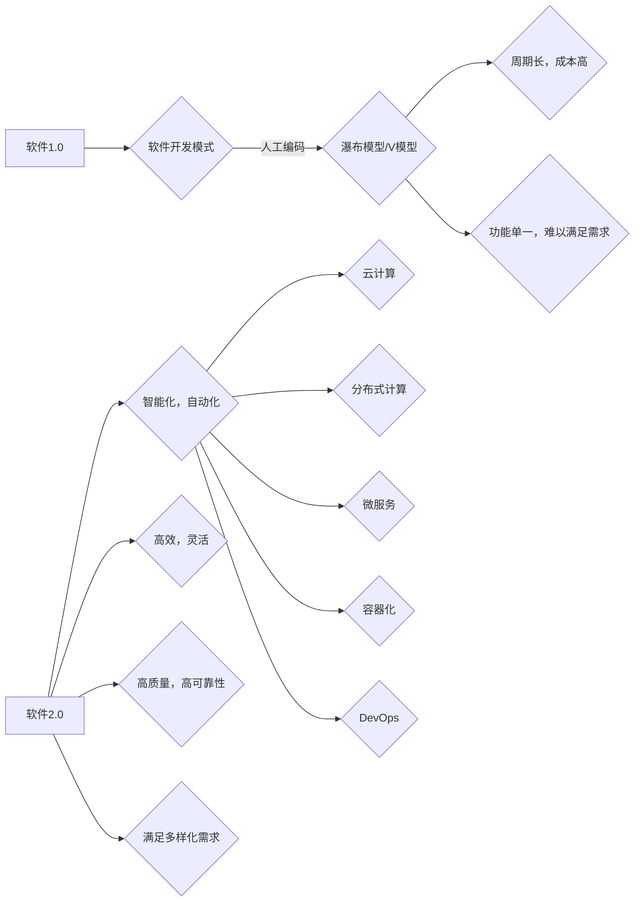

> 关键词：软件2.0，人工智能，自动化，云计算，分布式计算，微服务，容器化，DevOps，机器学习

# 软件2.0的未来展望：更智能、更强大

软件2.0时代，我们正站在技术变革的十字路口。从传统的软件开发模式到如今的智能化、自动化趋势，软件正在经历一场深刻的变革。本文将深入探讨软件2.0的核心概念、发展趋势、挑战，以及未来应用场景，展现软件技术的无限可能。

## 1. 背景介绍

### 1.1 软件1.0时代的局限

软件1.0时代，软件开发主要依赖于人工编码，流程繁琐，周期长，成本高。传统的瀑布模型和V模型等开发方法，往往导致项目延期、成本超支、质量难以保证。此外，软件1.0时代的软件产品功能单一，难以满足用户日益增长的需求。

### 1.2 软件2.0的兴起

随着云计算、大数据、人工智能等技术的飞速发展，软件2.0时代应运而生。软件2.0的核心特征是智能化、自动化和分布式，旨在构建更加灵活、高效、智能的软件系统。

## 2. 核心概念与联系

### 2.1 软件2.0的核心概念

**人工智能（AI）**：通过模拟、延伸和扩展人的智能，让软件具有学习、推理、感知、认知等能力。

**自动化（Automation）**：利用计算机技术实现软件开发的自动化，提高开发效率和质量。

**云计算（Cloud Computing）**：通过互联网提供动态易扩展且经常是虚拟化的资源。

**分布式计算（Distributed Computing）**：通过网络将计算任务分散到多个计算节点上执行，提高计算效率和可靠性。

**微服务（Microservices）**：将大型应用程序拆分为小型、独立的微服务，实现模块化开发和部署。

**容器化（Containerization）**：通过容器技术实现应用程序的轻量级、可移植和隔离运行。

**DevOps**：将开发（Development）和运维（Operations）相结合，实现快速、高质量的软件交付。

### 2.2 Mermaid流程图



## 3. 核心算法原理 & 具体操作步骤

### 3.1 算法原理概述

软件2.0的核心算法主要包括：

**机器学习（Machine Learning）**：通过数据训练，让软件具备自动学习和推理的能力。

**深度学习（Deep Learning）**：机器学习的一种，使用多层神经网络进行特征提取和模式识别。

**自然语言处理（Natural Language Processing，NLP）**：利用计算机技术理解和处理自然语言。

**计算机视觉（Computer Vision）**：让计算机能够理解图像和视频内容。

### 3.2 算法步骤详解

**机器学习步骤**：

1. 数据收集：收集相关领域的数据，用于模型训练。
2. 数据预处理：对收集到的数据进行分析、清洗和转换，使其适用于模型训练。
3. 模型选择：选择合适的机器学习算法，如线性回归、决策树、神经网络等。
4. 模型训练：使用预处理后的数据对模型进行训练。
5. 模型评估：使用测试数据评估模型的性能。
6. 模型优化：根据评估结果对模型进行调整和优化。

**深度学习步骤**：

1. 数据收集与预处理：与机器学习步骤相同。
2. 网络结构设计：设计合适的深度学习网络结构，如卷积神经网络（CNN）、循环神经网络（RNN）等。
3. 模型训练：使用预处理后的数据对模型进行训练。
4. 模型评估与优化：与机器学习步骤相同。

### 3.3 算法优缺点

**机器学习**：

优点：泛化能力强，适用于各种数据类型和场景。

缺点：对数据质量要求较高，模型训练时间长。

**深度学习**：

优点：在图像识别、语音识别等领域表现优异。

缺点：需要大量数据，模型结构复杂，可解释性差。

**NLP**：

优点：能够理解和处理自然语言。

缺点：对语言歧义处理能力有限，需要大量标注数据。

**计算机视觉**：

优点：能够识别图像和视频中的物体、场景等。

缺点：对复杂背景下的目标识别能力有限，需要大量标注数据。

### 3.4 算法应用领域

机器学习、深度学习、NLP和计算机视觉等算法在各个领域都有广泛应用，例如：

- 金融领域：风险评估、欺诈检测、智能投顾等。
- 医疗领域：疾病诊断、药物研发、远程医疗等。
- 交通领域：自动驾驶、智能交通信号控制等。
- 教育领域：智能教育、个性化学习等。

## 4. 数学模型和公式 & 详细讲解 & 举例说明

### 4.1 数学模型构建

以线性回归为例，假设我们有一个线性回归模型：

$$y = w_1x_1 + w_2x_2 + \cdots + w_nx_n + b$$

其中，$x_1, x_2, \cdots, x_n$ 是输入特征，$w_1, w_2, \cdots, w_n, b$ 是模型参数，$y$ 是预测值。

### 4.2 公式推导过程

以最小二乘法为例，推导线性回归模型参数：

最小二乘法的目标是最小化预测值和真实值之间的平方误差：

$$J(\theta) = \frac{1}{2} \sum_{i=1}^{m}(h_\theta(x^{(i)}) - y^{(i)})^2$$

其中，$h_\theta(x) = \theta_0x_0 + \theta_1x_1 + \cdots + \theta_nx_n$ 是线性回归模型预测值，$m$ 是样本数量。

对 $J(\theta)$ 进行求导，并令导数为0，得到：

$$\frac{\partial J(\theta)}{\partial \theta_i} = \theta_i - \frac{1}{m} \sum_{i=1}^{m}(h_\theta(x^{(i)}) - y^{(i)})x_i = 0$$

从而得到参数的更新公式：

$$\theta_i = \frac{1}{m} \sum_{i=1}^{m}(h_\theta(x^{(i)}) - y^{(i)})x_i$$

### 4.3 案例分析与讲解

假设我们有一个简单的线性回归问题，输入特征为 $x_1$ 和 $x_2$，真实标签为 $y$，数据如下：

| x1 | x2 | y |
|----|----|---|
| 1  | 2  | 3 |
| 2  | 4  | 5 |
| 3  | 6  | 7 |

使用最小二乘法求解参数 $w_1, w_2, b$，得到：

$$w_1 = \frac{1}{3} \times (3+5+7) = 5$$
$$w_2 = \frac{1}{3} \times (2\times3+4\times5+6\times7) = 10$$
$$b = \frac{1}{3} \times (1+4+9) - 5 = 1$$

因此，线性回归模型为：

$$y = 5x_1 + 10x_2 + 1$$

## 5. 项目实践：代码实例和详细解释说明

### 5.1 开发环境搭建

以Python为例，搭建线性回归模型的开发环境：

1. 安装Python：从官网下载并安装Python 3.8及以上版本。
2. 安装NumPy：`pip install numpy`
3. 安装Matplotlib：`pip install matplotlib`

### 5.2 源代码详细实现

```python
import numpy as np
import matplotlib.pyplot as plt

# 数据
x1 = np.array([1, 2, 3])
x2 = np.array([2, 4, 6])
y = np.array([3, 5, 7])

# 最小二乘法求解参数
theta = np.linalg.lstsq(np.column_stack((np.ones(len(x1)), x1, x2)), y, rcond=None)[0]

# 模型预测
x = np.linspace(0, 10, 100)
y_pred = theta[0] + theta[1] * x + theta[2] * x**2

# 绘制结果
plt.scatter(x1, y, color='red')
plt.plot(x, y_pred, color='blue')
plt.show()
```

### 5.3 代码解读与分析

1. 导入NumPy和Matplotlib库。
2. 定义数据集。
3. 使用NumPy的`lstsq`函数求解线性回归模型参数。
4. 使用求解得到的参数进行模型预测。
5. 使用Matplotlib绘制预测结果和真实数据。

## 6. 实际应用场景

### 6.1 金融领域

在金融领域，线性回归模型可以用于：

- 预测股票价格：分析历史股价、成交量等数据，预测未来股价走势。
- 信用评分：分析个人信用历史、收入、负债等数据，评估个人信用风险。
- 贷款审批：根据客户的信用评分、收入等数据，判断是否批准贷款申请。

### 6.2 医疗领域

在医疗领域，线性回归模型可以用于：

- 预测疾病风险：分析患者的年龄、性别、病史等数据，预测患者患某种疾病的风险。
- 医疗资源分配：根据医院的床位、医生、设备等资源，优化医疗资源的分配方案。
- 治疗效果评估：分析患者的年龄、病情、治疗方案等数据，评估治疗效果。

## 7. 工具和资源推荐

### 7.1 学习资源推荐

- 《Python机器学习》
- 《深度学习》
- 《自然语言处理入门》
- 《计算机视觉基础》

### 7.2 开发工具推荐

- Python：主流的编程语言，支持多种机器学习库。
- Jupyter Notebook：交互式计算环境，便于数据分析和可视化。
- TensorFlow：Google开发的深度学习框架。
- PyTorch：Facebook开发的深度学习框架。

### 7.3 相关论文推荐

- 《梯度下降算法》
- 《神经网络》
- 《深度学习》
- 《自然语言处理》
- 《计算机视觉》

## 8. 总结：未来发展趋势与挑战

### 8.1 研究成果总结

本文从软件2.0的核心概念、发展趋势、挑战和未来应用场景等方面，对软件技术进行了深入探讨。通过介绍人工智能、自动化、云计算、分布式计算、微服务、容器化、DevOps等关键技术，展示了软件技术的无限可能。

### 8.2 未来发展趋势

1. 软件更加智能化：人工智能技术将深入应用到软件开发的各个环节，实现软件的自动生成、自动测试、自动修复等功能。
2. 软件更加自动化：自动化工具将贯穿软件开发的整个生命周期，提高开发效率和质量。
3. 软件更加分布式：分布式计算技术将打破地域限制，实现全球范围内的协同开发、部署和运行。
4. 软件更加轻量化：容器化技术将使软件更加轻量化、可移植和可扩展。
5. 软件更加安全：随着安全威胁的日益严峻，软件安全将成为软件2.0时代的重要关注点。

### 8.3 面临的挑战

1. 技术复杂性：随着技术的不断发展，软件系统的复杂性也在不断增加，对开发者的技术能力提出了更高的要求。
2. 跨领域融合：软件2.0时代需要跨学科、跨领域的知识，对人才的需求更加多元化。
3. 数据安全：随着大数据的广泛应用，数据安全问题日益突出，需要加强数据安全和隐私保护。
4. 伦理道德：人工智能技术的发展引发了一系列伦理道德问题，需要制定相应的法律法规和道德规范。

### 8.4 研究展望

1. 开发更加高效的软件开发工具和平台，降低开发门槛，提高开发效率。
2. 研究更加智能的软件测试技术，提高软件质量，降低软件缺陷率。
3. 探索更加安全的软件运行环境，保障软件系统的稳定性和可靠性。
4. 加强软件伦理道德研究，制定相应的法律法规和道德规范，引导软件技术健康发展。

软件2.0时代，软件技术正处于快速发展阶段。面对机遇与挑战，我们需要不断学习、创新，以推动软件技术的进步，为人类社会创造更多价值。

## 9. 附录：常见问题与解答

**Q1：软件2.0与软件1.0的主要区别是什么？**

A：软件2.0的主要区别在于其智能化、自动化和分布式特点，旨在构建更加灵活、高效、智能的软件系统。

**Q2：如何选择合适的机器学习算法？**

A：选择合适的机器学习算法需要根据具体问题、数据类型和性能要求进行综合考虑。

**Q3：如何保证软件系统的安全性？**

A：保证软件系统的安全性需要从多个方面入手，包括代码安全、数据安全、网络安全等。

**Q4：如何实现软件的自动化测试？**

A：实现软件的自动化测试需要编写测试脚本，使用自动化测试工具，并构建完善的测试框架。

**Q5：如何进行分布式计算？**

A：分布式计算可以通过多种方式实现，如使用云计算平台、分布式文件系统等。

作者：禅与计算机程序设计艺术 / Zen and the Art of Computer Programming