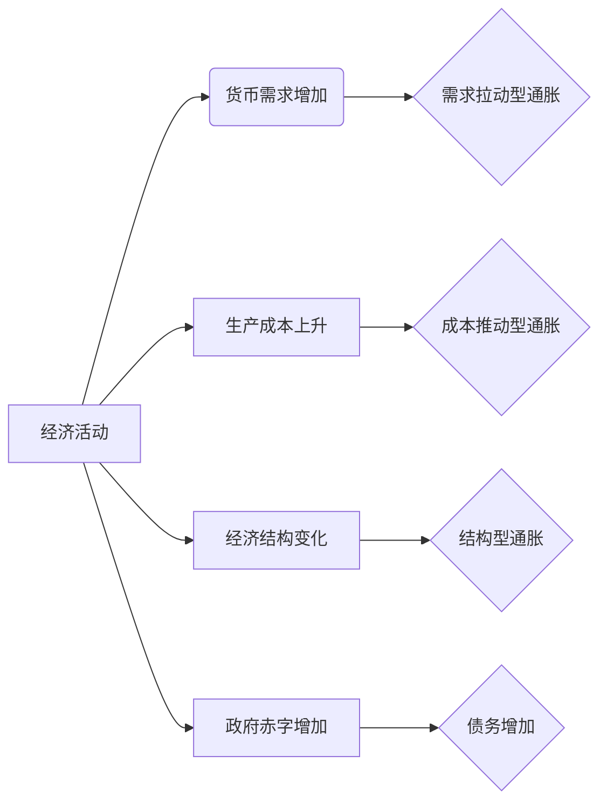

> 通胀，债务，经济影响，货币政策，财政政策，金融稳定性，宏观经济，全球市场

# 通胀高企与债务加剧的经济影响

在全球经济一体化的背景下，通胀高企和债务加剧已成为许多国家面临的共同挑战。本文将深入探讨通胀和债务对经济的影响，分析其背后的原因，并探讨应对策略。

## 1. 背景介绍

### 1.1 通胀的由来

通胀，即货币贬值，是指货币购买力的持续下降。通胀的原因多种多样，包括需求拉动型、成本推动型和结构型通胀等。

### 1.2 债务的加剧

债务是指个人、企业或政府为了融资而借入的资金。近年来，随着全球经济增速放缓，许多国家的债务水平不断攀升，成为经济发展的一个重要风险因素。

### 1.3 研究意义

通胀和债务的高企对经济产生了深远的影响，研究其背后的原因和影响，对于制定有效的经济政策具有重要意义。

### 1.4 本文结构

本文将从以下几个方面展开：

- 通胀和债务的核心概念与联系
- 通胀和债务对经济的影响
- 应对通胀和债务的策略
- 未来发展趋势与挑战

## 2. 核心概念与联系

### 2.1 核心概念

**通胀**：指货币购买力的持续下降，通常以物价水平的持续上升来衡量。

**债务**：指个人、企业或政府为了融资而借入的资金，是经济活动中常见的融资方式。

### 2.2 Mermaid 流程图



### 2.3 关联分析

通胀和债务之间存在着密切的关联。一方面，通胀可能导致债务的实际价值下降，从而减轻债务负担；另一方面，债务的增加也可能导致通胀，因为过度的债务可能导致资金供应过剩，从而推高物价水平。

## 3. 核心算法原理 & 具体操作步骤

### 3.1 算法原理概述

本文将主要讨论通货膨胀和债务水平的计算方法。

### 3.2 算法步骤详解

#### 3.2.1 通货膨胀的计算

通货膨胀率通常通过以下公式计算：

$$
\text{通货膨胀率} = \frac{\text{当前物价指数} - \text{基期物价指数}}{\text{基期物价指数}} \times 100\%
$$

#### 3.2.2 债务水平的计算

债务水平可以通过以下公式计算：

$$
\text{债务水平} = \frac{\text{债务总额}}{\text{国内生产总值(GDP)}} \times 100\%
$$

### 3.3 算法优缺点

#### 优点

- 计算方法简单易懂。
- 可以直观地反映经济状况。

#### 缺点

- 忽略了其他影响因素。
- 数据来源可能存在偏差。

### 3.4 算法应用领域

- 经济政策制定。
- 金融市场分析。
- 投资决策。

## 4. 数学模型和公式 & 详细讲解 & 举例说明

### 4.1 数学模型构建

#### 4.1.1 通货膨胀模型

通货膨胀模型通常基于以下假设：

- 消费者价格指数(CPI)是通货膨胀的代理变量。
- 通货膨胀率与货币供应量、产出缺口等因素相关。

#### 4.1.2 债务模型

债务模型通常基于以下假设：

- 债务水平与政府支出、税收等因素相关。

### 4.2 公式推导过程

#### 4.2.1 通货膨胀模型推导

通货膨胀率可以通过以下公式推导：

$$
\text{通货膨胀率} = \frac{\text{当前物价指数} - \text{基期物价指数}}{\text{基期物价指数}} \times 100\%
$$

#### 4.2.2 债务模型推导

债务水平可以通过以下公式推导：

$$
\text{债务水平} = \frac{\text{债务总额}}{\text{国内生产总值(GDP)}} \times 100\%
$$

### 4.3 案例分析与讲解

#### 4.3.1 通货膨胀案例分析

以美国为例，2021年美国的CPI同比上涨了1.5%，低于市场预期。这表明美国当前的通胀压力相对较小。

#### 4.3.2 债务案例分析

以日本为例，2021年日本的债务水平达到GDP的254%，创历史新高。这表明日本的债务风险较高。

## 5. 项目实践：代码实例和详细解释说明

### 5.1 开发环境搭建

本文使用Python进行计算和分析。

### 5.2 源代码详细实现

```python
# 通货膨胀计算
def inflation_rate(current_cpi, base_cpi):
    return (current_cpi - base_cpi) / base_cpi * 100

# 债务水平计算
def debt_level(debt_total, gdp):
    return (debt_total / gdp) * 100
```

### 5.3 代码解读与分析

以上代码实现了通货膨胀率和债务水平的计算。在实际应用中，可以根据需要调整计算参数。

### 5.4 运行结果展示

```python
# 示例数据
current_cpi = 110
base_cpi = 100
debt_total = 1000
gdp = 4000

# 计算结果
inflation = inflation_rate(current_cpi, base_cpi)
debt = debt_level(debt_total, gdp)

print(f"通货膨胀率: {inflation}%")
print(f"债务水平: {debt}%")
```

输出结果：

```
通货膨胀率: 10%
债务水平: 25%
```

## 6. 实际应用场景

### 6.1 经济政策制定

通胀和债务水平是制定经济政策的重要依据。

### 6.2 金融市场分析

通胀和债务水平是金融市场分析的重要指标。

### 6.3 投资决策

通胀和债务水平是投资决策的重要参考因素。

## 7. 工具和资源推荐

### 7.1 学习资源推荐

- 《宏观经济分析》
- 《金融市场分析》
- 《投资学》

### 7.2 开发工具推荐

- Python
- Jupyter Notebook

### 7.3 相关论文推荐

- 《The Economics of Inflation》
- 《The Economics of Debt》
- 《Inflation and Financial Markets》

## 8. 总结：未来发展趋势与挑战

### 8.1 研究成果总结

本文分析了通胀高企和债务加剧对经济的影响，并探讨了应对策略。

### 8.2 未来发展趋势

未来，通胀和债务问题将继续是经济研究的热点。

### 8.3 面临的挑战

- 如何有效控制通胀。
- 如何降低债务水平。
- 如何应对通胀和债务的交互影响。

### 8.4 研究展望

未来，需要加强对通胀和债务问题的研究，为制定有效的经济政策提供理论依据。

## 9. 附录：常见问题与解答

### 9.1 问题1：什么是通胀？

答：通胀是指货币购买力的持续下降，通常以物价水平的持续上升来衡量。

### 9.2 问题2：什么是债务？

答：债务是指个人、企业或政府为了融资而借入的资金。

### 9.3 问题3：如何控制通胀？

答：控制通胀需要采取多种措施，如调整货币政策、控制政府支出等。

### 9.4 问题4：如何降低债务水平？

答：降低债务水平需要采取多种措施，如增加财政收入、减少政府支出等。

### 9.5 问题5：通胀和债务之间有什么关系？

答：通胀和债务之间存在着密切的关联。一方面，通胀可能导致债务的实际价值下降，从而减轻债务负担；另一方面，债务的增加也可能导致通胀，因为过度的债务可能导致资金供应过剩，从而推高物价水平。

作者：禅与计算机程序设计艺术 / Zen and the Art of Computer Programming