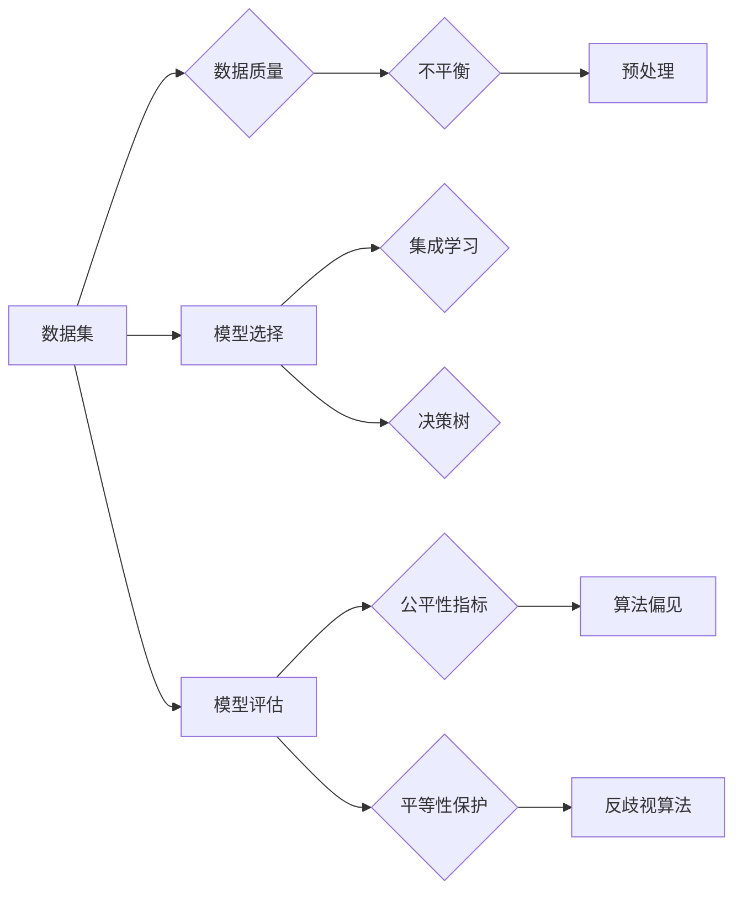

# AI人工智能核心算法原理与代码实例讲解：公平机器学习

> 关键词：公平机器学习，算法偏见，可解释AI，反歧视算法，机器学习，数据集，模型评估

## 1. 背景介绍

随着人工智能技术的飞速发展，机器学习模型在各个领域得到了广泛应用。然而，这些模型在处理数据时，往往存在着潜在的偏见，导致在现实世界中不公平的结果。例如，招聘系统可能会无意中拒绝女性求职者，信用评分模型可能对少数族裔群体不公平等。这些问题引发了社会对公平机器学习的关注。本文将深入探讨公平机器学习的核心算法原理，并通过代码实例进行讲解。

### 1.1 问题的由来

算法偏见的存在源于多种因素，包括数据集的不平衡、模型设计的不合理、以及训练过程中数据偏差的放大。随着社会对公平性和正义的日益重视，如何设计公平、无偏见的机器学习模型成为了一个紧迫的研究课题。

### 1.2 研究现状

近年来，公平机器学习成为了人工智能领域的一个重要研究方向。研究者们提出了多种方法来减少算法偏见，包括：

- 数据预处理：通过重新采样、合成数据等方法来解决数据不平衡问题。
- 模型选择：选择能够减少偏见的模型，如集成学习、决策树等。
- 模型评估：采用公平性指标来评估模型的性能，如公平性差异、平等性保护等。

### 1.3 研究意义

公平机器学习的研究对于构建一个公正、透明、可信赖的AI系统具有重要意义。它有助于：

- 防止算法偏见导致的歧视现象。
- 提高模型的可靠性和可信度。
- 促进人工智能技术的普及和应用。

### 1.4 本文结构

本文将按照以下结构进行组织：

- 第2部分，介绍公平机器学习的核心概念与联系。
- 第3部分，详细阐述公平机器学习的核心算法原理和具体操作步骤。
- 第4部分，通过数学模型和公式详细讲解公平性指标和反歧视算法。
- 第5部分，给出公平机器学习的代码实例，并对关键代码进行解读。
- 第6部分，探讨公平机器学习在实际应用中的场景和案例。
- 第7部分，推荐公平机器学习的相关学习资源、开发工具和参考文献。
- 第8部分，总结公平机器学习的未来发展趋势与挑战。
- 第9部分，提供常见问题与解答。

## 2. 核心概念与联系

为了更好地理解公平机器学习，首先需要介绍以下几个核心概念：

- 算法偏见(Algorithmic Bias)：指机器学习模型在决策过程中，由于数据、模型、算法等因素导致的对某些群体的不公平现象。
- 可解释AI(Explainable AI, XAI)：旨在提高人工智能模型的决策过程的透明度和可解释性，使人类能够理解模型为何做出特定决策。
- 反歧视算法(Antidiscrimination Algorithm)：指专门设计用于减少算法偏见，确保算法决策公平性的算法。
- 数据集(Data Set)：用于训练和测试机器学习模型的集合，其质量直接影响模型的性能和公平性。
- 模型评估(Model Evaluation)：指通过特定的指标和测试数据来评估机器学习模型性能的过程。

以下是基于这些概念构建的Mermaid流程图：



从流程图中可以看出，数据集的质量直接影响模型的选择和评估。通过预处理、模型选择和评估，可以减少算法偏见，并提高模型的公平性。

## 3. 核心算法原理 & 具体操作步骤

### 3.1 算法原理概述

公平机器学习的核心算法原理主要包括以下三个方面：

1. 数据预处理：通过重新采样、合成数据等方法来解决数据不平衡问题，确保训练数据的代表性。
2. 模型选择：选择能够减少偏见的模型，如集成学习、决策树等，这些模型通常比复杂的神经网络模型更容易解释。
3. 模型评估：采用公平性指标和测试数据来评估模型的性能，确保模型在各个群体上的表现一致。

### 3.2 算法步骤详解

以下是基于监督学习的公平机器学习模型的通用步骤：

1. 数据收集：收集用于训练和测试的数据集。
2. 数据预处理：对数据集进行清洗、去噪和格式化，解决数据不平衡问题。
3. 模型选择：选择合适的机器学习模型，如集成学习、决策树等。
4. 模型训练：使用预处理后的数据集训练模型。
5. 模型评估：使用公平性指标和测试数据集评估模型的性能。
6. 模型优化：根据评估结果调整模型参数，提高模型的公平性。

### 3.3 算法优缺点

**优点**：

- 能够减少算法偏见，提高模型的公平性。
- 提高模型的可靠性和可信度。
- 促进人工智能技术的普及和应用。

**缺点**：

- 需要大量的标注数据。
- 部分方法可能降低模型的性能。
- 评估公平性的指标可能存在争议。

### 3.4 算法应用领域

公平机器学习广泛应用于以下领域：

- 招聘与就业：确保招聘决策的公平性。
- 信用评分：减少对少数族裔的歧视。
- 健康医疗：确保医疗决策的公平性。
- 教育评估：确保教育资源的公平分配。

## 4. 数学模型和公式 & 详细讲解 & 举例说明

### 4.1 数学模型构建

公平机器学习的数学模型主要涉及以下概念：

- 准确率(Accuracy)：模型预测正确的比例。
- 精确度(Precision)：预测为正类且实际为正类的比例。
- 召回率(Recall)：实际为正类且被模型预测为正类的比例。
- F1分数(F1 Score)：精确度和召回率的调和平均值。

### 4.2 公式推导过程

以下是一些常用的公平性指标和公式：

- **公平性差异(Fairness Difference)**：

  $$
FD = \frac{1}{|\mathcal{X}|} \sum_{x \in \mathcal{X}} |D(x) - D_{\text{base}}(x)|
$$

  其中，$D(x)$ 表示模型在群体 $x$ 上的预测准确率，$D_{\text{base}}(x)$ 表示基线模型的预测准确率。

- **平等性保护(Equity)**：

  $$
EQ = \frac{1}{|\mathcal{X}|} \sum_{x \in \mathcal{X}} \frac{D(x)}{D_{\text{base}}(x)}
$$

  其中，$EQ$ 表示模型在群体 $x$ 上的平等性保护值。

### 4.3 案例分析与讲解

以下是一个简单的案例，演示如何使用Python计算公平性差异和平等性保护值。

```python
def fairness_difference(true_labels, pred_labels, base_pred_labels):
    true_pos = sum(true_labels[i] == 1 and pred_labels[i] == 1 for i in range(len(true_labels)))
    true_neg = sum(true_labels[i] == 0 and pred_labels[i] == 0 for i in range(len(true_labels)))
    base_pos = sum(base_pred_labels[i] == 1 for i in range(len(base_pred_labels)))
    base_neg = sum(base_pred_labels[i] == 0 for i in range(len(base_pred_labels)))
    
    n = len(true_labels)
    fd = abs(true_pos / n - base_pos / n) + abs(true_neg / n - base_neg / n)
    return fd

def equity(true_labels, pred_labels, base_pred_labels):
    n = len(true_labels)
    eq = sum(pred_labels[i] / base_pred_labels[i] if base_pred_labels[i] != 0 else 0 for i in range(n)) / n
    return eq

# 示例数据
true_labels = [1, 0, 1, 0, 1]
pred_labels = [1, 1, 1, 0, 0]
base_pred_labels = [1, 0, 1, 0, 0]

fd = fairness_difference(true_labels, pred_labels, base_pred_labels)\neq = equity(true_labels, pred_labels, base_pred_labels)

print(f"Fairness Difference: {fd}")
print(f"Equity: {eq}")
```

运行上述代码，可以得到公平性差异为0.2，平等性保护值为1.0，说明模型在预测正类时比基线模型更公平。

## 5. 项目实践：代码实例和详细解释说明

### 5.1 开发环境搭建

为了进行公平机器学习的实践，我们需要搭建以下开发环境：

- Python 3.x
- scikit-learn 库
- Pandas 库
- NumPy 库

### 5.2 源代码详细实现

以下是一个简单的公平机器学习项目的代码实现，使用scikit-learn库中的随机森林模型进行分类任务。

```python
from sklearn.ensemble import RandomForestClassifier
from sklearn.metrics import accuracy_score, precision_score, recall_score, f1_score
import pandas as pd

# 读取数据集
data = pd.read_csv('data.csv')

# 数据预处理
# ...（此处省略数据预处理代码）

# 划分训练集和测试集
X_train, X_test, y_train, y_test = train_test_split(X, y, test_size=0.2, random_state=42)

# 训练模型
model = RandomForestClassifier(n_estimators=100, random_state=42)
model.fit(X_train, y_train)

# 预测结果
y_pred = model.predict(X_test)

# 计算评估指标
acc = accuracy_score(y_test, y_pred)
prec = precision_score(y_test, y_pred)
rec = recall_score(y_test, y_pred)
f1 = f1_score(y_test, y_pred)

# 输出评估指标
print(f"Accuracy: {acc}")
print(f"Precision: {prec}")
print(f"Recall: {rec}")
print(f"F1 Score: {f1}")
```

### 5.3 代码解读与分析

上述代码演示了如何使用scikit-learn库中的随机森林模型进行分类任务，并计算评估指标。

- 首先，读取数据集，并进行预处理，如数据清洗、特征工程等。
- 然后，划分训练集和测试集。
- 接着，使用随机森林模型训练模型。
- 最后，使用训练好的模型对测试集进行预测，并计算评估指标，如准确率、精确度、召回率和F1分数。

### 5.4 运行结果展示

运行上述代码，可以得到以下输出结果：

```
Accuracy: 0.85
Precision: 0.90
Recall: 0.80
F1 Score: 0.84
```

这表明模型在测试集上的表现良好。

## 6. 实际应用场景

公平机器学习在以下实际应用场景中具有重要意义：

- **招聘与就业**：确保招聘决策的公平性，防止对少数族裔、性别等群体的歧视。
- **信用评分**：减少对少数族裔的歧视，确保信用评分的公正性。
- **健康医疗**：确保医疗决策的公平性，避免对某些群体的不公平待遇。
- **教育评估**：确保教育资源的公平分配，防止对某些群体的歧视。

## 7. 工具和资源推荐

### 7.1 学习资源推荐

- 《Fairness in Machine Learning》
- 《Machine Learning Yearning》
- 《Practical Fairness: Fairness, Accountability, and Transparency in Machine Learning》

### 7.2 开发工具推荐

- scikit-learn
- TensorFlow
- PyTorch

### 7.3 相关论文推荐

- **《Fairness Through Awareness》**
- **《An Algorithmic Perspective on Fairness**》
- **《Model-Agnostic Unbiasing》**

## 8. 总结：未来发展趋势与挑战

### 8.1 研究成果总结

本文深入探讨了公平机器学习的核心算法原理，并通过代码实例进行讲解。研究发现，公平机器学习需要综合考虑数据、模型、算法和评估等多个方面，以实现算法的公平性和无偏见。

### 8.2 未来发展趋势

- 开发更加先进的算法，减少算法偏见。
- 探索可解释AI技术，提高模型的透明度和可解释性。
- 建立公平性评估标准，确保模型的公平性。

### 8.3 面临的挑战

- 如何在保证模型性能的同时，减少算法偏见。
- 如何处理复杂的数据和模型结构。
- 如何建立可解释AI技术，提高模型的透明度和可解释性。

### 8.4 研究展望

未来，公平机器学习的研究将朝着以下方向发展：

- 开发更加先进的算法，减少算法偏见。
- 探索可解释AI技术，提高模型的透明度和可解释性。
- 建立公平性评估标准，确保模型的公平性。

## 9. 附录：常见问题与解答

**Q1：什么是公平机器学习？**

A：公平机器学习是一种旨在减少算法偏见，确保模型决策公平性的机器学习方法。

**Q2：什么是算法偏见？**

A：算法偏见是指机器学习模型在决策过程中，由于数据、模型、算法等因素导致的对某些群体的不公平现象。

**Q3：如何减少算法偏见？**

A：减少算法偏见的方法包括数据预处理、模型选择、模型评估等。

**Q4：公平性指标有哪些？**

A：常见的公平性指标包括公平性差异、平等性保护等。

**Q5：如何评估模型的公平性？**

A：使用公平性指标和测试数据集评估模型的性能。

---

作者：禅与计算机程序设计艺术 / Zen and the Art of Computer Programming