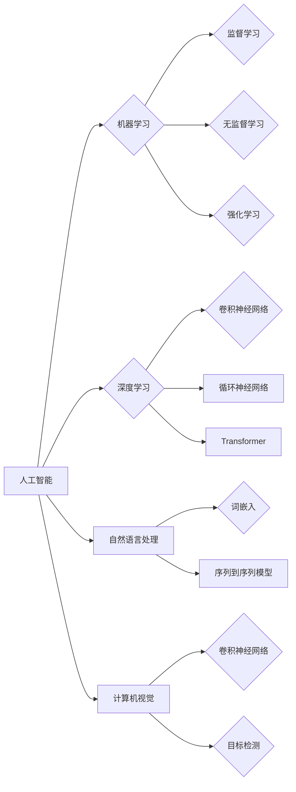

# Andrej Karpathy：人工智能的未来发展前景

> 关键词：人工智能，机器学习，深度学习，神经网络，自然语言处理，计算机视觉，自动驾驶，伦理，未来趋势

## 1. 背景介绍

安德烈·卡帕西（Andrej Karpathy）是人工智能领域的杰出人物，曾担任特斯拉（Tesla）的AI总监，并在Google Brain工作多年。他的工作涵盖了深度学习、自然语言处理、计算机视觉等多个领域，并且他经常在网络上分享关于人工智能的见解和思考。本文将基于安德烈·卡帕西的观点，探讨人工智能的未来发展前景。

## 2. 核心概念与联系

### 2.1 人工智能的核心概念

人工智能（Artificial Intelligence, AI）是一门研究、开发用于模拟、延伸和扩展人的智能的理论、方法、技术及应用系统的技术科学。它包括机器学习（Machine Learning, ML）、深度学习（Deep Learning, DL）、自然语言处理（Natural Language Processing, NLP）、计算机视觉（Computer Vision, CV）等多个子领域。

#### Mermaid 流程图



### 2.2 人工智能的发展联系

人工智能的发展是一个多学科交叉的过程，不同领域的研究成果相互促进，共同推动人工智能技术的进步。例如，深度学习在计算机视觉和自然语言处理领域的突破，为自动驾驶、智能客服等应用提供了强大的技术支持。

## 3. 核心算法原理 & 具体操作步骤

### 3.1 算法原理概述

人工智能的核心算法包括机器学习、深度学习、自然语言处理、计算机视觉等。以下简要介绍这些算法的原理。

#### 机器学习

机器学习是人工智能的基础，它通过算法让计算机从数据中学习，并做出决策或预测。机器学习主要分为监督学习、无监督学习和强化学习三种类型。

- **监督学习**：通过输入数据和对应的输出数据进行学习，目标是建立一个函数，将输入映射到输出。
- **无监督学习**：通过未标记的数据进行学习，目标是发现数据中的模式和结构。
- **强化学习**：通过试错的方式学习，目标是最大化某种累积奖励。

#### 深度学习

深度学习是机器学习的一种，它使用多层神经网络来学习数据中的特征和模式。深度学习在图像识别、语音识别、自然语言处理等领域取得了显著的成果。

#### 自然语言处理

自然语言处理是人工智能的一个分支，它研究如何让计算机理解和生成人类语言。自然语言处理技术包括词嵌入、序列到序列模型、机器翻译等。

#### 计算机视觉

计算机视觉是人工智能的一个分支，它研究如何让计算机从图像或视频中提取有用信息。计算机视觉技术包括目标检测、图像分类、人脸识别等。

### 3.2 算法步骤详解

以下以监督学习为例，简要介绍机器学习的具体操作步骤：

1. 数据收集：收集用于训练的数据集。
2. 数据预处理：对数据进行清洗、归一化等操作。
3. 模型选择：选择合适的机器学习模型。
4. 模型训练：使用训练数据训练模型，得到模型参数。
5. 模型评估：使用测试数据评估模型性能。
6. 模型优化：根据评估结果优化模型。

### 3.3 算法优缺点

#### 机器学习的优点

- 自动化：机器学习可以自动从数据中学习模式，无需人工干预。
- 泛化能力：机器学习模型可以通过少量样本学习到广泛的知识。
- 适应性：机器学习模型可以根据新的数据进行在线学习，适应环境变化。

#### 机器学习的缺点

- 需要大量数据：机器学习模型需要大量数据进行训练。
- 模型可解释性差：机器学习模型通常难以解释其决策过程。
- 需要大量计算资源：机器学习模型的训练和推理需要大量的计算资源。

### 3.4 算法应用领域

机器学习在各个领域都有广泛的应用，以下列举一些常见的应用领域：

- 医疗诊断：使用机器学习模型进行疾病预测和诊断。
- 金融风控：使用机器学习模型进行风险评估和欺诈检测。
- 垃圾邮件过滤：使用机器学习模型过滤垃圾邮件。
- 语音识别：使用机器学习模型实现语音识别功能。

## 4. 数学模型和公式 & 详细讲解 & 举例说明

### 4.1 数学模型构建

以下以线性回归为例，介绍机器学习中的数学模型构建。

#### 公式推导过程

线性回归模型的目标是找到一个线性函数，使得该函数能够最小化预测值与真实值之间的误差。假设输入特征为 $X$，真实值为 $y$，预测值为 $\hat{y}$，则线性回归模型可以表示为：

$$
\hat{y} = w_0 + w_1 \cdot x_1 + w_2 \cdot x_2 + \cdots + w_n \cdot x_n
$$

其中 $w_0, w_1, \cdots, w_n$ 为模型参数，通过最小化损失函数来优化这些参数。损失函数通常采用均方误差（MSE）：

$$
\mathcal{L}(\theta) = \frac{1}{2} \sum_{i=1}^n (y_i - \hat{y}_i)^2
$$

### 4.2 公式推导过程

均方误差损失函数的梯度计算如下：

$$
\nabla_{\theta} \mathcal{L}(\theta) = -\sum_{i=1}^n (y_i - \hat{y}_i) \cdot x_i
$$

### 4.3 案例分析与讲解

以下使用Python和Scikit-learn库实现线性回归，并使用matplotlib库进行可视化。

```python
import numpy as np
import matplotlib.pyplot as plt
from sklearn.linear_model import LinearRegression

# 生成数据
X = np.linspace(0, 10, 100).reshape(-1, 1)
y = 3 * X + np.random.randn(100) * 0.5

# 拟合模型
model = LinearRegression()
model.fit(X, y)

# 可视化
plt.scatter(X, y, label='Data points')
plt.plot(X, model.predict(X), label='Linear regression', color='red')
plt.xlabel('X')
plt.ylabel('Y')
plt.title('Linear Regression')
plt.legend()
plt.show()
```

## 5. 项目实践：代码实例和详细解释说明

### 5.1 开发环境搭建

以下是使用Python进行机器学习项目开发的基本环境搭建步骤：

1. 安装Anaconda：从官网下载并安装Anaconda，用于创建独立的Python环境。
2. 创建并激活虚拟环境：
```bash
conda create -n ml-env python=3.8
conda activate ml-env
```
3. 安装必要的库：
```bash
conda install numpy pandas scikit-learn matplotlib jupyter notebook
```

### 5.2 源代码详细实现

以下使用Scikit-learn库实现线性回归，并使用matplotlib库进行可视化。

```python
import numpy as np
import matplotlib.pyplot as plt
from sklearn.linear_model import LinearRegression

# 生成数据
X = np.linspace(0, 10, 100).reshape(-1, 1)
y = 3 * X + np.random.randn(100) * 0.5

# 拟合模型
model = LinearRegression()
model.fit(X, y)

# 可视化
plt.scatter(X, y, label='Data points')
plt.plot(X, model.predict(X), label='Linear regression', color='red')
plt.xlabel('X')
plt.ylabel('Y')
plt.title('Linear Regression')
plt.legend()
plt.show()
```

### 5.3 代码解读与分析

以上代码首先使用numpy生成模拟数据，然后使用Scikit-learn库中的LinearRegression类拟合线性回归模型。最后，使用matplotlib库绘制数据点和拟合的线性回归曲线。

### 5.4 运行结果展示

运行以上代码后，会生成一个散点图，其中蓝色点代表模拟数据，红色线代表拟合的线性回归曲线。可以看出，线性回归模型能够较好地拟合数据。

## 6. 实际应用场景

### 6.1 医疗诊断

机器学习在医疗诊断领域具有广泛的应用，例如：

- **癌症检测**：使用机器学习模型分析医学影像，辅助医生诊断癌症。
- **疾病预测**：使用机器学习模型分析患者病历，预测患者未来可能出现的疾病。
- **药物研发**：使用机器学习模型进行药物筛选，加速新药研发。

### 6.2 金融风控

机器学习在金融风控领域具有重要作用，例如：

- **欺诈检测**：使用机器学习模型检测金融交易中的欺诈行为。
- **风险评估**：使用机器学习模型评估贷款申请人的信用风险。
- **投资策略**：使用机器学习模型制定投资策略，提高投资收益。

### 6.3 智能客服

机器学习在智能客服领域具有广泛的应用，例如：

- **语义理解**：使用机器学习模型理解用户问题，实现智能问答。
- **情感分析**：使用机器学习模型分析用户情感，提供更个性化的服务。
- **智能推荐**：使用机器学习模型推荐产品或服务，提高用户体验。

## 7. 工具和资源推荐

### 7.1 学习资源推荐

- 《Python机器学习》
- 《机器学习实战》
- 《深度学习》
- 《统计学习方法》

### 7.2 开发工具推荐

- Scikit-learn
- TensorFlow
- PyTorch
- Jupyter Notebook

### 7.3 相关论文推荐

- "Playing for Data: Learning to Beat the Human Benchmark in Noisy Channels" (Goodfellow et al., 2014)
- "Sequence to Sequence Learning with Neural Networks" (Sutskever et al., 2014)
- "Generative Adversarial Nets" (Goodfellow et al., 2014)
- "BERT: Pre-training of Deep Bidirectional Transformers for Language Understanding" (Devlin et al., 2019)

## 8. 总结：未来发展趋势与挑战

### 8.1 研究成果总结

人工智能在过去几十年取得了长足的进步，深度学习、自然语言处理、计算机视觉等领域取得了显著的成果。机器学习模型在各个领域都得到了广泛应用，为人类生活带来了诸多便利。

### 8.2 未来发展趋势

#### 1. 模型规模持续增大

随着计算能力的提升，人工智能模型将变得越来越复杂，模型规模将不断增大。这将为人工智能带来更高的性能和更强的能力。

#### 2. 算法创新

随着研究的深入，新的机器学习算法将不断涌现，进一步提高人工智能的效率和准确性。

#### 3. 跨学科融合

人工智能将与其他学科（如生物学、心理学、社会学等）进行融合，为人工智能的发展提供新的思路和方法。

#### 4. 可解释性

提高人工智能模型的可解释性，使人类更好地理解模型决策过程。

### 8.3 面临的挑战

#### 1. 数据隐私

随着人工智能应用范围的扩大，数据隐私问题将日益突出。如何保护用户隐私，成为人工智能发展的重要挑战。

#### 2. 安全性

人工智能模型可能被用于恶意目的，如网络攻击、虚假信息传播等。如何确保人工智能的安全性，成为亟待解决的问题。

#### 3. 伦理道德

人工智能的发展引发了一系列伦理道德问题，如机器人的权利、人工智能的决策责任等。如何制定合理的伦理规范，成为人工智能发展的重要挑战。

### 8.4 研究展望

#### 1. 通用人工智能

研究通用人工智能（AGI），使人工智能具备与人类相似的智能水平。

#### 2. 人工智能与人类协作

研究人工智能与人类协作的模式，使人工智能更好地服务于人类。

#### 3. 人工智能伦理

研究人工智能伦理，制定合理的伦理规范，确保人工智能的可持续发展。

#### 4. 人工智能与自然环境融合

研究人工智能与自然环境的融合，使人工智能更好地适应自然环境。

总之，人工智能的发展前景广阔，但也面临着诸多挑战。只有不断探索、创新，才能推动人工智能技术更好地服务于人类社会。

## 9. 附录：常见问题与解答

**Q1：人工智能是否会取代人类？**

A：人工智能可以辅助人类工作，提高生产效率，但短时间内不会完全取代人类。人类的价值在于创造力、情感和道德判断等方面，这是人工智能难以取代的。

**Q2：人工智能的伦理问题如何解决？**

A：人工智能的伦理问题需要多学科合作解决。可以从以下几个方面入手：
1. 制定伦理规范：明确人工智能的应用范围和边界。
2. 建立伦理审查机制：对人工智能项目进行伦理审查。
3. 加强人工智能伦理教育：提高公众对人工智能伦理问题的认识。

**Q3：人工智能的就业影响如何应对？**

A：人工智能的发展将导致部分工作岗位的消失，但也创造新的就业机会。政府和企业应采取措施，帮助失业者重新就业，提高全民技能水平。

**Q4：人工智能的未来发展趋势是什么？**

A：人工智能的未来发展趋势包括模型规模增大、算法创新、跨学科融合、可解释性提高等。同时，人工智能也将面临数据隐私、安全性、伦理道德等挑战。

**Q5：如何学习人工智能？**

A：学习人工智能需要掌握以下知识：
1. 编程基础：学习Python、C++等编程语言。
2. 数学基础：学习线性代数、概率论、统计学等数学知识。
3. 机器学习基础：学习机器学习、深度学习等知识。
4. 实践经验：通过实际项目积累经验。

作者：禅与计算机程序设计艺术 / Zen and the Art of Computer Programming